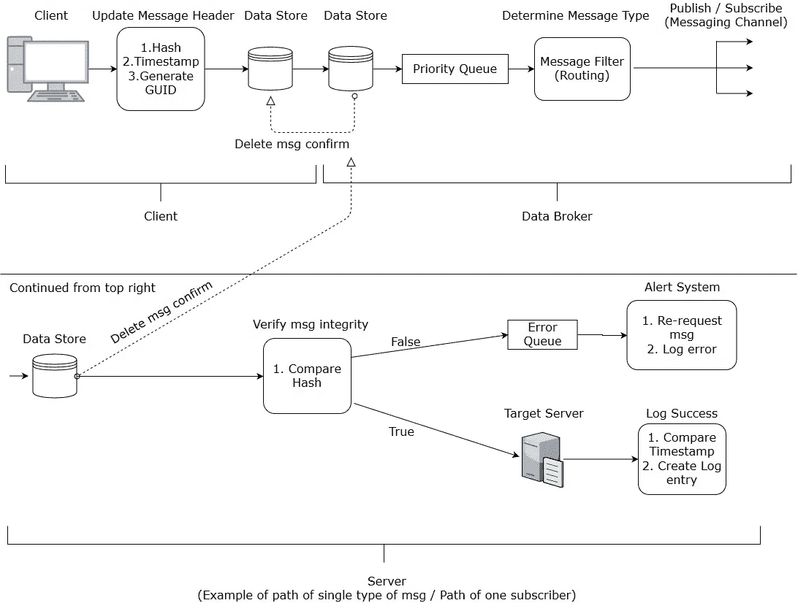

# 使用企业集成模式设计消息传递系统

> 原文：<https://medium.com/hackernoon/designing-a-messaging-system-using-enterprise-integration-patterns-86a998a07bd3>


我最近收到了一个编码挑战，要求我设计一个消息传递系统，绘制设计图，并附上一篇文章解释我的设计选择。

我根据企业集成模式(enterprisesintegrationpatterns . com)的原则设计了这个系统的结构。

## 制约因素

1.  确保没有消息丢失。
2.  确保损坏或格式错误的消息会触发某种警报。
3.  允许基于优先级的消息传递。
4.  按特定类型处理消息。
5.  收集并记录每条消息的信息，如处理时间、已处理的消息数以及其他相关信息。

## 解决方案



The system design document I created

1.  消息传递系统采取的第一个动作是通过扩展和修改消息头(XML 格式)来准备消息的传输。在这种情况下)。它将添加一个时间戳来跟踪处理时间的长度，添加一个 GUID 来确保唯一性，并跟踪已处理的唯一消息的总数。还会生成一个散列，使用 GUID 作为关键字，使用消息正文作为种子，以允许在消息到达目标时进行完整性验证。优先级也可以在报头中声明。
2.  我们的消息传递系统现在处理确保没有消息丢失的问题。我通过实现保证传递消息通道模式解决了这个问题。这实现了一系列本地数据存储(它们本身不需要是本地的，然而，这是该解决方案的最简单的实现)以确保消息总是以持久的方式存储，从而防止在系统崩溃或其他故障的情况下丢失消息。一旦系列中的下一个存储正确地接收到消息，它就发送一个确认回执，该回执充当对保存在前一个存储上的消息的删除命令。在将消息发送到网络上之前，第一个数据存储在客户端本地(数据代理段落中说明了此目的，即分离系统)。注意:当需要快速通信时，队列不是一个好的选择，因为消息在队列中停留的时间是未知的。对于那个用例，Web 服务将是一个更好的解决方案。
3.  下一步可以用几种方式来执行。将数据从客户机传递到服务器的最简单方式是点对点通道模式。然而，数据代理通道模式将是一个更健壮的解决方案。使用数据代理通道将目的地与发送方分离，同时仍然确保正确的交付。这有几个好处，也有几个缺点。使用数据代理的好处是提高了安全性，能够通过单个代理路由多个应用程序，而不必为每个应用程序编写单独的管道(这也迫使开发人员在不同的应用程序之间维护严格的数据标准)。也许数据代理提供的最重要的元素是客户机即使在服务器不在线的情况下也能运行的能力，这使得在不中断客户机系统的情况下或者在发生灾难性事件(如服务器崩溃)的情况下也能对服务器系统进行维护。这种能力依赖于有保证的交付模式实现及其本地数据存储。数据代理方法的缺点是它需要遵守一个标准，这个标准可能不适合每个应用程序的需求，并且增加了整个系统的复杂性。
4.  然后，数据代理根据类型过滤每条消息，同时优先过滤优先级较高的消息。数据流在这一点上产生分歧，因为每种消息类型都通过不同的路径发送到应用程序或服务器，而应用程序或服务器需要与该类型匹配的消息。现在过滤的消息可以通过与数据代理模式和消息过滤器协同工作的发布/订阅通道模式发送，以确保所有感兴趣的和适当的应用程序(订阅并匹配消息类型)都被告知新的可用消息。注意:管理筛选操作的优先级队列的算法可能会被修改，以允许较低优先级的消息偶尔通过，即使有高优先级的消息刚刚进入，以防止整个管道专用于高优先级的消息，这可能会导致较低优先级的消息严重积压，并可能导致完全阻塞。我需要对优先级队列的实现有更好的理解，以确定它应该或者已经是如何设计的。
5.  现在，消息已经从数据代理发送到目标服务器，它将存储在本地数据存储中，确认接收/删除命令将发送到数据代理的数据存储。然后，通过将邮件头中包含的哈希与使用 GUID 和邮件正文新生成的哈希进行比较，检查邮件的数据完整性。如果散列不匹配，则消息已经被破坏或格式不正确，因为消息被发送到错误队列，该错误队列按照优先级顺序组织错误，以确保高优先级消息被尽可能快地重新请求。然后，错误队列从客户端重新请求消息，并将错误记录在警报系统中。如果相同的消息/相同的消息类型出现足够多的错误，则可以向用户/管理员提交一个错误。如果哈希匹配，消息将被传递到目标/应用程序，并写入一个日志条目，将时间戳与当前系统时间进行比较，以确定处理时间，并记录其他相关详细信息。如果需要，可以在流程的其他阶段插入额外的日志记录，比如在数据代理收到消息之后。
6.  关于工作负载分布的注意事项:例如，如果消息包含必须发送到多个流程进行验证的元素，我们可以通过使用分散-收集路由模式来解决这个问题。这为消息头添加了一个相关 ID，并为分发给必要进程和例程的子消息(子消息)添加了一个相应的 ID。然后，父消息在一个聚合器处等待，在我的系统中，该聚合器将被放置在与散列检查过程相同的位置，在那里它等待与其相关 ID 匹配的各种子消息返回。如果来自不同流程的所有响应都是肯定的，并且满足了业务规则，则消息可以继续发送。通过这种方式，我们满足了工作负载分布的需求。

## **示例 XML 消息有效负载:**

```
<?xml version=”1.0" encoding=”UTF-8"?><head> <type>tradingRequest</type> <hash>a09asdf098232nrkjasd982j82as0adkjh234r87as</hash> <id>12DF234KJSDNS9834KSJSD0239898023SDN</id> <priority>High</priority> <timestamp>2018–07–18 11:51:57</timestamp> <correlationId></correlationId></head><body> <message>Buy 100 shares of TSLA</message></body>
```

非常感谢你来看我的文章！我很想知道你对我的实现的想法。如果您对我如何改进该解决方案有任何问题、意见、建议或提示，请随时留下您的评论！