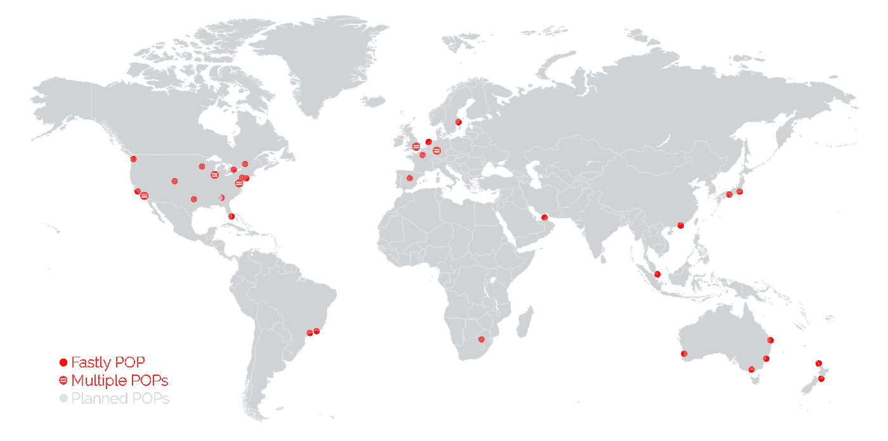

# 设计一个每月服务数百万请求的关键任务 API

> 原文：<https://medium.com/hackernoon/designing-a-mission-critical-api-serving-millions-of-requests-per-month-575d850fb41f>

当我与人合作创办我的上一家公司时，我们最大的挑战之一是向我们的客户提供一个可以 100%保持运行的 API。我们的产品是一个内容管理系统和一个 API，每月服务于数百万个请求，我们的客户使用它来将内容集成到他们的网站中。在多次几乎瘫痪我们业务的停机后，我们开始致力于消除单点故障。

# 停机是致命的

我们的客户建立了网站，在他们的请求/响应生命周期中向我们发出页面内容的 API 请求。这意味着如果他们的 API 请求失败，他们的页面可能不会呈现。换句话说:如果我们的 API 宕机，我们客户的网站也会跟着宕机。

这是我们早年艰难学到的一课。不可靠的服务器托管导致频繁的间歇性停机和性能下降，这让客户感到沮丧。一次拙劣的 DNS 迁移导致了数小时的 API 宕机，导致数十个客户的网站宕机近半天，并让大量客户质疑他们是否可以继续依赖我们(其中有少数客户离开了我们)。

在此事件之后，我们认识到确保接近 100%的正常运行时间是一个生死攸关的问题。未来的重大停电可能会导致我们失去辛苦赢得的客户，并使我们的业务陷入危机。

# 提供全球化、快速、灵活的 API

完全避免失败是不可能的——你只能尽最大努力减少失败的机会。

例如，通过运行自己的物理服务器来“控制自己的命运”可以保护您免受托管服务提供商的影响，但会让您不得不处理安全性和可伸缩性问题，这两个问题很容易让您崩溃，并且难以恢复。

对我们来说，始终保持我们的 API 并确保它在全球范围内提供高性能是至关重要的。但是，作为一家规模较小的公司，我们知道我们没有足够的资源来提供具有接近 100%正常运行时间的全球高度可扩展的性能。所以我们求助于这样做的人:[快速](https://www.fastly.com/)。

Fastly 将自己描述为“为全球最受欢迎的企业提供快速、安全和可扩展的数字体验的边缘云平台”。他们与大客户合作，包括纽约时报、BuzzFeed、Pinterest 和 New Relic。我们将 Fastly 放在 API 前面作为缓存层，这样所有的 API 请求都可以通过它们的 CDN 得到服务。

Fastly’s points of presence

当我们的一个客户在我们的后端更新他们的网站内容时，我们使被编辑的特定内容的 API 密钥无效。非缓存请求击中了我们的服务器，但我们有大约 94%的命中率，因为我们客户网站上的内容相对于他们的访问者数量很少改变。这意味着即使我们的数据库或服务器经历了间歇性的中断，我们的 API 仍然保持运行。我们不希望这样，但理论上，我们的服务器可能会完全瘫痪几个小时，而我们客户的网站会保持正常。

Fastly 的全球 CDN 为我们提供了另一个好处。我们的许多客户都有静态的 JavaScript 网站，API 请求是从访问者的浏览器而不是他们的服务器发出的。通过 Fastly 的 CDN 提供 API 响应意味着我们客户的网站访问者无论身在何处都能获得快速的加载时间。

# 消除单点故障

在我们公司的早期，我们处理了两起独立的 DNS 事件，给我们留下了创伤。在第一个事件中，我们的 DNS 提供商当时意外地从他们的系统中“取消”了我们的帐户，导致我们花了近 6 个小时才完全恢复。我们的第二个事件发生在常规 DNS 编辑导致我们的[不同] DNS 提供商出现故障时，花了将近半天时间才解决。DNS 事件尤其具有破坏性，因为即使在问题被识别和修复之后，您也必须等待各种 DNS 服务器和 ISP 清空它们的缓存，然后客户才能看到它们的修复(DNS 服务器也倾向于忽略您的 TTL 设置并实施它们自己的策略)。

我们的经验使我们非常专注于消除整个架构中的任何单点故障。

对于 DNS，我们转而使用来自不同 DNS 提供商的多个域名服务器。DNS 提供商通常允许并鼓励你使用 4-6 个冗余域名服务器(如 ns2.example.com，ns2.example.com)。这很好:如果一个失败了，请求仍然会被其他的解决。但是因为你所有的域名服务器都来自同一家公司，你就过于相信它们会 100%正常运行。

对于我们的应用服务器，我们使用 Heroku 的监控和[自动伸缩](https://blog.heroku.com/heroku-autoscaling)工具来确保我们的性能不会因为流量高峰而下降(或者如果 Fastly 出现故障，我们突然需要将所有请求直接路由到我们的服务器)。除了使用 Fastly 缓存我们的 API，我们还使用 Memcached 在应用程序级别缓存我们的 API。这提供了针对间歇性数据库或服务器故障的额外弹性层。

为了防止 Heroku 或 AWS(Heroku 在其上运行)完全中断的罕见可能性，我们维护了一个运行在 Google Cloud 上的独立服务器和数据库实例，我们可以快速地故障转移到该实例。

# 失败不可避免

无论我们的 API 有多可靠，我们都不得不接受网络不可靠，失败是必然会发生的。我们都经历过连接 Wi-Fi 出现问题，或者电话突然掉线。总体而言，停机、路由问题和其他间歇性故障在统计上可能并不常见，但在某种环境背景下仍然会一直发生。

为了克服这种固有的不可靠环境，我们帮助客户构建了在出现故障时仍能保持稳定的应用程序。我们构建了 SDK，其中包括当 API 请求失败时自动重试等功能，或者支持使用 Redis 等本地备份。

# 最后的想法

我们中的许多人都没有意识到，他们正在我们的堆栈中构建单点故障。为了构建有弹性的容错系统，您必须考虑堆栈的所有方面，并找到即使在一个或多个方面出现故障时也能保持服务正常运行的方法。

*喜欢这篇文章吗？* [***在 Twitter 上关注我***](https://twitter.com/abi) *在这里，我分享关于创业和生活的想法。* [*看看我最新的产品*](https://pullreminders.com/) *，它会给你发送关于 GitHub 拉请求的延期提醒。*