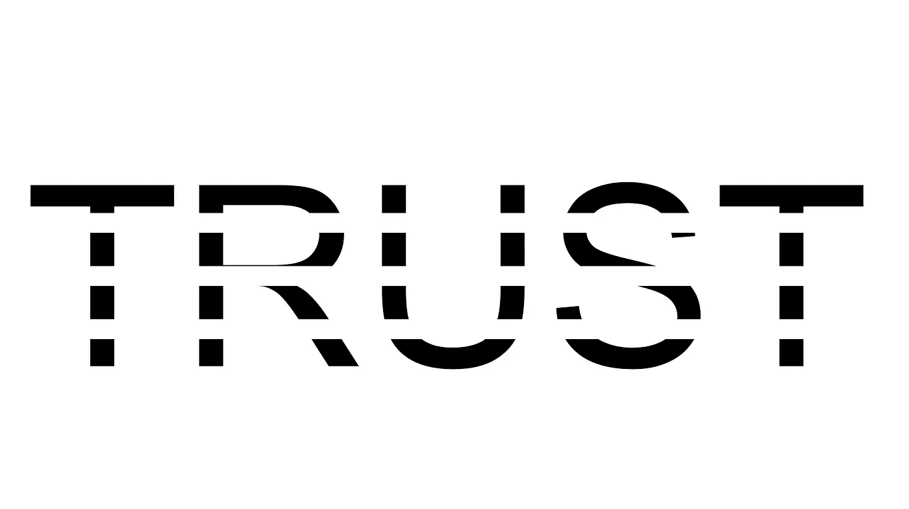
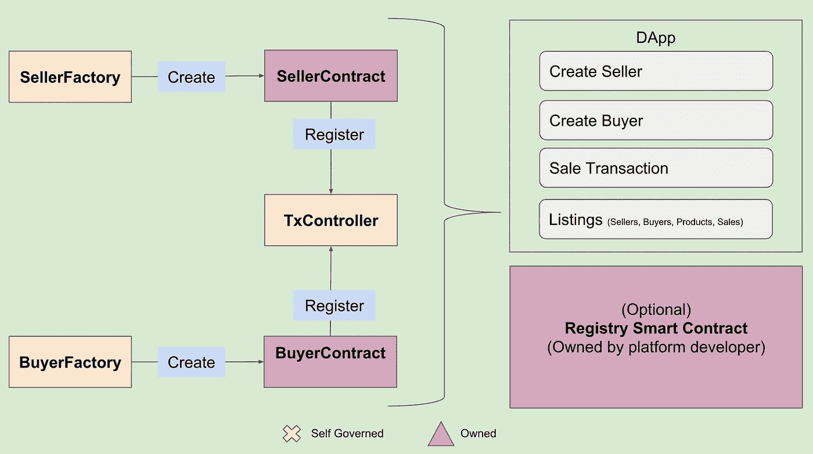

# 如何用区块链和货币化建立真正的无信任系统

> 原文：<https://medium.com/hackernoon/designing-a-truly-trust-less-solution-and-monetise-it-possible-design-pattern-1337de7c640c>

# 背景

[区块链](https://hackernoon.com/tagged/blockchain)已经存在，任何知道潜力的人都不想被排除在外，但也想成为早期采用者。因此，有很多个人和公司试图建立基于区块链的解决方案，但更多情况下，这些解决方案并不符合区块链的真正价值(或去中心化的账本)。本文试图解释一种可能的设计模式，在为常见的业务问题设计基于区块链的解决方案时，可以使用这种模式。在分散化术语中，设计模式构建真正的**无信任**解决方案。此外，这为分散式分类账的无信任解决方案提出了一种可能的收入模型。

# 示例业务问题

让我们考虑一个简单的业务应用程序，这样我们就可以应用这种设计模式。考虑一个类似于易贝的简单在线市场(最简单的易贝版本)。这个系统最好有 3 个角色，即卖家、买家和管理员(管理市场)。让我们定义一下在这个极简市场中每个参与者会做什么。

**卖家:**创建店铺&贴出物品出售

**买家:**建立档案，购买卖家提供的物品

**管理员:**通过授权卖家、买家管理网站，解决任何争议，并从交易中收取佣金

# 以集中和基于信任的心态进行设计

如果你让一个普通的软件开发人员(这里我指的是不使用分散化技术也不知道这种概念的开发人员)来构建这个解决方案，下面是这个解决方案的典型实现。

*   卖家可以在这个市场注册，但管理员必须批准/接受卖家使用该平台进行交易。不管批准/接受过程如何，如果愿意，管理员可以将卖家踢出系统
*   和上面一样，适用于买家，管理员将最终控制特定买家在市场上的存在
*   管理员可以从后端访问系统内的所有卖家和买家，并能够改变配置文件属性，如果有必要(重置密码等)
*   访问买方和卖方(及其项目)列表的唯一方式是通过市场平台(或平台提供的 API)
*   无论谁在这个平台上注册(包括买家和卖家),最终都必须信任平台管理员或平台背后的组织

所以以上所有特征构成了一个受控的、封闭的系统，由平台的所有者来治理。一切都取决于平台所有者的可信度。**因此，解决方案是基于信任和集中的**。

这里要记住的重要事实是，即使使用分散技术(如智能合同和分布式分类账)，也很有可能实现需要信任平台所有者的解决方案，并且所有者可以控制平台的大部分方面。不幸的是，我们发现的大多数基于区块链的商业解决方案都有这些属性，尽管它们是在分散化技术之上实现的。

# 用分散的、不信任的心态进行设计

让我们看看如何才能使上述解决方案真正做到无信任。换句话说，平台所有者不应该对平台的任何方面有任何控制。这就是事情开始听起来奇怪的地方，但如果你仔细看看比特币是如何工作的，从概念上讲，这就是我们在这里提出的建议。实现无信任设计的可能方法，

*   平台所有者应该为系统中的每个参与者和实体提供一个智能合同，它是一个合同工厂(一个可以创建子合同的智能合同)。这里重要的一点是，一旦这些合同被部署到网络上，平台所有者**不应该**对这些工厂合同有任何控制。**没有后门**。
*   因此，在我们上面的示例平台中，卖方和买方各有两个工厂合同。因此，网络中的任何人都可以使用这些工厂合同来创建卖方合同或买方合同。
*   一旦卖方或买方合同被创建，这样的合同由合同的创建者所有，而不是由平台所有。因此，个人卖家和买家将拥有各自的合同，并对这些合同拥有完全的控制权。平台所有者与这些合同无关。
*   为了使买卖成为可能，应该有第三个合同来定义买卖交易如何进行。同样，让这个**事务控制契约**(称之为**事务控制器**)自治是很重要的。换句话说，任何人都不应该拥有 **TxnController** 或者不应该对其拥有任何控制权【在基于信任的世界中，这将是业务的核心，但在我们缺乏信任的世界中，平台创建者不拥有或控制它】。

总之，我们已经构建了一组智能契约，它们由相关的参与者拥有和控制，另一个契约由契约中编写的逻辑之外的任何人拥有和控制。这构成了一个真正无信任系统。这里我们唯一信任的元素是契约逻辑和执行它的**虚拟机**(以太坊世界中的 EVM)。这些都是公正的和自主的，所以可以信任他们去做他们编程要做的事情。

这里要记住的重要事实是我们构建的解决方案的开放性。作为平台创建者，你可能是第一个为平台构建 DApp 的人，但这并不妨碍任何第三方也构建类似的或更好的 DApp。这在所有级别都是可能的，因为每个智能合约对第三方的可用性与对创建者的可用性一样多。

# 可能的商业模式

因此，我们有一个可行的方法，以完全无信任的方式实现一个去中心化的解决方案。这是真的，你可能会想，如果你最终什么都不拥有，为什么有人要建立这种类型的系统。通常(在基于信任的中央化世界中)，所有权和控制能力是你可以转变为商业模式(收入流)的东西，在这种模式下，你可以维持你的业务，并最终从中获利。

虽然可能有许多不同的方式来从类似于我们上面解释的无信任系统中获利(例如，在 marketplace 的例子中，您可以从 **TxController** 合同中的每笔交易中收取一定比例的费用，并将其转移到您的 ether 帐户)，但有一种可能的模式可以用来从几乎任何无信任系统中获利。

智能合同开始了去中心化和无信任设计的核心，我们可以利用去中心化的应用程序(d App)来创造收入。即使智能合约彼此完全独立，您创建的 DApp 也可以提供一个单一的入口点来处理所有这些独立和自我管理的智能合约。这将为用户提供通过单个 DApp 访问这些自治智能合同的便利，并且作为平台开发者，您可以向其最终用户确保数据完整性(以有意义的方式链接和引用存储在智能合同中的数据)。再次强调，在核心处，契约逻辑和存储的数据不受任何人的控制，并且可以被任何任意用户访问，但是包装这些契约的 DApp 提供了一个连接点，以将这些契约作为单个解决方案平台来处理。

如果你作为读者仍然对这种模式的可行性持怀疑态度，我想把它与开源生态系统中流行的收入模式联系起来。

如果你想到基于开放核心的解决方案来运营盈利业务，这可能会掩盖一些灯来证明这种模式的可行性。许多解决方案都有一个开源核心，任何人都可以使用它来构建任何类型的解决方案。但与此同时，也有一些组织通过在开放核心之上提供增值服务来为其用户提供便利(许多 Apache 基金会的解决方案都是由从该服务中获利的商业企业支持的)。例如:ThoughtWorks & Hadoop)。

**智能合约概述**

正如您在上面的图表中看到的，工厂契约(SellerFactory & BuyerFactory)和 TxController 是自治的(没有所有者或者没有人能够控制它们)。DApp 提供了与这些自治契约进行交互的手段，并且可以选择拥有 **Registry** Smart Contract，它可以用来存储独立契约中存储的数据之间的关系。如 DApp 下所示，将会有以更加集成的方式与智能合同交互的功能(类似于任何一般的业务应用)。

# 结论

如果任何人基于区块链(或去中心化账本[技术](https://hackernoon.com/tagged/technology))构建解决方案，重要的是在实施中坚持区块链的核心概念。使核心行为者和实体相关的智能合约自治是提供真正的无信任实施的必要条件，但是在这些独立智能合约之上的附加应用层(DApp +由授权方控制的智能合约)可能是将真正的无信任平台货币化的一种可能方式。

这种设计模式更多的是一种思想实验和 PoC 级别的实现，也就是说没有针对商业实现进行测试。我希望在如何改进和/或实现相同目标的其他可能方法方面会有许多不同的想法。请在评论中分享你的想法，进一步探讨这个话题。