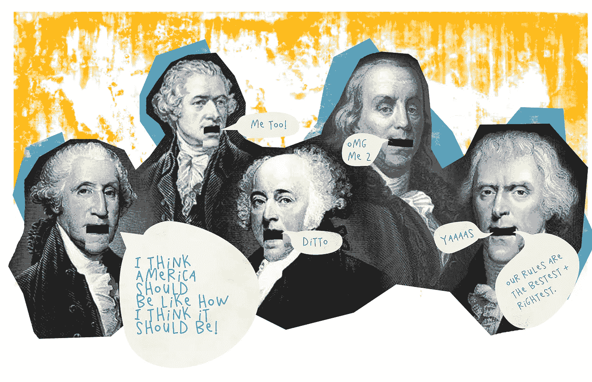
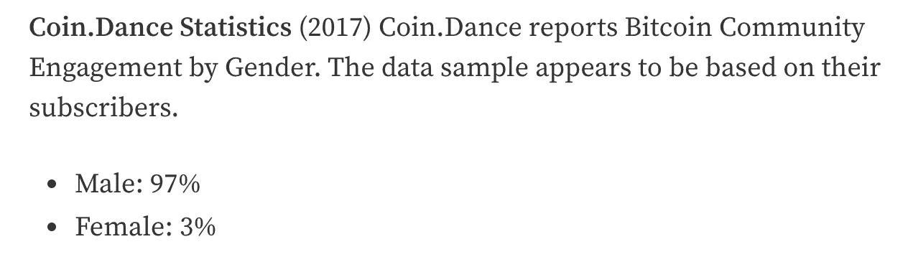
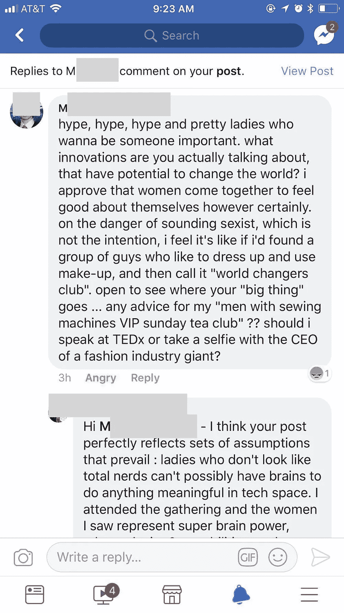
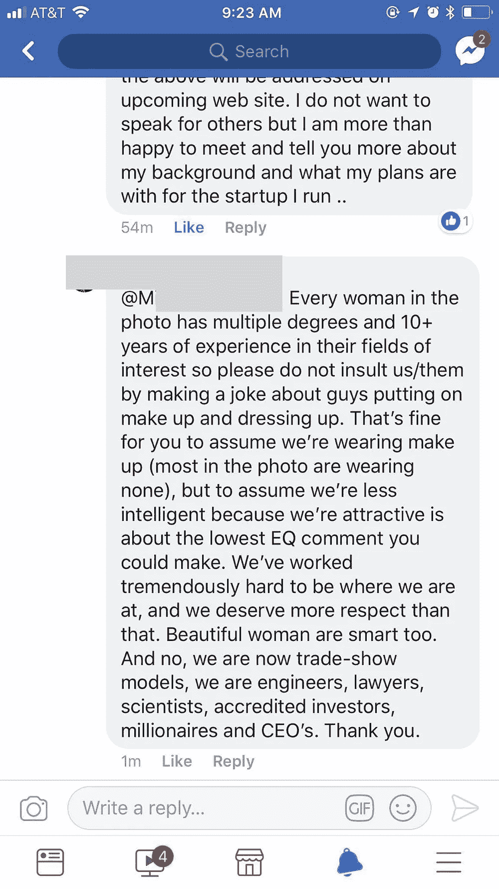
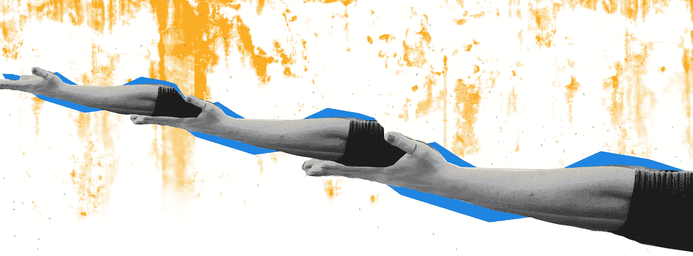
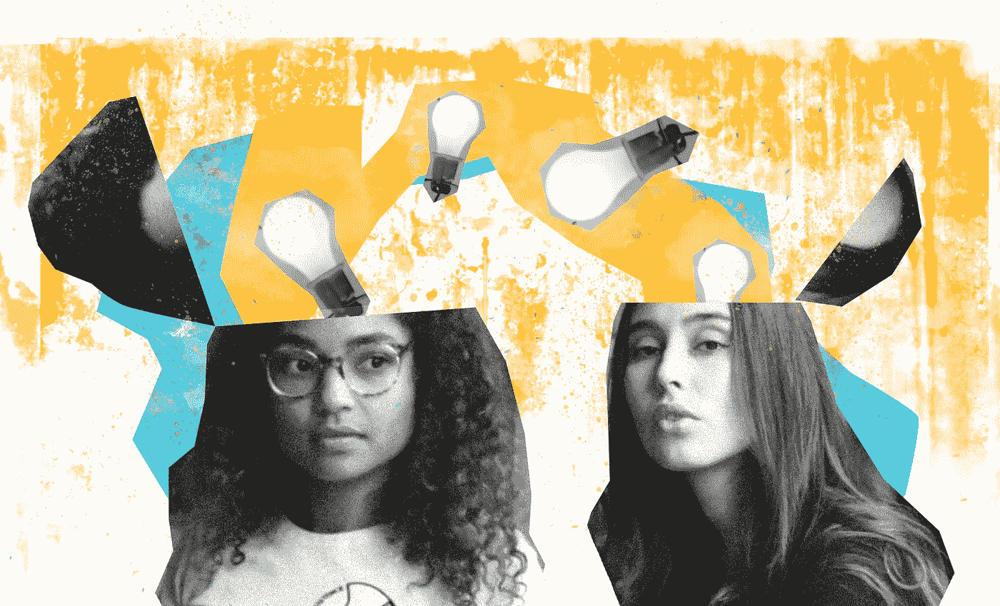
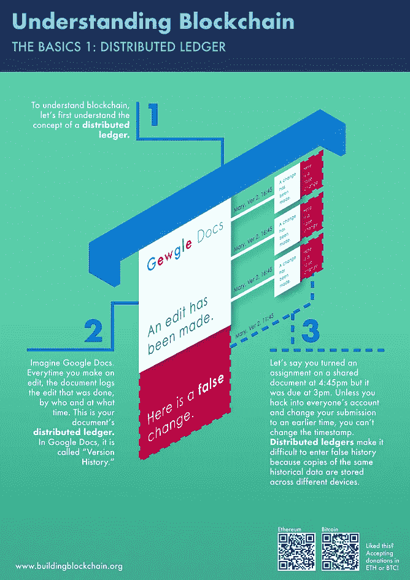
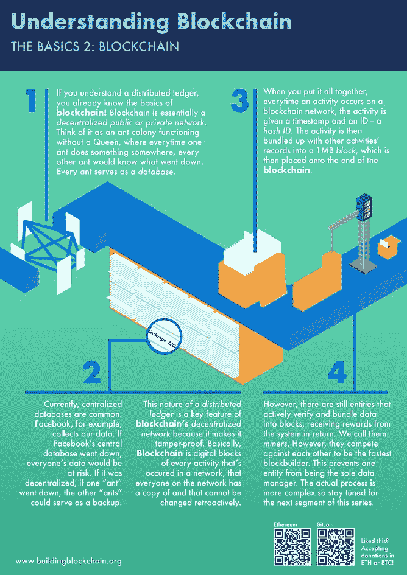
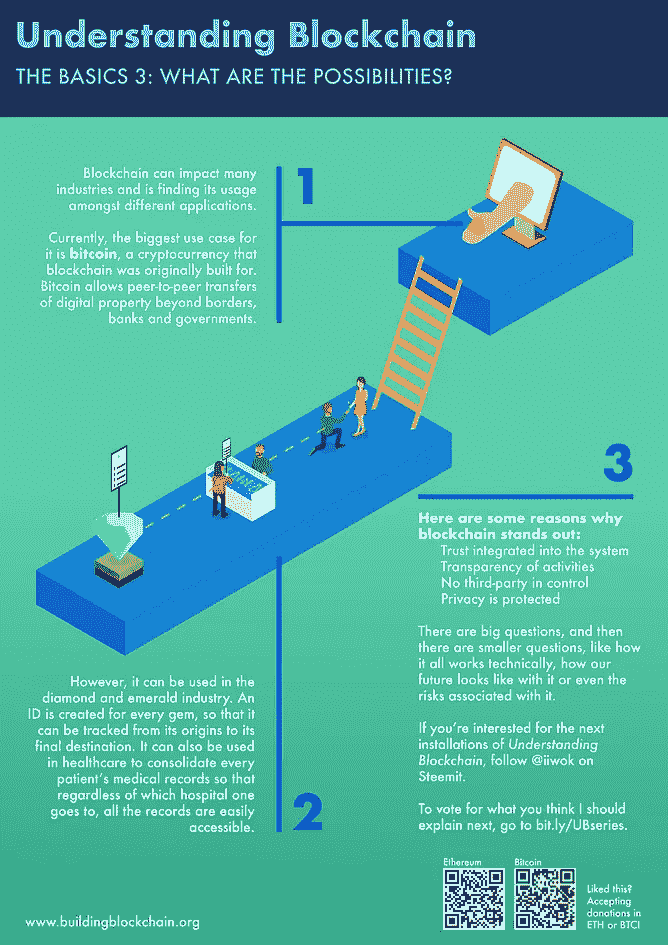

# 区块链是“1%”的对话，这需要改变

> 原文：<https://medium.com/hackernoon/designing-blockchain-equitably-55420e2951f5>

## 包容性和多样化的对话将如何有助于建立这一未来体系。

## 你有没有访问过区块链的公司，浏览过他们的网站，读过他们的白皮书，但却不知道他们在做什么？

## 或者加入了一个加密人的社区，觉得自己的声音没有得到足够的代表？

## 你是那 99%的一部分。

即使术语*区块链*、*加密货币*和 *ICO* s 已经成为流行语，仍然有许多人不知道它是什么，它是如何工作的，或者它有什么作用。

这是一个问题吗？是的。因为生态系统和基础设施可能会受到 1%的影响——在这种情况下定义为早期采用者，最有影响力或最响亮的人。这 1%并不能代表未来的大众区块链/加密消费者。他们中的许多人是技术的传播者；虽然有些人可能会认为早期采用者通常不代表大众消费者，但在这种情况下，拥有尽可能多样化的观点很重要，因为我们仍在定义这项新技术的基础。

想想投票吧。想象一下，如果有 100 个人要为设计未来的公司投票，每个人都会受到投票结果的影响。然而，只有 10 人投票，90 人弃权。只有 10 个人而不是 100%的人在为未来投票，这有什么关系吗？

**是的。差别很大**。我希望你也这么想。

# 创建一个系统很容易。在一个系统继续运行的时候改变它几乎是不可能的。

这里有一个例子:

数百年前，当开国元勋们制定宪法时，他们有一套植根于 18 世纪美国政治哲学的非常具体和相似的利益。直到今天，美国政府仍在这一政治理念上运作。

但是你知道谁被排除在决定美国应该是什么样的国家的对话之外吗？除了白人，每个人都感受到了英国帝国政治的痛苦。多年来，被奴役和边缘化的美国人为打破和改变美国赖以建立的不公正制度而斗争，取得了成功，但同样也经历了巨大的斗争和冲突。直到今天，人们仍在为改变系统性的不平等状态而斗争，哦，变革是如何度过它的甜蜜时光的。

系统可以赋能；但是如果人们不在早期就考虑到整体的话，他们也会被剥夺同样多的权力。这就是为什么围绕区块链的对话现在必须向更多的人开放，因为它的基础正在建立。

# **区块链会走同样的路线吗？**

One example of “homogeneous early adopters” — [Source](https://steemit.com/cryptocurrency/@nubchai/are-women-really-the-key-to-the-future-success-of-blockchain-applications)

是的，如果我们重复相同的周期，让更同质的早期采用者为这项技术铺平政策、系统和用例，情况就更是如此。

区块链有不一样的可能。这种围绕分散网络和非治理系统的整体愿景很重要，因为它创造了以前不存在的经济准入和参与。就其核心而言，这真的是一场人道主义的对话。

许多区块链和加密货币的对话都围绕着技术术语，这并不罕见，因为当前围绕它的许多兴趣都与它的技术方面直接相关。

我们偶尔也会看到，当前的氛围对那些不太符合区块链人期望的人有多么歧视——而实际上，对话中已经有越来越多的“非典型”参与者。Scalar Capital 的创始人琳达·谢(Linda Xie)写了一篇文章，阐述了这种偏见如何在社会环境中产生负面影响。

A post that reflects the biases that are still prevalent in this space.

# 以下是我们推动包容性讨论的两种主要方式。

# 赋予权力，不要剥夺权力

很多人在区块链和加密货币**做着有趣的工作。**由于其技术的性质，有新兴经济体和社会团体在实施它——其中[非洲可能是它的一个伟大前沿](http://www.nasdaq.com/article/is-africa-the-next-hub-for-blockchain-development-cm803927)和[黑人社区接受它](https://austinstartups.com/how-black-people-leveraged-tech-bigotry-to-boss-the-blockchain-below-the-radar-bf2a3a259611)。在缅甸，区块链 facebook 群组有 500 多人，考虑到几年前只有不到 3%的人口使用互联网，这是一个引人注目的数字。[少女](https://www.outfrontmagazine.com/trending/culture/queering-blockchain-maiden-global/)，知道空间需要更加多样化，[支持 LGBTQ 们学习区块链技能](/@RhysLindmark/17-raine-revere-shapeshift-blockchains-and-diversity-at-denver-startup-week-82e02d935a7e)。

然而，全球区块链领域的不同“顶级”玩家之间并没有太多的差异。如果你看看这两份区块链“重要”人士名单([名单 1](https://www.cryptocompare.com/coins/guides/30-most-influential-people-in-the-blockchain-space/) 和[名单 2](https://www.rise.global/top-fintech-people) )，女性、POC 或国际人士不到 15%。限制出风头可能足以减少不同的观点，因此，主要的讨论不能代表更多的人群。

当这种情况发生时，世界上其他关注区块链的人看到的(很可能)是陌生的角色。他们无法理解。他们没有得到太多的启发，不知道如何将别人的做法融入自己的社会。他们开始从那些有声音的人的角度来看待技术，以及将他们的视野投射到大众的平台。

如果我们谈论的是创造更好的变化，**我们应该让不同社区和国家的工作变得光明**，这样我们就可以为各种声音创造更多的空间。*

[这里](/@linda.xie/women-in-crypto-3972d6c45442)是[一些](https://hackernoon.com/blockchains-diversity-problem-why-women-aren-t-the-only-ones-missing-d6b2f42f126e)你可以[学习](https://steemit.com/cryptocurrency/@nubchai/are-women-really-the-key-to-the-future-success-of-blockchain-applications)和做的事情。

更好的表现很重要(如果你需要推理，[看这个视频](https://www.ted.com/talks/chimamanda_adichie_the_danger_of_a_single_story))。

**我发现区块链社区总体上非常热情，超过了其他科技领域。然而，在我看来，它的开放程度至少可以提高十倍。这让我想到了…*

# ***传授知识***

我们还需要让人们更容易参与进来，降低准入门槛。一种方法是对区块链技术进行更有创意、独特和简单的解释，让更多的人在接触它时感到舒适，而不是不知所措或犹豫不决。

这项技术仍然很新，学习曲线很高，很难想象它的样子和工作原理。通过给予人们想象你的系统的能力，你让他们了解了一切是如何工作的。通过这样做，我们获得了一个受过更多教育的多元化群体，他们将就区块链技术的功能、目的和使命展开丰富的对话。

# 我为什么在乎？

我是一名区块链信息设计师，专注于综合这个领域的高层次概念和信息，并将其转化为简单的解释和视觉效果。我把协议、白皮书、区块链、分类账和 ico 浓缩成一张信息图。我这样做是因为我相信降低进入这项技术的门槛是非常重要的。

A few examples of my Intro to Blockchain explanations.

通过创造空间让其他人进入，并帮助他们从链外过渡到链上，我们可以为区块链的未来开辟更多的可能性。

# 是时候把那些 1%的讨论变成 100%的对话了，而且必须从现在开始。

你想把你的区块链/密码公司合成到视觉效果中并构建你的信息吗？打我！我为区块链项目做合同设计。这里是我在[构建区块链](http://www.medium.com/buildingblockchain)和我的[投资组合](http://www.sayaiwasaki.com)的一些作品。

*除非另有说明，所有图形和图像均由赛亚裙岩崎设计。原图来自*[*Unsplash*](http://www.unsplash.com)*。*