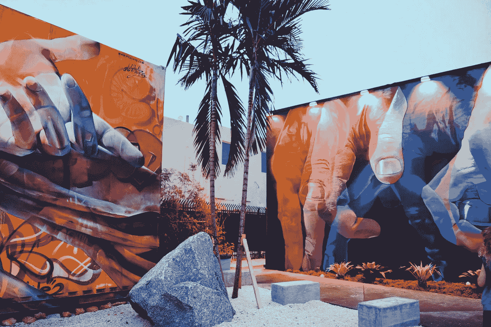
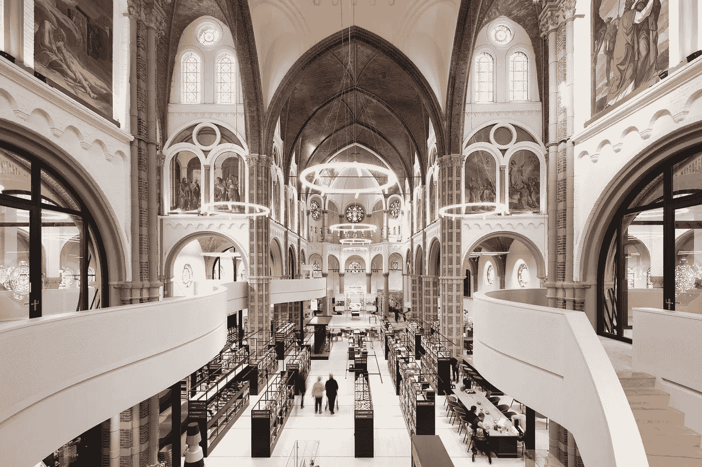

# 策划密码社区的设计

> 原文：<https://medium.com/hackernoon/designing-for-curated-cryptocommunity-6bb3a9fdd024>


## 对人的同理心是社区的真正核心。这最终是一个设计问题，而不是营销问题。

***“这个网络因其非结构化的简单性而强健。”—中本聪、*** [***比特币***](https://bitcoin.org/en/) ***白皮书***

***“我们必须在这个新的领域开创公司的先河。”——***[***以太坊***](https://ethereum.org/foundation) ***和***[***ConsenSys******联合创始人、乔鲁彬***](https://new.consensys.net/)

这个领域的许多团队已经把这个想法放在心上了。例如， [**阿拉贡**](https://aragon.one/) 是无国界的分权组织， [**是民主。地球**](https://www.democracy.earth/) 正在模糊基金会和治理活动家之间的界限，[**block stack**](https://blockstack.org/)(*披露:凭证持有者*)正在煞费苦心地全面思考长期的去中心化设计和数据所有权， [**o1 实验室**](https://o1labs.org/blog/posts/snarky.html) 正在包容性地思考用可验证的计算将加密可伸缩性带入黄金时段； [**兰花实验室**](https://orchid.com/) 正在做香蕉 R & D 创造一层使互联网免于监视和审查；在负责任的新闻报道中，为新闻编辑室创造了市场机会； [**假人**](https://golem.network/) 是世界范围内的网络硬件，是计算机处理的重要市场；还有数不清的 其他辉煌的项目，重新思考作为公司参与其中意味着什么…

> 我们可以在密码空间走得更远。
> 
> 我们还需要在一个社区中开拓什么是先锋。

设计一个充满活力的社区是一个“挑战性的问题”；为了繁荣，我们知道社区需要**联系**、**弹性**(甚至*抗脆弱*)、**健康**、受到**鼓舞的**和**鼓舞人心的**。对于任何地方的任何有活力的社区来说，没有一条简单明了的道路，也没有什么现成的剧本来“管理社区组织”。

# *在我们去中心化的&基于分布式账本的未来，我们如何实现这些事情？*


Because everyone needs some architectural inspiration when living in front of computers all day. Source: [Daniel Lee](https://unsplash.com/@shoulders?utm_source=medium&utm_medium=referral)

# 一、提出设计方案

在技术中，尤其是*到目前为止，在区块链周围的空间和分散的网络中，建立社区的方法看起来像是一个营销问题。*

我不得不表示不同意。

## 从本质上来说，社区不是一个营销问题，而是一个设计问题。

**棘手、杂乱、细致入微、*势在必行—* 设计难题。**

他们之间的差异最终归结为思维模式的差异。

有了设计，既有理性的过程，是的；然而也有某种**反射性** ***实践性*** 。这里面有微妙之处:在“[做一些卖自己的东西而没有明确要求购买自己的东西](http://www.bureau-gesamt.com/gazette/difference-between-design-vs-advertising/)”这种脉络中有一种潜流和手法。当我们处理设计问题时，令人不安的现实是设计问题本来就是“不确定的”。

> 设计过程不只是从你的想法开始，它在那之前很久就开始了。因此，你必须审视过去，你必须了解你正在创作的当代背景。”
> 
> —詹尼弗·里特纳*、*、[、*考虑包容性设计*、](http://www.core77.com/posts/75416/Jennifer-Rittner-Says-Designing-with-Inclusivity-In-Mind-Requires-Dialogue-and-Some-Uncomfortable-Moments)

最佳设计看起来像创意概念中的北极星，并且知道几乎任何类型的“战略”或“营销计划”都需要更多的背景和更多的渐变和灰色阴影。

***与其说是“执行计划”，不如说是赋予事物生命。***

但是这篇文章并不意味着增加关于“设计与营销”的看似永恒的争论；相反，我们希望指出，在蓬勃发展的密码社区中，我们有机会重写许多以前发生的事情。很长时间了。

## 如果我们注定要重复已经犯过的错误，重新开始就没有什么意义了

— *迈克·劳基德斯*“是时候重建互联网了”


Inspiration board #2\. Source: [Niti K.](https://unsplash.com/@inhalexhale?utm_source=medium&utm_medium=referral)

# 二。反社会的

社交媒体放大并传播了最人性化的东西之一:声音。然而，现在不仅仅是个人的声音，还有超人的声音被平台放大和扩散:公司的 Twitter 账户，宠物 Instagram 账户，大量相似但不相同的脸书页面和群组，等等。

这已经在全球范围内从人们那里提取了声音。从某种意义上来说，这很好，而且不一定是负面的，因为如果那些科技平台记得他们的人类，并问他们自己一些尖锐的问题，这也可能是一件好事。

***但是我们继续看到他们没有。***

真的，当某个地方的增长成为道德目标时，我们还能期待什么呢？

这就是当这变成一件坏事的时候:当许多非常响亮的声音被系统地*****非人化*** 人们，深深地被我们自己在我们的技术和社交平台上放大的偏见所激活。这引出了一个问题:**

> **“既然互联网已经成为许多人生活的中心，我们该如何系统地维护一个更公平、更安全、更善解人意的互联网？”**
> 
> **— [CivilServant.io 社区研究峰会报告](https://civilservant.io/civilservant_summit_report_jan_2018.html)**

**我们*很清楚* [*当前的社交媒体范式*](https://www.callmegwei.com/2018/04/13/peepeth-the-decentralized-twitter-alternative/) *是多么的破碎*，生活在这个世界上，即使是真正的声音，其影响力也是基于其*音量*或*分裂性*超过**值**或**意为**的，当数字身份正在帮助企业、巨头“垄断”变得不可思议地强大。 ***而我们还想自举这一切来‘成长’吗？*****

****

**Source: [Daniel von Appen](https://unsplash.com/@daniel_von_appen?utm_source=medium&utm_medium=referral)**

# **三。超越分裂**

**rypto 现在可以提供一个最终的游乐场，让我们的生活从数字、物理和其他方面全面融合。**

**然而，一个核心问题是，只要[区块链](https://hackernoon.com/tagged/blockchain)项目和分散的团队将他们的社区努力集中在“*营销总增长*或“*增长黑客”他们的“参与度*，他们就会错过培养 ***更人性化的*** [技术](https://hackernoon.com/tagged/technology)和社区的机会。他们将继续把真实的人视为次要的追随者、爱好和观点——并继续兜售老一套的“数字对物理”的神话。**

**“数字&物理”也是过去几年的热门话题。同样，这篇文章不是要陷入这些无休止的错误困境。**

**然而，这里有一些思想的食粮，这几乎不是一个新颖的想法:我们的平台社区是数字化的，是的，但社区是人——而人是物理人类。句号。当短视的未来主义天真地试图将技术进化误认为超越物质时，它在我们的话语中不应有一席之地。**

## **“技术革命”的目的不是偶然的，它们是为了进化*——而不是相反。比特币等。***

***“在线”和“离线”社区，当它们都由活生生的人组成时，实际上是一枚硬币的两面。共同的主线永远是 ***个体***人的 生活经历。***

***显然，人和他们的经历都是多方面的，因此他们应该有多种渠道来表达自己的不同部分，并以集体的方式做出贡献。***

***这一点对于参与密码领域的人来说尤其重要，他们关注的重点是匿名和开源工作。之前关于在线社交网络给社会带来的一些好处的观点与这个事实有关。***

***然而，许多学者和研究人员关于社交网络对我们自己和我们的社会的影响的批评的一个核心原则是，我们的心理正受到我们数字生活的这种 ***同步*碎片化**的*负担*。除了其他不确定的影响。我们可以做得更好。***

******

***Source: Wynwood Walls***

# ***四。社区有一种地方感***

***在我们的生活经验中，一个社区通常被理解为与*地点*相关联。这是一个市政厅，那是一个“礼拜场所”，在那里你去*交易所*，一个**花园**种植东西，*所有这些的社区空间*等等。如果在“数字” ***和*** 物理/建筑领域进行同样的实验，那么同样的想法背后有如此多的潜在能量。对于去中心化和分布式计算的新范例来说，更是如此。***

***我们很可能[需要重建互联网](https://www.oreilly.com/ideas/its-time-to-rebuild-the-web)的大部分，就像我们一直在重建和再利用我们构建的环境的架构，有时甚至是我们个人关系的架构。***

***想象一下，如果我们围绕这些项目建立的社区，在这个新的技术时代，可以是深思熟虑而又有意义的，有组织而又流动的，就像一个最古老和当代意义上的真正的“社区”——充满混合使用案例和多态空间，以及新的更人性化的联系。***

> ***让人们说话，并鼓励他们这样做。是一种缓解数字世界和现实生活体验之间转换的方式。”***
> 
> ***——凯蒂·迪尔，[Airbnb 体验设计总监](https://airbnb.design/co-creating-experiences-with-our-community/)***

***我们并不简单。我们现在需要超越“围墙花园”和“渠道”(试图“*无处不在*”在电报组、Slack 频道、Reddit 线程、Twitter feeds，诸如此类)，思考更像是一种可持续的空间架构，它是受欢迎的和有活力的——并与社区共同设计它们。***

***为了让这篇文章为更大的 crypto/web3 社区贡献更多的价值，也许它还会以新生想法的形式出现，无论是:***

*   ***发起一个摄影项目作为一个创造性的挑战([就像这个](https://airbnb.design/no-filter/) ): *如果我们在分散化的技术和隐秘的世界里用民族志的方式记录和传达感官体验会怎么样？****
*   ***通过食物培养社区作为一种历史悠久的仪式:*如果我们把* [*滋养和繁荣*](https://airbnb.design/food-for-thought/) *应用于硬币和代币会怎么样？****
*   ***在这里插入设计冲刺。从微小的行动到宏伟的目标，一切都有价值。*如果我们考虑一个分散的系统来寻找痛点和上下文时刻，就像我们现在对 bug 和奖金所做的那样，以激发更多的社区想法，会怎么样？****
*   ****如果我们认为这些都是没有简单答案的问题，* [*不能在某个计划或路线图*](/fast-company/did-we-create-this-monster-how-twitter-turned-toxic-3761b1e6180a) *中解决，需要时间来完全理解，那会怎么样？****
*   ****如果我们真的致力于超越秘密部落制度和肤浅的社区划分* *，在我们的生态系统中走向更多的合作和交叉授粉，会怎么样？****

***我们需要所有我们能收集到的创造性灵感，来真正建立一个密码生态系统，这将会改善我们人类的状况。社区至上。***

******

***Netherlands Library, Museum, and Community Center ‘[De Petrus](https://www.archdaily.com/892558/library-museum-and-community-center-de-petrus-molenaar-and-bol-and-vandillen-architects)’ / Molenaar&Bol&vanDillen Architects***

# ***动词 （verb 的缩写）培养人际关系是每个人的工作***

***区块链[被称为一种技术，它本身就是创造一种无价的资产](https://www.technologyreview.com/s/610781/in-blockchain-we-trust/) : ***信任*** 。***

***我不得不同意。技术和它们带来的转变并不意味着信任应该变得一文不值。这是因为**信任永远带来健康的社会关系**——它们是人类真正繁荣的核心。***

***利用 P2P 信任是**而不是**区块链和加密货币原则的对立面——如果我们要接触全球受众，这是**探索 P2P 网络和信任对信任设计**的一条途径。***

***在如何围绕“无信任”技术进行信任设计方面，我们正在大步前进。***

***有时仅仅“掰一点面包，看着人们的眼睛”就是重建无数“部落”之间信任架构的开始[。](https://craftsmanship.net/the-architecture-of-trust/)***

***人们和他们的对话*需要*才能繁荣。一个社区，无论在线还是离线，都有责任为人们回应这些呼吁。这是每个人的工作。应该始终关注将人们聚集在一起的空间，让他们有机会使用变革工具，在*协作*活动中获得乐趣，[促进包容性对话](https://www.invisionapp.com/blog/fostering-inclusivity-design/)，并培养*深思熟虑+有目的的*声音。***

***尤其是建筑和设计，因为实践已经在如何实现这些目标方面取得了很大进展——现在是时候让我们每个参与建设新兴区块链技术的人都来设计和构建我们的社区了。***

***【*免责声明:此处提及的任何内容都不是对投资的认可，作者也从未提及任何项目或团队而不披露任何涉及的投资。如果她是个人投资，她会这样披露。* ]***

***Gabrielle Michele tti([@ Gabrielle mic](http://www.twitter.com/gabriellemic))有着企业家精神，精通技术的文科背景，之前曾与[Pininfarina](https://uncrate.com/rossinavi-x-pininfarina-aurea-yacht/)([Mahindra](https://www.bloomberg.com/news/photo-essays/2015-04-16/a-visual-history-of-pininfarina-the-design-house-that-helped-shape-ferrari))[Design lab](http://trydesignlab.com/)，[交互设计基金会](https://www.interaction-design.org/about?r=gabrielle-micheletti)， [Rails](http://railsgirls.com/) & [JS 女孩](http://js-girls.org/)，[罗德岛设计学院](https://ce.risd.edu/)#WomeninBlockchain 和区块链包容性和多样性承诺的自豪支持者。***

## ***我喜欢和渴望用分散的分布式技术改善世界的团队讨论社区。你可以在这里平我[](mailto:gabriellemic@protonmail.com)****。*******

```
***If you enjoyed this story, 👏🏻 **CLAPS ARE APPRECIATED** 👏🏻 so you can help "trigger" Medium's algorithm to share this post. Or you could just share it personally, and avoid powering more 'growth-hacking' algorithms..And, sure, if you'd like to see more, [**follow me here**](/@gabriellemic). Or we could always meet for coffee...With gratitude for your time + attention ♥ Gabrielle***
```

******无尽的‘同行评议’感谢* [*海罗·维维斯*](http://jairovives.com/)*[*阿图尔·楚卡诺夫*](https://www.linkedin.com/in/ACoAAAKta4UBfO9VwJ7BHnFzn52O7iXULTzz3eE/)*[*安德烈斯·皮内达*](https://www.linkedin.com/in/pinedandres/) *，以及埃德加·阿尔瓦雷斯对本文的帮助和支持。********