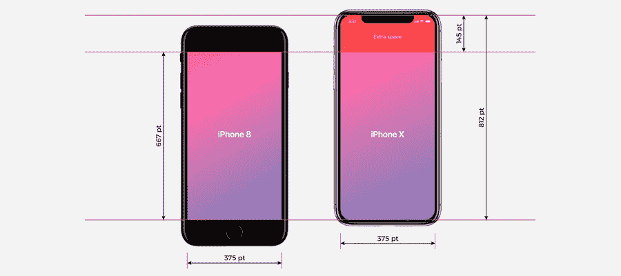
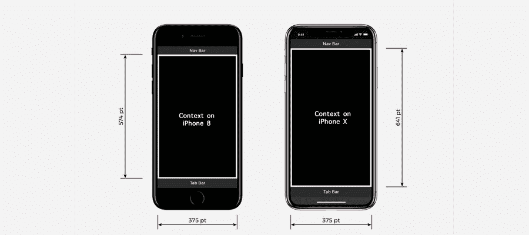
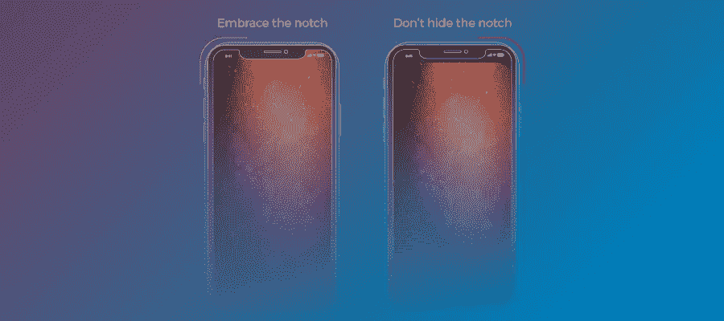
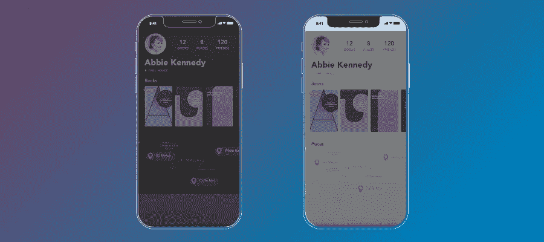
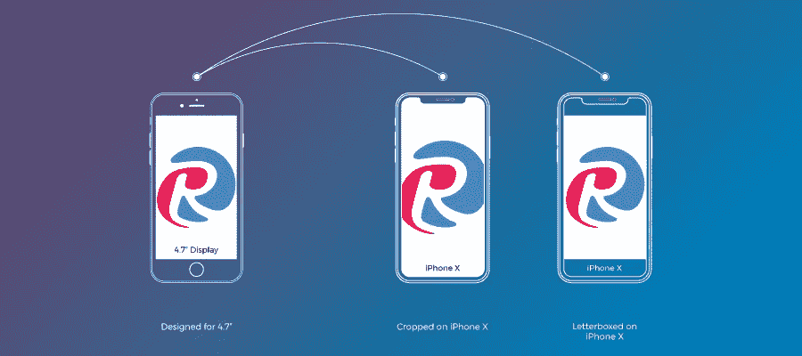
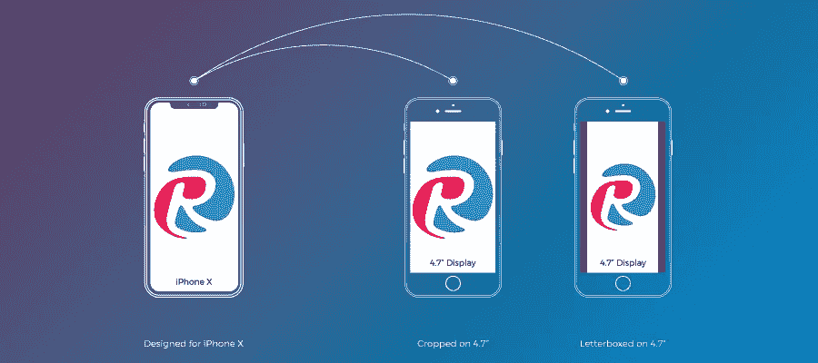
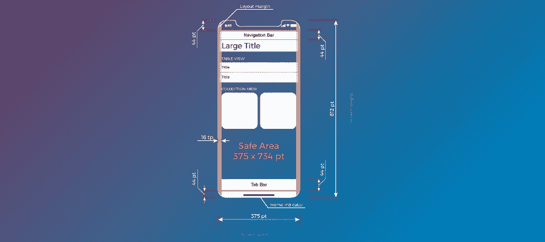
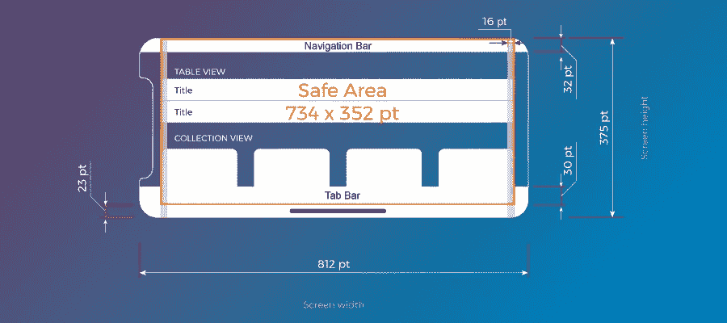

# 为 iPhone X 设计:创建漂亮应用程序的 9 个技巧

> 原文：<https://medium.com/hackernoon/designing-for-iphone-x-9-tips-to-create-a-great-looking-application-c9e004b9f370>

苹果每年都会发布新的 iPhone 手机，但通常它们不会像 iPhone X 那样影响用户体验。对于设计师来说，它的窄边框屏幕没有 home 键意味着他们必须构建一个方便易用的 iPhone X 应用程序[设计](https://hackernoon.com/tagged/design)，尽管用户以前从未面临过类似的事情。

毫无疑问，为 iPhone X 创建量身定制的应用程序设计的唯一可靠方法是通过反复试验。尽管如此，我们还是想在本文中与您分享一些有助于实现这一目标的技巧。

# iPhone X 屏幕尺寸:控制像素

显然，影响设计过程的主要变化始于手机的窄边框 5.8 英寸显示屏。如果与 iPhone 8/8 Plus 相比，iPhone X 的屏幕变高了 20%，这相当于**145 pt**的额外空间。所以，准备好在你最喜欢的 UI 设计软件中使用尺寸为 375 x 812 的画板。

*与 iPhone 8 相比，iPhone X 的屏幕尺寸*

让我们跳到我们关于如何在设计时更好地处理 iPhone X 屏幕分辨率的建议。

# 1.重新排列界面元素

如果排除 iOS 上所有这些在 iPhone X 屏幕上占据额外空间的标准栏，我们会得到一个令人印象深刻的 641pt 的“纯”高度，您可以在其中放置应用程序的内容。为什么这是一件大事？因为 iPhone 8 有 570pt 左右的有用空间可以对比。

*iPhone X 与 iPhone 8 相比的分辨率*

就适应 iPhone X 的应用程序设计而言，这样的分辨率变化意味着，如果你想在 iPhone X 上保留应用程序的像素完美设计，你应该重新安排界面元素的布局。在其他情况下，元素可能会放置得太靠近凹槽，这会使设计看起来不合适。

# 2.不要隐藏 iPhone X 缺口

让我们继续我们的建议马拉松，谈谈 iPhone 的屏幕缺口，因为我们已经提到过了。凹口或传感器外壳，可能是打算放置所有这些智能传感器的最有争议的解决方案。然而，苹果采取这一步骤有很好的理由——屏幕上额外的有用空间。此外，竞争对手也没有想出更优雅的东西。

这个缺口怎么办？苹果坚持让你在 iPhone X 的应用程序设计中保留它的外观。换句话说，你不应该通过将导航栏涂成黑色或试图以任何其他方式隐藏它来掩盖它。该公司表示，传感器外壳两侧的空间为内容和状态栏提供了一些额外的宝贵空间，所以隐藏它会让你的应用程序感觉更小。

不要担心你的背景元素，比如地图、颜色等等。它们会被智能手机的圆角和凹口轻轻夹住，所以你的 iPhone X 应用程序设计不会被这些元素破坏。

*iPhone X 屏幕:凹口*

顺便告诉你的 iOS 开发者不要太担心 iPhone X 的应用适配。苹果保证这不会有问题，因为使用标准 UI 元素(例如，表格、导航条等)的应用程序会自动适应新的外形。关于使用自定义布局的应用程序，如果应用了自动布局，并且你跟随了 **iPhone X 安全区域和边距参考线**(我们将进一步讨论它们)，这种适应可能会相对容易。

[最佳免费 UI/UX 设计资料](https://www.mockplus.com/resource/post/30-isometric-icon-set-download)

[下载](https://www.mockplus.com/resource/post/30-isometric-icon-set-download)

要预览应用程序并查看它的外观，您可以使用内置的 Xcode 模拟器。然而，苹果强调，包括宽颜色在内的一些功能最好在真实设备上预览。

# 3.还记得 iPhone X 的状态栏吗

与其他型号相比，状态栏变得更高。为了保留系统的好看，苹果将 iPhone X 的状态栏高度从 **22pt** 翻倍至 **44pt** 。事实上，它移到了智能手机屏幕上的圆角处。在其[人机界面指南](https://developer.apple.com/ios/human-interface-guidelines/overview/iphone-x/)中，苹果指出，无论当前开启的后台任务如何(例如位置跟踪、语音识别等)，状态栏都不会改变其高度。

之间，该公司建议你不要在你的 iPhone X 应用程序设计中使用自定义状态栏，并重新考虑旨在隐藏它的设计解决方案。他们的关键论点是，用户期望这个条对应于系统外观。相反，您可以使用系统提供的三种状态栏类型之一。

*iPhone X 状态栏:标准栏*

尽管设计自定义条形图并不可取，但您可以轻松地将颜色更改为标准颜色。这样，你可以为每个屏幕设置一种新的颜色，或者让它在所有屏幕上保持不变。它不仅适用于为 iPhone X 设计，也适用于任何其他型号。

# 关注你的应用程序内容

在这种情况下，大小真的很重要。我认为向你解释为什么精确的 UI/UX 设计如此重要是没有意义的。因此，让我们来看看在为 iPhone X 设计时与处理内容相关的一些技巧。

# 4.请记住颜色的影响

苹果公司鼓励设计师在创作 iPhone X UI 设计时拒绝使用 sRGB 的颜色，转而支持 P3。据苹果公司称，这一举措将有助于利用手机显示屏上更广泛的色彩。换句话说，如果使用相应的颜色配置文件 P3，您的资源可以以 16 位 PNG 格式导出。遗憾的是，此选项仅在 Photoshop 中可用，Sketch 不支持。

*iPhone X 屏幕类型:sRGB vs 显示 P3 颜色*

请记住，并不是所有的显示器都能应对 P3 处理的这种超宽色域。换句话说，他们中的许多人就是不显示它们，从而无法为 iPhone X 创建准确的应用程序设计。谈到准确的显示器，苹果在 2015 年底发布的 iMac 是第一台获得广泛支持的基于 Mac 的电脑。现在，所有带有 Touch Bar 的 MacBook Pro 机型都继承了 P3 的支持。

# 5.介意 iPhone X 的比例吗

iPhone X 的长宽比与以前的型号不同，因为它更高。这意味着任何在以前的 iPhone 上看起来不错的作品在 iPhone X 的应用程序中可能会看起来很奇怪。这样，你就把应用程序的内容置于被**裁剪**或者**信箱**的风险之中。

*iPhone X 屏幕纵横比:内容裁剪或信箱模式*

如果 iPhone X 的内容将在 4.5 英寸屏幕的设备上显示，该应用程序的内容甚至可能最终被**打包**。因此，在处理不同的纵横比时，考虑使用不同的资产是一个好主意。

*iPhone X 屏幕长宽比:边框和裁剪*

# 6.爱上屏幕的形状

是啊是啊，不是每个人都乐意看到这些圆形的 iPhone X 边角，尤其是那些必须为 iPhone X 创造一个有吸引力的[移动设计](https://www.cleveroad.com/services/design/mobile-design)的人。但这仍然是体验移动应用的一种新方式。然而，苹果要求设计师不要掩盖屏幕的这一部分，也不要强调它的形状特点。这就是 iPhone X 应用程序设计的样子:

*iPhone X Instagram app 概念由 Cleveroad(来源:*[*Dribbble*](https://dribbble.com/shots/3819384-Iphone-X-Instagram-Concept)*)*

# 遵循 iPhone X 设计指南

正如我已经提到的，应用程序中的内容可能会因为屏幕的凹口和圆角而被剪切。在为 iPhone X 设计时，你当然应该避免它。为此，苹果公司创建了其**安全区域指南**，并告诉我们如何在不损坏内容的情况下将内容放置在应用程序中。如果你的应用程序的背景不应该遵循这些指南，那么按钮、图片、文本等其他内容当然应该遵循。

*iPhone X 安全区大小*

# 7.在应用程序中仔细考虑 iPhone X 的风景模式

当手机转向横向模式时，状态栏被隐藏，以便为内容提供最大的空间。此外，其他酒吧越来越小。因此，横向导航栏采用 **32pt** 而不是 44pt，而标签栏尺寸从 49pt 减小到 **30pt** 。

尽管事实上并非所有的应用程序都需要并将利用 iPhone X 的横向模式，但仍然有很多使用它的场景。例如，它非常适合全屏观看不同类型的内容，如照片、视频和文本。请记住，用户在完成与 iPhone X 的交互后转向横向模式，他们应该可以轻松切换到纵向模式。

你应该考虑你的应用程序在设计上如何适应横向模式，尤其是如果你的应用程序已经适应了 iPads。这样的更新可以让应用程序更加方便用户。

*iPhone X 风景模式:安全区域*

# 8.爱护网站

有可能你们中的一些人不仅设计了应用程序，还设计了网站来告诉用户。考虑到这一点，我们决定在 iPhone X 中涵盖一些与横向网站相关的内容。

当你横向浏览的时候，安全区域会在你的网站两侧留下很多自由空间。这是为了避免内容被删减，所以苹果制作了单独的[指南](https://webkit.org/blog/7929/designing-websites-for-iphone-x/)来为我们提供如何改编网站的知识。

*为 iPhone X 设计:网站*

# 9.避免使用类似系统的手势

正如你所知，iPhone X 的屏幕没有按钮，这意味着所有的操作都是通过手势来完成的。分别将按钮的所有功能转化为手势。这个事实可能会令人困惑，因为我们在构建界面时也使用手势。反过来，它可能会困扰一些用户。

为了避免这种情况，苹果提供了在没有必要的情况下不隐藏 iPhone X 屏幕上的主页指示器。此外，该公司警告我们，在靠近住宅指示器的互动元素上工作时要小心。万一你对放置得很近的元素无能为力，你可以利用**边缘保护功能**来设置手势的优先级。这样，第一次滑动将被视为应用程序的手势，而第二次滑动将被视为系统级操作。