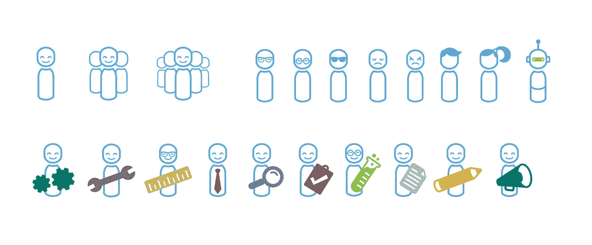

# 设计包容性插图(或者，插图简史)

> 原文：<https://medium.com/hackernoon/designing-inclusive-illustrations-or-a-brief-history-of-the-meeple-11307faddb75>

## 利用每周提示和操作方法，更智能、更好、更快地工作。

[立即订阅](#subscribe)

*合著*[*Trace Byrd*](/@tracebyrd)*，品牌设计师&Atlassian 插画师。*

2017 年对于 Atlassian 品牌和[设计](https://hackernoon.com/tagged/design)来说是巨大的一年。我们开发了一种新的设计语言，涉及到我们业务的每一个部分。这不仅是为了改变我们体现个性的方式，也是为了改变我们坚持的标准。

在过去的几年里，我们对插图的使用变得更加突出。这是一个强大的工具，它可以灵活地讲述异想天开、令人向往的故事，以及传达复杂的技术概念，否则这些概念可能会让人感到不知所措。插图区分我们的声音，并与我们的观众建立更深的情感联系。

作为我们品牌重塑过程的一部分，我们探索了 Atlassian 的使命，以释放每个团队的潜力。这对我们设计师来说意味着我们需要描绘那些团队——这意味着描绘组成他们的*人*。因为我们知道最好的团队是多元化和包容性的，我们觉得这是一个独特的机会来庆祝我们所服务的团队的多元化——特别是在这个时候 [80%的高技能员工表示包容性的工作场所对他们很重要](https://www.atlassian.com/diversity/survey/2018)。

## 进步的过程

很长一段时间以来，我们一直使用插图人物来讲述我们的故事，我们称之为“ [meeples](https://hackernoon.com/tagged/meeples) ”。事实上，我们已经在这条路上走了好几年了。最初，meeples 被用作图形设备来讲述不同角色的不同人的故事。他们是人形的，但不完全是人类。他们还没有可以代表所有团队成员多样性的现实特征，只有简单的道具来表明他们的功能。(谁能确定左起第二个例子的作用，谁就有加分。)

正如你所看到的，这并没有努力让我们的观众感到被代表了。这些纯粹功能性的插图通过把人抽象得面目全非来淡化多样性。

我们的下一次迭代增加了更多的字符，但不多。性别表达只通过两种发型选项显示出来，默认的秃顶者看起来是男性。某些陈规定型观念正在得到强化，例如领带(传统上属于男性的物品)被用来指商人或经理。肤色仍然“缺席”，结果有效地使这些角色变白。

我们添加的细节越真实，缺乏代表性就变得越明显。我们没有很好地代表我们自己的团队，更不用说世界上所有的团队了。我们的下一个 meeples 版本在性别和服装上更加多样化，但这使得不同肤色的缺失和性别的二元方法更加明显。这是一个天真的策略，以避免破坏我们脆弱的调色板——事后来看，我们过度依赖它来承载我们品牌的外观和感觉。

越来越明显的是，通过试图避免讨论包容性，我们实际上养成了我们需要打破的习惯。我们首先在品牌语言中为扩展的调色板留出空间，以包括不同的肤色。

团队是多样化的。如果我们想代表他们，我们需要承认这一点。接下来出现的是一个善意但有点肤浅的多元化代表方法。这包括对肤色(浅、中、深)、服装暗示的角色以及一些宗教符号的选择。

尽管这一步看起来很小，但我们终于开始提出关于包容性代表意味着什么的困难问题，即使我们远远没有回答这些问题。

## 我们今天的方法

我们开始了创造更具包容性的图像的使命，将我们过去尝试的经验教训放在首位。这始于*对他们的想法*不同。我们需要摆脱将我们的观众简化成几个人物角色的倾向。我们越是强化我们受众的有限形象，我们就越是限制哪些人把自己视为 Atlassian 的客户、科技行业的一员，甚至是他们团队的正式成员。

总而言之，Atlassian 产品是为团队成员设计的。这不应该受到他们的种族、宗教、性别、年龄或能力的限制。任何人都应该能够在我们讲述的故事中看到自己。

在我们新的专色样片中，我们从拓宽肤色、发色和其他特征的光谱开始，以更好地反映真实的人。我们通过更多的发型和服装选择，扩展了我们的 meeples 如何表达性别和个性。我们增加了可以表达的文化和宗教的数量，并尝试用新的方法来展示不同能力的例子，从增加眼镜和助听器开始。

这不仅让我们能够更有效地代表有色人种，而且帮助所有年龄、能力和性别身份的人在我们的品牌中看到自己。

在一些插图中，我们展示了丰满的 meeples 与大环境的互动。这些视觉效果通常使用各种不同的角色来讲述更复杂的隐喻故事。这里使用的例子没有太多的面部细节，但显示了彼此之间更直接的关系。这为我们提供了一个分享包容性团队合作愿景的绝佳机会，因为他们是全身身材，我们有机会展示更真实的身体尺寸和比例范围。

每个人都像一个小故事，每个人都是其中的一个角色。我们赋予每个角色的角色都很重要，所以我们会注意到我们创造的权力动态。一个场景中的每个人都应该做出同等的贡献。我们的插图应该提倡一种合作精神，包括一群不同的人将他们不同的优势带到手头的任务中。

这个过程不科学，也不应该科学。当试图表现多样性时变得过于公式化是导致我们过去许多问题的原因。对我们来说，以包容的方式创作这些故事是建立在对话的基础上的。我们与我们的团队(它本身是非常多样化的)以及团队之外的人甚至公司共享迭代。

我们问插图中的表现如何让人们产生感觉。我们做出调整，并对自己和彼此负责。根据我们收集的意见，我们尽最大努力将它们提炼为推动我们前进的结果。还有很长的路要走。这个过程永远不会真正结束，但我们正在朝着更好的方向前进。

## 走，跑，绊倒，重复

这段旅程教会我们，在我们的品牌中促进多元化和包容性是一项持续的、多方面的工作。我们面临一些不容易克服的挑战。例如，很难成为一个完全包容的品牌，因为它知道多样性的一些方面，如隐形残疾或神经多样性，这些都很难说明。

在我们行业的现实真正代表我们服务的客户和整个世界之前，描绘多样性而不让人感觉只是敷衍了事或象征性的也是一个挑战。因此，在品牌之外，还需要做更多的工作来促进包容性工作场所。这不仅仅是为了推进我们的业务，而是为了尽我们所能成为技术社区的最佳成员。

本着在旅程中帮助他人的精神，我们想分享一些建议，告诉你如何在你的品牌空间中更加意识到多样性和包容性，无论是通过插图、摄影还是其他直接与人类打交道的媒介，以及我们如何描绘他们。

*   在设计过程的早期挑战你的观众的假设。在定义谁是你的客户时，不要满足于一刀切的方法。
*   如果你的组织以投资包容性为荣，考虑向你的同事寻求灵感。有很多我们的例子是以我们自己的队友命名的。
*   把它当成“正常化”，让你的品牌代表真实世界。专注于“多样化”会导致添加令牌字符。
*   与您的内部客户谈论他们在使用品牌资产时对多样性的看法。这也将为你的书面设计指南提供信息。
*   使用微妙元素的集合来表示种族。过分依赖一个元素(比如所有亚洲人统一的眼睛形状)是制作漫画的捷径。
*   利用公司中那些对多元化和包容性充满热情的人。即使有最好的意图，假设每个人都知道如何以尊重的方式可视化多样性也是不现实的。
*   接受改变是不可避免的！愿意不断挑战你的假设。你的品牌会成长，你也会。

通过掌控问题，你可以为营销人员和设计师提供一个更好的工具包，也可以让你的整个组织了解包容性代表的重要性。

## 页面内外的多样性设计

我们在团队合作中传递人性的承诺变得更加坚定。因为我们的使命是释放每个团队的潜力，所以刻画人物尤为重要。我们如何代表组成团队的人也同样重要。

品牌对社会的影响不可小觑。尤其是科技行业非常不平衡，毫无疑问，科技品牌缺乏代表性是一个原因——如果人们从未看到自己在科技品牌中得到体现，他们就不太可能认为科技是一个受欢迎的工作场所。

重新定义我们的插图不仅是一个机会，使它成为一个更强大和更有用的工具，以推进我们的品牌信息，而且要站出来，成为一个更负责任的成员，我们的社区。这是一个令人兴奋的地方。我们希望你能加入我们。

. . .

好奇像你这样的员工如何看待工作场所的包容和归属感？前往我们的 [2018 年多样性状况报告](https://www.atlassian.com/diversity/survey/2018)寻找答案。

[查看 2018 年多样性报告](https://www.atlassian.com/diversity/survey/2018)

*最初发表于* [*亚特兰蒂斯博客*](https://www.atlassian.com/blog/inside-atlassian/designing-inclusive-illustrations-at-atlassian) *。*