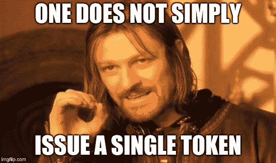

# 设计多令牌经济

> 原文：<https://medium.com/hackernoon/designing-multi-token-economies-7c7f39916e>

[区块链](https://hackernoon.com/tagged/blockchain)项目和去中心化应用(Dapps)通常围绕一个加密资产。的支付、实用和[安全](https://hackernoon.com/tagged/security)功能捆绑在一起；但是如果他们不是呢？单一令牌模型使融资、开发和用户体验变得容易。然而，在一个无限和可编程的数字资产的世界里，这仅仅是可能的事情的皮毛。

我们正在经历[令牌工程](https://blog.oceanprotocol.com/towards-a-practice-of-token-engineering-b02feeeff7ca)、[密码经济原语](/@jacobscott/the-emergence-of-cryptoeconomic-primitives-14ef3300cc10)、[令牌构建模块](https://blog.oceanprotocol.com/towards-a-hierarchy-of-token-building-blocks-6c8dd7b42341)和[设计模式](/@mattdlockyer/token-curated-registry-tcr-design-patterns-4de6d18efa15)的爆炸。代币构建模块仍然围绕着单一可替代代币(FT)的使用，但是随着[新兴市场](/@jacobscott/the-playful-paradigm-shift-4bf35d9d1d11)的[不可替代代币](https://hackernoon.com/an-overview-of-non-fungible-tokens-5f140c32a70a) (NFTs)和[加密收藏品](/crypto-simplified/a-simple-explanation-of-crypto-collectibles-8674c4527bd1)，基于区块链的游戏和应用程序的世界即将被震撼！

在这篇文章中，我将探索多令牌经济的设计。我将展示今天建立在单一代币经济基础上的无许可创新如何扩大基础资产的价值。最后，我将分享关于多令牌经济体如何从无许可创新中获取更多价值的假设，创造更开放、无信任和有价值的经济。

# 硬币、替代硬币和代币

Coins get boring after a while… This guy needs a cape! 😉

像比特币一样，硬币是区块链网络的原生单位。它是一种稀缺的可替代资产，代表过去为换取效用所做的工作；在比特币的例子中，这个工具通过工作证明来保护网络。替代硬币是其他区块链网络的本地单位，并且*可能*代表不同形式的效用(dns 名称、存储、计算)。这些可以是可替换的或不可替换的单元。代币是典型的数字稀缺 T21 单位，在以太坊等现有智能区块链的基础上发行。

以太坊有标准接口表示可替代令牌( [ERC-20 标准](https://github.com/ethereum/EIPs/blob/master/EIPS/eip-20-token-standard.md))和不可替代令牌( [ERC-721 标准](https://github.com/ethereum/EIPs/blob/master/EIPS/eip-721.md))。一个[标准接口](/coinmonks/blockchain-standards-are-eating-the-world-6bc4b59e297f)意味着钱包、交易所和应用只需要实现一个代码库，就可以查看所有使用该标准的代币并与之交互。这提高了开发速度，从而加快了迭代周期，改善了用户体验，并增加了大众对加密资产的采用。👌

在这篇文章的剩余部分，我将讨论基于以太坊的令牌和项目。

# 无许可创新

[Gitcoin](https://gitcoin.co/) (depth-first) and [Bounties Network](https://bounties.network/) (breadth-first) have integrated! [CO this post.](/gitcoin/integrating-standard-bounties-dc4cf62bf814)

没有什么可以阻止应用程序或游戏使用任何区块链协议项目的令牌。Gitcoin ，一个奖励完成 Github 问题和发展开源软件的服务，就是这样做的，它允许区块链开发者张贴以他们协议的本地令牌命名的奖金。Gitcoin 提供了一个额外的“代币工作”工具，可以替代以太坊区块链上的任何代币。像 ERC-20 这样的标准接口和以太坊区块链的开源特性使得这种无许可的创新成为可能。为 Gitcoin 和[bounts Network](https://bounties.network/)增加每个人代币的效用干杯。

另一种类型的无许可创新可以在建立在现有代币经济基础上的基本界面和体验中找到。[钱包](https://trustwalletapp.com/)、[区块探索者](http://etherscan.io/)和[交易所](https://coinmarketcap.com/currencies/volume/24-hour/)正在为代币提供基本用户体验(UX)层。

像 [Cryptokitties](https://cryptokitties.co) 这样的 NFTs 经济体也见证了基于其独特链上令牌的不同体验的爆炸式增长。像 [KittyRace](https://kittyrace.com/) 和 [KittyFamily](https://www.kitty.family/) 这样的游戏产生了 [KittyVerse](/@CryptoKitties/welcome-to-the-kittyverse-1e7fb65c8c55) 正在增加养(养)隐猫的总价值，因此也增加了隐猫经济的价值。由 [KittyHats](https://medium.com/u/9ab55825b71a#/) ， [Composables](/coinmonks/introducing-crypto-composables-ee5701fde217) )

*   NFTs 的外部化真实世界实用程序(例如: [Cryptogoods](https://cryptogoods.co/) )

# 集中式加密经济的问题🤔

让我们使用一些相当大的假设，并说大多数基于单个令牌模型的可替换令牌项目都提供效用，即项目治理、令牌管理的注册中心(TCR)等。想法是令牌价值将随着网络效应或增强的效用而增加。投机者也可以冲进去，提前投资一个象征性的东西，然后坐以待毙，等待其他人投入必要的工作来创造一个理想的价格。在这一点上……这个代币也可以作为一种支付方式吗？不太可能。它将面临与比特币相同的波动性问题。没有人愿意花比特币，因为每个人都害怕当他们这样做时，价格会上涨。

Bitcoin. 3 months of price. Would you pay for groceries with this asset? Or invest in it?

大多数单令牌项目都将其所有功能捆绑到单个令牌中。如引言中所述，这使得项目的融资、开发和向散户投资者营销变得更加容易，但经济效益根本行不通。

还记得那些聪明的投资者吗？那些早早进入并打算让网络的“用户”做所有的工作并增加代币价值的人？一个项目，以一个大约 5-25 人的开发团队为中心，如何达到足够大的用户采用水平，以证明象征性的需求将超过供应，从而提高价格？即使作为一种投机资产，大多数单一令牌项目都是集中的，并且依赖于创始团队的行动。

## 神秘猫咪启示录

什么是不可替代的令牌(NFT)？它是一个可以拥有和转让的唯一 ID。也许它有一些链上的效用函数或游戏机制。交易记录链上功能的使用情况。NFT 经济通常由开发团队启动，为资产提供第一个用户界面和插图。这是当今的技术水平。到目前为止听起来还不错…

Eternal Cuteness… and Darkness 😈

如果我告诉你 Cryptokitties 团队计划明天升级所有的 kitty 作品呢？你在区块链上拥有的独一无二的 ID 指向一只你已经认识并喜爱的猫的图像，现在它将永远消失😭，取而代之的是不同的艺术再现。从主观上来说，你会发现这种变化完全是负面的，类似于脸书任意改变他们所有的表情符号设计；什么什么？

siring(育种)算法，主要的游戏机制，让你产生新的稀有和有价值的小猫，也是集中和打算是“秘密”的。就像区块链的大多数秘密一样，最终有人会查看足够多的交易，以弄清真相。如果 Cryptokitties 团队决定升级 siring 算法以增加安全性或 siring 的难度，该怎么办？这种升级会使你现有的一套猫咪不太适合配种。一夜之间，你的投资化为乌有💸。

> 这是我们想要生活的“基蒂维斯”吗？

在那里，我们可爱的收藏品的感知和投机价值可以在一瞬间破灭？Greg McMullen 对[的 Cryptokitties 所有权难题](/@gmcmullen/do-you-really-own-your-cryptokitties-d2731d3491a9)进行了更详细的分析。

## 集中式加密经济的问题概述

*   FT 集中走向市场、用户采用和协议升级
*   金融时报效用，投机和支付捆绑
*   NFT 集中发行和升级
*   NFT 艺术品归谁所有并受谁控制？
*   NFT 游戏机制由谁控制？

# 进入多令牌经济

😍 80s memes! Found at [PhotoFunia](https://photofunia.com/categories/all_effects/retro-wave)

也许我们需要一种对《金融时报》和 NFT 项目的链上治理形式，以便为代币持有者提供一些可预测的价值，并减少对集中发行者的依赖。布莱恩·弗林在他的文章《[分散不可替代代币的铸造](/@brianubiquik/decentralizing-the-minting-of-non-fungible-tokens-51875a5cbf77)》中引入了这个概念。在接下来的章节中，我将分享一些多令牌经济的设计，我假设这些设计更加开放和有价值，通过将霍德勒的激励与集中发行者和品牌的增长相结合。说到品牌，还记得 90 年代的 FUBU 吗？加密重启的时间到了:

> FUHBUH——为了我们霍德勒，由我们霍德勒😆

首先，我们必须开始考虑多令牌经济。

## 1.解除可替代物的捆绑

想象一下，一份解决各方纠纷的协议，比如克莱罗斯(Kleros)或 T2·萨盖威斯(SageWise)和 T3。以下是一个假设的例子，我不属于这些项目。争议解决协议可能只有一个令牌，即田中树，并通过出售一定数量的田中树来为项目筹集资金。协议生效，用户加入。他们开始在一份托管协议中押上田中树，以确保他们可以将协议纠纷诉诸仲裁。你猜对了，田中树是用来挑选陪审团和对争议进行投票的。争议解决后也会支付。你能看出这种方法有什么问题吗？田中树的价值与用户接受度和网络效应密切相关。如果用户觉得在他们的托管期内，由于大量新用户的涌入，田中树的价值可能会上升，那么没有用户会想要持有它，这些新用户也需要田中树代币来...你明白了。

如果我们把田中树的投机和效用分开会怎么样？

在上面的例子中，协议令牌田中树分为两部分:田中树和投票。没有把它打扮成一个实用令牌…田中树现在代表了协议中的安全和投资。它甚至可以代表投票权和其他无聊的[安全令牌功能](https://hackernoon.com/the-security-token-thesis-4c5904761063)😴(抱歉[Combinatorial](https://medium.com/u/d1b00c9f1ea7#eefb) + [Graded TCR](/coinmonks/token-curated-registry-tcr-design-patterns-4de6d18efa15)

实现这一点的一种方法是使用令牌管理的注册中心(TCR)。为了让 Cryptokitty NFT·霍德勒在 TCR 上下注，他们需要一些 KittyCoin。KittyCoin 不会有 ICO，但可以从最初发布开始空投给所有原始购买者，即未繁殖的 kitty。

从本质上来说，KittyCoin 是一个有限供应令牌，仅用于*和*对产生最终艺术品的 Cryptokitty 属性“属性”的有利遗传配对进行下注和投票。通过允许 NFTs 霍德勒夫妇拥有一个可替换的令牌来管理负责铸造新 NFT 的主要游戏机制，我们为 Cryptokitty 经济创造了一个极其罕见、有影响力和有价值的令牌。不错！👊

这可能是这样的:

1.  原始 Kitty NFTs 在 airdrop 中接收 KittyCoin
2.  用户用 KittyCoin 做赌注，在一个[组合 TCR](/coinmonks/token-curated-registry-tcr-design-patterns-4de6d18efa15#eefb) 中列出基因对
3.  用户还可以用 KittyCoin 在一个[等级的 TCR](/coinmonks/token-curated-registry-tcr-design-patterns-4de6d18efa15#871d) 中给它们排名
4.  限量供应的玉米已经减少了流通
5.  新 NFT 分布是基于对秩和一些随机性
6.  因此，具有良好育种特性的非转基因作物更有价值

这是一个分散的多令牌经济。👌

## 3.无许可创新——再一次

Permission is friction. Time to standardize your assets and #buidl multi-token economies, together!

如前所述，像 Gitcoin 这样的项目通过提供“为令牌而工作”实用程序，为其他项目的令牌带来价值；允许*任何人*在其他项目的令牌中为 GitHub 问题创建奖金。代币的链上效用和链下体验越多，代币经济对用户的潜在价值就越大。现在事情变得有点疯狂了…

理想的多令牌经济是一个无限的游戏。“与他人友好相处”的心态，创造代币制造、利用和价值创造的良性循环。代币可以激励有创造力的开发者通过创造新的非功能性交易、公用事业或链外体验来发展经济。以下是一些无需许可的创新技巧和想法:

1.  使令牌标准化、可扩展和可组合
2.  铸造、合成和利用现有的代币
3.  通过与现有令牌合成来生成新令牌
4.  使用 TCR 分散控制令牌机制
5.  激励贡献新代币的创意人员
6.  设计开源代码和 API 以提高令牌利用率
7.  令牌外链的经验，以货币化他们的工作

# 包扎

以太坊区块链上已经启动了无数的项目，其中大部分都依赖于“一个令牌统治所有人”的令牌经济思想。资金、安全、效用、支付……创造多种形式的数字稀缺从未如此容易，那么为什么我们要把一切都包装在一种资产中呢？不可替代的代币目前仍处于婴儿期，但由于其独特的性质，它们将创造一波令人难以置信的游戏化数字资产和无许可代币经济。那些试图过早或过于天真地获取价值的公司，将会发现自己逆流而上，应用与区块链技术未经许可的本质根本对立的商业模式。只有突破多令牌经济的极限，才能整合垂直行业中所有利益相关者的激励，以产生无限的价值。

Matt 热衷于为真实的人解决真实世界问题的开放和分散的区块链解决方案。取得联系:

【medium.com/@mattdlockyer
T5[twitter.com/mattdlockyer](/@mattdlockyer)
linkedin.com/in/mattlockyer