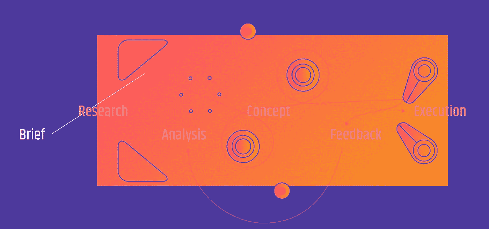

# 为你革命性的想法设计用户界面/UX:过程和陷阱

> 原文：<https://medium.com/hackernoon/designing-the-ui-ux-for-your-revolutionary-idea-processes-and-pitfalls-69ed609ae7c9>

## 想法很可爱。但是，**处决杀死**。

当然可以。想法很棒。有些甚至是革命性的。但是它会改变世界吗？通常，并不是想法本身的价值决定了它的成功。即使是最具革命性的想法，成败的关键也在于执行。想一个失败的想法，“只是因为这个世界还没有准备好。”我们认为这是一个可以归类和分析为“用户接受度低”的借口。这意味着，即使这个想法以最有效的方式专业地解决了问题，它也没有考虑到用户。至少，还不够。因此，我们需要的是，对用户的心态进行广泛的研究，以制造出与明确定义的受众群无缝集成的产品。

> *给我六个小时去砍树。* ***接下来我会花四个小时磨利斧头。***

对一个想法来说，最困难的挑战之一是绝对不偏不倚。为了最客观地看待一个想法，一个人必须对一个特征、一个图形或任何其他元素不偏不倚，不管它们是多么微不足道或巨大。这是我们作为一个机构开始工作的地方。我们热爱数字，发现数据很美。我们遵循严格的研究流程，以确保所有决策都基于核心研究得出的见解，而非假设。我们相信直觉的力量。然而，即使是突破性的直觉，除非经过研究验证，否则也不会成功。

# 我们的方法:

1.  确定当前行业流程中涉及的所有步骤。
    找到您的目标受众，确定从第一步(即销售线索来源)到最后一步(即服务交付)所涉及的所有步骤。使用广泛的主要研究方法，如电话采访、网上调查、面对面调查、焦点小组、墙上的苍蝇等，从哲学上对你的受众进行细分。你甚至可以用和你的观众一样的方式在网上做生意，以了解低效率。这也将极大地有助于创建您的信息架构。
2.  识别工作流程中的痛点
    任何工作流程中的痛点其实都是伪装的机会。痛点仅指出低效率已被隔离。其中的解决方案可以转化为收入。这就是为什么每个创业想法都是美好的。一旦确定，通过在与你的听众的访谈中讨论来再次确认痛点。一旦确认，创建如何我们可能的。一些例子是我们如何减少食物的运送时间？或者我们如何减少预订出租车的时间？并且痛苦地具体说明这些问题。
3.  构思
    基于这些高度集中的问题陈述，单独或跨团队合作进行构思会议。无论我们如何努力，都要找出最愚蠢的想法和最不可行的想法(HMW)。将这些想法组合成解决方案，并尝试提出一个概念来弥合造成棘手问题的差距。在这一点上，还应该有一个发现和一个附在概念上的增长战略。
4.  线框图
    找出执行概念的最小方法。试着关注所提供的价值。确定有助于执行概念的最少步骤。然后看看你的观众的冗余。确定哪些冗余需要继续，以提高产品的接受度。放松学习曲线。还是那句话，大多数产品失败不是因为没有解决问题，而是因为没有被受众接受。
5.  原型和测试
    使用市场上的各种平台，只需点击几下鼠标，就可以将你的设计变成 iPhone、iPad、台式机和 Android 的交互式原型。我最喜欢的是 marvelapp 和 invision。链接你所有的设计，制作动画并展示给你的观众，收集有价值的反馈。然后挖掘他们的洞察力。
6.  设定视觉识别和品牌指南
    这将有助于提高观众的接受度。确定客户在当前场景中使用的所有元素。使用与他们相关的视觉提示。视觉效果不需要过于漂亮。然而，它需要对观众有吸引力和安慰。这可以通过选择合适的字体、风格图标、语言等来实现。

用户界面/UX 是任何想法最重要的过程。它定义了消费者心目中可以接受的当前流程和更有效的理想流程之间的差异。这种差距必须被足够地弥合，这样才能增加最小的价值，同时又不会使产品与受众格格不入。

一个成功的 UX/用户界面冲刺会产生一个能吸引观众的产品，之后，他们会被带向理想的解决方案。

毕竟，理想的解决方案可能在第一天就不理想。

*原载于 2018 年 2 月 11 日*[*blog.tripinstudio.co*](http://blog.tripinstudio.com/design-ui-ux-an-application-for-a-revolutionary-idea/)*m。*