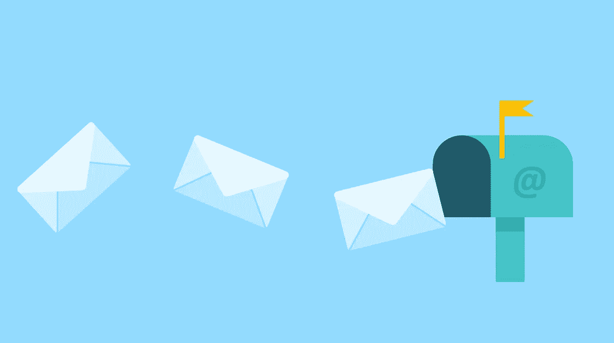
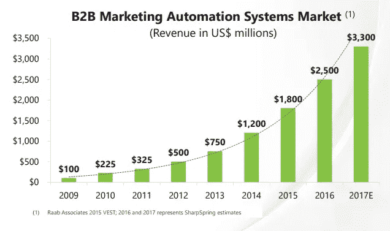
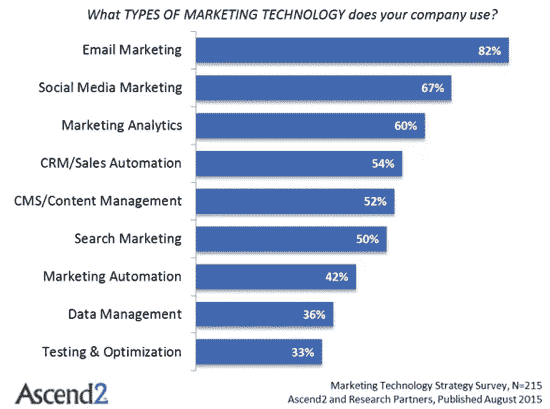
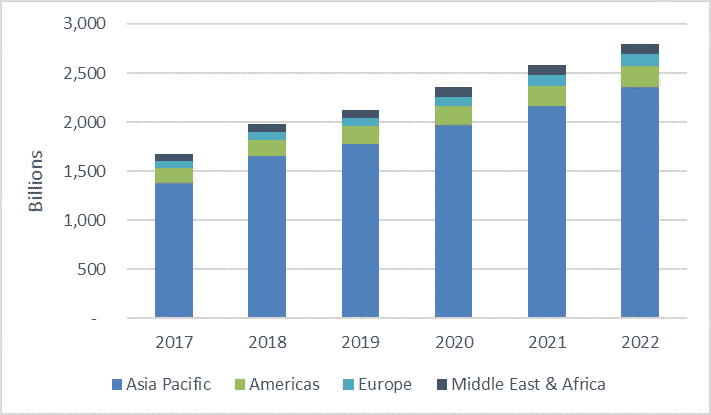

# 尽管超负荷，电子邮件在这里停留

> 原文：<https://medium.com/hackernoon/despite-the-overload-emails-are-here-to-stay-edb15c3f866f>

电子邮件还值得吗？他们实现了他们的宣传吗？现在我们已经到了 2018 年，一些人可能会认为电子邮件已经完成了它的使命:被垃圾邮件和令人讨厌的做法弄得千疮百孔，这种媒体可能已经失去了任何剩余的效用。

外表具有误导性，电子邮件是证明这句格言准确性的又一佐证。我们将更深入地研究下面的数据，但在此之前，让我们从更高的层面来探讨这个问题。

# 一个古老但仍无处不在的国王

尽管年事已高，电子邮件仍然非常活跃。存疑？请回答我这两个问题:

1.  您目前每天或每周监控多少个不同的电子邮件帐户？
2.  你每天在所有的地址上收到多少封电子邮件？

我不是电子邮件的大用户，也不喜欢电子邮件，但我经常查看 6 个不同的电子邮件账户(三个个人账户，一个用于垃圾邮件服务，如电子商务网站，一个用于严肃服务，一个用于人类；和三个专业账户)每天轻松总计超过 **30 条接收信息**，尽管强制执行了非常有选择性的方法来清理它们。

从我听到的与朋友和同事的讨论来看，我会说我处于这个范围的低端:我有很多同事会让我上面给你的数字看起来很小。你呢？

现在，我们的反思时刻已经过去，让我们更进一步，冷静地看看这些数据。

# 数据，数据，数据

首先，让我们看一下高层次的使用指标，以了解这个庞然大物的大小:

*   **43 亿用户**(用户，而非账户)——电子邮件与短信并列“有史以来最广泛的沟通方式”
*   每天发送超过 2500 亿封电子邮件:也就是说，地球上每个人每天发送 36 封电子邮件，或者说每分钟 15 万封。

好了，够了！然而，人们不再阅读他们的电子邮件了，对吗？他们收到的太多了，无法处理！尽管一名办公室职员平均每天收到 **121 封电子邮件**，但我们观察到:

*   【美国】**平均开盘率:34.1%**
*   【美国】**平均点击率:3.1%**(=点击邮件正文中至少一个链接的人)

所有这一切的疯狂之处在于，我们意识到人们确实会在任何地方阅读和回复他们的电子邮件:

*   超过 55%的打开邮件是在移动设备上阅读的。
*   50 %的美国人在床上查看电子邮件
*   【美国】 **42%的人在浴室里**
*   [美国]开车时甚至达到惊人的 18%

[点击此处](https://expandedramblings.com/index.php/email-statistics/)查看之前提供的数据来源，或者如果您想更深入了解。

到目前为止，我们已经查看了电子邮件的使用情况以及协议级别的使用情况。现在你可能会问自己:这种持久的优势来自哪里？

在我们探索电子邮件全垒打的一些潜在解释之前，让我们提醒自己一些基本但经常被忽视的东西:**电子邮件今天仍然流行，因为没有人想出更好的东西**。奇怪的是，丘吉尔关于民主的名言也适用于电子邮件:

> 电子邮件[民主]是最糟糕的沟通形式[政府]，除了所有其他的。

# 电子邮件长期占据统治地位的根源

那么，如何解释电子邮件的统治地位和一个垂死媒介的形象之间的传播呢？现实和我们的期望怎么会相差这么远？

我认为有两个主要因素导致了这种传播:

1.  **:`The tendency for an intervention to appear better when it is new.`。我们，弱小的人类，容易产生偏见，最糟糕的是它们是阴险的——我们没有意识到我们受到它们的影响。新奇偏见可以解释为什么我们如此倾向于相信一种新奇的新技术(Slack？)将很快取代旧的但久经考验的电子邮件，尽管数据表明(电子邮件不会去任何地方)。**
2.  ****新技术可以增强旧技术:**1971 年(第一封电子邮件的那一年)的电子邮件格局与现在完全不同。B2B 营销自动化市场(不仅仅是电子邮件，但仍然)目前价值超过 35 亿美元，年增长率接近 30%。**

# **不断发展的电子邮件生态系统**

**通过电子邮件协议开发了数千种工具(软件和服务)，提供各种服务，包括:**

*   **电子邮件提供商和客户**
*   **查找电子邮件和改进数据库的服务**
*   **电子邮件自动化工具**
*   **垃圾邮件检测和防范工具**
*   **时事通讯/活动经理**
*   **使用电子邮件的 CRM**
*   **课程/培训会议教你如何写销售驱动电子邮件。**
*   **和许多其他人。**

**我们现在有一个完整的围绕电子邮件的生态系统，提供更多的功能，同时也使它们更容易访问(例如，想想移动电子邮件客户端)。**

**很难找到仅涵盖电子邮件相关服务的数据。营销自动化行业不仅仅是电子邮件，但它可以让我们对电子邮件行业的动态有一个总体的了解:**

****

***Marketing Automation Market Growth (*[*source: EmailMonday*](https://www.emailmonday.com/marketing-automation-statistics-overview/)*)***

**尽管自电子邮件出现以来，各种新技术不断涌现，如社交媒体、搜索和其他技术，但电子邮件仍然是王者——它是**使用最多的营销技术**:**

****

***What types of marketing technology does your company use? (*[*source: EmailMonday*](https://www.emailmonday.com/marketing-automation-statistics-overview/)*)***

# **当新技术让旧技术进化**

**当你这样想的时候，这有点令人震惊:闪亮的新技术，如人工智能或自然语言处理，被用来使 50 年前的技术更加高效。有些人可能会说，最好彻底抛弃旧技术，他们可能是对的，除了一件事:**如何开发一种比已经拥有 43 亿用户的通信技术更好的技术**？**

**暂且把这些数字放在一边，想想**当你注册一项新服务时，索要电子邮件已经变得多么平常。**网络服务不会询问你的推特账号、你的信使姓名或者你的电报:从互联网早期开始，直到现在，他们会询问你的电子邮件地址。**

## **邮件和短信，类似的故事？**

**随着时间的推移，技术及其用途也在发展。令人怀疑的是，电子邮件的创建者预见到了当前的形势——自动化信息的绝对优势比如时事通讯，或者来自我们使用的所有网络服务的其他自动化电子邮件。他可能在投射他所知道的景象:旧的普通邮件。**

**类似的场景也在手机短信上展开。一方面，P2P(个人对个人)短信流量呈下降趋势([来源:MMAGlobal](http://www.mmaglobal.com/files/casestudies/mob-mobilecustomerengagement_a2p-wp-77158.pdf) )。**

**另一方面，A2P(应用到个人)短信正在蓬勃发展:**

****

***Total global A2P (Application to Person = automated) SMS messages by region (2017–22) (*[*source: MobileSquared*](https://mobilesquared.co.uk/2018/02/18/global-a2p-traffic-growth-by-2022/)*)***

**短信和电子邮件之间的比较很有见地，因为这两种媒体都走在相似的道路上:**它们从人与人之间的媒体开始，现在作为公司与人之间的媒体达到了顶峰**。它们用法的变化并没有使它们变得不那么流行，恰恰相反:机器比人类更健谈。**

**从我们目前看到的情况来看，我们只剩下一大堆无处可去的电子邮件。更糟糕的是，它可能会继续增加，所以如何处理呢？**

# **替代品并没有削减它**

**多年来，许多不同的应用程序和服务被称为电子邮件杀手。其中，Slack 可能是最突出的。**

**事实上，Slack 对专业环境的关注使它成为了`email killer`这个头衔的主要目标。这是一个令人信服的故事，每个媒体都可以支持，他们很快就这样做了。**

**早在 2014 年，The Verge 就将 Slack 描绘成电子邮件棺材上的钉子: [Slack 正在扼杀电子邮件](https://www.theverge.com/2014/8/12/5991005/slack-is-killing-email-yes-really)。**

**尽管出于宣传目的，但该采访包含了 Slack 创始人斯图尔特·巴特菲尔德的一个有趣(且经过验证的)见解:**

> **过去 10 年左右，电子邮件变得越来越糟糕。十年前，50%到 60%的电子邮件来自另一个人，现在是 8%到 10%。另外 90%来自机器。**

**他没能(可能是故意的，因为 Slack 的议程)看到自动电子邮件是多么有用，并引用了一些琐碎的事情。密码重置电子邮件、交付通知、可疑登录通知、账单和警报怎么办？**

****

**现在，这就是有趣的地方:从那以后，我们有没有从 The Verge 听到过同样的话题？是的，就在最近。事实证明**四年的时间足以完全推翻之前确立的诊断** :
[懈怠并没有杀死电子邮件——它可能会让它变得更强大](https://www.theverge.com/2018/7/4/17486742/slack-distraction-front-mathilde-collin-interview-converge-podcast)**

**作者([凯西·牛顿](https://twitter.com/CaseyNewton))详细描述了 Slack 常见的令人沮丧之处，比如**它的即时、永远在线的特性**最终使它比它本应扼杀的电子邮件更加苛刻。Slack 的同步本质集中了作者的批评，但他正在采访一家公司的首席执行官，该公司希望构建“异步 Slack ”,因此再次对此持保留态度。**

# **杂乱的开放协议胜过围墙花园**

**一家目前价值 51 亿美元的公司未能消灭电子邮件是必然的。这表明，取代电子邮件并不是筹集足够资金的问题:它更多的是与用来推翻国王的心态和方法有关。**

**NYMag 上的 Vijith Assar 完美地总结了 Slack 未能终止电子邮件的原因:**

> **也就是说，除非主要目标是沟通本身，否则不可能建立更好的沟通系统。但是，总的来说，我们没有在创建新的开放标准、规范和协议方面投入太多，而围绕这些标准、规范和协议可以构建全新类别的工具——我们太忙于销售应用程序了！归根结底，Slack 只是另一个应用程序。**

**电子邮件协议的开放性使得它无处不在:任何人都可以托管它的服务器，成为电子邮件提供商。任何人都可以在其上构建服务，没有任何限制。如果电子邮件的替代品真的会出现，那也不会是一家寄希望于`expand in new markets`和`establish a new (proprietary) communication standard`的私人公司。**

**恰恰相反:**每个人都可以在**的基础上建立一个开放和友好的协议。围墙花园在美学上是令人愉悦的，但最终，它不是最好看的解决方案，而是最具包容性的解决方案。维基百科展示了知识共享的理论；**现在在线通讯正耐心地等待他们开放和欢迎的冠军。与此同时，电子邮件的时钟还没有开始计时。****

***原载于 2018 年 9 月 17 日*[*gwapit.com*](https://gwapit.com/blog/email/emails-are-here-to-stay/)*。***