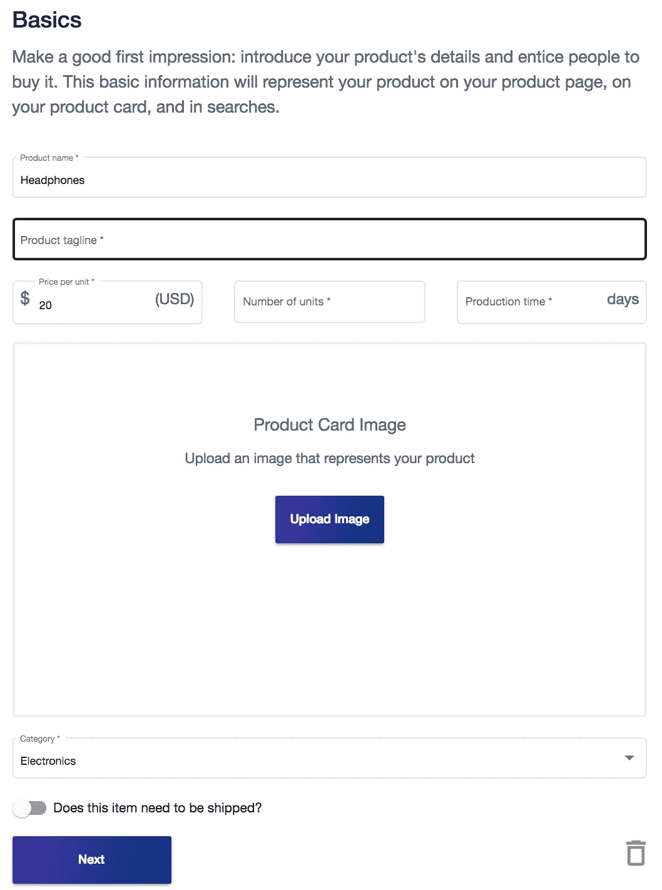
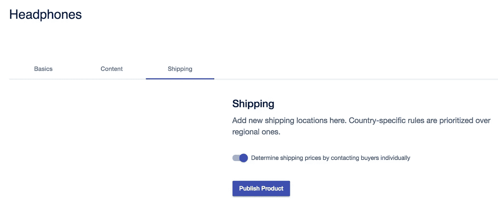

# 我们增加了详细的卡片视图，改进了 ELIX 活动和产品设置，还包括一个视频演示

> 原文：<https://medium.com/hackernoon/detail-card-views-improved-campaign-product-setup-more-5205a13c26b8>

在过去的一周里，我们一直在努力改进 ELIX 门户网站。如果您还没有，请在此注册 ELIX 门户网站[。](https://www.elixirtoken.io/signup)

**详细卡片视频演示**

现在，当点击仪表板中的产品和活动时，会显示详细信息卡。对于产品，您现在可以看到关于产品的重要信息，如标题、标语、类别、描述和所有三个图像。查看下面的演示视频:

此外，创作者现在可以在创建产品和活动时添加多达 3 张详细照片和一个视频。

我们还在设置产品和活动时添加了标语:

此外，我们还澄清了产品和奖励的发货信息对话。现在，创作者可以选择联系支持者，并单独安排运输，给每个人额外的灵活性。

Creators can opt to contact backers or buyers individually

在过去的一周里，我们在 [ELIX 博客](https://blog.elixirtoken.io/)上发布了三篇新的博客文章。ELIX 博客关注众筹、区块链和技术趋势，并包含大量关于 ELIX 的教程。请查看我们最近的博文:

*众筹和电子商务互补的 5 种方式*

本文涵盖[为什么众筹和电商走在一起](https://blog.elixirtoken.io/crowdfunding-and-ecommerce/)。点击下面的图片阅读文章。

*如何用众筹智能合约为你的下一笔生意融资*

本文涵盖了以太坊智能合约的基础知识，以及如何使用它们来表示和分配公司中的令牌化股权。

*区块链将如何使企业家和投资者的筹资民主化*

本文涵盖了为未来公司提供股权的代币发行，以及为什么这种发行通过提供更好的利率和交易而使企业家受益。

查看 ELIX 博客中关于众筹、技术和区块链趋势的其他有趣文章。

我们最近还发布了一个用 ELIX 创建项目的教程。点击下面的图片开始:

这星期就这些了！[注册 ELIX](https://elixirtoken.io/signup) 并关注新的更新和特性。

创造一个产品或活动

注册 ELIX 门户网站，只需几分钟即可创建您自己的产品或活动。

