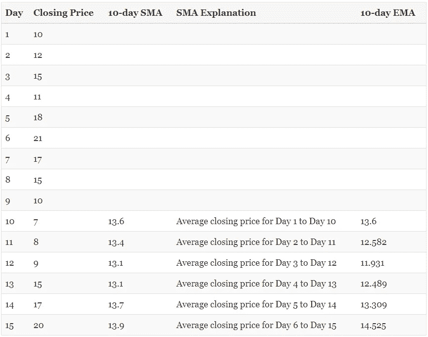
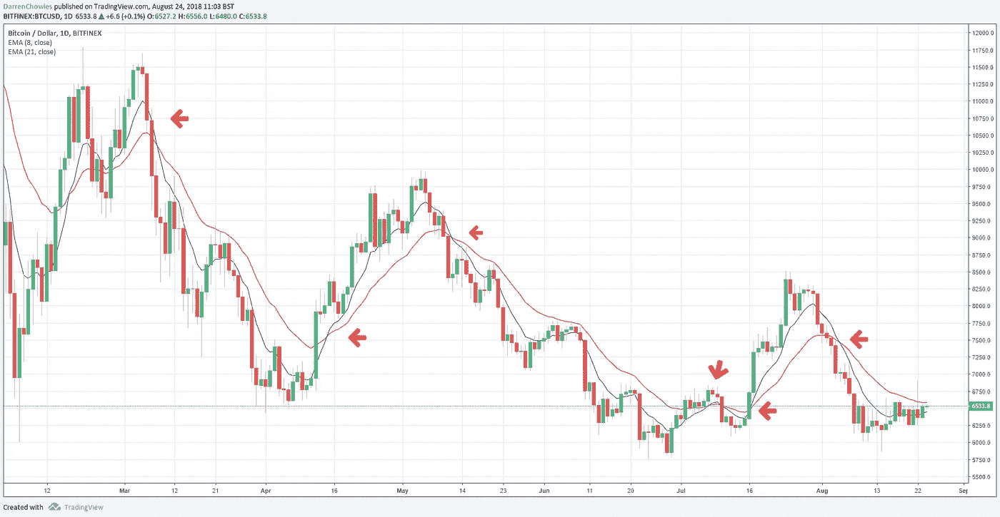
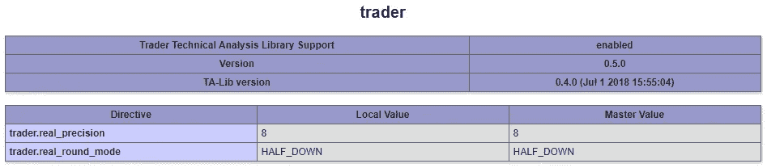
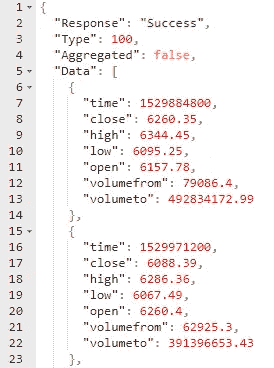
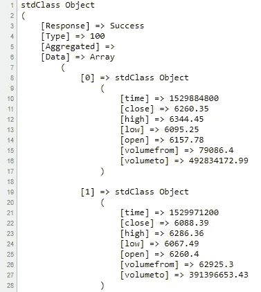

# 使用 PHP 检测加密货币市场趋势:指数移动平均线

> 原文：<https://medium.com/hackernoon/detect-cryptocurrency-market-trends-using-php-exponential-moving-averages-d5134d56f484>

## 我们将使用 PHP 计算 8 天和 21 天的指数移动平均线，以确定比特币的看涨/看跌交叉。


Photo by [Nokwan007](https://www.shutterstock.com/g/nokwan007) on Shutterstock.com

# 什么是均线？

移动平均线可以让你看到一个金融工具在一段时间内的价格变化。它在技术分析中被广泛使用，被称为“滞后”指标，因为它是基于历史价格的。

两种常用的均线是简单移动平均线(SMA)和指数移动平均线(EMA)。SMA 是证券在特定时期的简单平均值。均线与此类似，但是更重视最近的价格。

# SMA 和 EMA 的示例

理解 SMA 和 EMA 最简单的方法是看一个例子。

我们将虚拟证券在过去 15 天的收盘价计算如下:

第一周 : 10、12、15、11、18

**第二周** : 21、17、15、10、7

**第三周** : 8、9、15、17、20

在这个例子中，10 天均线是前 10 天的平均收盘价。第二天的 SMA 将是前 10 天，将第一天从列表中删除。诸如此类。



Table illustrating SMA and EMA values

EMA 的参与程度略高。它包括计算加权乘数，然后用价格、加权值和前一天的均线来确定均线。

幸运的是，您不需要担心所涉及的底层算术。PHP 有一个名为 Trader 的库，用来处理技术分析计算。

# 8 日和 21 日均线



8-day and 21-day EMA on the BTCUSD chart on TradingView

8 日和 21 日 EMA 是股票市场和加密货币市场中非常流行的短期指标。

主要信号是:

*   当 8 日线穿越 21 日线上方时。这表明多头交叉，价格可能会上涨(买入信号)。
*   当 8 日线穿越 21 日线下方时。这表明一个熊市交叉，价格可能会下降(卖出信号)。

看上面的图表，我已经标出了 8 天(蓝色)和 21 天(红色)的交叉点，这就是趋势。

# 提醒一句

我不是财务顾问，本文中的任何内容都不应被理解为财务建议。加密市场是高度不稳定的，你应该在做任何投资之前做自己的彻底研究。

同样需要注意的是，技术分析并不完美。因为市场是由心理驱动的，一些信号可能会完全消失。这就是为什么同时利用各种指标(如 RSI 和成交量)很重要。然后你会寻找汇合点，也就是几个指标都显示出相似的趋势。即使这样，你也不能百分百确定。

**技术分析不是银弹。**

# 准备好您的 PHP 环境

我们将使用 PHP [交易者扩展](http://php.net/manual/en/book.trader.php)来计算均线。您可以通过检查`phpinfo()`的结果来确认它已安装:



历史价格数据可通过优秀的 [CryptoCompare API](https://min-api.cryptocompare.com/) 获得。我们将使用他们的历史数据 API。以下请求将显示过去 60 天 BTC 的美元价格:

[https://min-api.cryptocompare.com/data/histoday?fsym=BTC&tsym = USD&limit = 60](https://min-api.cryptocompare.com/data/histoday?fsym=BTC&tsym=USD&limit=60)



JSON extract from CryptoCompare

它将关闭时间视为 12:00 GMT，`time`字段返回 Unix 时间戳(纪元时间)。

# 确定 EMA

添加以下代码以从 CryptoCompare API 读取响应:

```
<?php$response = json_decode(file_get_contents('https://min-api.cryptocompare.com/data/histoday?fsym=BTC&tsym=USD&limit=60'));
```

如果您执行`print_r($response)`，将会返回如下响应:



Decode the JSON response into a PHP object

接下来，我们将收盘价添加到一个数组中:

```
$prices = [];foreach ($response->Data as $v) {
    $prices[] = $v->close;
}
```

保存这些价格后，我们现在可以使用 [trader_ema()](http://php.net/manual/en/function.trader-ema.php) PHP 函数来确定 8 天和 21 天的 ema:

```
$ema8 = trader_ema($prices, 8);
$ema21 = trader_ema($prices, 21);
```

提醒一下:默认情况下，Trader 扩展使用 3 位小数的精度。要使用 satoshi 或显示几个小数的硬币，如 XRP 和 XLM，您可以在运行时设定精度:

```
ini_set('trader.real_precision', '8');
```

或者在 **php.ini** 文件中:

```
trader.real_precision=8
```

现在我们有了 EMA 的数组，我们将获取每组的最后两个来设置前一天的 EMA 和当前的 EMA:

```
$current_8 = array_pop($ema8);
$current_21 = array_pop($ema21);
$previous_8 = array_pop($ema8);
$previous_21 = array_pop($ema21);
```

我们现在可以简单地检查是否发生了交叉，并做出相应的反应:

```
if ($current_8 > $current_21 && $previous_8 < $previous_21) {
    echo 'Buy';
} elseif ($current_8 < $current_21 && $previous_8 > $previous_21) {
    echo 'Sell';
} else {
    echo 'Do Nothing';
}
```

这是完整的最终源代码，带有一些输出:

```
<?phpini_set(‘trader.real_precision’, ‘8’);$response = json_decode(file_get_contents(‘[https://min-api.cryptocompare.com/data/histoday?fsym=BTC&tsym=USD&limit=60'](https://min-api.cryptocompare.com/data/histoday?fsym=BTC&tsym=USD&limit=60')));$prices = [];foreach ($response->Data as $k => $v) {
    $prices[] = $v->close;
}$ema8 = trader_ema($prices, 8);
$ema21 = trader_ema($prices, 21);$current_8 = array_pop($ema8);
$current_21 = array_pop($ema21);
$previous_8 = array_pop($ema8);
$previous_21 = array_pop($ema21);echo ‘Current 8-day: ‘ . $current_8 . “\n”;
echo ‘Current 21-day: ‘ . $current_21 . “\n”;
echo ‘Previous 8-day: ‘ . $previous_8 . “\n”;
echo ‘Previous 21-day: ‘ . $previous_21 . “\n”;if ($current_8 > $current_21 && $previous_8 < $previous_21) {
    echo ‘Buy’;
} elseif ($current_8 < $current_21 && $previous_8 > $previous_21) {
    echo ‘Sell’;
} else {
    echo ‘Do Nothing’;
}
```

# 真实世界使用

这方面的一个简单的现实应用是将它集成到一个交易机器人中。您可以使用服务器上的 cron 将它设置为每天运行。在最新收盘价后运行它，检测是否有交叉。

如果你的机器人发现了某些趋势，你可以与币安这样的交易所整合，通过他们的 API 执行交易。如前所述，尝试从至少三个不同的指标中寻找确认，以最小化你的风险。

在接下来的文章中，我们将关注更多指标，以及它们如何用于确定加密货币市场趋势。

# 升级你的网站开发技能！

[注册我的时事通讯](https://webdev.chowles.com/)，在那里我将分享有见地的网络开发和区块链相关的文章，以增强你的技能。