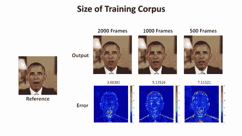
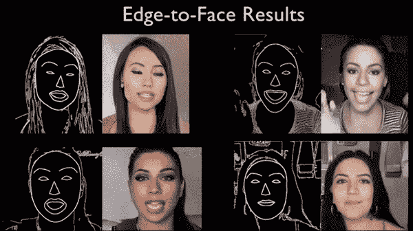
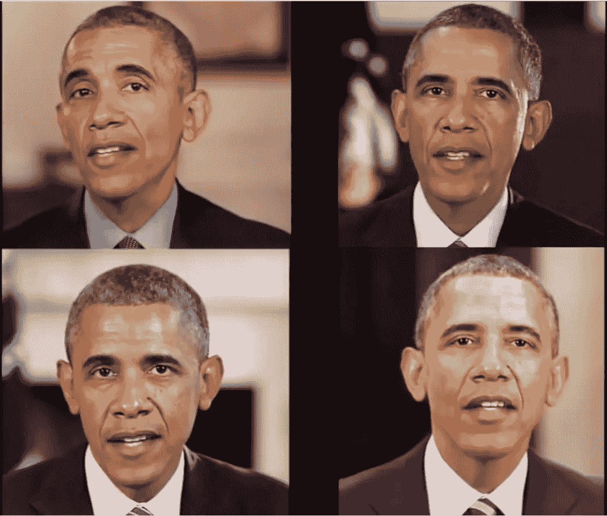
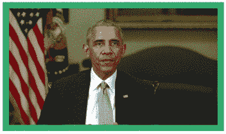
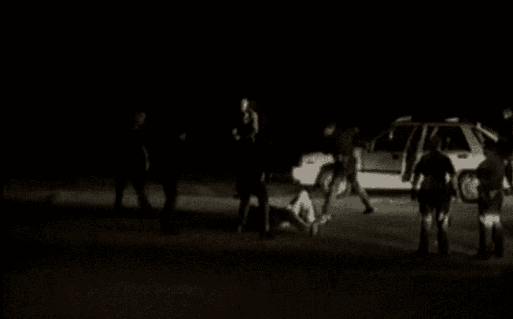

# 检测假视频需要从视频认证开始

> 原文：<https://medium.com/hackernoon/detecting-fake-video-needs-to-start-with-video-authentication-224a988996ce>

## 人工智能能力存在军备竞赛。相反，让我们用视频的加密签名来对抗“深度伪造”。

基于人工智能的图像合成的最新发展赋予了机器生成真实世界的照片和视频的能力，以及几年前似乎不可能实现的准确性。虽然这种技术令人难以置信的应用才刚刚开始探索，但最近媒体对[假视频](https://www.youtube.com/watch?v=cQ54GDm1eL0)的报道告诉我们，这种技术的恶意使用就在眼前。

虽然制作一个足够质量的假视频来愚弄大多数人既昂贵又耗时，但功能的逐年发展正见证这种技术以极快的速度商品化。当前的努力有时看起来很可笑，但基于深度学习的造假(或“深度造假”)的存在已经开始质疑我们自己的感官、犯罪证据和我们信任的机构。

在 deepfake 技术发展的同时，人工智能也在发展，以应对这种威胁:经过训练的机器可以检测视频中的恶意篡改，在不可避免的未来，我们发现自己无法检测伪造。

> 两个人工智能研究领域之间的军备竞赛，很可能会永远持续下去。
> 
> 但是我们能从不同的角度来应对这个挑战吗？

自从有了计算机网络，我们就一直在处理伪造的电子数据。

*   你正在阅读这篇文章的浏览器可能会显示一个绿色的小挂锁，让你知道这个页面来自它声称的来源，并且在到达你的屏幕的过程中没有被第三方修改过。
*   你关注的名人推特资料可能有一个蓝色勾号，告诉你这些推文来自他们声称的那个人。
*   当您最后一次在网页上输入您的信用卡信息时，您必须提供附加的个人信息，如与信用卡关联的邮政地址，以证明您是信用卡的合法所有者。
*   当您使用在线服务时，您的政府网站可能会要求您以电子方式提供护照或其他形式的官方身份证的详细信息。

这些都是我们在日常生活中遇到的电子身份识别和认证形式。我们周围的基础设施—医疗保健、金融、司法系统和许多其他系统—也依赖于电子身份识别和认证信任。数字证书和电子签名在我们生活的背景中不断地被交换，我们几乎看不见。

虽然应对假视频对社会日益逼近的威胁的大部分对话都围绕着通过法医分析视频的特征来检测视频中的恶意篡改——部署*好的人工智能*来对抗*坏的人工智能*——但我们可以通过对我们记录和消费视频内容的方式进行一些改变来保护自己免受假视频的影响。

> 来自源的视频的加密签名为我们提供了证据，表明该视频来自记录它的设备，未被改动。

分析和检测虚假视频的软件很容易集成，因为这种类型的软件位于视频上传和播放之间的分发位置。相比之下，认证视频更难协调，因为有许多利益相关者，从相机制造商到分销商，都必须同意并采用认证标准。将组织聚集在一起进行协作是我们在社会的众多领域建立互操作性标准的方式。仅仅因为它很难，并不意味着我们不应该尝试——*尤其是*如果风险证明努力是值得的。

## 利害攸关的是什么？

*   你面试一份工作，但是在最后阶段失败了。你被告知的只是你“不适合”，而他们“正在和另一个候选人一起前进”。在你不知情的情况下，HR 发现了你在一次常规背景调查中辱骂种族主义者的录音。
*   一名青少年的父母坐在她的床边，因为她在一次自杀未遂后躺在医院里一动不动。他们心烦意乱地发现他们女儿的班级一直在分享她所谓的色情视频。
*   当报纸标题号召战争时，一个国家的人民被激发起来了。“我们必须先发制人”，他们在回应所谓的另一个国家的总统向他们的国家宣战的镜头时说。录像是真的吗？还是他们自己国家的情报机构试图为战争制造借口？

这关系到真实的生命。

有些人认为，我们已经有了“假”文本和“PS”图像一段时间了。从根本上说，这段视频没有什么不同:人类会像适应被篡改的图像一样适应假视频。即使有一种怀疑的观点认为社会最终会重新定位自己:[短期内的后果是真实的](https://www.npr.org/2018/04/11/601323233/6-facts-we-know-about-fake-news-in-the-2016-election?t=1539388706797)正如我们在 2016 年看到的选举干预假新闻。

虽然视频似乎只是一个不可避免的序列中的另一步(文本→图像→视频)，但人类与视频的关系比其他形式更加强大和独特(我们将在未来的博客中对此进行更多阐述)。为了分析虚假视频的风险和影响的规模，我们需要考虑三个趋势的三重影响:视频优先的世界，提供大规模定向分发的社交网络，以及复杂的深度学习人工智能大规模创建现实内容。

> 我们还没有看到人工智能的大规模协调部署来创造和发布大量的假货，但这种基础已经播下。

在一个我们不能相信自己的眼睛和耳朵的世界里，我们将如何解释事件和情况？

寻求欺骗和传播虚假信息的 Deepfakes 是一个需要打击的问题，那么我们有什么选择呢？

## 当前对话:好人工智能对坏人工智能，一场军备竞赛。

最常讨论的方法是，我们应该用法医分析视频的软件来对抗深度造假。像这样的软件可以检查音频和视频数据本身的特征，寻找伪像、异常压缩签名或者相机或麦克风噪声模式。除了数据的特征，人工智能还可以分析视频元数据，甚至对视频的主题进行行为模式分析。

> 所谓的好的人工智能用来监管坏的人工智能。
> 
> 这种方法的挑战是，坏的人工智能将有一个反馈回路，它知道它生成的视频在搜索结果中被标记为假的或被惩罚的。

它会不断地从知识中学习。

一个深度伪造生成系统可以不断产生内容，从它获得的确定性中学习什么是可检测的，什么是不可检测的，而好的人工智能将永远落后一步，慢慢学习，但永远不会将其新发现的知识建立在确定性的基础上，即什么内容是假的，什么内容不是假的。

> 好的人工智能就像诺顿杀毒软件一样:它可以捕捉大多数病毒，但不是全部。

会有假阳性，也会有假阴性。最终，坏的人工智能只需要让*一个*视频作为假阴性来欺骗它的预定目标。

> 打击虚假视频不一定是一场军备竞赛。

让我们从预防的角度来看问题:身份验证，而不是关注补救措施。

YouTube: [https://www.youtube.com/watch?time_continue=39&v=MVBe6_o4cMI](https://www.youtube.com/watch?time_continue=39&v=MVBe6_o4cMI)

## 视频认证及其工作原理。

视频认证是指通过哈希算法处理视频数据，该算法将视频数据集合(例如文件)映射到一小段文本字符串或“指纹”。视频文件指纹可以在视频的整个生命周期中随身携带，从捕获到分发。在回放时，这些指纹会被再次确认，证明视频数据的真实性——确认这是最初录制的同一视频。

该指纹也可以由记录设备进行数字签名，提供内容最初来自设备细节和其他元数据的证据。无论是闭路电视摄像机、急救人员的随身摄像机、记者的注册设备，还是相关公民的手机应用程序。

当观众观看录像时，他们可以检查真实性证书，检查该文件的保管链。在回放过程中，甚至应该有一个视频指纹匹配原始记录内容(它是真实的)和不匹配(真实性无法保证)的视觉表示。这类似于浏览器的锁图标简单明了地传达你正在访问的网站的真实性。

[Amber](https://ambervideo.co)’s UI uses a border around the video to communicate where it has been altered

这种形式的视频认证需要:

1.  哈希和签名技术将通过 SDK 集成到录制应用程序或录制设备的固件中。在尽可能接近录制时间时采集视频指纹是非常必要的，因为任何延迟都会增加被利用的风险。(未来，我们可能需要在板载视频编码器芯片或图像传感器本身中内置指纹识别功能。)
2.  生成的指纹以及诸如作者、位置、时间和设备细节等细节将以安全、签名和不可改变的方式存储。一个例子是一个强大的区块链，其中智能合同记录视频的哈希和附加细节。
3.  在回放时，视频被重新散列，并与从不可变的存储中检索的指纹进行比较。

如果指纹不匹配，视频就被篡改了。

如果指纹匹配，视频是真实的，未经更改。

结果是二进制的:匹配或不匹配。由于这种方法依赖于哈希函数，所以恶意更改视频以产生相同的指纹并仍然可以播放是非常非常困难的，很可能是不可能的。

> 最终结果将类似于浏览器中使用的传输层安全技术，为媒体文件创建一个“真相层”。

至关重要的是，这些指纹被存储在一个不可变但透明的数据库中，以便多个利益相关者可以对视频的真实性有信心。如果不是这样，一个坏演员可以修改视频和原始指纹，使修改后的视频看起来是真实的。或者他们可能只改变指纹本身，从而对真正视频的合法性产生怀疑。

对于在新闻或视频证据等相关类别的视频中变得常见的认证视频，也就是说，大多数视频不需要认证和签名，关键的挑战是引入大量关键参与者。这些群体包括相机制造商(包括智能手机制造商)和分销商，如传统的电视和广播公司，以及 Twitter、脸书和 YouTube 等新媒体平台。

在一个我们应该对自己的眼睛和耳朵(以及它们所解释的东西)持怀疑态度的世界里，认证是一种系统设计，在这种设计中，真理是在一个基础层上形成的。

## 通过设计获得信任:

当然，视频认证或假视频检测不会停止:

*   青少年互相欺负；
*   新闻编辑选择以某种方式歪曲故事的镜头；
*   阴谋论者声称证据是伪造的。

然而，系统设计中的选择可以防止篡改视频的传播，或者允许观众对照源镜头查看他们正在观看的编辑过的镜头，并为那些试图抹黑或传播错误信息的人煽风点火。

If the Rodney King Beatings happened today, would people doubt the legitimacy of the video as a product of a deepfake? The existence of deepfakes will cast a shadow over authentic videos.

我们社交媒体帖子上的最新大片或最新图像过滤器不需要认证技术。但基于事实的内容，尤其是风险很高的内容，应该从一开始就考虑到可信度。

在 Amber，我们为视频创建了一个视频认证系统或“真相层”,其中信任被构建到基础层中。该系统包括一个视频记录应用程序，将指纹和审计线索存储为不可改变的区块链记录，以及一个播放再次确认视频的网站。

## 与苹果应用商店相似

我们的视频认证系统在许多重要方面反映了苹果应用商店。一部 iPhone(除非越狱)只能从官方应用商店下载并运行应用。该应用程序商店上的这些应用程序已经过安全策略合规性评估。应用程序本身是由经验证的开发人员提交的，根据提交者是个人开发人员还是公司，经过严格审查。

> 苹果在其生态系统中围绕应用程序建立了一个安全环，从而让客户对他们选择从 App Store 下载的应用程序的安全性和有效性充满信心。

如果你在你的 iPhone 上下载一个应用程序，你几乎可以肯定它会像它在应用商店描述中声称的那样运行。这款应用(及其开发者)已经通过了苹果生态系统的认证。你的手机是生态系统的一部分。生态系统中的信任度也大大提高了。

## 认证+检测:一种混合方法。

由于电子商务网站上的交易即使在认证检查通过后也要通过欺诈检测软件，Amber 采取了一种组合方法，不仅生成内容的指纹，还部署了最新的 *good* AI 开发来检测假货。我们对上传到我们平台的视频进行了各种分析，不仅提供了视频被篡改的可能性，还提供了图像中可能发生这种篡改的位置。

视频认证是一种重要的方法，但它可能不是万无一失的，例如，如果您使用摄像机(带有视频指纹技术)拍摄播放被操纵视频的屏幕。使用软件来检测假货和篡改是对认证的重要补充。

在琥珀，我们坚信对人类最大的影响之一是采用科学方法及其基于证据的结论的前提。我们的任务是保护视听证据的真实性。

Deepfakes，以及一般的恶意 AI，在不久的将来会造成很大的危害。我们需要先发制人应对当前的挑战，而视频认证是解决方案的关键部分。

想参加吗？

1.  在等候名单上注册尝试琥珀认证:[https://app.ambervideo.co/](https://app.ambervideo.co/)

2.联系我们，了解我们的验证产品是否适合您:【https://ambervideo.co 

3.请在下面留下您的想法或给我们发消息:【https://twitter.com/ambervid 

# 关于| Amber:视频真实性，按比例。

Amber 正在开发视频的“真相层”。**琥珀鉴定**指纹来源视频&追踪其出处。 **Amber Detect** 使用先进的 AI 和 deepfakes 计数器系统分析未知来源的合成视频。

[如果您想了解更多关于我们的工作以及如何将**认证**和**检测**产品无缝集成到您的工作流程中，以实现大规模的无摩擦视频准确性，请联系我们](https://twitter.com/ambervid)。

感谢 [Roderick Hodgson](https://medium.com/u/c966e83cb950?source=post_page-----224a988996ce--------------------------------) 、 [Shaan Puri](https://medium.com/u/46a2351963d0?source=post_page-----224a988996ce--------------------------------) 和 [Sikander Mohammed Khan](https://medium.com/u/a7400d831f97?source=post_page-----224a988996ce--------------------------------) 对这篇文章的所有投入和反馈。