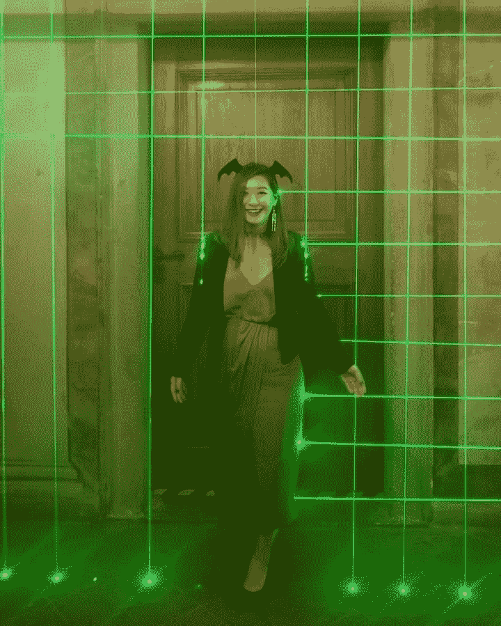
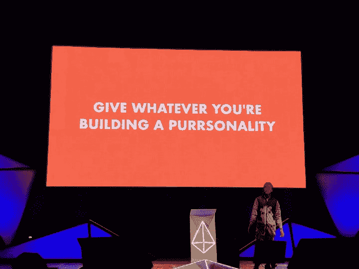
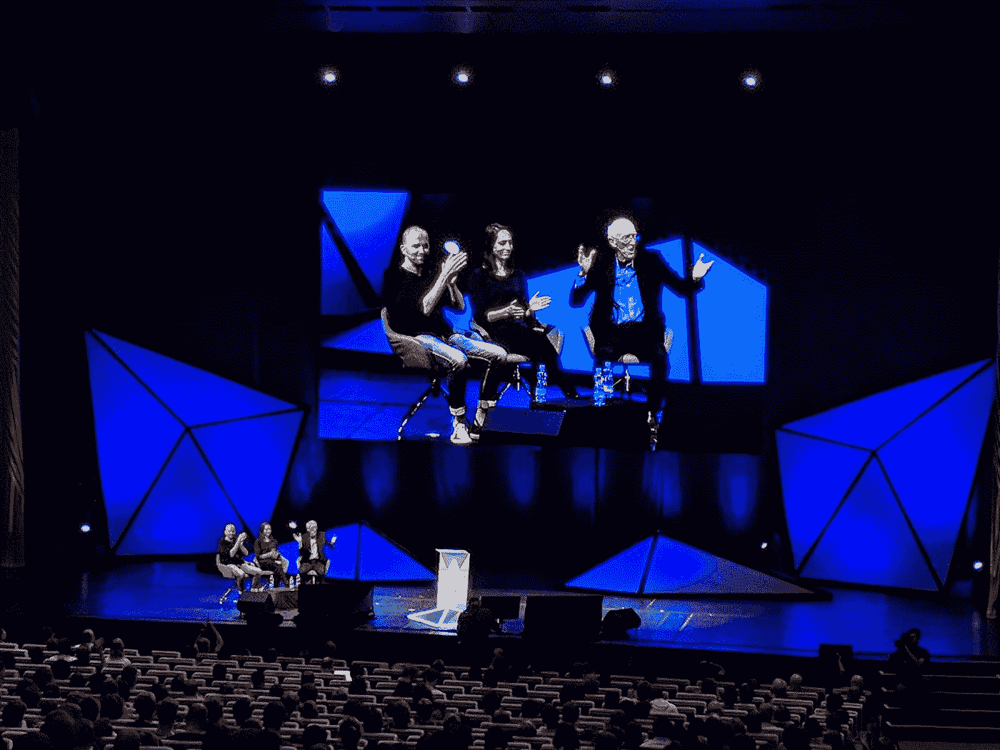

# DEVCON4 2018:以太坊开发者大会亮点

> 原文：<https://medium.com/hackernoon/devcon4-2018-highlights-of-ethereum-developer-conference-6bfdae040c8d>

# 功能失调、分散的以太人社区去喝苦艾酒

区块链开发者最大的会议——敌无双每年都会召开一次；很明显，它不同于任何其他的秘密会议。与会者称赞这一年一度的聚会实际上只是一次大的家庭聚会。

敌无双吸引了加密货币领域几乎所有项目的代表，包括以太坊核心家族内外的代表。这是一个酒吧，古怪的堂兄弟，你从来没有听说过的叔叔，和隔壁邻居的寄养儿童聚集在一起，了解其他人正在建设的新东西。事实上，这看起来确实像是一个快乐的不正常的大家庭。似乎没有人知道如何拼写“构建”。

今年，隔壁领养的孩子出现了——他带来了一个扩展解决方案。

# 以太薄荷

[Cosmos Network](http://cosmos.network) 发表了一个演讲，展示了它的区块链应用框架, [Cosmos SDK](http://github.com/cosmos/cosmos-sdk) ，用于构建兼容 Web3 的挂钩侧链，还有一个额外的好处——区块链互操作性。

由 Cosmos 的核心开发者 [Christopher Goes](/@cwgoes) 在 YouTube 上录制的这个演讲[详细阐述了 Cosmos 网络如何提供技术来实现这一点。](https://youtu.be/xPO4TU0RTqA) [Ethermint](https://github.com/cosmos/ethermint) 是针对以太坊第 1 层水平可伸缩性提出的扩展解决方案，使 dApp 开发人员能够跨多个连接的区块链运行专用 EVM 实例。

**以太币演讲幻灯片** : [*以太币 2.0 —以太币缩放解决方案*](https://www.slideshare.net/tendermint/ethermint-20-an-ethereum-scaling-solution-by-cosmos-121914580)

# 涡轮增压

Turbo-Geth 的首席开发人员 Alexey Akhunov 做了一次特别的演讲，详细介绍了他为每个以太坊客户端(Geth & [奇偶校验技术](/@ParityTech))以及如何降低 p2p 层的[大叔率](https://nulltx.com/what-are-ethereum-uncles/)所做的优化。

# 状态黑客马拉松

作为主赛事的前兆，[状态](/@status.im)举办了一场黑客马拉松。维塔利克·布特林在舞台上非正式地出现，回答了每个人心中迫切的问题:以太坊的路线图是什么？

DADI 团队给观众演示 DADI 的振动。

在黑客马拉松结束时，获得不名誉提及奖的团队归 DADI 团队所有。DADI 主张分散自主假阳具接口。杰出项目劫持了一个蓝牙假阳具，将其连接到以太坊区块链，并让用户能够在一个街区的时间间隔内控制机械阳具的速度。

仍然可以在 [*大地拍卖*](https://dadi.auction/) 竞价。

维塔利克·布特林结束了敌无双之前的派对。

# 主要事件

5000 人的活动在布拉格市中心一个令人印象深刻的 140，000 平方英尺的场地举行。制成展厅。

组织者得到了一个令人印象深刻的阵容发言人以外的区块链部门:格伦 Weyl 和斯图尔特布兰德举两个例子。

[Vitalik Buterin](/@VitalikButerin) 在 Devcon4 上发表开幕主题演讲，欢迎所有与会者，该演讲展示了以太坊的发展蓝图，其中包括备受期待的 Proof-of-stage beacon chain、Shasper 和 Serenity。

# 赃物

Devcon4 是赃物猎人的梦想。

从左至右:来自 [ConsenSys](/@ConsenSys) Design 的衬衫，来自 [Polymath](/@polymathnetwork) 的袜子，来自[Hodge](/@hoardexchange)的背包，来自 [Status](/@status.im) 的衬衫，来自[inter chain Foundation](/@interchain_io)(Cosmos)的帽衫。

[宇宙网络](/@cosmosnetwork)吹嘘其测试网络[的视觉显示](http://nylira.net)，六边形的狗代表完整的节点。

# 余兴派对

从左到右:Rockaway 区块链党。万圣节之夜，卡斯帕城堡的激光门。

The tower party. Photo credit: Matej Nemček ⚡ 孔子

# 艺术装置——海王星房间

一进入海王星房间，人们不禁会认为自己走进了一个火人营，而不是一个区块链会议。然而，这正是你在以太坊活动中所期待的那种体验。悬挂的灯对迪吉里杜管、姆比拉管和悬挂的鼓的声音做出反应，创造了一种适合在漫长的一天密集会谈后冥想或小睡的氛围。

# 特别嘉宾出场

Devcon4 正好在万圣节期间，所以当人们穿着相当古怪的服装出现时，一点也不奇怪。一些比较独特的角色出现了:

## 吹笛者

如果你友好地请求，吹笛者会演奏一首歌。

## 圣诞老人

那是 DevCon 的前一天晚上，整个链条上没有一个以太人在动，甚至 Vlad 的大脑也没有。这些积木都小心翼翼地挂在区块链上，希望维塔利科很快就能到那里。— [莱恩·雷蒂格](/@lrettig)

主演:[格里夫·格林](/@thegrifft)饰演圣诞老人。

## 披着斗篷的变形人

《T4》的迈克尔·佩克林通过海角旅行到了敌无双。

# 闭幕式

除了狗，猫也高调亮相。

[OmiseGO](/@omise_go) 让 Stewart Brand 作为闭幕主题演讲。

在感谢猫在拟人化的赞赏中抓着屏幕之后，是一系列由在活动期间发推特#devcon4 的与会者自己的脸组成的时刻。最后，为期 4 天的面向开发人员的会议以一首合唱歌曲的方式圆满结束。

# 那些脸

这种语气表达了对与会者的简单敬意——构建者社区是赋予技术意义和与使用者相关的人。因为缺少了人的因素，去中心化技术本身很容易沦为空洞的承诺。

关于作家:

[被解放的钱戈](http://silicon.nyc/author/chjango/)

## 宇宙公司战略沟通主管

Chjango Unchained 是 Tendermint 的 Cosmos Network 战略沟通主管，也是首席技术作家和 Cosmos 博客的主编。Chjango 撰写了长篇文章，为各种理解水平的读者详细介绍了协议、分布式系统和区块链技术。