# 为即时消息应用程序开发辅助功能支持

> 原文：<https://medium.com/hackernoon/develop-accessibility-support-for-instant-messaging-app-abf74266c442>

*如何让阿里巴巴的 DingTalk Android 对视障人士无障碍*

对于世界上数百万患有视觉障碍或失明的人来说，使用智能手机或平板电脑可能是一个挑战。我们必须让尽可能多的用户能够使用应用程序，阿里巴巴的工程师们一直在努力让视障人士能够使用阿里巴巴强大的企业即时通讯工具 DingTalk。

世界上大约有 2.85 亿人患有视觉障碍，但在智能设备的帮助下，他们可以访问互联网并享受互联网带来的所有好处。但是，在一个大多数互动都在网上进行的世界里，无法阅读他们屏幕上的内容可能会阻止视障人士像视力正常的人一样充分认识到互联网的好处。

2017 年 6 月，为了补充已经为 DingTalk iOS 提供的可访问性支持，阿里巴巴推出了一系列针对 DingTalk Android 的可访问性改进。经过与深圳信息无障碍研究协会两个多月的密切合作，DingTalk Android 现已完全无障碍且用户友好。它目前已经在各种组织和机构中使用，包括浙江盲人学校。

# **什么是辅助功能支持？**

视障用户通常需要使用读屏软件来了解他们屏幕上的内容，他们主要依靠听觉来完成交互。例如，Android 设备使用 TalkBack，它使用口语，振动和其他听觉反馈，让盲人用户知道他们的屏幕上有什么，他们正在触摸什么以及他们有什么选择。它还引入了几个手势，允许视障人士浏览他们可用的不同选项。

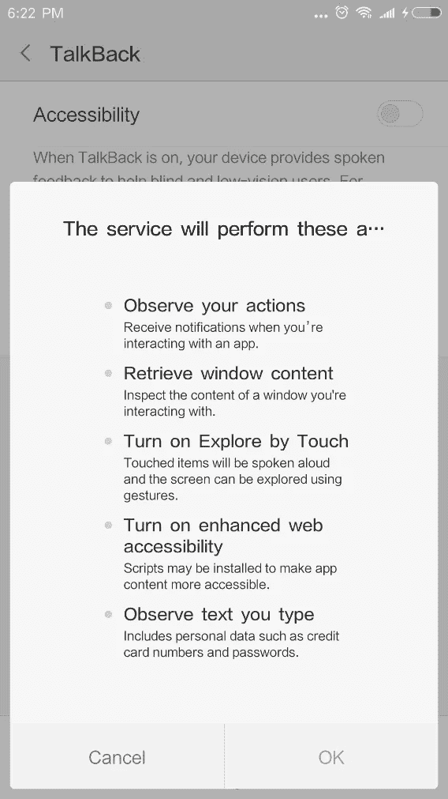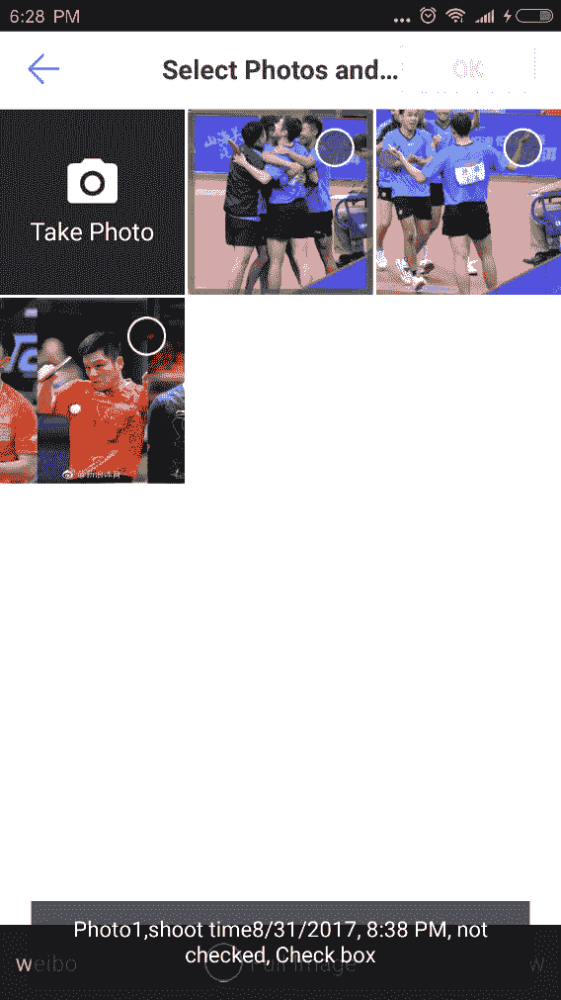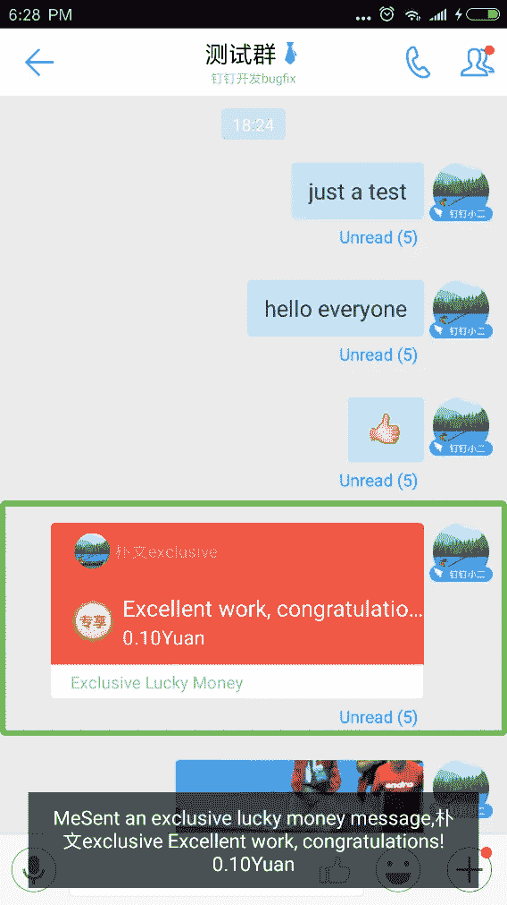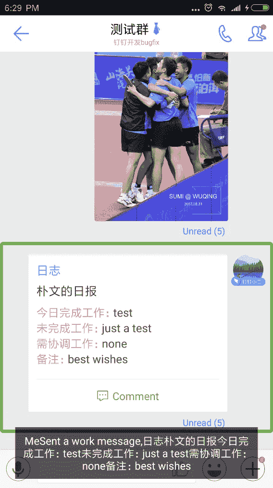

*Screenshots of the newly accessible DingTalk, showing the tasks that can be performed with accessibility support*

例如，当启用“文本到语音输出”选项时，可以大声朗读任何文本。所需要的只是将焦点设置到一个特定的视图，并让屏幕阅读器读出最合适的描述。这使得盲人用户能够准确地知道他们在哪里，以及他们下一步可以做什么。

# **无障碍事件分布**

为了更好地理解 Android 可访问性框架是如何工作的，从而提供尽可能好的可访问性支持，DingTalk 团队从源代码级别分析了可访问性事件分布。

> *sendAccessibilityEvent(可访问性。TYPE _ VIEW _ SELECTED)；*
> 
> *sendAccessibilityEvent(AccessibilityEvent。TYPE _ VIEW _ CLICKED)；*

在 View.java，显示了与上面的 sendAccessibilityEvent 类似的各种方法调用。这是辅助功能事件分发的起点:

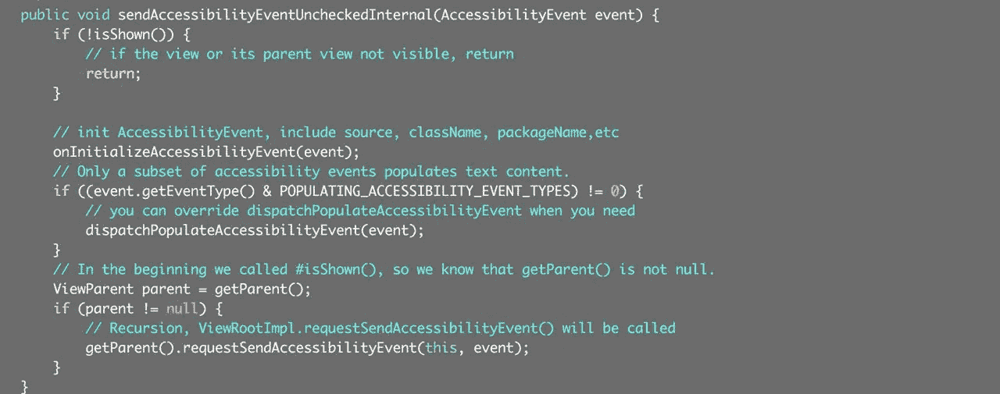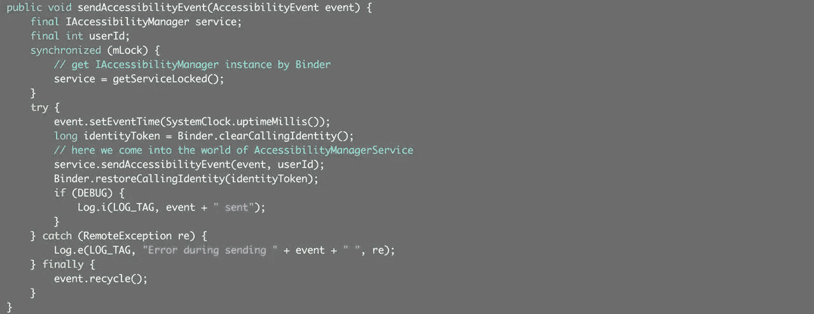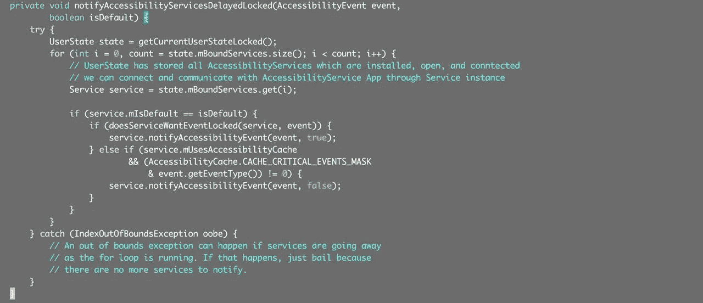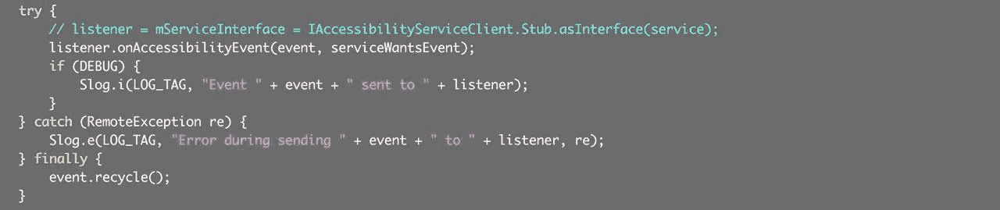

然后调用实现 AccessibilityService 的屏幕阅读应用程序的 onAccessibilityEvent(AccessibilityEvent 事件)方法来完成辅助功能提示。

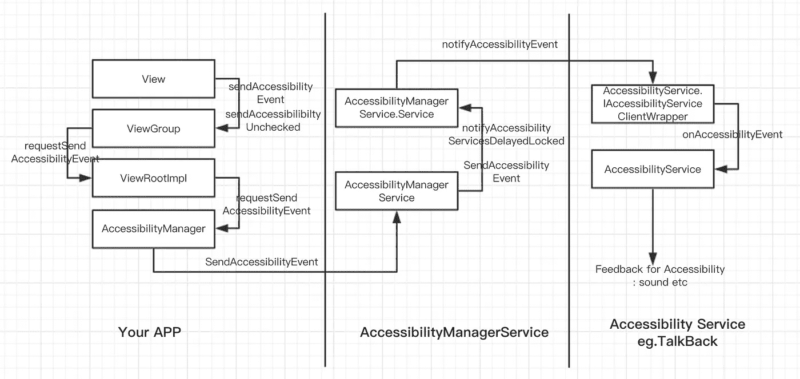

上图显示了从方法调用顺序分配可访问性事件的过程。

# **无障碍工作列表**

在为应用程序或其他软件开发可访问性支持时，有五个关键领域需要解决。

## **1)元素的内容描述标签**

这是辅助功能支持中最简单也是最重要的部分。简而言之，当导航到不同的元素或控件时，这决定了用户听到的描述，并且构成了高达 80%的可访问性支持工作。需要记住的一点是，contentDescription 需要清晰简洁。冗长的描述文本会影响盲人用户的操作效率。

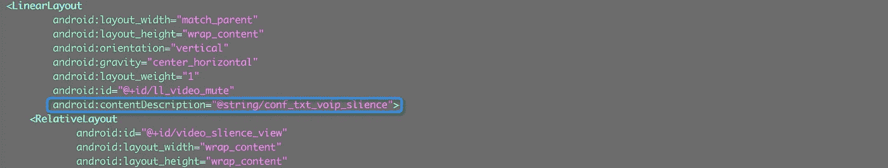

对讲系统使用视图组件的以下属性:

内容描述

组件类型(图像、按钮等)

状态(如复选框被选中)。

这些都是 Android 框架自动支持的。对于 ImageView、ImageButton 和 CheckBox，contentDescription 是必须添加的属性。TextView、Button 等带有 text 属性的元素可以不加选择，Android 框架会将其 text 属性作为读屏内容。

## **2)启动对焦导航，启动视图对焦，控制对焦顺序**

由于视障用户无法准确识别界面中可操作元素的位置，他们需要通过左右滑动在不同的可操作元素之间切换焦点。因此，另一个障碍是管理元素的焦点。

默认情况下，Android 框架提供的元素是可聚焦的。Android 还提供 API，允许开发人员决定元素是否可以聚焦，以及请求元素聚焦。我们应该确保每个可操作的元素都能被聚焦。但是，干扰可访问用户的用户体验的元素不应该被设置为接收焦点。

焦点顺序基于在特定方向寻找相邻元素的算法。在某些情况下，默认算法可能与开发人员定义的顺序不匹配，或者对用户来说可能不符合逻辑。在这些情况下，可以用布局文件中的 android:nextFocusxxx 属性显式覆盖焦点顺序。

## **3)自定义视图**

如果 Android 框架提供的可访问性事件不能满足特定的需求，例如，当有视觉障碍的用户拖动进度条时，您希望将当前进度反馈给他们，那么就需要定制视图。上面显示的可访问性事件分发过程的源代码，给出了一个定制视图在可访问性支持方面可以做什么的粗略想法。

> *sendAccessibilityEvent() //在合适的时间发送可访问事件*
> 
> *onInitializeAccessibilityEvent()//初始化辅助功能事件*
> 
> *dispatchpupulaceaccessibilityevent()//重写可访问性事件*
> 
> onInitializeAccessibilityNodeInfo()//该方法填充 AccessibilityNodeInfo 对象，该对象为可访问性服务提供更多的上下文，并为用户提供适当的反馈。

欲了解更多详情，请访问位于[http://www.siaa.org.cn/androidguideline.pdf](http://www.siaa.org.cn/androidguideline.pdf)的定制视图部分。

**4。定制的可访问性服务** Android 提供标准的可访问性服务，包括 TalkBack，但开发者也可以创建和发布自己的服务。可访问性服务甚至可以用来代替用户操作来执行许多高级技术功能。

以 Google 的示例演示为例。与任何其他服务一样，可访问性语句需要在 AndroidManifest.xml 中声明。

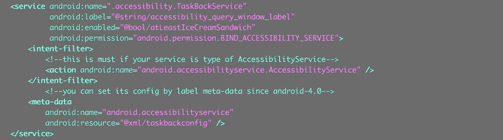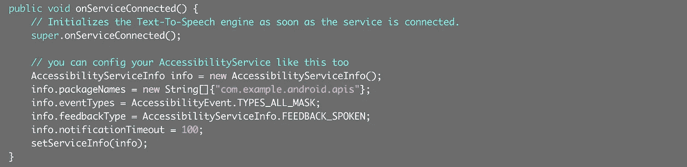

无障碍服务参数的配置可以如上图动态设置，也可以在 android 4.0 之后使用<meta-data>标签，如下图。</meta-data>

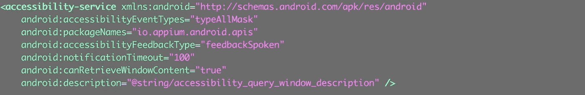

这是 AndroidManifest.xml 中引用的 taskbackconfig.xml 文件的内容，下面介绍几个重要的标签。

> `*accessibilityEventTypes*` *//指定要监控的时间类型，如点击或窗口变化*
> 
> `*packageNames*` *//指定此辅助功能服务可以处理的应用程序包的名称，多个应用程序用逗号(，)分隔*
> 
> `*canRetrieveWindowContent*` *//指定是否可以获取到窗口的内容*

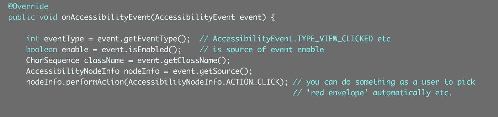

自定义的可访问性服务需要实现 AccessibilityService，并重写这些方法，如 onAccessibilityEvent、onInterrupt 等。视图上下文等信息可以通过 AccessibilityEvent 获得，甚至可以代替用户做事。

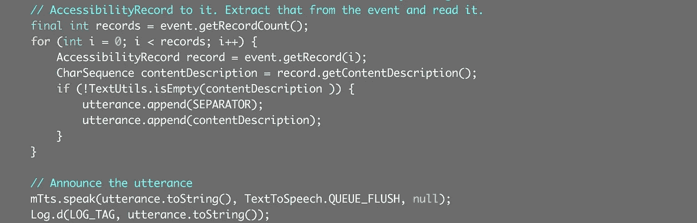

最后，还可以访问 AccessibilityEvent 来执行音频或振动反馈，从而提供辅助功能服务。

## **5)测试**

让应用程序完全可访问需要时间，尤其是像 DingTalk 这样的应用程序，它有许多可能被忽略或错误处理的特性。防止在添加 contentDescription 属性时引入 NullPointerExceptions 也很重要。

因此，测试和回归测试是优化可访问性支持过程中的重要步骤。可以用 Espresso 或 Robolectric 实现自动化测试。

您还可以联系专门的可访问性团队，以获得验收测试方面的帮助。

有关测试方法的详细信息，请访问[https://developer . Android . com/training/accessibility/testing . html](https://developer.android.com/training/accessibility/testing.html)。

**开发辅助功能支持的其他技巧:**

1.条件允许的话，使用 Android 内置的界面控件，默认提供辅助功能支持。

2.在 DingTalk 中，有一种方法可以部分使用 ImageView 来代替 CheckBox。在 UI 中没有区别，但是在交互式辅助功能模式中，盲人用户将不能正确地确定当前视图是如何操作和检查的。您不应使用 ImageView 直接完成复选框功能。

3.EditView:使用提示代替 contentDescription。如果文本框为空，hint 会提示盲人用户输入内容。如果不为空，TalkBack 读取当前输入的内容，而不是提示。如果设置 contentDescription，这将丢失。

4.小控件组:如果控件小于推荐的触摸尺寸，考虑使用 ViewGroup 将控件分组在一起，使用 android:contentDescription 为组合提供内容描述。要增加可点击区域，减少无效焦点。

5.功能更改控件:如果在应用程序的标准操作过程中，用户更改了按钮或其他控件的功能(例如，将按钮从播放更改为暂停)，按钮的 android:contentDescription 需要相应地更改。

6.关联控件:一组提供独立功能的控件，如日期选择器(DatePicker)，当用户与关联控件中的单个控件交互时，这些控件提供有效的听觉反馈。

7.额外的听觉反馈:例如，开发人员想要告诉用户应用程序正在做什么，比如在一本书里自动翻页，使用 announceForAccessibility(char sequence)方法允许辅助功能服务向用户读取信息。

8.contentDescription 属性是确保您的介绍准确的最简单和最有效的方法。

9.在创建布局之前，查看并遵循设计指南中提供的可访问性指南:[https://material . io/guidelines/usability/accessibility . html # accessibility-principles](https://material.io/guidelines/usability/accessibility.html#accessibility-principles)

# **结论**

今天很难想象没有互联网的生活。无障碍项目帮助视障人士与世界保持联系，现在完全无障碍的 DingTalk 将帮助中国和国外的视障用户。阿里巴巴全面推广无障碍环境——目前正在开发让个人电脑更加无障碍——因此，它还将继续优化 DingTalk Android 和 iOS 的无障碍环境，为视障用户提供增强的、用户友好的体验。

# **参考资料**

【http://www.siaa.org.cn/androidguideline.pdf
[http://informationaccessibilityassociation . github . io/androidAccessibility/services . htm](http://informationaccessibilityassociation.github.io/androidAccessibility/services.htm)
[http://www.jianshu.com/p/4cd8c109cdfb](http://www.jianshu.com/p/4cd8c109cdfb)
[https://github . com/app ium/Android-API demos/blob/master/src/io/app ium/Android/APIs/accessibility/clockbackservice . Java](https://github.com/appium/android-apidemos/blob/master/src/io/appium/android/apis/accessibility/ClockBackService.java) [https://darkness 463 . github . io/2017/](https://darkness463.github.io/2017/04/17/accessibility-event)

(Original article by Chen Pu 陈朴)

# 阿里巴巴科技

关于阿里巴巴最新技术的第一手深入信息→在**脸书**上搜索 [**【阿里巴巴科技】**](http://www.facebook.com/AlibabaTechnology)