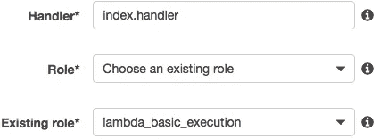

# 使用 Alexa 技能工具包建立一个 Alexa 问答游戏技能

> 原文：<https://medium.com/hackernoon/develop-an-alexa-skill-like-everyday-quiz-baf1e9688cb2>


像亚马逊 [Alexa](https://hackernoon.com/tagged/alexa) 和谷歌 Home 这样的语音助手已经改变了人们与新数字世界的互动方式。声音在交流中比简单的文字或者有时甚至是视觉元素更真实自然！亚马逊 Alexa 及其支持的设备对语音助手的技术成功产生了巨大影响。

**开发 Alexa 技能**

Alexa 能力被称为技能。我们可以通过开发一个技能来给 Alexa 增加额外的能力(即技能)。 [Alexa 技能工具包](https://developer.amazon.com/alexa-skills-kit)是一个自助式 API、工具、文档和代码样本的集合，让你可以快速轻松地向 Alexa 添加技能。

在这里，我们将向你展示我们是如何开发一项名为[日常测验](https://www.amazon.in/dp/B07BK5N7KX/)的技能的

“日常测验”每天会问你 10 道选择题。对于每个正确的答案，用户得到 1 分。我们需要定义一个语音用户界面(称为[交互模型](https://developer.amazon.com/docs/alexa-voice-service/interaction-model.html)，在这里我们定义技能可以处理什么请求以及用户将如何请求它们。

去 [Alexa 技能控制台](https://developer.amazon.com/alexa)创建一个新技能。创建技能时选择自定义模型。选择一个调用名—在我们的例子中，它是“日常测验”。调用名称用于 Alexa 用户调用技能。

现在让我们定义我们的交互模型。从左侧菜单中选择“JSON 编辑器”。您可以将[中给出的交互模型复制粘贴到 JSON 编辑器中。](https://github.com/cedextech/alexa-skill-everyday-quiz/blob/master/model.json)

**QuizIntent**

测验内容定义了用户开始测验的方式。除了命令(任何一个示例字符串)之外，开始提问不需要任何其他信息。因此，slot 字段在 QuizIntent 中没有条目。

槽是为处理用户请求提供任何附加信息的“实体”。

```
{
   "name":"QuizIntent",
   "slots":[

   ],
   "samples":[
      "start quiz",
      "start a quiz game",
      "for a quiz",
      "a quiz",
      "start the quiz",
      "start my quiz",
      "start"
   ]
}
```

**回答意图**

这就是定义用户如何回答 Alexa 所提问题的意图。可能的话语是我们使用的样本。我们需要定义一个定制的槽类型来从用户的响应中获取答案。

Alexa 有一些内置的插槽类型，如果它可以提供额外的信息，可以使用。比如亚马逊。时间，亚马逊。电话号码等。因为测验的答案不能放在特定的类别中，所以我们需要一个自定义的槽类型。

```
{
   "name":"AnswerIntent",
   "slots":[
      {
         "name":"Answer",
         "type":"ANSWER"
      }
   ],
   "samples":[
      "the answer is {Answer}",
      "my answer is {Answer}",
      "answer is {Answer}",
      "I don't know"
   ]
}
```

自定义插槽的样本值将提供给 Alexa 参考。我们需要为在 intents 数组之外定义的自定义插槽提供这些示例值。

```
"types": [
   {
      "name":"ANSWER",
      "values":[
         {
            "name":{
               "value":"option 1"
            }
         },
         {
            "name":{
               "value":"Oncologist"
            }
         },
         {
            "name":{
               "value":"option 2"
            }
         },
         {
            "name":{
               "value":"option 3"
            }
         }
      ]
   }
]
```

我们还应该添加一些 Alexa 提供的内置意图，如亚马逊。取消亚马逊。停止意图等。

请参见 JSON 文件[此处](https://github.com/cedextech/alexa-skill-everyday-quiz/blob/master/model.json)查看技能中使用的“意图”和“示例”(示例短语)的完整列表。将 JSON 内容放入交互模型 JSON 编辑器后，单击按钮“保存模型”，然后单击“构建模型”。


这一步为 Alexa 技能建立了我们的交互模型。现在我们已经定义了我们的语音用户界面。我们还可以在左侧面板的相应菜单项中定义 intents、custom slots 和 samples。JSON 编辑器为您提供了交互模型的总体视图。


下一步是定义如何处理意向请求，并根据用户的响应构建响应。这就是我们使用 Lambda 函数的地方。Lambda 函数包含处理用户响应并将结果发送回 Alexa 设备的逻辑。

**处理请求并将响应发送回用户**

现在，我们正在定义如何响应用户请求。这是我们定义技能逻辑的地方。我们使用 [AWS](https://hackernoon.com/tagged/aws) Lambda 函数来定义逻辑。我们需要做的只是将代码上传到 AWS Lambda 函数，然后 Lambda 函数执行代码，并响应 Alexa 语音交互进行必要的资源管理。

**定义 Alexa 技能逻辑**

我们使用了一个名为“string-similarity”的节点 JS 库来比较用户对某个问题的回答和该问题的正确答案。如果相似度值大于 0.6(满分为 1)，我们认为用户给出的答案是正确的。这为用户回答测验问题提供了一定的灵活性。

例如，如果答案词是阿道夫·希特勒，用户可以说只是希特勒。Lambda 函数需要定义处理程序，处理程序将决定如何处理传入的请求。这些处理程序需要注册为 Alexa 的处理程序对象。因此，Alexa 处理程序的基本设置如下:

```
exports.handler = (event, context) => {
    const alexa = Alexa.handler(event, context)
    alexa.appId = APP_ID
    alexa.registerHandlers(handlers, startHandlers, quizHandlers)
    alexa.execute()
}
```

这里，我们使用“registerHandlers”函数注册了 3 个处理程序。我们还将定义两个会话级状态；开始并测试。我们的第一个处理程序如下所示:

```
const handlers = {
    'LaunchRequest': function() {
        this.handler.state = states.START
        this.emitWithState('Start')
    },
    'QuizIntent': function() {
        this.handler.state = states.QUIZ
        this.emitWithState('Quiz')
    },
    'AMAZON.HelpIntent': function() {
        this.response.speak(HELP_MESSAGE).listen(HELP_MESSAGE)
        this.emit(':responseReady')
    },
    'Unhandled': function() {
        this.handler.state = states.START
        this.emitWithState('Start')
    }
}
```

当用户启动技能时，它处于开始状态。然后在“startHandlers”中，我们将状态“Start”定义为

```
'Start': function() {
    this.response.speak(“Welcome to Quiz Game!Are you ready to take   the quiz ? ”).listen(“Are you ready to take the quiz ? ”)
    this.emit(':responseReady')
}
```

因此，Alexa 会给出一个欢迎消息，并等待用户对询问他们是否准备好继续的提示的响应。我们已经定义了亚马逊的另一个意图。startHandlers 中的 YesIntent，如果用户代表 Start intent 作出肯定的答复，它将捕获肯定的响应。

```
'AMAZON.YesIntent': function() {
    this.handler.state = states.QUIZ
    this.emitWithState('Quiz')
}
```

现在我们要开始测验了。因此，在“是意图”中，我们将状态更改为“测验”,并切换到“quizHandlers”状态中的意图测验。在测验意图中，我们初始化数据(即多项选择题)并设置一些会话属性。

```
'Quiz': function() {
    var data = < QUESTION LIST >
    this.attributes['data'] = data
    this.attributes['response'] = ''
    this.attributes['counter'] = 0
    this.attributes['quizscore'] = 0
    this.emitWithState('AskQuestion')
}
```

“提问”的目的是我们从现有的数据中提出一个问题。数据以 10 个问题为一个列表。我们使用属性“计数器”来跟踪问题编号。

```
let question = data[this.attributes['counter']]
```

向用户提出问题，我们保持会话开放。如果用户没有回答，我们会在结束会话和退出技能之前再次提示相同的问题。当用户说出答案时，它将被“quizHandlers”中的“AnswerIntent”捕获。我们提取答案槽类型的槽值，并将其与问题的实际答案进行比较。

```
function compareSlots(slots, item) {
    var value = item.Answer
    var requestSlotvalue = slots.Answer.value
    var similarity = stringSimilarity.compareTwoStrings(requestSlotvalue.toString().toLowerCase(), value.toString().toLowerCase())
    if (similarity1 >= 0.6) {
        return true
    } else {
        return false
    }
}
```

如果比较结果为真，我们增加“分数”属性和“计数器”属性。如果结果为假，则“分数”保持不变，仅“计数器”增加。在问题结束时，将给出用户的总得分，并结束会话。

没有必要在代码中定义状态，因为一项简单的技能没有它们也能很好地工作。但是使用状态非常有用，因为我们可以很容易地在不同的处理程序之间切换。

例如，这里我们使用了亚马逊。“startHandlers”和“quizHandlers”中的 YesIntent。在“startHandlers”上，它将状态设置为测验并指向测验目的。测验意图初始化必要的会话属性。但是在亚马逊的“quizHandlers”中。YesIntent 指向‘ask question’意图，并保持一个接一个地问下一个问题的流程。因此，根据状态，相同的意图导致两种不同的行为。因此，使用状态和状态管理是一个很好的实践，特别是如果你计划在将来为你的技能增加更多的特性。

你可以在 [GitHub](https://github.com/cedextech/alexa-skill-everyday-quiz) 上找到完整的代码

创建 Lambda 函数并上传您的文件前往 https://aws.amazon.com/并使用您的帐户登录。如果您没有帐户，则需要设置您的帐户，并提供帐单详细信息。登录后，从服务中选择 Lambda。


现在，你必须确保你选择的地区是美国东部(弗吉尼亚州)或欧盟(爱尔兰)。AWS Lambda 目前只支持这两个地区。现在点击“创建功能”按钮。这将提示您提供一些关于该函数的信息。输入 Lambda 函数的名称，并从角色下拉列表中选择“创建自定义角色”。这将在您的浏览器中启动一个用于配置自定义角色的新选项卡。


如上配置详细信息，然后单击“允许”按钮。现在，您已经重定向回配置设置页面。



单击“创建函数”按钮，您已经为我们的技能创建了 Lambda 函数。

现在点击左边菜单中的“添加触发器”并从列表中选择 Alexa 技能包。向下滚动并在配置触发器下，选择启用技能 ID 验证。应该会出现一个技能 ID 编辑框。转到您的亚马逊开发者门户网站，复制您的技能 ID 并粘贴到技能 ID 框中。点击“添加”按钮，然后点击顶部的“保存”按钮。

单击带有 Lambda 图标的方框，后面是您的函数名称，并在“函数代码”部分选择代码输入类型为“上传. zip 文件”。现在，单击刚才出现的 Upload 按钮，从提供的代码库中选择 zip 文件(包括节点模块和所有其他文件),并保存更改。现在从页面的右上角复制这个 Lambda 函数的 ARN 值。


返回 Amazon developer portal，选择左侧导航面板上的 Endpoint 选项卡。为您的端点选择“AWS Lambda ARN”选项，并将 ARN 值粘贴到“默认区域”字段。现在单击主面板顶部的保存端点按钮。现在，您已经成功地将代码连接到技能。

**测试并提交认证**

设置好终点后，点击“保存并继续”,现在您可以测试您的技能了。测试一下，看看它是否能像预期的那样工作。您还可以在测试技能时，通过使用 developer portal 中服务模拟器的“请求”框中的内容，在 AWS Lambda 中配置测试事件。要申请认证，请从顶部菜单选择启动选项。

填写必要的字段，如名称、描述等。你需要提供一些可以用来与我们的技能互动的示例短语。在定义交互模型时，使用您为每个意图添加的“示例短语”中的短语。

给你的技能一个合适大小的图标。完成所有必要的字段后，单击“提交以供审查”按钮。认证过程可能需要几天时间。如果您通过了该过程，您将收到电子邮件通知，并且您的技能将在成功完成认证后生效。

*最初发表于*[*【botartisanz.com】*](http://botartisanz.com/blog/develop-an-alexa-skill-like-everyday-quiz)*。*

希望我们已经涵盖了所有能帮助你建立 Alexa 技能的内容。如果您有任何问题或建议，您可以通过评论或通过我们的网站([http://botartisanz.com/contact](http://botartisanz.com/contact))联系我们

在 Botartisanz，我们根据业务需求开发聊天机器人和语音应用程序。看看我们团队开发的聊天机器人([http://botartisanz.com/projects](http://botartisanz.com/projects))