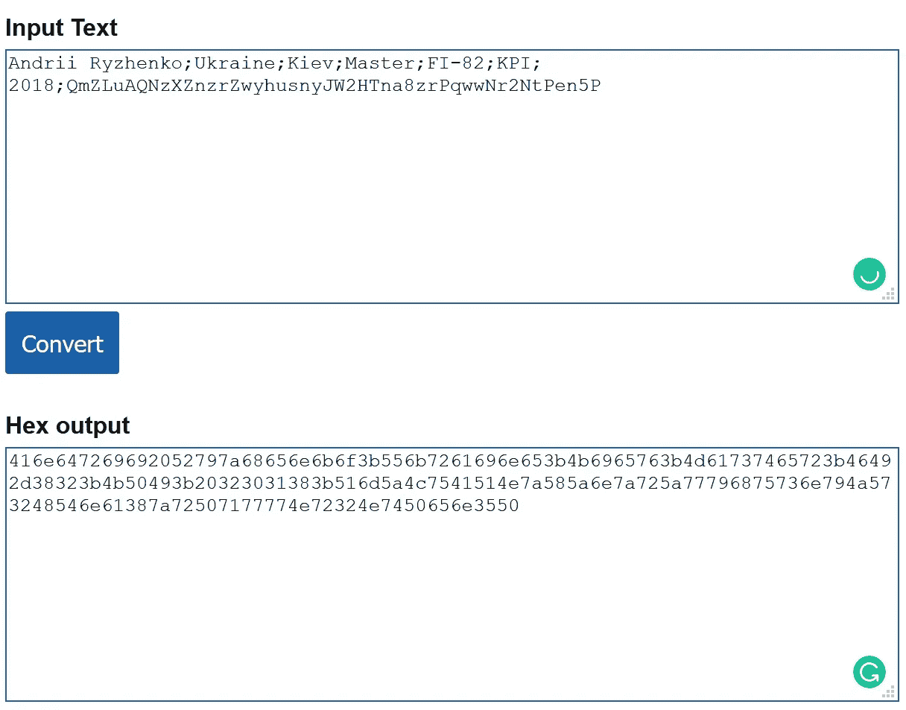

# 在 15 分钟内开发区块链“可信文凭”。逐步指令

> 原文：<https://medium.com/hackernoon/develop-blockchain-trusted-diploma-verification-system-in-15-minutes-step-by-step-instruction-fdcf37a244ab>

在网上冲浪时，我注意到几篇关于 Emercoin 和 Bitfury Group 成功故事的文章。

 [## Emercoin 区块链用“可信文凭”认证系统改变教育部门

### Emercoin 与位于第比利斯的工商大学( )共同致力于解决假货的全球性问题

emercoin.com](https://emercoin.com/en/news/emercoin-blockchain-changes-the-educational-sector-with-trusted-diploma-verification-system) 

最初几次我只是跳过它们，但后来决定看看里面。

> “我们非常高兴能与创新的 Emercoin 团队在这个至关重要的项目上合作。BTU 大学校长 Mikheil Batiashvili(现任格鲁吉亚教育、科学、文化和体育部部长)表示:“可信的文凭平台将帮助我们的学校建立一个安全、不变的教育证书数据库，这将有助于我们的毕业生追求成功的职业生涯。

好，安全！我已经决定，我们可以在 15 分钟内创建类似的文凭认证原型。

**小菜一碟！**

准备好开始了吗？

1!2!3!走吧。

# 产品要求

产品需求通过概述工程师应该构建什么来帮助将产品的愿景变为现实。必要的最低要求包括使用角色和系统功能。

在 MVP 上，我们只期待两个角色:

*   大学或学院工作人员
*   学生和公共社区

## 大学职员角色—提供文凭:

*   准备文凭的电子副本或扫描件
*   收集学生信息:姓名、专业、日期、小组等。
*   将所需信息输入文凭认证系统

## 学生和公共用户

*   验证文凭信息

## 文凭系统逻辑

*   保证只有大学可以添加文凭信息
*   支持任何文凭格式
*   提供 24/7 只读开放公共访问(包括文件和文本数据)

## 假设

额外的安全级别、公共交易可见性、零预算:)

# 解决方案设计架构

1.  IPFS 用来储存文凭文件。每个独特的文件(包括文凭)都有自己独特的哈希。
2.  大学工作人员输入学生信息数据，唯一的文凭哈希是从 IPFS 带到以太坊[区块链](https://hackernoon.com/tagged/blockchain)的交易数据。
3.  每所大学都有一个唯一的公开地址以保证权威性。一个交易专用于一个文凭

让我们来看看当您将文件添加到 IPFS 时会发生什么:

*   每个文件及其内的所有**块**都被赋予一个**唯一指纹**，称为**加密哈希**。
*   IPFS **消除网络上的重复**并跟踪每个文件的**版本历史**。
*   每个**网络节点**只存储它感兴趣的内容，以及一些帮助找出谁在存储什么的索引信息。
*   当**查找文件**时，你是在要求网络寻找存储唯一散列背后内容的节点。
*   每个文件都可以通过**人类可读的名字**找到，使用一个叫做 **IPNS** 的分散命名系统。

# 第一步。创建文凭文件

在一个奇妙的世界里，所有的大学都使用一种标准格式的数字文凭。然而，在现实生活中，有许多不同的选项，但命名约定不明确:

*   pdf 文凭副本
*   预定义的。带有锁定设计和填充学生数据的 pdf 模板
*   低质量扫描或照片

我们必须和他们所有人合作！
在 MS Word 或 MS Paint 中创建自己的“手工”文件，输入您的个人或测试数据，并保存为 pdf 或 jpeg 格式。不要担心文件的质量，因为它只是测试。

我丑陋的例子

# 第二步。上传文件网络。检查唯一散列

下一步把这个文件放在区块链。

我们知道，公共区块链不支持媒体文件存储。所以我们必须使用另一种解决方案。上传文件到 IPFS，只存储哈希到公共区块链

唯一文件具有唯一散列。如果我们上传文凭文件到 IPFS，黑客不能改变它，因为哈希将被重新创建。

转到[https://globalupload.io/](https://globalupload.io/)

上传你的文凭文件。复制并保存您的哈希

[qmzluaqnzxznzrzwyhusnyjw 2 htna 8 zrpqwwnr 2 ntpen 5 p](https://ipfs.io/ipfs/QmZLuAQNzXZnzrZwyhusnyJW2HTna8zrPqwwNr2NtPen5P)

# 第三步。在区块链添加数据

打开记事本，创建自己的文凭记录，包括文凭散列:

*安德里·雷振科；乌克兰；基辅；主人；FI-82；KPI2018;qqmzluaqnzxznzrzwyhusnyjw 2 htna 8 zrpqwwnr 2 ntpen 5 p*

但是以太坊数据交易支持十六进制格式。使用 convector“文本到十六进制”并传输实际记录

 [## 在线十六进制工具

### 世界上最简单的使用十六进制数据的实用工具集合。将十六进制数字转换为其他数字…

onlinehextools.com](https://onlinehextools.com/convert-string-to-hex) 

我的例子

我的十六进制文本

> 416 e 647269692052797 a 68656 e 6 b 6 F3 b 556 b 7261696 e 653 B4 b 6965763 B4 d 61737465723 b 46492d 38323 B4 b 50493 b 20323031383 b 516 D5 a4 c 7541514 e 7 a 585 a6 e 7 a 725 a 7796875736 e 794 a 5 a 54 a 5 a 54 a 54 a 54 a 54 a。

现在我们准备好发送数据到以太坊区块链。

## 是时候安装元掩码了。如果您以前使用过，请跳过

我通常使用 MetaMask web 插件。

转到 *www.metamask.io* 网站，按照基本说明进行安装。保存助记词，以便在出现问题时恢复访问。

接下来，去[https://faucet.rinkeby.io/](https://faucet.rinkeby.io/)

完成一个简单的任务。将你的账户地址从 MetaMask 复制到 Google+ post。

输入链接到水龙头形式，并选择 18.75 乙醚延迟 3 天。

等待帐户余额更新

## 运行以太坊交易

前往以太坊 MetaMask 钱包。选择 Rinkeby 测试网络。此外，您可以使用公共以太网或运行自己的私有以太网(MS Azure 或 Google Cloud)。

点击**发送**，输入数据:

*   收件人地址:选择任意(在[未来](https://hackernoon.com/tagged/future)可以是学生地址或教育部门户)
*   金额:0(将来可以是 0.0000000171 来标记交易)
*   交易数据(可选):粘贴您的十六进制输出。交易数据必须是十六进制字符串

点击**下一步**

增加气限(最好加零，因为 21000 魏不够。以太坊为非零字节花费 68 gas)

点击**发送**

等待交易结果

# 第四步。文凭的验证

在 MetaMask 中打开您最后一次交易的链接。

验证以太坊交易的主要参数:

*   交易状态为“*成功”*
*   来自的地址已填写，它等于大学帐户
*   检查“输入数据”字段，但不要忘记更改 UTF-8 选项的选择

我的交易链接示例

 [## Rinkeby 事务 0x4d 38 f 11 fc 2 ABA 277 b 44 a2 cfba 8 a 7775 BF 8739339 edff 999d 7 e 6 a 29 b 0 E0 DC 567 f

### 0 x4d 38 f 11 fc 2 ABA 277 b 44 a 2 cfba 8 a 7775 BF 8739339 edff 999d 7 e 6 a 29 b 0 e 0 DC 567 f 的 Rinkeby (ETH)详细交易信息

rinkeby.etherscan.io](https://rinkeby.etherscan.io/tx/0x4d38f11fc2aba277b44a2cfba8a7775bf8739339edff999d7e6a29b0e0dc567f) 

将哈希字符串复制到浏览器链接[https://ipfs.io/ipfs/{copy_your_file_hash}](https://ipfs.io/ipfs/QmVZWqKmbk2aViXDjqBSNUeHbEX35aWvBTM574iU6y4ifQ)。

打开文凭文件，并与上传的版本进行比较。

# 摘要

*   区块链大学文凭认证系统开始运行
*   只有授权人员才能从唯一地址上传数据。每个人都可以检查文凭
*   零预算的 15 分钟项目

不要忘记分享或喜欢这篇文章，以帮助其他人发现和阅读它。

## 非常感谢！别忘了你最多可以鼓掌 50 次！❤

敬请关注 Medium 和 LinkedIn[https://www.linkedin.com/in/andrii/](https://www.linkedin.com/in/andrii/)

阅读更多内容…

## [开发盗版“黑标”投票系统。关于稳固性的区块链智能合约。15 分钟逐步指令](/coinmonks/developing-pirates-black-label-voting-system-6618378aae03)

.

.

.

## [EOS 的第一步:账户、钱包、密钥对、测试网、转移代币、验证交易](https://hackernoon.com/andrii-ryzhenko-eos-first-steps-account-wallet-keypair-testnet-transfer-tokens-validate-transactions-cc470b713abe)