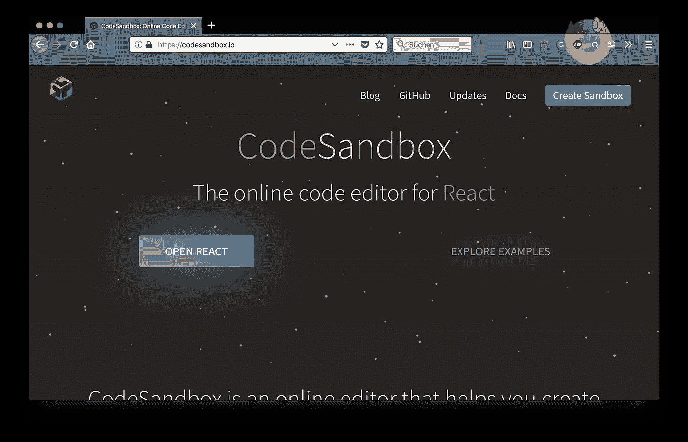
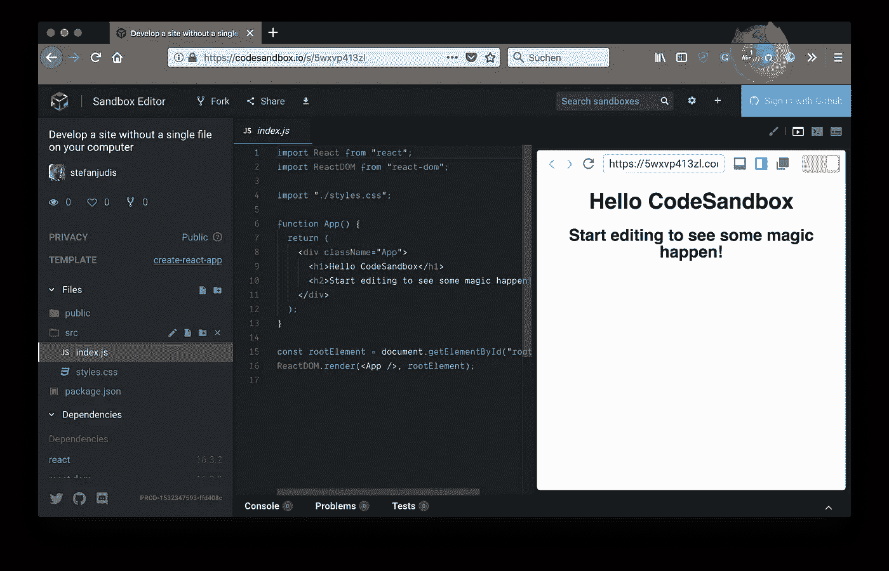
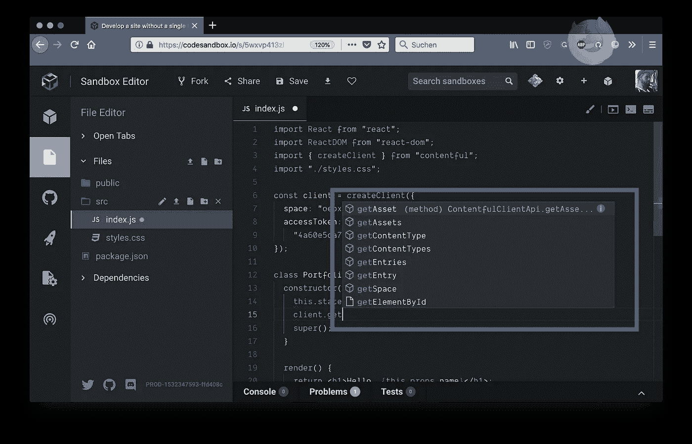
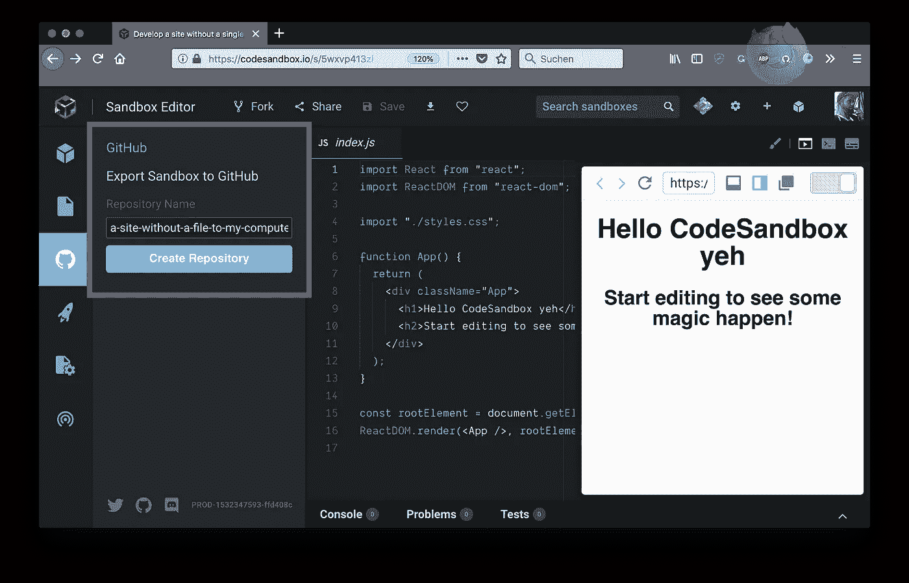
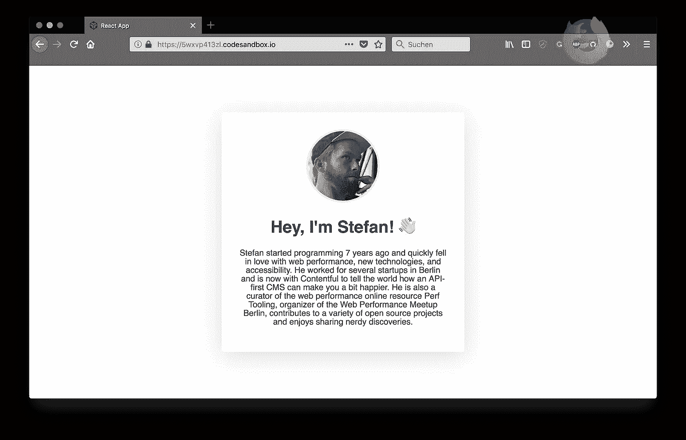
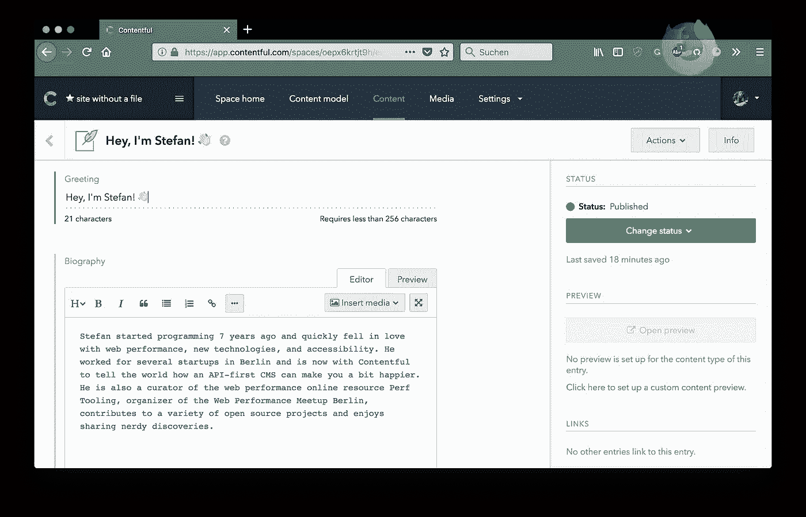
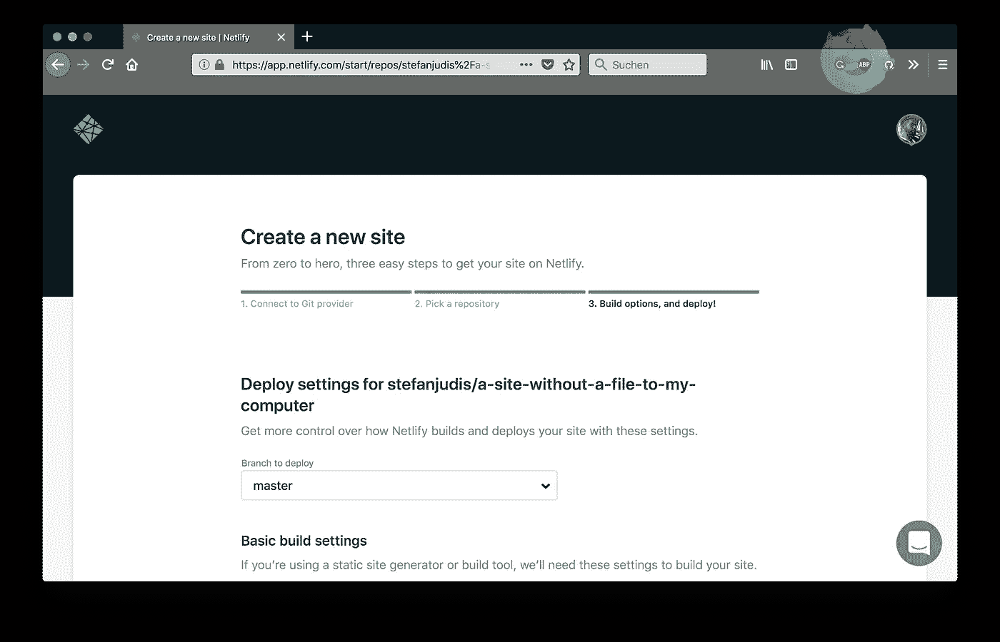
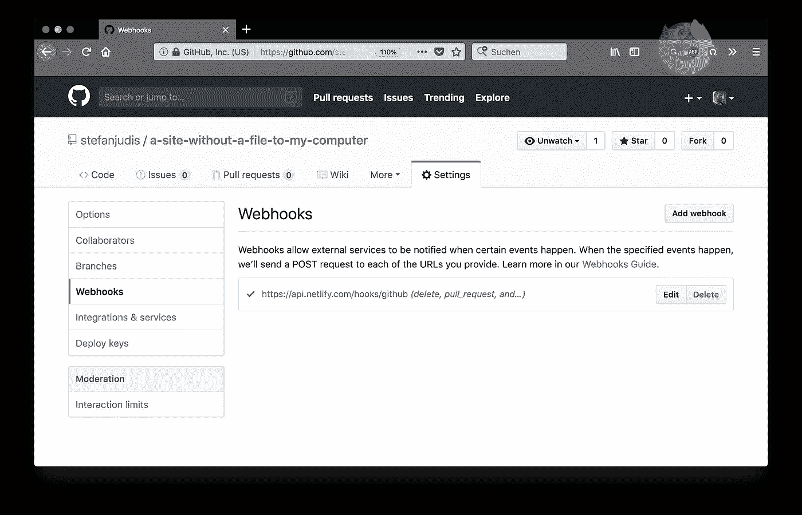
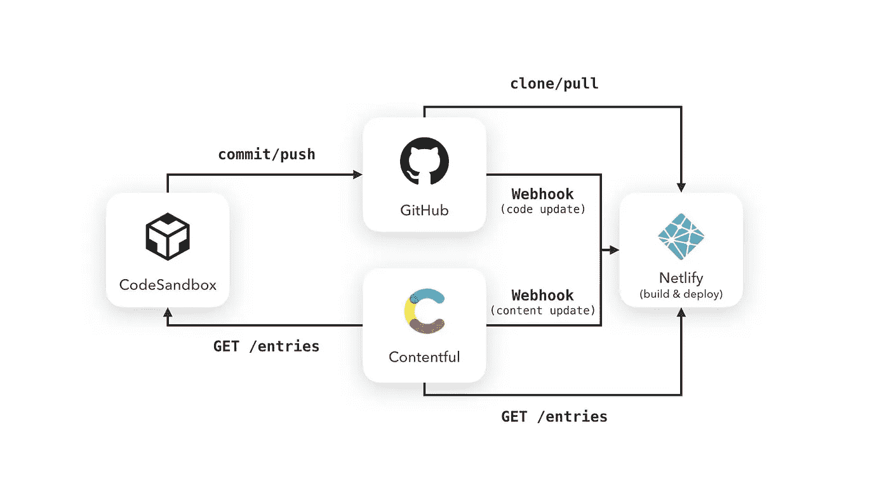
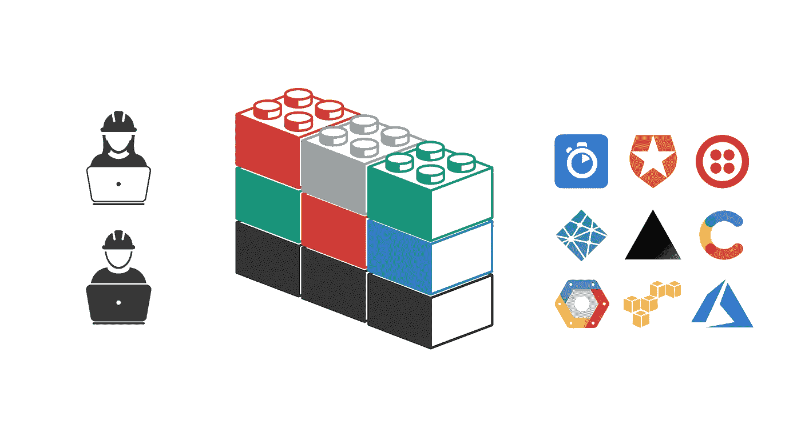

# 使用 CodeSandbox、Contentful 和 Netlify trio 完全在云中开发、编辑和部署网站

> 原文：<https://medium.com/hackernoon/develop-edit-deploy-websites-entirely-in-the-cloud-with-the-codesandbox-contentful-and-netlify-3aa81a18b749>


设置开发机器可能是一个乏味的过程。我曾经在一家公司工作过，在那里，我们在不到两天的时间内就完成了定制商店系统的开发环境的设置，这是一项成就(公平地说，这是在 vagger 和 Docker 成为事物之前)。这是为什么呢？

构建软件产品在很大程度上依赖于像您最喜欢的编辑器或 IDE 这样的东西来提高效率，它依赖于安装的依赖项，如数据库、shell 程序或服务器来实际运行和更新您的软件。这仍然是必要的吗？或者我们现在可以抛弃所有这些，完全依赖云服务吗？

我最近做了一个关于[前端堆栈 2018](https://www.youtube.com/watch?list=PL03Lrmd9CiGfprrIjzbjdA2RRShJMzYIM&time_continue=1963&v=88K8oO_dYbI) 的演讲，看看在你的电脑上不放一个文件能走多远。**果然如此；你真的可以创建网站，使它们可编辑，然后在今天使用强大在线服务的任何电脑上部署它们(** [**)我是最近静态网站生成器**](https://www.contentful.com/blog/2018/04/11/new-era-static-sites-rise-future/?utm_campaign=deploy-cloud-codesandbox&utm_medium=referral&utm_source=medium&utm_content=deploy-cloud-codesandbox&utm_term=) **)的忠实粉丝。**

# code sandbox——城里的新在线编辑器

不久前，我注意到 CodeSandbox 越来越多地用于 React 原型开发，当时人们开始在 Twitter 上分享带有特定 React 模式或最佳实践的沙盒。“我们需要另一个在线编辑吗？”这是我的第一反应。



今年早些时候，我写了一篇关于如何在 React 中使用渲染道具的文章[，并决定尝试一下](https://www.contentful.com/blog/2018/01/23/how-to-write-reusable-sane-api-based-components/?utm_campaign=deploy-cloud-codesandbox&utm_medium=referral&utm_source=medium&utm_content=deploy-cloud-codesandbox&utm_term=) [CodeSandbox](https://codesandbox.io/) 。感觉不像我的本地编辑器(我用的是 vs code)——但也很接近了。

在 CodeSandbox 中，您可以从 500，000(！)可用的用户沙箱，或者选择使用 React、Vue、Angular 和其他框架的 starter 模板从头开始。纵观所有用户创建的沙箱，您会发现编辑器主要用于 React 生态系统中的快速原型制作。然而，这并不意味着您不能使用它在 React 生态系统内部或外部构建更复杂的东西。

# 完全在云端开始 JavaScript 开发

使用现代框架开始一个新的基于 JavaScript 的项目是非常乏味的，并且在过去远远不是初学者友好的。React 的工作人员发现这必须改变，于是想出了 [create-react-app](https://github.com/facebook/create-react-app) 。这个项目帮助你在几分钟内引导并启动一个新的 React 项目，方法是去掉所有的配置并提供所有需要的缺省值(#zeroconfig)🎉).

*create-react-app* 是 CodeSandbox 创建新 react 项目的基础。对于 Preact、Vue 和其他框架，类似的 CLI 工具是可用的，甚至还有一个“普通”的初学者模板，它没有大量的框架依赖性，使用[包](https://parceljs.org/)(一个新的零配置捆绑器——相信我，这太棒了！)给你所需要的一切自由。

当您决定走 React 路线并初始化一个新项目时，您将获得一个可以投入 React 开发的代码库。



# 重要的编辑器特性，让你忘记你“只是”在一个在线编辑器中

*cmd/ctrl+p 快速访问文件和命令*

做 web 开发，有几样东西是我离不开的——首先，`CMD+p`和`CMD+Shift+p`。这两个快捷方式可以让您通过快速易用的模糊搜索跳转到任何文件或执行任何命令。编程通常与生产力有关，这两个快捷方式可以帮助你在不离开键盘的情况下完成任何事情。

*依赖处理和自动安装*

但是现在你在云环境中，对吗？那么如何安装依赖项呢？CodeSandbox 提供了一个对话框，让您可以轻松地从 npm 中选择依赖项。当你用这个对话框安装包时，`package.json`会自动更新。太棒了。

*默认包含更漂亮的*

在 CodeSandbox 中开发时，[beautiful](https://prettier.io/)默认开启，可配置，运行也非常流畅！

*在单独窗口中热重装*

请看上面的截图，编辑器为您提供了一个浏览器内预览。最酷的是，你可以在一个单独的窗口中打开预览，这对于像我这样的两个显示器设置来说是完美的。这样，代码在一个监视器上，我可以在另一个监视器上几乎实时地看到变化。

*项目装运的自动完成与 TypeScript 类型定义*

当我发现 VSCode 采用 npm 包中包含的类型定义时，我最终决定使用 TypeScript。作为一名 JavaScript 开发人员，我非常习惯在没有强大的自动完成功能的情况下工作，但是看到我的编辑器使用 TypeScript 定义是非常好的。看到 CodeSandbox 做同样的事情真好！



*GitHub 集成使 CodeSandbox 成为一个真正的工作工具*

让我着迷的最后一个功能是 GitHub 集成，它让你可以在 CodeSandbox 中创建一个项目，将其推送到 GitHub，然后从 CodeSandbox 直接提交到 GitHub。非常酷的东西！



*唯一缺失的功能*

一次查看多个文件的拆分视图模式是我日常开发应用程序中唯一缺少的东西。让我们希望它会很快到来！🤞🏻

# 内容丰富——任何项目的内容基础设施

有了 CodeSandbox，你可以快速创建下一个 JavaScript 项目，并将其推送到 GitHub。当你做网站开发的时候，项目通常是为那些不太习惯写代码的人设计的。

以一个朋友的快速单页作品集网站为例。你将如何实现这个项目，既节省了用拉请求更新内容的工作量，又不用自己建立一个完整的内容管理系统？您可以使用 Contentful 的内容基础设施来实现这一点。



使用 Contentful，您可以在几分钟内定义所需的数据模型，并使用 JSON APIs 取回数据。在上面的例子中，您需要一个实体，它有单独的字段，分别用于图像、标题和段落。这种灵活性正是 Contentful 的亮点——创建一个内容类型`portfolio`并定义三个所需的字段，而不需要设置服务器或类似的东西。

您的非技术朋友现在可以对您正在构建的 JavaScript 应用程序进行内容更改，而无需编辑 JSON 文件或 React 代码。



稍后，您可以使用提供的 [JavaScript SDK](https://github.com/contentful/contentful.js/) 来获取由您的朋友编辑的内容丰富的数据。

```
import React from "react";
import ReactDOM from "react-dom";
import { createClient } from "contentful";
import "./styles.css";

*// create the SDK client with the needed credentials*
*// which you can get in the web app*
const client = createClient({
  space: "...",
  accessToken: "..."
});

function Portfolio() { */* … */* }

class App extends React.Component {
  constructor() {
    super();
    this.state = { isLoading: true, portfolio: null };
    *// fetch the entry of your portfolio entry type*
    client
      .getEntries({
        content_type: "portfolio"
      })
      .then(({ items }) => {
        this.setState({ isLoading: false, portfolio: items[0] });
      });
  }

render() {
    return this.state.isLoading ? (
      <div>Loading</div>
    ) : (
      <div className="App">
        <Portfolio {...this.state.portfolio.fields} />
      </div>
    );
  }
}
```

[当你看上面](https://codesandbox.io/s/5wxvp413zl)的代码时，我最喜欢的一点是，你可以非常容易地将内容条目与你的前端组件连接起来(`<Portfolio {...this.state.portfolio.fields} />`)。这种联系使得 Contentful [非常适合组件驱动的应用程序和站点](https://www.contentful.com/blog/2017/10/11/love-letter-to-component-ready-cms/?utm_campaign=deploy-cloud-codesandbox&utm_medium=referral&utm_source=medium&utm_content=deploy-cloud-codesandbox&utm_term=)。

# netlify——点击次数少的静态部署工具

现在，您在 CodeSandbox 中拥有了可编辑的代码并连接到 Github，您可以编辑通过 Contentful 驱动应用程序的内容。最后一步是在某个地方部署这个应用程序。

[Netlify](https://www.netlify.com/) 是一个相对较新的服务，专门从事静态部署。Netlify 很酷的一点是，它们还允许您定义构建脚本——可以说，它们是您的 CI 服务和主机。

要将站点部署到 Netlify，可以从导入特定的 GitHub 存储库开始:



接下来的步骤是定义一个构建命令和公共目录，静态文件将出现在其中。在 *create-react-app* 的情况下，构建命令为`npm run build`，发布的目录将为`build`。提交这两个配置后，您的第一个部署将启动并运行，您将在 netlify.com 上获得一个唯一的子域。

在 Netlify 中导入 GitHub 存储库后，一个不太明显的事情是，这个过程还在 GitHub 上定义了 webhooks。现在每次你推新代码到 GitHub，Netlify 都会自动重新部署你的站点。魔法？神奇！



# 使用 webhooks 连接所有部件

对于这个 portfolio 演示站点，不需要额外的 webhook 配置，因为 React 应用程序直接从浏览器获取数据。只有客户端的应用程序有一个很大的缺点，它们最初显示一个加载微调器，直到它们获取了所有需要的 API 数据。一种更高效的方法是在服务器上静态预渲染 React，然后在客户端 React 代码启动时做一些叫做[水合](https://reactjs.org/docs/react-dom.html#hydrate)的事情。

静态预渲染方法意味着，每当您的朋友在 Contentful 中更新她的作品集数据时，您都必须重新渲染生成的 HTML 文件并部署它们。在这种情况下，必须在 Contentful 中配置一个通知 Netlify 的附加 webhook。



再多一点 webhook 配置，您就可以设置一个完整的部署管道，不需要任何本地安装和配置，不需要加载 spinners 就可以发布静态站点。

# 利用 web 服务的力量，而不是重新发明轮子

总之，我对 web 开发领域的变化感到惊讶。[无服务器技术改变了我们的工作方式](https://www.contentful.com/blog/2018/04/05/graphql-and-serverless-where-cloud-computing-is-heading/?utm_campaign=deploy-cloud-codesandbox&utm_medium=referral&utm_source=medium&utm_content=deploy-cloud-codesandbox&utm_term=)我们不再需要担心项目中可能需要的所有细节。对于运行 Node.js 项目，我们可以使用 [Zeit](https://zeit.co/) ，认证 [Auth0](https://auth0.com/) ，以及高性能搜索体验 [Algolia](https://www.algolia.com/) 。



Webhooks 和无服务器功能让我有可能连接所有这些服务，并以简单快捷的方式在云中编写快速连接器。这非常令人兴奋，因为我现在可以专注于构建东西，而不是设置东西……**我甚至可以坐在朋友的阳台上，在他的电脑上创建和部署网站。**

*原载于 2018 年 8 月 7 日 www.contentful.com*[](https://www.contentful.com/blog/2018/08/07/developing-website-cloud-codesandbox-contentful-netlify/)**。**