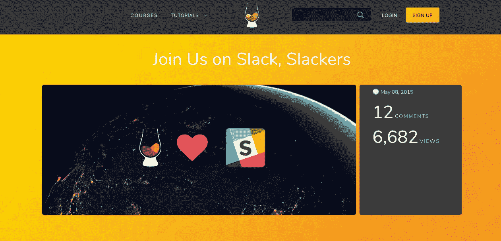

# 10 个以开发人员为中心的空闲频道，帮助您找到下一份远程工作或项目。

> 原文：<https://medium.com/hackernoon/developer-slack-channels-remote-job-freelance-project-98e9b70d6275>

有很多以开发者为中心的[松弛](https://hackernoon.com/tagged/slack)渠道。似乎每种语言和框架都有自己的 Slack 频道供你加入。

在这篇文章中，我将列出 10 个你可以加入的 slack 渠道，如果你是一个正在寻找下一份远程工作或项目的开发人员，这些渠道将会非常有帮助。

我提到的每个频道都有某种类型的工作频道，专注于发布工作和讨论工作。

**重要提示**:我不鼓励任何人加入这些精心培养的社区，并立即开始询问他们是否在找工作。他们花时间建造。请尊重。

好的，让我们直接开始吧。

# 1)拉拉夏

Larachat 是一个专注于 PHP 框架 Laravel 的 Slack 小组。他们目前拥有来自世界各地的 24，000 多名成员。Laravel 是最受欢迎的 PHP 框架之一，它是一个非常活跃的渠道。

在工作方面，这个松弛通道有一个`#work`和一个`#freelance`通道。他们发布 PHP 和 Laravel 特定的工作，还讨论如何找到工作。

**链接:**[https://larachat.co/slack](https://larachat.co/slack)

# 2) Ruby on Rails 链接

Ruby on Rails Link 是一个关注 Ruby 和 Ruby on Rails 框架的 Slack 频道。它有 8700 多名成员。

加入这个社区需要更多的努力。你必须有选择地提供你的 GitHub 和投资组合链接。他们用这个来阻止垃圾邮件发送者。

在与工作相关的渠道方面，他们有一个用于发布信息的`#work-offers`渠道。还有用于帖子讨论的`#work-career-chat`。

如果你是一个正在寻找下一个项目的 Ruby 程序员，这是一个非常有用的 Slack 群组。

**链接:**https://www.rubyonrails.link/

# 3)反应通量(不一致)

好吧，Reactiflux 是一个不和谐的渠道，而不是一个松弛的渠道。但是，我把它包括在这个列表中，因为它是一个非常活跃的渠道，可以帮助你找到你的下一个项目。

Reactiflux 是一个由 25，000 多名开发人员组成的社区，专注于脸书工具 React、React Native、Jest、Redux 和 GraphQL。

他们有一个名为`#jobs`的频道，专门关注帖子。从我的经验来看，这里也有很多远程招聘。

如果你不愿意加入 Discord 频道寻找工作，他们也会在 Reactiflux 工作网站上发布他们所有的工作。[这是求职网站的链接。](http://jobs.reactiflux.com/)

**链接:**[https://www.reactiflux.com/](https://www.reactiflux.com/)

# 4)会员社区

EmberCommunity 是一个专注于前端框架 Ember.js 的 Slack 频道。在这篇文章发表时，他们目前有超过 12，300 名注册用户。

他们的求职频道叫做`#-jobs`，几乎只关注招聘信息。

唯一的缺点是，它不是一个付费的松弛频道，所以有 10，000 条消息的限制。当你让任何人加入时，这是可以理解的。只要记住，如果你认为这些工作与你相关，就要定期关注这份工作。

**链接:**https://embercommunity.slack.com/

# 5)爱奥尼亚全球

Ionic Worldwide 是一个松散的渠道，专注于前端框架 Ionic。Ionic 是一个前端框架，让你只用前端代码就能构建移动应用。他们有两万多名注册会员。

乔布斯频道叫做`#ionic-jobs`。这里发布了许多合同和自由职业者的角色。如果你是一个专门寻找这些角色的前端开发人员，这是一个很好的加入 slack 频道的机会。

**链接:**[https://ionic-worldwide.slack.com/](https://ionic-worldwide.slack.com/)

# 6)苏格兰威士忌

这是 Scotch.io 网站的 slack 频道。Scotch.io 是一个专注于网络开发的网站。他们有关于 Angular，React，Node 和 Laravel 的教程。

Scotch.io 的就业频道名为`#jobs`，里面有大约 875 人。你会发现这里的工作和他们网站上的一样多种多样。

如果你是一个网络开发人员，这是一个很好的休闲频道，因为任何东西都可以发布。

**链接:【https://scotchio.slack.com/】T22**

# 7)地鼠

Gophers 是一个 Slack 社区，专注于支持使用 Golang 编程语言的开发人员。截至本文发布之时，它已有近 30，000 名成员。

据我所知，他们有一个`#golang-jobs`频道，在那里发布帖子和讨论工作。有这么多的成员，所以如果你是一个后端开发人员，我绝对推荐这个。

【https://gophers.slack.com/】链接:

# 9) iOS 开发者

iOS 开发者 Slack 频道主要面向 iOS 和 Mac 开发者。在本文发表时，该频道目前已有超过 20，000 名成员。

他们的就业渠道叫做`#job-board`。再一次，这个松弛频道在有 10，000 条之后删除了消息。所以，如果 iOS 工作是你想要的，那么继续关注这一点是很好的。

**链接:**[https://ios-developers.slack.com/](https://ios-developers.slack.com/messages/C043ZMZS1/)

# 10) SlashRocket(不和谐)

我在这里推荐的最后一个也不是 Slack 频道，但它是一个以开发者为中心的社区。

SlashRocket 将自己描述为一个面向所有技能水平的开发人员的包容性社区。他们有一个`#jobs`频道，随时更新开发工作。这个频道也有关于工作本身的讨论。

如果你正在寻找一般的网站开发职位，这是一个非常有用的渠道。

**链接:**[https://discordapp . com/channels/150087676005974016/440691544983339008](https://discordapp.com/channels/150087676005974016/440691544983339008)

# 结论:加入一个松散的渠道，找到你的下一个远程工作或项目

你可以加入许多其他以开发者为中心的 slack 频道。这里有一个 23+ Slack 频道的列表，你可以作为开发者加入。

我不确定工作渠道会有多活跃，或者他们是否会有工作渠道，但它们可能值得一试。

祝你在寻找下一个远程项目时好运！

# 下一篇阅读:如何在没有充实的投资组合的情况下，在 21 天内找到一份远程自由网络开发工作

 [## 如何在没有充实投资组合的情况下，在 21 天内获得一份远程自由职业网站开发工作

### 大多数客户都不会仔细检查你的投资组合。以下是你如何获得一个远程自由网络开发客户…

hackernoon.com](https://hackernoon.com/remote-freelance-web-development-job-no-portfolio-2f871f298cbb)