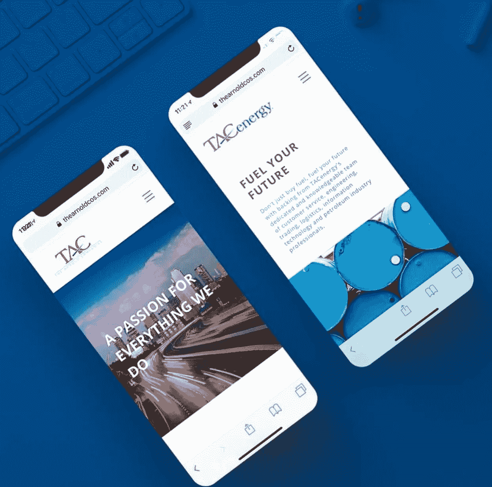

# 开发者聚焦:布兰登·里德

> 原文：<https://medium.com/hackernoon/developer-spotlight-brandon-reid-197223f83ef0>

在 [Cosmic JS](https://cosmicjs.com) 开发者聚焦系列的这一期中，我们采访了 Brandon Reid，他是居住在得克萨斯州达拉斯的 JavaScript 开发者，目前是 [Simple Media](https://simplemedia.co/) 的首席开发者。Brandon 最近在 Cosmic 上为能源和航空客户 Arnold Companies(T4)推出了一个新的 React / Node 网站。在 [LinkedIn](https://www.linkedin.com/in/brandon-reid/) 和 [GitHub](https://github.com/bar0191) 上关注 [Brandon](http://brandonreid.io/) ，享受问答。

**Cosmic JS:你做软件多久了？
Brandon** :就我个人而言，我曾经为我在高中玩的一个名为《太空工程师》(我知道！它还能变得更好吗？)专业上，我在北德克萨斯大学读本科期间，直到大二才开始构建生产级软件。2015 年，我当时是一名研究助理。所以现在已经三年了，我享受其中的每一分钟。

**您首选的开发堆栈是什么？我正在赶 JavaScript 潮流。所以，我总是去欧洲粒子物理研究所。Couchbase、Express、React 和 Node。然而，由于使用的是 Cosmic JS，我不得不改变我的后端偏好:Cosmic 的 Couchbase。:wink:就 UI 框架而言，我的目标一直是材料 UI 设计。它简单、优雅，有一个巨大的 react 工具包，提供了大量优秀的组件。**

过去有哪些项目是你最引以为豪的，为什么？
毫无疑问，这是我在北德克萨斯大学担任研究助理时，在 Ram Dantu 博士手下工作时创建的第一个生产应用程序。他的研究实验室建立了一个基于可穿戴技术的移动 android 应用程序，可以监控在蓝色代码紧急情况下对患者进行的 CPR 的质量。本质上，护士会戴上一个与安卓平板电脑同步的安卓智能手表，监测心肺复苏术的动作/质量。这项研究是与旧金山的德克萨斯健康长老会合作进行的。我的工作是实现一个内部 web 应用程序，它可以以图表/直方图的形式显示实时统计数据。数据包括在 CPR 过程中泵的速率/分钟，多少泵/分钟等。我必须在 android 设备和内部服务器之间实现一个后端同步网关，使用完整的堆栈。这个项目真的让我觉得我在医疗行业产生了影响。

**多谈谈你构建应用的过程。**
通常在我构建一个应用程序之前，我会试着把一些展示应用程序重要功能的高级图表放在一起，大部分是以交互/序列图的形式。然后，我将分析应用程序将拥有什么样的全局和可重用组件。这有助于我更好地了解数据如何在应用程序的组件树中流动，以及我需要实现哪种数据管理。在那之后，我将实现某种类型的敏捷工作流程，在开发冲刺阶段工作，并尝试向我的客户发布一个 MVP。我喜欢对我的客户尽可能透明，并让他们参与敏捷过程的每一步。

**您对目前正在使用的哪些技术感到兴奋，或者想了解更多？天哪，这是一个大名单。外面有很多我一直想加入的很酷的东西。我真的很高兴能与一些提供 3D 渲染功能的 JavaScript 库合作，如 3D.js。随着现代浏览器变得越来越强大，我觉得我们会看到使用 3D 内容的网站越来越多。我也对人工智能在聊天机器人和其他用例中的应用感到兴奋，我一直渴望有时间在数字海洋上安装一个人工智能服务器并玩它。还有！React 动画库。有一些真正有才华的开发人员正在创作一些很酷的动画作品。迫不及待地想找时间和他们一起玩。**

你刚刚完成了 TAC 的构建，从 WordPress 安装到一个现代的 API 优先的堆栈——感觉如何？
大楼 [TAC](https://thearnoldcos.com/) 被炸了！在 Cosmic 中构建一个超快速的 API 后端再顺利不过了。我能够使用 [Cosmic 的 React Starter kit](https://github.com/cosmicjs/react-starter) ，并使用一个包含 NextJS 及其 SSR 功能的令人敬畏的样板文件开始运行。我从未遇到过 Cosmic 的问题，也从未联系过支持人员。对于开发人员来说，在这个平台上入门是多么简单、容易和优雅。我喜欢看到大公司最终摆脱像 WordPress/Drupal 这样笨重的系统，转向更现代的网络堆栈的趋势。作为一名专门研究 React/Node 的全栈开发人员，我对 web 开发的未来感到无比兴奋。

TAC 的后端由 Node、Next.js 和 Express 提供支持。js 用于 SEO 优化和站点路由的服务器端渲染功能。Next.js 还使得与 babel 和 webpack 的集成变得容易，因为它们是内置的。我使用 Next.js 路由 API 为具有相同设计布局的页面呈现页面模板。TAC 的前端由 React.js 和世界上最流行的 react UI 框架 Material UI 提供支持。为了在 SSR 中使用 Material UI，我必须将站点包装在 JSSProvider 中，并使用 CSSBaseline。对于开发，我使用 Eslint 作为一个更干净、更一致的代码库。由于 TAC 使用 ES6 javascript，我还必须实现非常少量的 polyfill 来将 ES6 转换为 ES5，以便该站点能够与 IE11 一起工作。我使用的一些值得注意的节点模块是:React-Image-Gallery 用于整个网站的图库，React-Masonry-Component 用于新闻编辑室，以及 Fetch 用于 API 请求。对于电子邮件服务/API，我使用了 nodemailer 和 mailgun。

我通过使用 [Cosmic 的 React Starter Kit](https://github.com/cosmicjs/react-starter) 开始建立这个网站，它帮助我立即开始工作。构建 TAC 的开始是从实现网站的所有全局(页眉、页脚、图标等)开始的。所以我很快创建了一些 javascript 请求函数，使用 cosmic 的节点 API 从 Cosmic 桶中提取数据。我将这些全局组件添加到站点的 main _app 布局中，因此每个页面都将使用这些全局组件进行包装和呈现。在那里，我分析了哪些页面会有跨多个页面或站点的可重用组件，并根据我的分析为这些页面创建了组件视图。从那里，我能够高效地完成页面设计，并在运行中在宇宙桶中实现对象类型。随着我们越来越接近网站发布，我注意到 IE11 的兼容性问题，必须想出一个解决方案。起初，我打算在代码中做一个浏览器嗅探来显示一些可以在 IE 上工作的东西。相反，我实现了 Babel 和一些 polyfills 来解决任何兼容性问题。

Cosmic JS Spotlight 系列致力于展示使用现代工具构建应用程序的开发人员。为了与我们保持联系[在 Twitter 上关注我们](https://twitter.com/cosmic_js)和[在 Slack 上加入对话](https://cosmicslack.now.sh/)。