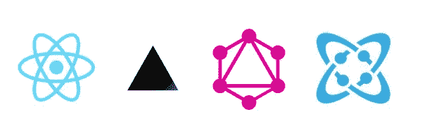

# 开发者聚焦:Harrie Pieters

> 原文：<https://medium.com/hackernoon/developer-spotlight-harrie-pieters-9029804bd45b>

在 [Cosmic JS](https://cosmicjs.com) 开发者聚焦系列的这一期中，我们采访了来自阿姆斯特丹的全栈 JavaScript 开发者[哈里·皮特斯](https://www.harriepieters.nl/)。哈里最近加入了一个团队，合作建设 [Bookabus 项目](https://cosmicjs.com/case-studies/bookabus-builds-a-localized-transportation-website)，这是一个本地化的交通网站，为其欧洲市场提供营销和公交路线内容。在 [GitHub](https://github.com/HPieters) 、 [LinkedIn](https://www.linkedin.com/in/harriepieters/) 或 [Twitter](https://twitter.com/harriepieters) 上关注哈里，享受问答。

**你开发软件有多久了？这一切都始于 15 年前，当时人们刚刚意识到使用表格比框架更好地构建网站。那时候我刚上高中，只是随便玩玩。大约 8 年后，在我的大学期间，我决定开始将我的爱好变成一项业务，从那时起，我一直在开发网站、网络应用程序和应用程序。**

**您首选的开发堆栈是什么？**
目前，作为一名全栈开发人员，我非常专注于 JavaScript，在前端使用 React，在后端使用 React Native for apps 和 Node。

**你过去最得意的项目是什么，为什么？最有收获的项目之一是为海洋清理项目开发一个应用程序，将海洋垃圾观测研究数字化。尤其是在大西洋中间调试应用程序是一种独特的体验，因为没有互联网或手机服务需要一些创造性的解决方案。**

**在谈论你构建应用程序的过程时，有没有想到最近的项目？今年早些时候，我被要求从头开始构建 Bookabus 网站，试图将生产力反应与服务器端渲染(SEO)结合起来，我决定尝试一下 Next.js。该网站的要求之一是该团队能够编辑支持欧洲多个国家和语言的内容的 CMS。我们发现 Cosmic 是当时充当我们的无头 CMS 的最佳解决方案。**

当前的堆栈由一个使用 GraphQL 的后端 API 组成，该 API 向前端(网站)提供内容。API 从 Cosmic 获取本地化内容，创建本地缓存，并基于查询参数提供内容。前端为静态内容(如 FAQ 项目和页面)做一些额外的缓存。

我们目前正在研究更进一步的可能性，并在项目中建立一个已经有本地化内容的静态版本。利用 web 钩子触发自动构建。

**您对目前正在使用的哪些技术感到兴奋，或者想了解更多？**
有这么多令人兴奋的事情正在发生，目前我对无服务器堆栈感到兴奋，使用人工智能、智能合同和向函数式编程发展来改进超出我们想象的产品。

要了解如何向 jobs@cosmicjs.com[的](mailto:jobs@cosmicjs.com)[宇宙 JS 社区](https://cosmicjs.com/community)贡献应用、文章和扩展，请联系我们。