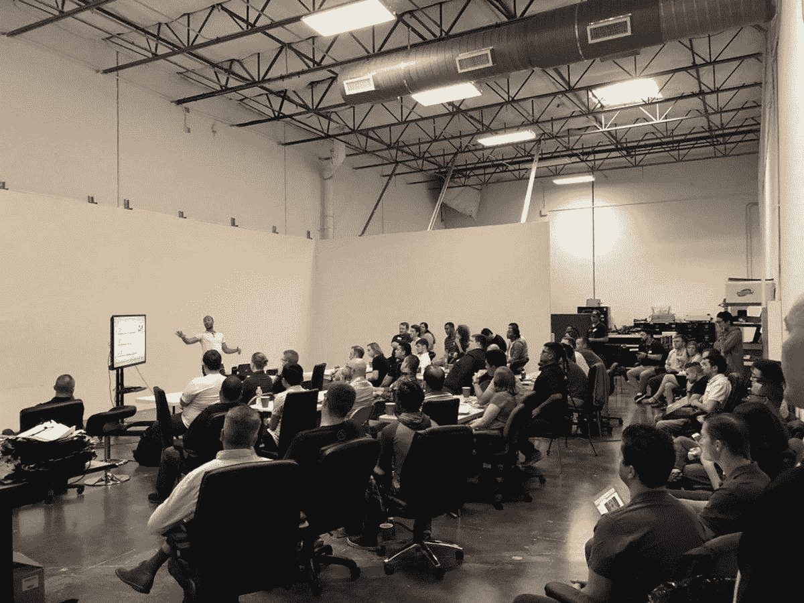

# 开发者聚焦:乔·沃伦

> 原文：<https://medium.com/hackernoon/developer-spotlight-joe-warren-5278e7431013>

在 Cosmic JS [开发者聚焦系列](https://cosmicjs.com/developers)的这一期中，我们采访了达拉斯的软件开发者[乔·沃伦](https://cosmicjs.com/mightyjoew)。Joe 毕业于 [DevMountain](https://devmountain.com/) ，目前在得克萨斯州的 Frisco 为 SMS 技术平台构建应用程序。Joe 活跃在当地的 ReactJS 社区，如下图所示。在 [GitHub](https://github.com/MightyJoeW) 和 [Twitter](https://twitter.com/MightyJoeW) 上关注 Joe，享受问答环节。

ReactJS Dallas Meetup

**你做软件多久了？** 我一直对技术充满热情，但我正式过渡到软件工程职业是从 2016 年开始的。在不同领域工作了 6 年后，我决定将我的重点转移到网站开发上。我两年的软件开发经历包括个人项目、训练营项目、开源项目和专业生产经验。

**您首选的开发堆栈是什么？我非常喜欢使用 SERN (SQL，Express，React，Node)堆栈来构建项目。我目前在一个团队工作，在前端使用 React、Redux 和 Material-UI。虽然我喜欢我目前的堆栈，但 Vue.js 和 [Cosmic JS](https://cosmicjs.com) 是我感兴趣的两项技术。**

**你过去最得意的项目是什么，为什么？** 我最喜欢的与工作无关的项目是我的 DevMountain group 项目， [Fittr.us](http://www.fittr.us/) 。Fittr.us 的创建源于我们团队对健身的热爱，以及将有用的数据和功能都放在一个地方的愿望。Fittr.us 与 Fitbit 同步，根据用户的目标导入和可视化数据。我们还实现了一个朋友系统和一个徽章系统。计时器和秒表功能也可在锻炼过程中实时使用。

这是一个有趣而富有挑战性的项目，因为我们被迫作为一个单一的单位运作，一起计划，有效地使用 Git & GitHub，并迅速找出如何做新的事情。

你对哪些技术感兴趣或想了解更多？
我真的很期待探索 [Cosmic JS](https://cosmicjs.com) 处理数据和文件管理的方法。目前，我想把大部分精力放在构建客户端应用程序上，而 [Cosmic JS](https://cosmicjs.com) 将允许我用我已经喜欢使用的工具来做这件事。托尼·斯皮罗在 ReactJS Meetup 上的 [React VR 艺术画廊](https://cosmicjs.com/articles/react-vr-art-gallery-app-jh10xe75)演示也引起了我的兴趣，所以这是我最终想要探索的另一个领域。

要了解如何向 [Cosmic JS 社区](https://cosmicjs.com/community)贡献应用、文章和扩展，请通过[jobs@cosmicjs.com](mailto:jobs@cosmicjs.com)联系我们。