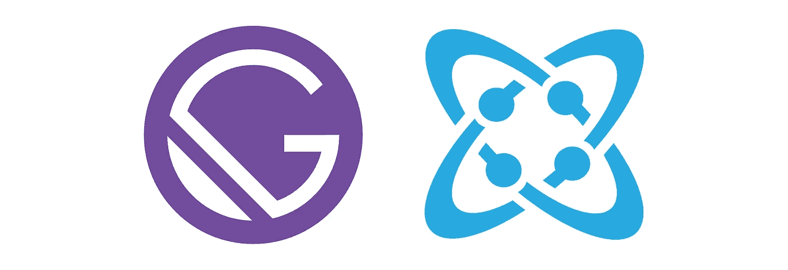
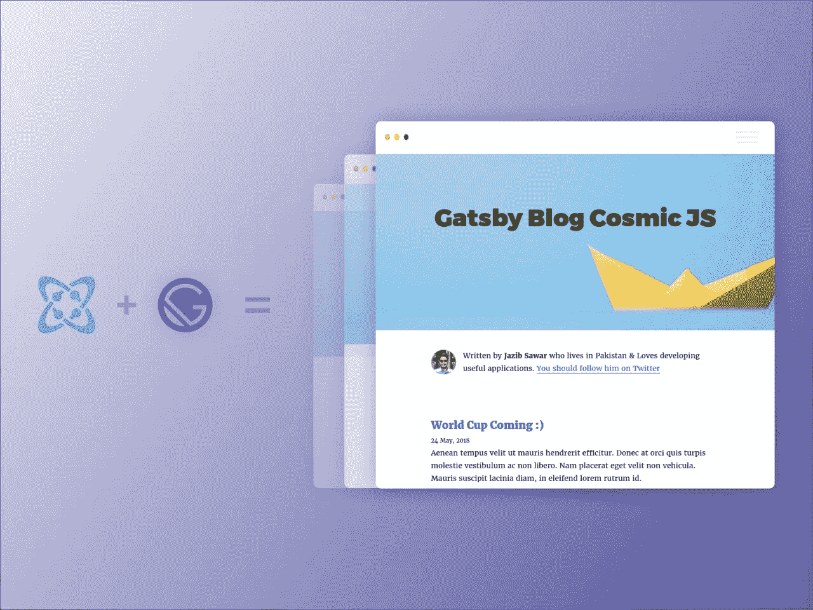

# 开发者聚焦:盖茨比的凯尔·马修斯

> 原文：<https://medium.com/hackernoon/developer-spotlight-kyle-mathews-of-gatsby-320d31fb8e91>

自从今年夏天早些时候推出 [Cosmic JS Gatsby 源代码插件](https://github.com/cosmicjs/gatsby-source-cosmicjs)和 Cosmic 驱动的 [Gatsby 博客](https://cosmicjs.com/apps/gatsby-blog)以来，它已经成为 [Cosmic JS 应用市场](https://cosmicjs.com/apps)中最受欢迎的应用之一。考虑到宇宙 JS 社区为盖茨比疯狂的暗示，我们提供了 [Gatsby Starter 应用](https://github.com/cosmicjs/gatsby-starter)，让你在几秒钟内安装一个宇宙驱动的 Gatsby 应用。

随着最近对《盖茨比》的狂热，我们很高兴能采访到凯尔·马修斯，他是《盖茨比》的创始人，也是一名居住在旧金山的软件工程师。在 [GitHub](https://github.com/KyleAMathews) 和 [Twitter](https://twitter.com/kylemathews) 上关注凯尔，享受问答环节。

**Cosmic JS:你做软件多久了？凯尔:我的哥哥是一名程序员，在我 10 岁左右的时候，他试图向我介绍 qbasic。我觉得这挺有趣的，但并没有持续下去。我在高中的时候做过很多视频编辑和动画制作，但是直到大学二年级的时候我才开始编程，当时我上了一堂编程入门课，并且迷上了编程。这导致了一系列的网络项目，然后是我大学最后一年的创业项目，从那以后就没有停止过。**

**您首选的开发堆栈是什么？**
我写了很多 JavaScript 所以 React & JS 在前端，Node 在后端。GraphQL 是我最喜欢的制作 API 的方法，我非常喜欢大型项目的事件源模型。

**你过去最得意的项目是什么，为什么？盖茨比之前，我在一家名为 Pantheon 的初创公司工作。这是我的第一份“真正的”工作，也是我第一次与一个伟大的工程产品团队一起工作，我真的为我在那里构建他们的仪表板工具而感到自豪。**

当然，这些天我在全职工作于《盖茨比》——我对此非常自豪。设计和建造一些很多人喜欢甚至更多的东西真的很有趣——看着它逐渐成为其他人的项目和激情——而不仅仅是我的。

**多谈谈你构建应用的过程。**
我喜欢在着手做事情之前，把事情想得相当透彻。尝试跳过用户对项目的每一个需求。这将如何影响用户界面和技术方面的事情，等等。然后试着忘记所有这些，找出我可以立即构建和发布的最小部分，也就是 MVP。这样做很棘手，但它有助于通过不预测大的需求来避免将自己编码在角落里，还可以避免花费大量时间来解决实际上并不是问题的问题。当你找到了正确的平衡点，你就可以很快解决问题的一小部分，这将帮助你从兴奋的用户那里获得很多很好的反馈，这些反馈和能量与你对需要什么的预见相结合，将使你能够非常非常快地重复问题的其余部分。

**您对目前正在使用的哪些技术感到兴奋，或者想了解更多？**
我认为 JavaScript、React、Node——虽然都很大——也才刚刚起步。他们还有巨大的增长空间。除此之外，我对无服务器(作为服务的功能)和所有真正令人耳目一新的改进感到非常兴奋，这些改进提高了工程生产率和服务器成本。

**盖茨比未来在解决什么问题？成长的计划是什么？**
这么多！我们希望确保无论你用 Gatsby 构建什么，都将是闪电般的快速，开发将是有趣和快速的。

*   我们最近发布了 [Gatsby Preview](https://www.gatsbyjs.org/blog/2018-07-17-announcing-gatsby-preview/) ，它帮助内容创作者在他们的 Gatsby 站点的实时版本上预览他们的更改——这是许多团队所要求的
*   我们一直在努力突破盖茨比的界限。Gatsby 的 v2(即将发布)构建站点的速度将提高 75%以上
*   我们正在为 Gatsby 开发一个云原生构建系统，这将使构建有几十万页的网站变得切实可行
*   我们正在对 docs 信息架构进行大规模改造，这样我们就可以添加更多的文档——随着人们越来越多地使用 Gatsby，我们会被问到关于各种高级用例的问题——所以要写更多的文档
*   我们这个项目总共有 930 个贡献者，每个月合并 100 个 PRs。我们正在想办法随着社区的发展来扩展我们的 OSS 维护，这样更多的自动化和帮助更多的人为 Gatsby 做出贡献。

因此，我们有很多事情要做:-)我们被社区的热情所鼓舞，并且很高兴能够继续推进与 Gatsby 一起建设网站的体验。

点击[这里](https://cosmicjs.com/developers)浏览更多来自 [Cosmic JS 社区](https://cosmicjs.com/community)的开发者聚焦，在 [Twitter](https://twitter.com/cosmic_js) 和 [Slack](https://cosmicslack.now.sh/) 上加入对话。