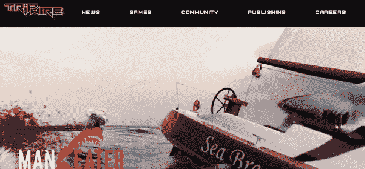

# 开发者聚焦:欧文·利弗西奇与绊网互动

> 原文：<https://medium.com/hackernoon/developer-spotlight-owen-liversidge-with-tripwire-interactive-80da5f470768>

在这一期的 [Cosmic JS](https://cosmicjs.com) 开发者聚焦系列中，我们采访了居住在佐治亚州亚特兰大的 Web 开发人员 Owen Liversidge，他目前在著名的游戏开发公司 [Tripwire Interactive](https://www.tripwireinteractive.com/#/) 负责开发。Owen 刚刚使用 React 和 Cosmic JS 驱动的堆栈发布了 Tripwire 的新公司网站。在 [LinkedIn](https://www.linkedin.com/in/owen-liversidge-39137470/) 或 [GitHub](https://github.com/vertigojones) 上关注欧文，享受问答

宇宙 JS:你是在去年开始编码的，对吗？欧文:是的，我四月份毕业回来了。我选择的训练营是亚特兰大的 General Assembly，从沉浸式 Web 开发专业毕业。这是疯狂的三个月，但我学会了开始建立网站所需的工具。在那之前我做了十五年的音乐老师，讽刺的是，这十五年逐渐被我现在选择的领域——互联网——毁掉了。越来越多崭露头角的音乐家转向免费的在线资源来学习如何演奏他们的乐器，所以我决定回到我早期在设计和广告方面的根源(在我以音乐为职业之前)。我很高兴我做出了改变——web 开发很有趣，很有挑战性，而且对大脑的两侧都是一个很好的锻炼。

**您首选的开发堆栈/工具是什么？在前端，我主要和 React 一起工作。我对 Gatsby 有所涉猎，但我还没有真正开始使用 GraphQL 的需要(尽管它非常有趣)。在后端，我使用 Node 和 Express，它很好地连接了[Cosmic JS](https://cosmicjs.com)——能够使用 Cosmic JS Dashboard 编辑我的所有内容允许我在服务器端保持我的代码非常简单。我唯一用过的其他框架是 Ruby On Rails。在使用 Cosmic JS 之前，我用 PostgreSQL 和 Mongo DB 构建数据库，但是我需要任何人都可以维护的 Tripwire 的东西，而不仅仅是软件工程师。**

谈论在游戏开发公司工作。你负责什么类型的项目？
在游戏开发公司工作很好玩，也很散漫。由于我是这里唯一的网站开发者，我并不是网站开发团队的一员，而是与营销团队紧密合作。当我开始在这里工作时，我的第一个主要任务是彻底更换以前的公司网站，它是用 Umbraco 建立的。除此之外，我们还有 Tripwire 发布的每款游戏的登陆页面，以及季节性更新和促销的微型网站。所以我一直很忙！

**在不久的将来，您希望探索哪些工具和技术？**
正如我之前提到的，我很想深入 GraphQL，并且可能会研究一下 Wes Bos 最近创建的[新课程](https://advancedreact.com/)。我还对 Gatsby 感兴趣，它是一个结合了 React 和 GraphQL 的框架。但实际上，作为一个 web 开发新手，我最大的目标是让我已经使用的技术变得更好、更通用。

**您刚刚发布了 Tripwire 的新网站，这是您有史以来的第一个应用程序。你是怎么开始的？在 Tripwire 没有人可以作为导师，我的第一个任务是成为谷歌的大师！作为一名训练营的毕业生，我学到了一些基础知识，但在我能够开发我的第一个生产应用程序之前，还有很多东西要学。知道如何自己做研究是一项艰巨的任务，我可能花了第一个月的大部分时间来收集信息。从那以后，大部分时间都是反复试验——看看什么可行，什么不可行。最大的挑战是弄清楚如何实现数据库。我之前构建的所有东西都使用了应用程序本身的种子，尽管我有过连接第三方 API 的经验，但我还没有整合过无头 CMS。**

谢天谢地，我发现了宇宙 JS，它把一切都照顾得天衣无缝。他们有很棒的在线资源，我甚至能够参考一些代码来帮助我比自己更快地构建我的应用程序——这是我一直以来最接近真正的导师的事情！因为 web dashboard 非常容易使用，我真的不需要培训任何人如何使用它。在我的数据库建立之后，事情变得简单多了。我的设计背景确实对我的造型有所帮助，所以我的大部分挑战都与编码本身有关。但我相信，在我的第一个专业项目中被抛入困境教会了我很多如何变得足智多谋。一路上我确实有过几次“给朋友打电话”的时刻，我要感谢詹姆斯·罗雅尔和塞洛的时间和耐心。

## 个案研究

[Tripwire Interactive 打造 React 企业网站](https://cosmicjs.com/case-studies/tripwire-interactive-builds-a-react-corporate-website)
[杀戮地板 2 推出扭曲的圣诞节](https://cosmicjs.com/case-studies/killing-floor-2-launches-twisted-christmas-seasons-beatings)
[Road Redemption 推出营销微型网站](https://cosmicjs.com/case-studies/road-redemption-launches-a-marketing-microsite)

Cosmic JS Spotlight 系列致力于展示使用现代工具构建应用程序的开发人员。在此了解如何[做出贡献。为了与我们保持联系](https://cosmicjs.com/contribute)[在 Twitter 上关注我们](https://twitter.com/cosmic_js)和[加入 Slack 上的对话](https://cosmicslack.now.sh/)。