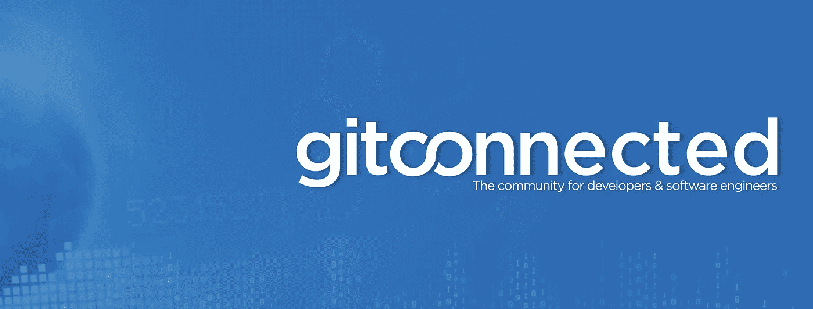

# 开发者聚焦:来自 Postmates 的 Trey Huffine

> 原文：<https://medium.com/hackernoon/developer-spotlight-trey-huffine-from-postmates-27ec1ffd677a>

Originally published on the [Cosmic JS Blog](https://cosmicjs.com/blog).

在这次 [Cosmic JS](https://cosmicjs.com) 开发者聚焦中，我们采访了[特雷·赫芬](https://www.linkedin.com/in/treyhuffine/)，他是旧金山的一名软件工程师，目前在 [Postmates](https://postmates.com/) 担任前端工程师。Trey 也是 [BlockAce](https://blockace.io/) 、 [gitconnected](https://gitconnected.com/) 和 [Radion](https://radion.co/) 的创始人。在 [Twitter](https://twitter.com/treyhuffine) 或 [Medium](https://levelup.gitconnected.com/) 上查看他，并享受问答。

你开发软件有多久了？大约 10 年前，在我的工程项目中，我开始开发软件，主要包括 Matlab 和 Python。我知道我喜欢编码，但是我有点不确定如何把它变成一个职业。我搬到伯克利去攻读硕士学位，在学习期间，我从 Ruby on Rails 和 JavaScript 开始自学 web 开发。

我被它吸引住了，意识到这是我真正热爱的领域。我会花更多的时间专注于开发应用程序，而不是我的学校作业，我意识到我需要把我的职业生涯推向那个方向。毕业后，我立即申请了一个 JavaScript 训练营，我对事情的结果非常满意。

**您首选的开发堆栈是什么？**
对于客户端，我几乎总是倾向于选择 React 作为工具。无论我是在构建一个小项目还是一个大的可伸缩界面，React 都是无与伦比的，围绕该技术的社区也是令人难以置信的。如果我需要更强大的状态管理，我还会添加 Redux。

对于服务器，我更倾向于关注项目的需求，以帮助指导选择正确的工具。如果我更关注开发速度，我会选择 Node (JavaScript ),因为它允许我非常快速地编写 API。如果我决定不使用 Node，那么 Go 将是我的下一个选择。这是一种简约但功能强大的语言，编写代码非常有趣。很少有语言能够提供 Go 所提供的开发者体验和性能。

不过最近，我发现自己真的很喜欢在 JAMStack 工作。在客户端，我使用 react-static 构建静态标记，然后为 API 提供用 Node 或 Go 编写的 AWS Lambda 函数。通过预先构建标记，用户会感觉应用程序运行速度非常快，并且不需要等待数据库调用。通过使用 Lambdas，它迫使我保持逻辑的小型和模块化，从而产生更好的整体代码质量。这也使得你的服务器可以横向扩展，因为你不需要管理你自己的 CPU。在这个堆栈中工作也让我对 [Cosmic JS](https://cosmicjs.com) 感兴趣，并思考如何使用它来管理我的数据后端。

**你过去最得意的项目是什么，为什么？**
我认为我最引以为豪的项目是 [gitconnected](https://gitconnected.com/) ，它是作为一种帮助开发者联系和提供社会学习社区的方式而创建的。我亲身体会到在软件工程领域转行可能会令人生畏。许多开发人员患有冒名顶替综合症，找到并联系其他工程师会感到非常困难。Gitconnected 的创建是为了帮助建立一个社区，并支持协作和开源软件开发。

最近，我还迷上了区块链技术，这使我决定开始 [BlockAce](https://blockace.io/) 和 [Radion](https://radion.co/) 。我相信区块链会带来变革，会颠覆我们做很多事情的方式。由于区块链太新了，开发商和公司之间存在脱节，BlockAce 是一个工作平台，为人们提供在区块链就业的机会。

区块链的另一个问题是收养。提供区块链软件解决方案的公司期望客户对他们当前的商业模式进行彻底的改变，我们认为这是错误的方法。Radion 专注于构建软件，使公司能够立即整合区块链，而无需改变任何日常运营。

我也是 Postmates 的软件工程师，我们一直在做一些非常令人兴奋的事情。我们最近重建了整个 web 应用程序以及移动应用程序的视图层。成为被数百万人使用的产品的基础重写的一部分是一次学习的经历，我非常感激成为其中的一部分。我们能够选择我们想要使用的确切技术，并构建一个非常适合作为开发人员使用的软件堆栈，并提供公司发展所需的所有功能。Postmates 的团队本身非常有才华，我真的相信天空是我们现在能够实现的极限。

**多谈谈你构建应用的过程。你是否在一个团队中工作，如果是，你在组织中与什么类型的角色合作？**
我既单独开发过应用程序，也在大型团队中工作过，在团队中我需要与所有不同的角色合作——其他工程师、设计师、产品经理、市场营销、客户服务等。我认为不管项目的规模或人数如何，我倾向于发现遵循这些原则会带来成功的结果和快乐的个人。

-关注完整性胜于完美，然后重复
-个人所有权至关重要。每个人都应该觉得自己是自己工作的 CEO。
——尽早且经常地从每个相关人员那里获得信息，并使构建产品的过程成为所有利益相关者之间的对话。
-关注并优先考虑将产生最大影响的事情
-做决策时牢记业务目标
-不要做假设。你应该验证想法。
——总是想办法让这个过程变得有趣——尝试新技术，加入你的创意，和其他人一起开发新功能。如果你喜欢你正在做的事情，很多其他的事情就会水到渠成。

对我个人来说，我倾向于尽快开始写代码。它有助于我全面考虑整个问题，并尽早发现需要关注的领域或机会。它还允许人们看到结果，并提供获得反馈的机会。

**您对目前正在使用的哪些技术感到兴奋，或者想了解更多？**
我目前使用的让我兴奋的技术是客户端的 CSS-in-JS，服务器端的 Golang，以及使用“无服务器”思想构建应用架构。能够在 JavaScript 中管理依赖项和数据的同时设计项目样式，这极大地提高了开发速度。直到我回到没有 CSS-in-JS 的老项目，我才意识到管理 CSS 和切换它和 JS 是多么痛苦。这是我在所有新应用中加入的东西。我喜欢 Go，因为拥有一种简单易用的打字编译语言让人耳目一新。无服务器架构令人兴奋，因为它真正挑战了我思考应用程序的方式，并使我成为一名更好的开发人员。此外，通过只需要关注业务逻辑和删除管理服务器的许多样板活动，它加快了开发，并让您专注于有趣的部分。

我非常兴奋地继续学习的技术是区块链、Solidity 和 Hyperledger 开发。研究对每个人来说都很新的东西，并集体寻找在实际环境中利用该技术的最佳方式，这很有趣。区块链空间也拥抱了开源思想，也许比其他任何领域都多，我渴望看到事情如何发展。

要了解如何向 jobs@cosmicjs.com[的](mailto:jobs@cosmicjs.com)[宇宙 JS 社区](https://cosmicjs.com/community)贡献应用、文章和扩展，请联系我们。