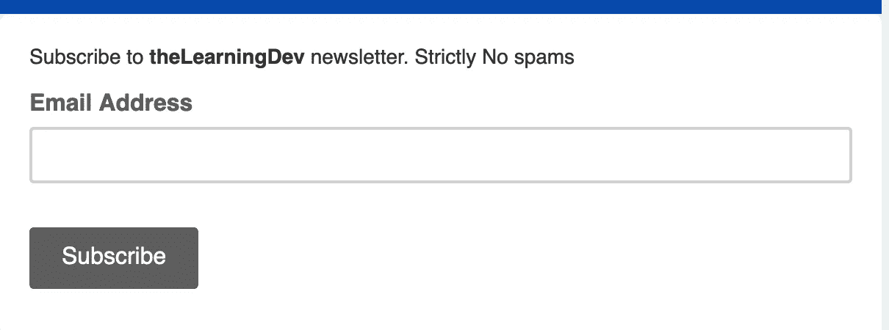

# 成为更好的开发人员的 6 个特质

> 原文：<https://medium.com/hackernoon/developers-deficiency-a238eebbd73c>

开发商的缺陷

软件开发人员是独一无二的。他们是每个组织中最著名的人群。其他团队看着他们，就好像他们是从异乡登陆的。像“你怎么能永远盯着电脑？”，“你是怎么理解那些术语的？”，以及“您是如何让这一切运转起来的？”支持这个论点。

相信我，我们只是人类，带着好奇心和电脑对话。就像一个通晓多种语言的人学习不同的语言一样，我们学习的是计算机能够理解的语言。我们总是被视为异类，这让我们的自我意识膨胀，认为自己比别人优越。从这一点出发，一个开发人员在他的生活中还有无数其他的不足。这里有几个。


# 代码就是一切

当你开始作为一个入门级的工程师，一切都是代码。那个了不起的产品经理会做所有的 UX，会向你解释用户在使用产品时的体验和情绪。但是你已经因为问了一个关于如果条件的问题而扼杀了热情。

开发人员很难在初始阶段打破这个外壳。直到有人明确地向我们指出，或者“吉安”在我们的生活中突然出现，我们才意识到这一点。

同样的理念也适用于我们正在开发或后期部署的过程中。开发人员工作的一个重要部分可能是编写代码，但记录过程中涉及的每一个决策更重要。

# 缺乏同理心

移情是另一个属性，是过多考虑代码的副作用。由于我们一直在与电脑对话和调整产品，我们很少有时间与人类交往。慢慢地，我们大多数人都失去了人际交往，从而缺乏与他人产生共鸣的能力。同样，如果你处于初级职位，这也是可以的。

# 链接不是解决方案

作为开发人员，如果没有 StackOverflow 或 Google，我们的生活将毫无意义。对于我们编写的每一个代码片段，我们都会仔细阅读上百万条互联网建议，并从中选择最好的。

如果你曾经看过两个开发者聊天，你可以看到这些链接的交流。其他开发人员知道如何解码并从中获取他想要的东西。

但在现实生活中，情况并非如此。我见过内部聊天激励客户做得更好。当他们马上赶上时，称赞他们，演示视频解释产品的每个细节。帮助别人不仅仅是分享链接。当一个非技术人员问你一个问题时，请记住那些你感到沮丧，却从没理解过 StackOverflow 的任何东西的日子。是时候让我们意识到即使是 StackOverflow 和 Google 也有一个学习曲线了。

# 领域知识

当我说出这个词的时候，所有的开发人员都会跳出来说“是的，我知道这个问题。”"时区。"关键是，作为开发人员，我们非常擅长开发跨地区、跨洲、跨时区的产品。

但这并不适用于现实生活中的问题。在了解了女权主义的各个方面后，我开始明白你不能只写一个应用程序就解决它。这类问题需要因地因人而异的个性化解决方案

# 认为我们聪明

在我的第一次钦奈比见面会上，我遇到了一位天体物理学家，她解释了她的工作，并希望一些开发人员与她合作，进行一些数据分析。她的作品令人惊叹。她观察死星并分析其特性。它包括在晚上建立营地等等。有趣的是，他们在操作高距离望远镜时不使用手机，因为这会在他们的数据中产生噪音，这是非常合理的，但令人兴奋的是，管状灯也产生了同样的效果，因此整个观测场没有管状灯…是的，我们不是什么都知道。

# 过度工作

可能是行业或者激情因素；当开发人员谈到工作与生活的平衡时，他们通常会感到不悦。他们的热情受到质疑。通过更深入地观察这一现象，我发现大学生们把他们所有的时间都花在了，为了好玩，他们拼了命地创造很酷的东西。但专业领域不需要这样。行业软件不是你花两天两夜就能创造出一个很酷的游戏。在进入一家公司时试图这样做会耗尽你的精力。

这些成为新公司首席技术官的孩子希望他们的员工像在大学时一样日以继夜地工作，最终吓跑或解雇他们的员工。

老实说，我们是独一无二的，我们喜欢一直写代码，但这不应该成为我们为自己设定的标准。还有很多我们不知道的其他领域和事物。花时间去理解这些领域会拓宽我们的思维视野。

```
[**Bhavani Ravi**](https://twitter.com/geeky_bhavani) **| Techie By Profession | Everything else by passion.**
```

如果你喜欢这个博客，用👏。一定要在评论区提到我错过的东西

[](http://eepurl.com/gaEkp5)

Subscribe to newsletter