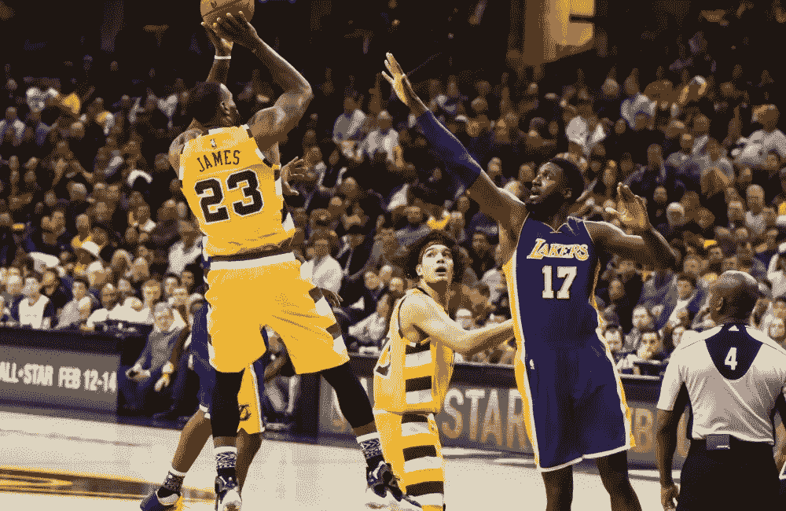
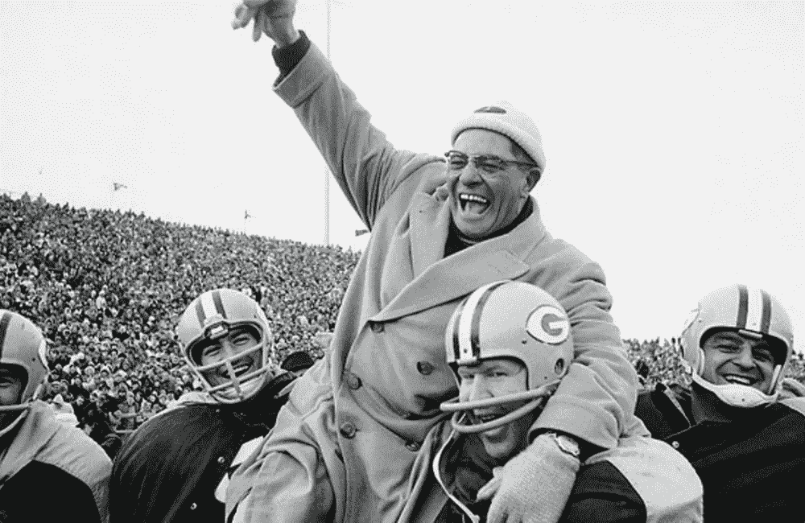
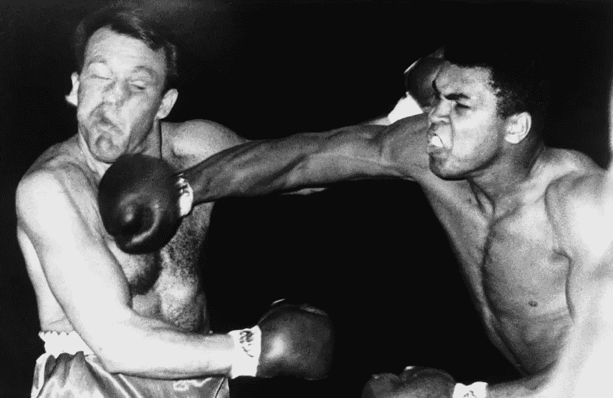

# 开发商也应该得到代言协议

> 原文：<https://medium.com/hackernoon/developers-deserve-endorsement-deals-too-602f048771c>

他们关了灯。

对讲机里传来 90 年代体育场的堵塞声。

办公室吉祥物开始在会议室里跳霹雳舞。

“现在……..引领今天的每日单口相声……..是那个角落里的后端开发者，他的桌子上摆着那些摇头晃脑和怪异的科幻人物！！！!"

上班就是这样的吧？嗯，应该是。

我最近和一个好朋友聊天，他提到开发人员很像运动员。我们有适销对路的技能，惊人的潜力，似乎我们的需求非常高。也许我们不会出现在那么多的麦片盒子和集锦卷轴上，但荣耀依然存在。

似乎在你读到的任何地方，公司都在争先恐后地填补他们的职位。这没什么新鲜的，真的。在过去的几十年里，软件塑造了我们的日常生活，需要有人在旁边编写它。但是最近，危机似乎真的重创了这个行业。

猜猜这让你变成了什么？一个超级巨星！一个非常优秀的运动员，有能力带领任何球队赢得胜利！冠军！不相信我？原因如下…

# 多一点小巷，少一点糟糕

首先也是最重要的，开发者有技能。如果你已经发展了 10 个月或 10 年，你会有一些大多数人不具备的惊人能力。你可能是 Azure Functions 或 Vue.js 等最新技术的大师，也可能在 ASP。NET 1.1，或者 Silverlight。但是，你总是能够学到更多，包括下一个新事物。

有些人比其他人更好。但这并不意味着每个开发人员在某些方面都不熟练。试着让你的牙医坐在你的笔记本电脑前，让他们理解一段代码。也许先给他点有趣的气体，看看会发生什么。

当我第一次开发时，我惊讶于我公司的一个开发人员“懂 12 种编程语言”。怎么了？？？太神奇了！现在，我可以查看任何代码文件，至少可以理解发生了什么。我并不了解那里的每个平台。我可以解释其中的逻辑。这就是我说的技巧。开发不是了解特定的平台或语言。它是理解应用程序如何工作，如何逻辑地处理信息，以及如何把你的复活节彩蛋埋得足够深，让人们发现它们而不被发现。

但是，就像任何职业运动员一样，你需要不断磨练自己的技能。练习它们。参加一个关于新事物的会议。回顾你的工作。打开 10 年前的东西，惊恐地尖叫，你的垃圾收集严重不足。关键是，确保你一直在使用你的技能和测试你自己。这是你进入大学代表队并且不坐冷板凳的唯一方法。

# 重要的不是你是否被击倒，而是你是否能重新站起来

不到 7 英尺高的人举起手来，做什么都是第一个被选中的？几乎所有人？好吧，像我一样，你可能在人生的某个阶段需要一些指导。这没什么丢人的！一个伟大的教练和培训师几乎可以把任何一块土豆雕刻成山(见…复活节彩蛋)。伟大的运动员向过去扮演他们角色的人学习。最好的开发人员与导师一起工作来磨练他们的能力，学习最佳实践，并理解几乎所有事情都是迭代的。一个事实是，最好的运动员和开发人员是最饥饿的人，他们永远不会满足。他们总是想让自己变得更好，从不停止学习。

你可能在每件事情上都处于最前沿，但是你仍然从在你之前做这件事的人那里学到了如何发展。一路上你学到了很多东西。也许是学校里的一个教授，或者是坐在你旁边的一个人。或者也许你只是被扔进了一个经典的 ASP 和 SQL 6.5 应用程序，而知道它的开发人员却离开了。开发人员经常受到考验，而教练和指导可以帮助你不被烧伤。

如果你刚开始，找一个好的导师。一个关心你知道事情应该怎么做的人，他会和你一起确保事情是这样的。如果你已经在游戏中有一段时间了，帮助新成员。你会对他们的成就感到惊讶，并被他们的创造力所鼓舞。

# 她的手心出汗了

时间不多了。

不可能的几率。

人群的吼声震耳欲聋。

这是每个运动员梦寐以求的。压力。他们肩上的世界。荣耀的机会。

表演时间到了。

好吧，也许对于开发者来说，这种大张旗鼓的宣传没那么令人兴奋。但是，我知道你被推到了一个看起来不可能完成的最后期限。你不得不默默无闻地工作几个小时来修复一个 bug。也许您已经在一台 Exchange 5.5 服务器前度过了一个晚上，该服务器必须在早上回到办公室之前进行重建。(Jet 数据库…不寒而栗…..)

你做到了。

开发者就是这样的。我们让不可能变成可能。我们把不可能变成可能。我们把简单的事情过分复杂化了。

我们每天都在克服障碍。我们的全部工作就是解决问题，而且我们非常擅长。当你面前没有防守队员时，很容易得分。真正的超级明星跳跃，juke 和 Ickey 洗牌得分，不管赔率。

作为一名开发人员，您将被要求“让它工作起来”你可能不知道怎么做，但你会找到方法的。关键时刻，开发者可以做出惊人的事情。压力能让一个人变得真正伟大。

# 我本可以成为一个竞争者！

一个处于黄金时期的运动员是一种有价值的商品。当一个超级明星寻求改变时，团队会到处摸索，急于找到说服他们加入他们组织的机会。它们代表成功、胜利和一些甜蜜的代言交易。他们只要在球场上就能扭转整个组织。

开发者同样有价值。有技能、有才华的程序员可以构建任何东西。公司也知道这一点。不相信我？去更新你的 LinkedIn 个人资料，写上“感兴趣”，然后看着潮水般的招聘邮件涌入。

开发人员很容易忘乎所以，梦想成为替罪羊。但他们没有错。这种渴望是创新的驱动力。这是激发创造力的源泉。这也是促使开发人员不断完善自我的原因。

那么，你应该试水自由球员市场吗？我不知道。但是，我可以告诉你，长寿是赢得冠军的关键。如果你想留下遗产，你必须花时间去实现它。你总是会得到更多(啊，2000 年的早期就是这样的惊人)，但知道何时采取行动对你的成功至关重要。

永远要权衡你的选择。对任何新的组织进行调查。确保你能读懂他们的战术手册，并融入他们的阵型。确保他们尊重你这个了不起的运动员。游戏是漫长的，你需要能够在顶端坚持到最后。

现在准备好。差不多是开球的时间了。