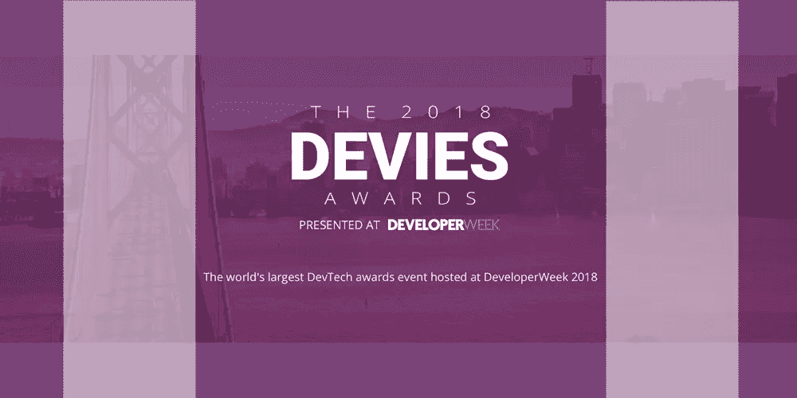
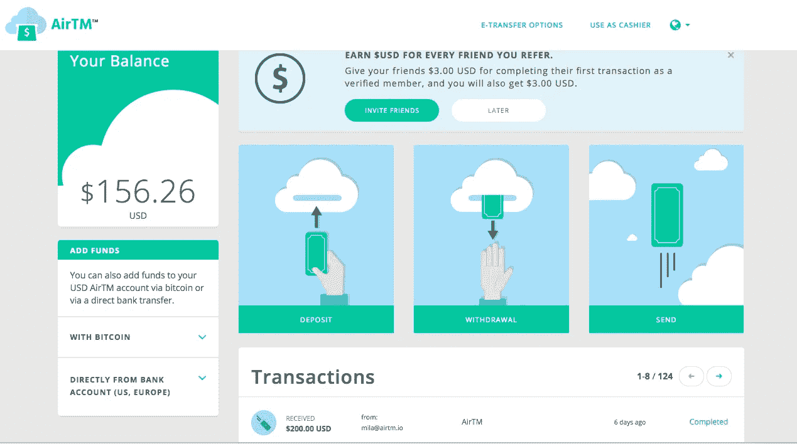
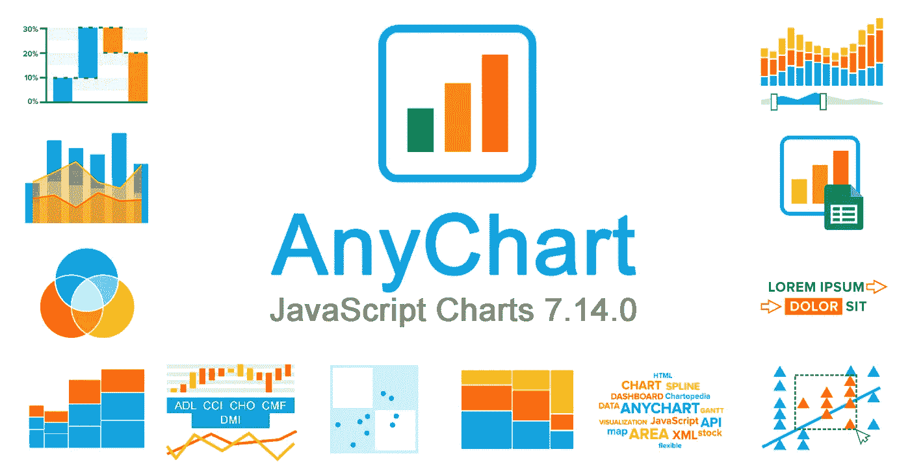
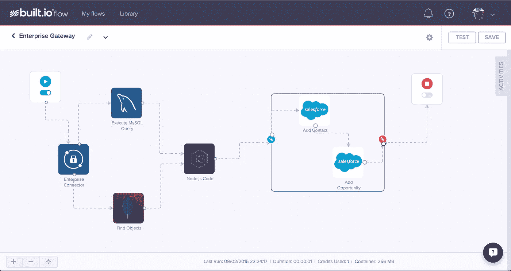
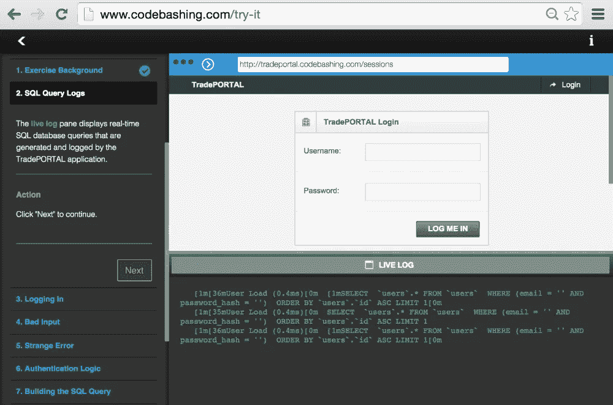

# DeveloperWeek 2018:开发行业最大的名字—第 1 部分

> 原文：<https://medium.com/hackernoon/developerweek-2018-biggest-names-in-development-industry-part-1-fea8cb0785d8>

我们一直关注大型行业活动，当然我们也不能忽视最近在加利福尼亚州奥克兰举行的 [DeveloperWeek 2018](http://www.developerweek.com/awards/) 。DeveloperWeek 是发展行业中最大的世界博览会，它关注前沿技术和创新。过去的活动主办者和支持者包括谷歌、脸书、IBM、Yelp 和其他行业巨头。因此，看看 2018 年获奖者名单，看看是什么让这些公司如此杰出，显然很有趣。

# 区块链/加密货币开发

# [AirTM](https://airtm.io/)

> ***赚钱又是你的朋友***

对于用户来说，AirTM 是一个云美元账户，使他们能够向自己的账户存入或从中提取当地货币。它还允许轻松发送或接收美元付款，总体而言，这是一种快速而简单的方式来进行和接收美元付款。

幕后留下的是 AirTM 基本上运行在比特币上的事实，这就是它如此酷的原因。处理用户存款和交易的值得信赖的收银员都是比特币制造者，他们将比特币转换成他们账户中的美元。因此，AirTM 大大增加了 AirTM 运营的所有市场对比特币的需求，而且这一数字还在不断增长。此外，AirTM 对比特币的适应产生了积极影响，这也是该团队获奖的原因。

# Javascript 技术

# [AnyChart](https://www.anychart.com/)

> ***设计为嵌入和集成的 JavaScript 图表***

AnyChart 是一家图形软件开发公司，提供各种产品，被 Oracle 或 3M 等世界领先公司所使用。该公司提供数据可视化解决方案，如图表、图形等。

AnyChart 是一个轻量级的 JavaScript 库，从 2003 年就已经存在了。公司的主要产品有 AnyChart、AnyStock(实时数据流图表)、AnyMap 和 AnyGantt(用于甘特图)。考虑到 AnyChart 客户的数量及其灵活高效的产品，难怪该公司获得了 JS 技术最佳创新奖。

# 人工智能和机器学习

# [蝴蝶](https://www.butterfly.ai/)

> ***你的个人领导力教练***

Butterfly 是一款[员工脉搏调查](http://butterfly.ai/)和管理教练软件，旨在将各级管理者转变为卓越的领导者。Butterfly 帮助现代组织收集定期的员工反馈，推动可操作的见解，并建立更强大的领导和更透明的文化。

作为人工智能管理教练的先驱，Butterfly 的自学技术使用实时团队反馈，持续向经理提供定制的领导力培训和内容。像通用电气、花旗银行、Jet.com、Ticketmaster 和奥美这样的公司依靠 Butterfly 来培养领导者和建立更强大、更快乐的团队。

Butterfly 最近完成了 240 万美元的种子资金轮，得到了 Daphi(牵头)、Precursor、construction Capital 和著名天使投资者的支持。2017 年，互联网最高荣誉威比奖(Webby Awards)将 Butterfly 评为该类别的前 5 大平台之一。

# 平台即服务

# [build . io 流](https://www.built.io/)

> ***数字转换套件***

Built.io 将自己定位为“基于云的 API 优先企业套件”，它为最具创新性的公司提供数字产品和解决方案，包括来自财富 500 强的公司。说到 Built.io Flow，它是一个面向 API 的集成即服务平台，旨在连接人与企业。

Built.io 流允许快速集成您的业务应用程序，自动化重复任务并消除手动流程。它提高了业务效率，提供了物联网利用率，被公认为任何业务的最佳工具，因此您可能也想关注它。

# 移动开发

# [代码攻击](https://www.checkmarx.com/codebashing)

> ***漏洞防御梦之队***

Checkmarx 在现代 IT 世界最大的问题之一——应用程序安全测试上表现出色。应用程序安全专家和开发人员之间的愿景存在差距(前者认为这是必要的，而后者认为这是一种负担)，Checkmarx 开发了一种既省时又有价值的解决方案。

应用程序安全性的问题在于，应用程序安全性应该从开发阶段就开始，而许多开发人员只是缺乏必要的技能。代码攻击被集成到 CxSAST UI 中，当开发人员遇到任何安全漏洞时，代码攻击允许立即激活必要的学习课程，并返回到如何解决问题的新知识工作中。

在[第 2 部分](https://dashbouquet.com/blog/web-development/developerweek-2018-biggest-names-in-development-industry-part-2)和[第 3 部分](/@dash_bouquet/developerweek-2018-biggest-names-in-development-industry-part-3-adaa1eff8741)中，我将继续我们对 DeveloperWeek Awards 的概述，所以请保持更新并订阅我们的新闻，以跟上来自发展中世界的最新消息！

[作者娜塔莉亚·库库什金娜](https://www.linkedin.com/in/natalia-kukushkina-b62397132/)