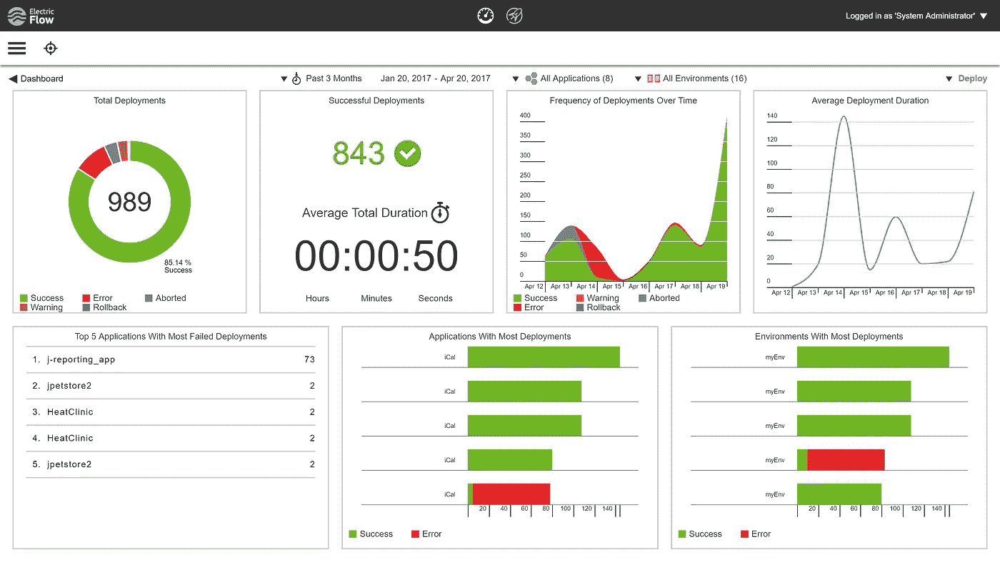

# DeveloperWeek 2018:开发行业最大的名字—第 2 部分

> 原文：<https://medium.com/hackernoon/developerweek-2018-biggest-names-in-development-industry-part-2-9fe70a44b480>

在我们之前的博文中，我们看到了一些[开发者周 2018](http://www.developerweek.com/awards/) 的获奖者。在今天的帖子中，我们将继续概述它们以及发展和现代 IT 世界的最新趋势。

# DevOps

# [电流](http://electric-cloud.com/products/electricflow/)

> ***自适应释放自动化***

Electric Cloud 是一家致力于简化运营并帮助组织以更快的速度交付更好的软件的公司。其 DevOps 发布自动化为 CD 提供了动力——持续交付。CD 旨在保持软件发布就绪，并提供一种可重复且可靠的方法来将软件部署到任何环境中。

所以 ElectricFlow 基本上就是我们所说的这个发布自动化。它允许团队按需协调发布，在任何规模上自动化部署，还提供跟踪和测量工具。因此，不用说该公司获奖是有原因的——他们的解决方案将开发提升到了一个新的更高效的水平。

# 物联网软件

# [涌入企业](https://www.influxdata.com/influxenterprise/)

> ***现代指标和事件引擎***

流入数据提供了一个开源的现代时间序列平台。该公司仔细审查和考虑了现代 IT 世界的最大问题之一，即大数据处理，并提供了一个解决方案，以满足不断变化的要求，并保持高质量的工作水平。

由于大量使用云原生应用和服务以及物联网投资的增加，时间序列平台正在崛起。这些平台可以支持实时数据处理和分析大量指标的要求，以便公司从所有数据中获得竞争优势。

因为如今内容是王道，所以对公司来说，识别数据的价值并将其转化为自己的优势是至关重要的。来自流入数据的解决方案无疑处理了这个任务。

# 3D 和虚拟现实/增强现实开发

# [交互引擎](https://github.com/leapmotion/UnityModules/wiki/Interaction-Engine)

> ***赤手空拳进入虚拟现实***

我们已经写了几篇关于 VR 和 AR 崛起的帖子。因此，难怪许多公司都试图在炒作浪潮中冲浪，开发与这些趋势相关的产品。Leap Motion 凭借其获得 DeveloperWeek 奖的交互引擎成为领先者。

Leap Motion 的交互引擎允许用户通过与物理或伪物理对象进行交互来使用 VR 应用。换句话说，如果你的应用程序有某种需要触摸、移动等的对象。交互引擎可以为你做一点(甚至全部)工作。

除此之外(好像 Leap Motion 还不够酷！)该公司还使用户能够从远处召唤虚拟物体并与之互动。因此，你可以在不靠近物体的情况下触摸或移动它，而不是让你走向它。事实上，这是一种更高层次的体验。

# 企业解决方案

# [标记逻辑 9](https://docs.marklogic.com/)

> ***数据库*的进化**

MarkLogic 是一个用于整合孤岛数据的数据库，也是唯一一个专门为企业打造的现有 NoSQL 解决方案。该公司使用灵活的多模型方法，可以毫无问题地处理来自任何来源的数据。此外，MarkLogic 的数据库还包括内置的搜索功能，以使您的工作流程更加轻松，并且它也是 100% ACID 兼容的。

最新的公司版本是 MarkLogic 9，它提供了新的数据集成、增强的安全性和更多功能，这些功能共同帮助公司获得更简单、可操作的 360 度数据视图。MarkLogic 9 被评为该公司迄今为止最具雄心的版本，并已被公认为任何公司的必备工具。

# 编码框架/库

# [npm 企业](https://www.npmjs.com/enterprise)

> ***把企业发展带到新的高度***

Npm 是 JavaScript 的包管理器，也是世界上最大的软件注册中心。它用于安装、共享和分发代码、管理项目依赖性和共享反馈。npm 的产品适用于任何项目和团队，因为它们有不同的大小和软件包，从浏览和安装公共代码到定制支持和 SLA。

Npm Enterprise 使您能够在公司的防火墙后运行 Npm 的基础设施。支持公共注册中心的是同一个代码库。该产品提供了大型组织所需的功能，并作为多种需求的解决方案，如共享私有模块的便利性、工作流控制、增强的安全性等等。

当然，这些并不都是 DeveloperWeek 的获奖者，但是他们似乎是我们最感兴趣的。也许他们会激励你走出去，自己创造一些革命性的东西，或者你可以考虑在自己的产品中实现某些想法。然而，你知道的越多，你的企业在现代 it 环境中的发展就越好，我们将继续为你提供最新的 IT 新闻知识。

[DeveloperWeek 2018:开发行业的大腕——第一部分](https://hackernoon.com/developerweek-2018-biggest-names-in-development-industry-part-1-fea8cb0785d8)

[DeveloperWeek 2018:开发行业的大腕——第三部分](/@dash_bouquet/developerweek-2018-biggest-names-in-development-industry-part-3-adaa1eff8741)

[作者娜塔莉亚·库库什金娜](https://www.linkedin.com/in/natalia-kukushkina-b62397132/)