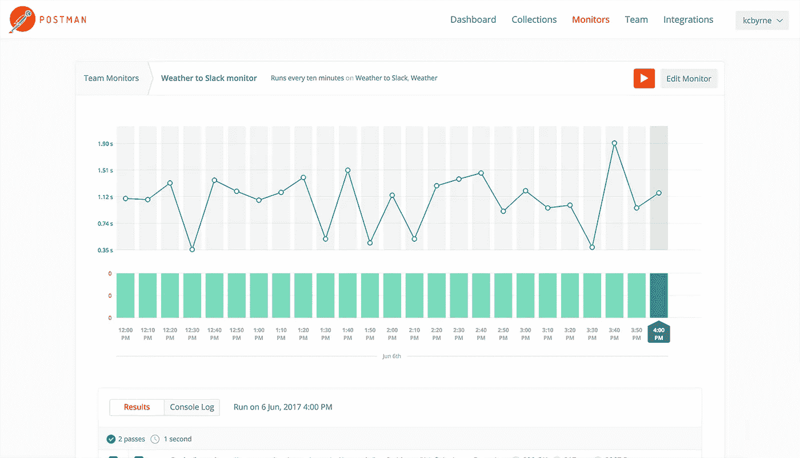

# DeveloperWeek 2018:开发行业最大的名字—第 3 部分

> 原文：<https://medium.com/hackernoon/developerweek-2018-biggest-names-in-development-industry-part-3-adaa1eff8741>

我们正在总结 [DeveloperWeek](http://www.developerweek.com/awards/) 的获胜者，在这篇博客文章中，我们将看看其他被选为行业领先者的公司。万一你错过了[第一部](https://hackernoon.com/developerweek-2018-biggest-names-in-development-industry-part-1-fea8cb0785d8)和[第二部](https://hackernoon.com/developerweek-2018-biggest-names-in-development-industry-part-2-9fe70a44b480)。

# API 服务

# [邮递员](https://www.getpostman.com/)

> ***开发 API 很难，Postman 让它变得简单***

Postman 是一个工具链，它包括一个专门为 API 优先开发设计的独特平台、用于 API 生命周期每个阶段的各种工具以及许多其他功能。通过支持 API 生命周期的每个阶段，Postman 允许您更轻松、更快速地进行开发。它提供了带有集合、工作区和内置工具 API 开发环境:组织提高效率和生产力所需的一切。

使用 Postman API，您将能够添加新的和更新现有的集合，添加和运行监视器以及更新环境。该公司专注于当前和未来的发展趋势，牢记一切都将连接在一起——因此，创造相应的产品。

# 应用分析/测试

# [酱实验室自动化测试平台](https://saucelabs.com/)

> ***连续测试云***

我们已经提到了这样一个事实，即产品的质量在其成功中起着至关重要的作用。本着这一理念，Sauce Labs 开发了一种解决方案，可以保持应用程序的质量，同时提高工作速度和效率。

Sauce Labs 的自动化测试平台提供跨浏览器测试、移动模拟器和实时 web 测试。所有这些特性都旨在节省测试时间，并将更多精力放在开发上。作为世界上最大的测试云，Sauce Labs 为其用户提供了 800 多种浏览器组合和大约 200 种移动仿真器和模拟器。有了如此令人印象深刻的数字，难怪该公司会获奖——它得到了全世界数百万用户的认可。

# API 基础设施

# [仙鸟](https://sendbird.com/)

> ***手机应用和网站的消息传递 SDK 和聊天 API***

SendBird 提供极其简单高效的消息传递解决方案。它提供 1 对 1 的直接消息传递、群聊和开放频道，以及所有附带的高级功能。该产品被认为是应用程序最简单的消息传递 API，它提供了从前端 UI 到后端的完整包。

SendBird 的所有功能都旨在提高应用效率和用户参与度。它有聊天室的调节工具，消息阅读状态的跟踪，消息速度的智能节流，防止垃圾邮件泛滥等等。消息传递的方式如下:SendBird — API — SDK —移动应用程序。只有四个阶段，这种简单性赢得了成千上万的产品崇拜者。

# 通信发展

# [安慰云](https://solace.com/products/clouds)

> ***完成跨越所有云端的灵活部署***

Solace 为其用户提供跨云计算环境的应用和微服务连接。作为用户，你可以选择任何适合你的云并迁移你的应用。此外，您还可以共享数据和工作负载，并配置和监控所有云中的数据移动。

听起来像是组织的一个很好的工具，它确实很棒。除了上述功能，Solace 还使用户能够构建物联网应用程序，流式传输数据并连接您的 web(或应用程序)流。

Solace Cloud 允许您使用开放 API 和标准协议，并且已经因为其性能、100%透明性、DevOps 自动化等等而受到许多公司的喜爱。亲自尝试一下，看看 Solace 为什么会获奖。

# 数据开发工具

# [瓦里克](https://varick.io/)

> ***花时间打造产品而不是工具***

Varick 的出色之处在于它将 REST 或 JSON APIs 转换成了管理面板。通过使用 API 模型，Varick 可以构建仪表板，用户可以完全控制合作者。此外，该产品还保证您的数据不会丢失或损坏，考虑到与数据相关的众多安全问题，这在当今是一个非常重要的因素。

使用 Varick，您将获得一个强大而清晰的管理界面。它也非常容易和高效:例如，您可以简单地设置权限来控制哪个用户可以看到什么，而不是教授拉请求。该产品已经赢得了国际认可，它为不同规模的团队提供了不同的解决方案，从而满足了现代 it 行业最严格的要求。

如果您有兴趣了解更多关于 IT 世界的有趣新闻，请订阅 DashBouquet news 并保持更新！

[DeveloperWeek 2018:开发行业的大腕——第一部分](https://hackernoon.com/developerweek-2018-biggest-names-in-development-industry-part-1-fea8cb0785d8)

[DeveloperWeek 2018:开发行业的大腕——第二部分](https://hackernoon.com/developerweek-2018-biggest-names-in-development-industry-part-2-9fe70a44b480)

[作者娜塔莉亚·库库什金娜](https://www.linkedin.com/in/natalia-kukushkina-b62397132/)