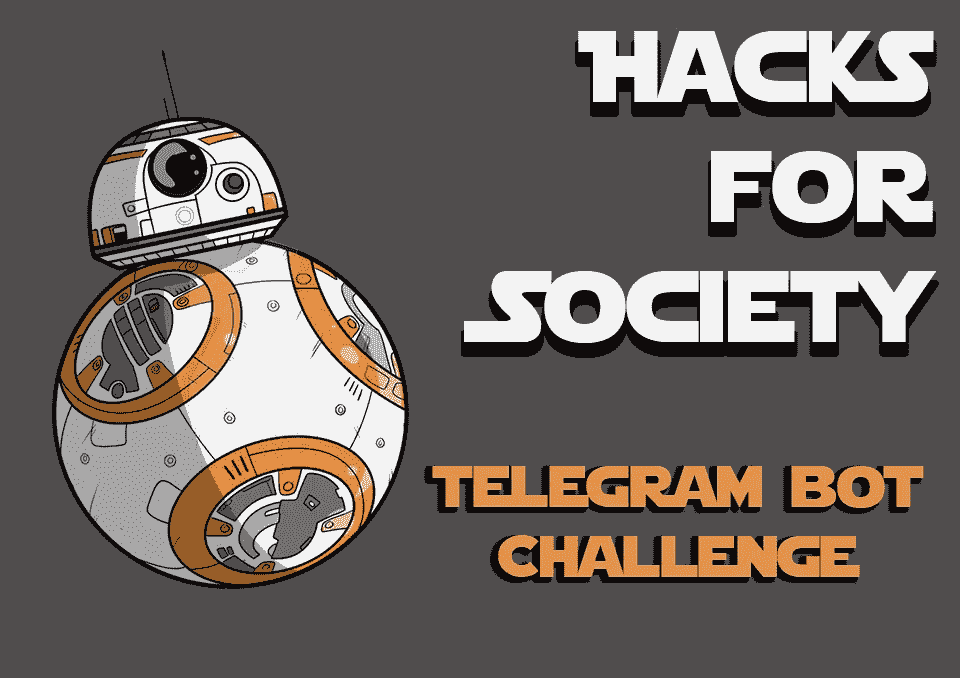

# 开发挑战——黑客马拉松的替代方案？

> 原文：<https://medium.com/hackernoon/development-challenges-an-alternative-to-hackathons-5b48cedb2389>

 [## 黑客协会|参加

### HackSociety 旨在促进开发文化，并激励学生通过实施技术来学习

黑客社会](https://hacksociety.tech/attend/challenges) 

在 HackSociety，我们相信要赋予年轻人力量，让他们展现深不可测的才华和隐藏在内心深处的创新。目前，软件开发被认为是一项单调乏味的工作，导致真正的技术爱好者数量大幅减少。我们坚信，如果全球的开发者想要开发出让他们周围的人生活更轻松的产品，这种情况需要改变。

> 黑客马拉松(*理想情况下*):软件和/或硬件开发人员之间的竞赛，旨在构建一个壮观的项目，为现有问题提供一个强有力的解决方案。

到目前为止，我已经参加过很多次黑客马拉松了，对于 team HackSociety 来说，给出一个同样的小定义是相当安全的。

然而，这并不是目前大多数黑客马拉松参与者的定义。这是他们很多人都有的 midset:

> 开发人员之间的激烈竞争，以构建一个部分工作的项目，该项目使用了一些最新的技术，并且可以很好地呈现。

虽然这种方法通常会在一夜之间取得惊人的成功，但对于现实世界中的每个人来说，这种方法的结果是零收益。作为一个概念，黑客马拉松旨在构建能够缓解日常生活问题的产品。然而，目前的趋势已经把他们变成了一个非生产性的通宵聚会，提供免费的食物和饮料，作为赞助商的营销活动。这给参与者、组织者和赞助商带来了很少的实际结果。

然而，也有一些梦想家在努力改变。他们看到像通过这些事件进行招募这样的活动如何改变了整个场景。他们明白，极客和技术爱好者最有趣的静修如何变成了不同级别的程序员之间的拔河比赛，他们在激烈竞争的软件开发版本中，在不确定性的浓烟中奋力拼搏。他们对解决方案的愿景也是如此，从“*举办黑客马拉松只是为了打造产品，没有奖励”*到“*邀请志同道合的人在每个周末打造一些令人敬畏的东西”*。

另一方面，HackSociety 已经为你准备好了自己的美味佳肴，而其他人则在考虑适合所有人的最佳饮食计划，即开发者、组织者和赞助商。我们很自豪地为社会 展示 [**Hacks，这是一系列精心策划的**每周在线挑战**，将要求开发者**构建真实世界的产品**，这些产品将被一组实际的最终用户使用。因此，与你的常规黑客马拉松不同，这些 ***智能黑客马拉松*** 将为每个人提供切实的结果。**](https://hacksociety.tech/attend/challenges)

每一个**参与者**都将通过为生产水平实际构建材料来学习。他们的产品将按比例设计，因为他们将被相当多的人使用，因此要经过彻底的测试。这个测试不仅反映了代码算法的正确性，还反映了它承受多次点击的能力。此外，这些将是*开源*软件，因此可能会有多个贡献者提供他们自己的调整，并增加其性能。

这个概念还会让技术领域最优秀的公司参与进来，把最简单的问题摆在你面前，同时给你必要的空间去创新和添加功能，为产品提供额外的优势。

虽然挑战将对所有人开放，即初学者、学习者和专家，但我们想借此机会邀请所有专家站出来，向他人伸出援助之手。我们会要求他们在一周的前三天内创建一个小教程，可以是一组视频或幻灯片，解释开始开发本周产品的最佳方式。这些人将被授予 ***本周导师*** 的称号，并获得我们颁发的证书以及社交媒体和我们网站上的认可。

最后，对于那些希望为他们各自的学院或组织策划一个单独的挑战的组织者来说，也有一些事情要做。他们可以在我们的门户网站上举办私人挑战，只有他们邀请的人才能注册参加。尽管如此，挑战的描述和统计将对所有人开放。

因此，为了用一句话来总结上述内容，下面是我们提供的解决方案的定义:

> 一组专门的挑战，让开发人员通过在一周时间内构建健壮的生产级产品来解决现实世界的问题

然后，这些产品将由问题解决者进行分析，他们认为合适的产品将由真实用户进行实时测试。然而，对构建产品的认可将只给予开发者。

作为对同一概念的证明，HackSociety 决定将第一项挑战作为基本的电报机器人挑战。这是一个简单的挑战，将用于给我们网站的用户，这些挑战的流程是什么粗略的想法。

本次挑战赛中开发的机器人将被我们所有的合作伙伴黑客马拉松用于他们的活动中和活动后功能，以及参与者。它将简化每一次黑客马拉松和其他技术倾向的活动中需要遵循的许多流程。以后，我们甚至可以把它变成一个跨平台的产品。该产品被相当多的用户使用的可能性很高，我们打算为他们提供服务。

足够好奇了吗？在这里为社会注册第一个黑客:[https://hacksociety.tech/attend/challenges](https://hacksociety.tech/attend/challenges)

在 [facebook](https://www.facebook.com/thehacksociety) 、 [instagram](https://www.instagram.com/thehacksociety/) 和 [twitter](https://twitter.com/thehacksociety) 上关注我们，获取更多更新，或者加入我们的 [facebook 群组](https://www.facebook.com/groups/1840988019285518/)，与其他志同道合的人就此进行交流。

下次见！

老尼克，黑客协会