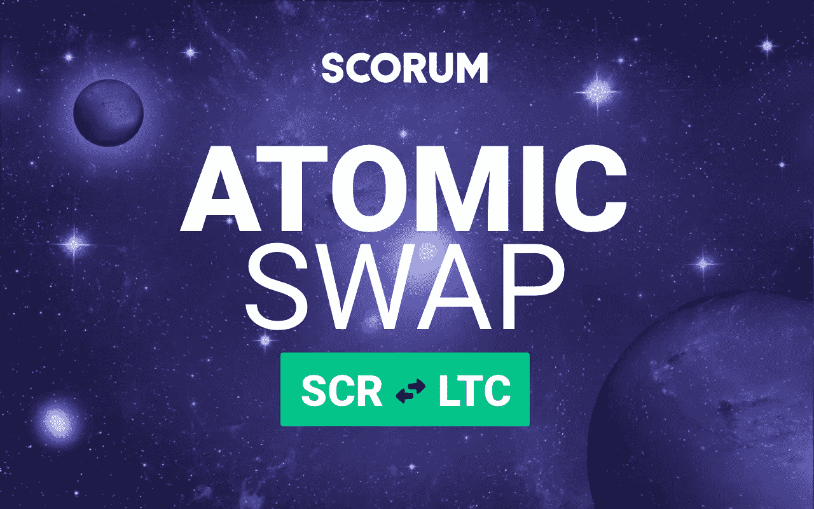

# 开发更新:Scorum 在 Litecoin 和 SCR 之间执行原子交换

> 原文：<https://medium.com/hackernoon/development-update-scorum-executes-atomic-swap-between-litecoin-and-scr-f91ddebb4269>

## 虽然距离 Scorum 众筹销售只有几天时间，但 Scorum 总部的团队正在推动加密货币创新的进展。

自从几年前第一次被讨论以来，原子互换已经在 T2 引起了公众的注意，并被 Litecoin 的 T4·查理·李和 BarterDEX 背后的科莫多团队推进。但在很大程度上，随着加密货币世界在 2017 年 ico 的爆炸式增长以及比特币价值上升的头条新闻，它们一直在雷达下飞行。

那么，为什么基于石墨烯框架的区块链 [Scorum](http://www.scorumcoins.com) 想要涉足原子交换呢？首先，这件事还没有完成。我们都喜欢新的挑战。作为区块链技术和加密货币的信徒，我们认识到该系统当前的一个主要缺陷是对集中交易的依赖。这是一个弱点，会使大量资金暴露给黑客和偶尔的内幕交易指控。

## **原子互换引物:**

也称为原子跨链事务，它们是“原子的”，因为事务要么完全发生，要么根本不发生。如果掉期交易中的任何一方在审计合同时停止了这一过程，那么双方都会收回他们原来的硬币。

概念很简单，快速、大规模地执行这一计划，同时维护隐私，将开创一个加密货币交易的新时代，最重要的是，它将带来效用。我们认为科莫多平台的 Barterdex 是一个很有前途的分散交易平台，可能会在明年将原子互换带入主流。

## Scorum 的用户会得到什么？

一旦完成，微调，并集成到 Scorum 的用户界面，原子互换将允许 Scorum 成员轻松地将其 SCR 硬币交换到其他加密货币。相反，如果 LTC 持有人想在 Scorum 的免佣金博彩交易所下注或买入零费用的梦幻体育联盟，他们可以直接交换到 SCR。**无需第三方集中**交易所处理，交易成本低，结果安全。

## **它是如何工作的？**

在我们的例子中，我们将概述 Alice 和 Bob 之间的原子交换。他们都有 Scorum 区块链和 Litecoin 区块链的地址，因为这将是一个**链上原子交换**。这种原子交换成功的另一个关键是两个区块链使用相同的[哈希算法](https://hackernoon.com/cryptographic-hashing-c25da23609c3)来实现秘密交换(这不同于块签名哈希算法)。

所以，假设爱丽丝想用她的 15 LTC 换 10 SCR，鲍勃愿意用他的 10 SCR 换爱丽丝的 15 LTC。每个区块链都有地址。接下来的内容被简化(相当)了一点，在这里查看我们的[完整文档](https://github.com/scorum/scorum/wiki/How-to-do-atomicswap)。

1.  Alice 通过创建一个秘密、一个秘密散列和一个合同来从她的 Litecoin 钱包发起交换，该合同说她将把她的 15 LTC 从她的 Litecoin 地址转移到 Bob 的地址。
2.  Alice 通过任何消息服务经由秘密散列将合同发送给 Bob。
3.  Bob 审核合同以确保所有内容都符合正确的费率。
4.  与此同时，Bob 从他的 Scorum 钱包中创建了一个参与合同，该合同表示他将从他的 Scorum 地址向 Alice 发送 10 个 SCR。
5.  Bob 将他的合同发送给 Alice，让她审核。
6.  一旦双方都审核了与秘密散列相关联的合同，Alice 将有 24 小时来赎回 Bob 的合同并接收她的 10 SCR。
7.  一旦这样做了，秘密就会暴露给 Bob，他必须在 48 小时内赎回他的 15 LTC。

上面的 [**散列时间锁契约**](https://themerkle.com/what-is-a-hashed-timelock-contract/) 有其优点也有缺点。好的一面是，没有第三方可以信任任何一个人的硬币。不利之处包括，如果参与者在发起者的合同创建后拒绝参与，加密货币可能会被捆绑或冻结长达 48 小时。

## **原子互换的潜力**

值得记住的是，原子互换只是在双方之间安全地转移资金。时间快进一点，我们看到一个场景，Alice 想用她的 LTC 购买一件商品，但商家 Bob 只接受 SCR。完美执行后，Alice 将通过分散式交换将资金发送给 Bob，Alice 的 LTC 将以适当的汇率交换 SCR，然后 SCR 将最终到达 Bob 处，Alice 将获得她的物品。

有什么不喜欢的呢？将有工具涉及汇总所有区块链的汇率并存储当前订单，但货币的实际变化将直接发生在点对点之间。

> 除了 reddit 的胜人一筹，没有人会在硬币或区块链协议之间不必要的竞争中“胜出”。已经有几千种硬币和代币存在，没有一种加密货币可以统治所有的硬币和代币。也不需要有。

大规模采用加密货币的未来取决于许多因素，但最重要的是安全、可靠和快速地在货币之间转移资金，而不需要信任第三方来执行交换**。当最终用户可以使用他们拥有的任何一种货币，并以另一种货币无缝支付他们所需的商品和服务时，我们就都赢了。**

## 想认识第一个 SCR > LTC 原子交换背后的团队吗？在 YouTube 上查看我们的[团队视频](https://youtu.be/538lqt0_Gkc)，并通过[电报](https://telegram.me/SCORUM)与我们聊天。在[脸书](https://www.facebook.com/SCORUM.COMMUNITY/)和[推特](https://twitter.com/SCORUM_en)上关注 Scorum 项目的最新进展。