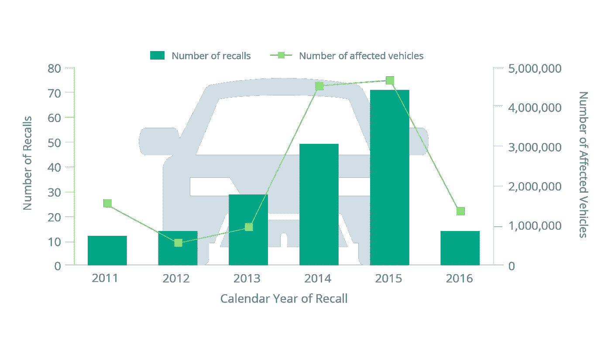
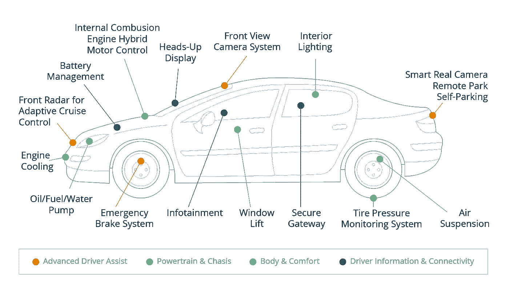
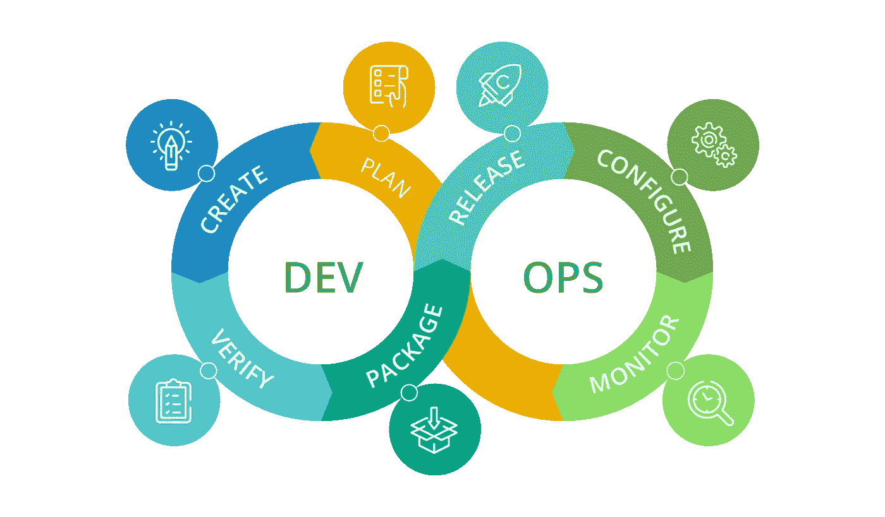
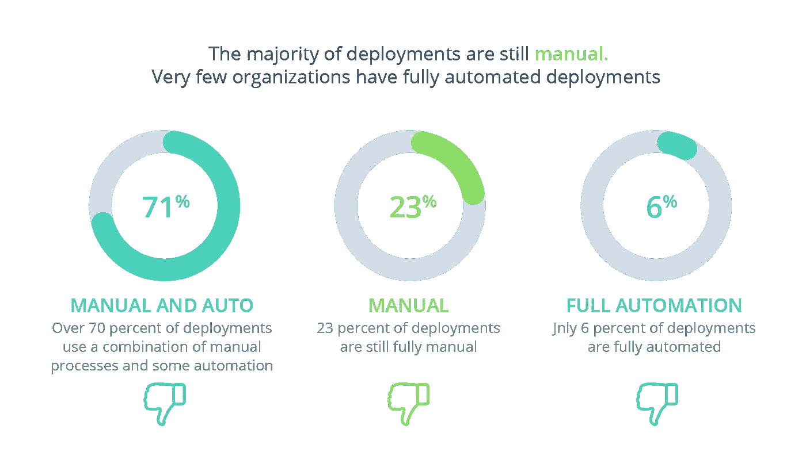
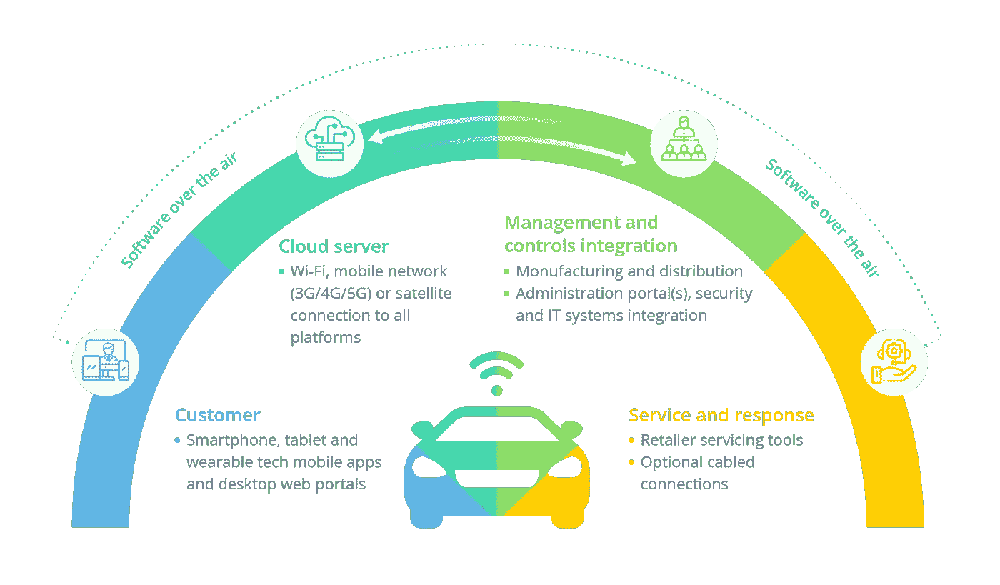

# DevOps:汽车行业的圣杯还是预算克星？

> 原文：<https://medium.com/hackernoon/devops-a-holy-grail-for-automotive-or-a-budget-buster-e45c801cfcc7>

《DevOps:汽车行业的圣杯还是预算破坏者？》一书的合著者是 [***弗拉基米尔·列别捷夫***](https://www.linkedin.com/in/vladimirlebedev/)***—DevOps 福音传道者和实践者，devo PS 咨询公司 CEO 特里安古***

今天做汽车公司是什么感觉？把运营的每一个环节都外包出去，有没有一家汽车公司变成了品牌[管理](https://hackernoon.com/tagged/management) / [营销](https://hackernoon.com/tagged/marketing)机构，很少接触技术？不完全是。

汽车工业在技术、设计以及最重要的制造方面有着辉煌的一百年历史。仅在几十年前，软件才成为车辆不可或缺的一部分。在许多方面，它类似于机械部件:两者都由具有输入和输出的互连系统组成。像任何机械零件一样，软件经历一个标准的开发周期:设计、开发、在隔离环境中测试，以及生产。但是软件和机械部件之间还是有很大的区别。

软件以零复制成本和预期的无限无故障时间为荣，因为不存在易损坏的部件。这导致了一个常见的误解，因为许多人没有认真对待软件开发生命周期:认为软件功能更容易创建、交付和管理。让我们看看如何避免这个错误。

# 为什么软件是生产失败的原因？

汽车厂商，无论是原始设备制造商还是一线企业，都不像其他公司那样知道，建立一个品牌的声誉需要数年时间，而失去它只需几天时间。以大众*柴油门*为例:丑闻已经过去三年了，但[仍未结束](https://www.theverge.com/2018/9/18/17876012/dieselgate-volkswagen-vw-diesel-emissions-test-epa-german-auto-industry-mercedes-benz-bmw)。

随着软件扩展汽车架构，其质量对整个装配变得至关重要。错误的代码会影响[车辆的性能和安全](https://blog.bugfinders.com/lack-of-software-testing-leads-to-spike-in-car-recalls)，这对汽车制造商来说可能是毁灭性的。菲亚特克莱斯勒不得不在全球召回[125 万辆皮卡](https://www.reuters.com/article/us-fiatchrysler-recall-idUSKBN1881I6)以解决一个编码错误，通用汽车召回近[430 万辆汽车](http://fortune.com/2016/09/09/gm-recall-software/)，原因是一个能够防止安全气囊在碰撞中展开的软件缺陷。

**软件相关车辆召回**

尽管软件行业无法在不使软件变得昂贵的情况下达到类似于六适马的生产质量，但我们有一个不错的替代方案— [汽车行业的 devo PS](https://www.intellias.com/continuous-integration-automated-release-management-aws/?utm_source=medium.com&utm_medium=referral&utm_campaign=IS&utm_content=devops%20in%20automotive)。这种方法结合了软件开发和操作实践，跨越了整个软件交付管道，交付了大多数原始设备制造商只能梦想的东西。采用 DevOps 实现自动化的公司报告了显著的优势，包括:

*   持续的产品质量改进；
*   缩短上市时间；
*   提高客户满意度；
*   更可靠的版本；
*   提高生产率和效率；
*   通过快速实验实现更可靠、更高质量的产品开发。

DevOps 计划还改变了公司的工作方式，在软件开发生命周期中为 IT 运营、开发人员和质量保证团队触发了新的协作机制。在企业开发和自动化应用中，尤其是在汽车行业，让这些团队顺利合作是一个重大挑战。

# 为什么 DevOps 还没有铺好通往汽车的路？

DevOps 努力做到这一点，但是有几件事让它有点麻烦。

**进近碰撞**

首先，汽车 R&D 生命周期使用基于规范的 A 到 Z 瀑布方法，每个步骤都受到控制。像 A-Spice 这样的软件质量系统试图通过建立 DMAIC(定义、度量、分析、改进、控制)过程将这种方法与 DevOps 相结合。但是当与敏捷——项目管理的迭代开发方法相结合时，DevOps for automotive 会繁荣起来，因为它消除了预先的计划。

敏捷和 DevOps 自动化将软件视为一个不断变化的领域，并处理诸如用户期望、环境和安全挑战等外部因素。这种组合适用于 SaaS，但很难映射到汽车行业，因为汽车行业习惯于从准时交付管理中继承下来的严格规划。在迭代中制造一辆汽车是一个奇怪的想法:在第一次冲刺时，你可能会把轮子粘在一个框架上，但这很难使它成为一辆汽车。

来自遥远星系的嵌入式软件

阻碍在汽车行业采用 DevOps 的第二个因素是汽车软件堆栈中的深度嵌入。今天的车辆基础设施超过 100 个不同的电子控制单元(ECU)以及用于生产维护和高级用户体验的配套软件，包括人机界面和各种配套应用程序。

**汽车嵌入式系统**

嵌入式软件有许多限制:

*   低计算和内存占用
*   多样且互不关联的工具
*   实时响应要求
*   连通性问题

尽管业界试图最小化和标准化这些 ECU，但基于嵌入式软件的控制系统仍然保持着竞争优势，因为它们在略微增加成本和缩短物料清单的情况下提升了功能。

嵌入式软件必须占用很少的空间，不能为编排器或额外的东西(如虚拟机管理程序、加载程序或维护相关代码)留出空间。然而，随着技术的快速进步，现代虚拟机管理程序和编排器今天变得越来越轻量级，谁知道呢，我们甚至可能有一天在 ECU 中看到它们——这将允许嵌入式实践获得 DevOps 自动化的所有好处。

**DevOps 工具链循环**

# 自动化挑战

实时嵌入式软件系统必须确保响应时间是可预测的，并且对系统条件或事件冲突不敏感。在大多数情况下，为了设计和验证这样的系统，需要使用非常特殊的软件栈和工具，这些软件栈和工具通常在创建时没有考虑过程自动化的思想。因此，在不完全改变软件栈的情况下，没有办法引入任何新的过程改进(比如 DevOps 自动化测试)。

如何处理部署？

# DevOps 有机会克服这些陷阱吗？

先说连接性。即使是一线国家也远没有 100%覆盖车联网。5G 的推出正好可以解决这个问题。

**软件空中连接**

凭借目标不到 1 毫秒的低延迟服务，5G 将成为汽车行业的颠覆者。其超高速和广泛的覆盖范围将推动[联网驾驶](https://www.intellias.com/v2x-basics-connected-vehicle-technology/?utm_source=medium.com&utm_medium=referral&utm_campaign=IS&utm_content=devops%20in%20automotive)的关键任务功能，如车辆对车辆(V2V)、车辆对基础设施(V2I)和车辆对一切(V2X)通信，并通过空中更新。5G 能够快速处理大量数据，将为自动驾驶提供动力，并确保车辆安全和增强的舒适度。

在 DevOps 环境中，5G 网络满足了对速度的需求，在整个开发周期中实现了更快的流程优化和流量控制。5G 驱动的 DevOps 专注于敏捷性和自动化，将通过持续集成/持续部署(CI/CD)实践显著提高软件交付周期的效率。一旦在基于云的软件开发中实现，CI/CD 将极大地减少 DMAIC 循环的持续时间。

连续交付支持开发、交付和部署基础设施的两个版本，允许它们支持不同的请求。CD 还支持高级 A/B 实施场景，独立的生产实例竞争用户的采用。

# 继承开源的最佳实践

API 和开源工具的标准化是汽车行业采用 DevOps 的另一组驱动因素。汽车行业有史以来第一次面临这样一个行业，它不想遵循汽车标准，但却强迫汽车公司遵循自动化和 DevOps 实践。 [AutoSAR Classic 到 Adaptive](https://www.autosar.org/fileadmin/user_upload/standards/adaptive/17-10/AUTOSAR_SWS_ExecutionManagement.pdf) 平台的过渡是从专有汽车到 IT 衍生解决方案逆向发展的生动例子。

此外，许多汽车厂商已经从开源软件中获益。以 Linux 基金会的[汽车级 Linux (AGL)](https://www.linuxfoundation.org/blog/2017/09/how-open-source-is-transforming-the-automotive-industry/) 为例，这是一个开源平台，可以解决当今支离破碎、常常令人困惑的汽车操作生态系统。这个包罗万象的平台可能会成为行业标准，推动自动驾驶领域的创新。

# 动态系统缩放

车载 ECU 和信息娱乐堆栈的汽车级虚拟化为模拟测试、动态系统资源分配和性能扩展创造了大量机会。将 DevOps 世界与汽车相结合，我们可以在高速公路上用汽车中的嵌入式设备和传感器自动进行测试。DevOps 处理软件集成和持续部署，帮助汽车制造商进行预测性维护和错误恢复。

在实时和硬件系统的开发中仍然有挑战需要解决。然而，现场可编程门阵列、混合专用集成电路和片上系统(SOC)的快速发展大有可为。这一进展使我们最终能够将实时系统和硬件系统集成到一个模拟环境中，通过相同的 DevOps 方法对它们进行无缝管理。

# 有什么弊端吗？

尽管我们支持汽车行业的 DevOps 文化，但忽视这些缺点是不公平的。

首先，你既不会发现 DevOps 的标准化机构，也不希望它会存在。是的，我亲爱的汽车同事们——没人关心 DevOps 定义、标准流程或工具。对于一个拥有超过一百年标准化开发过程的行业来说，这听起来像是一场噩梦。

尽管 DevOps 方法已经达到了它的生产力平台，但是方法、工具的多样性和软件标准化的缺乏使得它在汽车上的应用变得很麻烦。此外，开发和运营流程的差异使得很难将*开发*和*运营*部分分开。这与由来已久的*研发到生产*的生命周期概念相反，经常被汽车厂商拒绝。

对于传统企业来说，缺乏可参考的标准、验证和认证机构被认为是一个巨大的风险。甚至 [A-Spice](http://www.automotivespice.com/fileadmin/software-download/Automotive_SPICE_PAM_30.pdf) 似乎正推动整个行业朝着与敏捷相反的方向发展，它与这种方法并不矛盾。尽管如此，业界应该有很多概念上的灵活性和敏捷与 A-Spice 的知识，以便在软件生产中成功地融合它们。但是由于 DevOps 的高度适应性，标准化不会给它的概念带来负担。

# 推动汽车创新

为汽车行业构建 DevOps 实践需要强大的远见技能，以匹配价值观、技术和生产视角。对于 OEM 和一级供应商来说，与拥有开发运维设置实践经验的强大软件服务提供商合作变得越来越重要。在没有 DevOps 理论或证书可用的情况下，只有扎实的背景和专业知识才能证明一个公司的专业性。但如果实施得好，DevOps 可以让汽车制造商受益，缩短上市时间，降低开发成本，最大限度地减少服务中断，并不断提高质量。

# 听起来像是圣杯的承诺，不是吗？