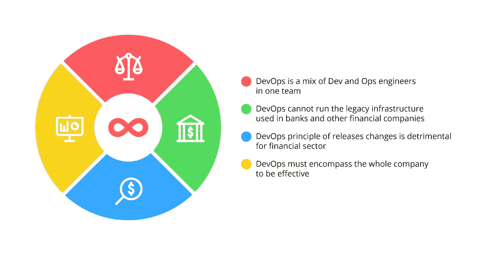

# 金融服务中的 DevOps:好处、神话、案例研究

> 原文：<https://medium.com/hackernoon/devops-in-financial-services-benefits-myths-case-studies-455f3e44d731>

金融公司采用根据 DevOps 工作流程工作有多种原因。更好的可预测性、更顺畅的运营、更低的开支等等…

金融业一直是最具创新性和技术最先进的商业领域之一。如今，在技术先进和数字化的世界中，客户希望他们的财务在移动中可用，通过方便的应用程序进行管理，并且他们的个人身份信息(PII)如银行卡号等得到安全保护。

> DevOps 是一种组织业务流程、软件交付管道和运营工作流的现代方式，可提高可靠性、交付更多价值并优化支出。

为了符合这些要求并保持市场竞争力，金融行业必须利用现代 IT 技术的所有优势和最佳实践来确保产品发布的可靠性、不间断的最终用户体验以及降低的运营支出。在金融服务领域实施 DevOps 有助于实现所有这些目标，下面我们将解释金融公司向 DevOps 文化过渡的好处。

# 在财务运营中使用 DevOps 实践的优势

DevOps 是一套运营模式、最佳实践和工具，旨在优化业务运营的各个方面，而不仅限于 IT 运营。以下是金融机构利用 DevOps 方法的主要优势:

*   **安全与合规**。金融行业必须遵守多项法规，以确保客户数据的安全性。开发运维的原则是**持续集成** (CI)、**持续部署** (CD)以及将不可变的**基础设施作为代码** (IaC)来提供，这导致了自动化的软件生命周期管道，没有人为错误或恶意意图的空间。当在构建新的代码批次并将其推向生产之前使用自动化测试单元彻底测试软件时，安全性问题从一开始就得到解决。此外，一旦达到法规遵从性并将其整理成文，相同的场景就会成倍增加和重复，这在很大程度上消除了产品开发生命周期中的安全性和遵从性问题。
*   **常规操作的自动化**。 [DevOps 工具](https://itsvit.com/blog/must-have-devops-tools-make-things-right-get-go/)旨在为软件开发和维护中涉及的多个过程提供深度自动化。服务器配置和配置、数据库备份和恢复、软件更新和回滚、测试环境设置、软件交付管道、生产服务器监控和日志记录—所有这些日常任务都可以而且必须自动化。一旦 DevOps 工程师设计并实施了自动化工作流和管道，IT 部门就可以开始致力于提高运营多功能性和基础架构性能，而不是一直在重复、低技能和耗时的任务中徘徊。
*   **更好地预测发布周期**。这是上一段的自然结果，因为当大多数流程运行时，可预测性的程度显著增加，因此企业能够通过确保快速的反馈实施和不间断的产品运营向客户交付更多的价值。
*   团队之间更好的合作。 [DevOps 文化](https://itsvit.com/blog/devops-culture-huge-step-mankind/)专注于各部门之间的沟通与协作。由于如今的金融业务要么是地理上分散的，要么是将部分业务外包，因此工作的集中和有效协作是运营稳定性的重要考虑因素。“您构建它，您运行它”是 DevOps 的主要原则之一。Ops 在软件设计阶段有发言权，因此开发人员可以充分评估他们的软件工作所需的资源数量，并相应地规划其体系结构。反之亦然，运营部门参与软件开发的所有阶段，并帮助开发人员更快地实现客户反馈，因此代码不会被扔到墙上成为其他人的问题。

尽管有多种切实的好处，但围绕 DevOps 方法的使用存在一些问题和误区，这阻碍了整个金融行业采用 DevOps 文化的速度。下面我们简单列举并消解。

# 阻碍金融业采用 DevOps 的误区

众所周知，金钱喜欢沉默。在金融行业，这意味着运营的稳定性、服务的持续可用性和结果的可预测性。DevOps 方法是旧方式的主要颠覆者，因此许多金融企业害怕在创新周期的早期开始他们的 DevOps 之旅，这些创新周期收获了几乎所有的好处。

目前在大多数金融机构中流行的 DevOps 方法有三个主要的误区。我们破除这些神话，希望你的公司不要相信它们，否则你就有可能落入后发多数甚至落后者的行列，失去你的竞争优势。正在讨论的流言如下:

1.  DevOps 是一个团队中开发和运营工程师的混合体
2.  DevOps 无法运行银行和其他金融公司使用的传统基础架构
3.  DevOps 释放变化的原则对金融部门是有害的
4.  DevOps 必须涵盖整个公司才能有效

所有这些神话都是完全不公正的，原因如下。

## 误解 1: DevOps 是一个团队中开发和运营工程师的混合体

这种信念诞生于 DevOps 时代早期，至今仍被那些几乎没有实践经验，不知道[什么是 DevOps](https://itsvit.com/blog/devops-devops-services-nutshell/) 的“IT 专家”们所普及。实际上，传统工作流和 DevOps 工作流的区别如下:

一个开发者有他自己的开发环境，在那里他写代码。一旦编写了新的一批代码，Ops 人员必须提供构建和测试服务器来构建和测试代码。bug 修复后，开发人员把代码扔过来，从现在开始就成了运营部门的问题，运营部门必须确保代码在生产中运行良好。如果发布后发现代码中仍有错误，Ops 必须恢复更改，循环重新开始。开发人员和运营人员很少互动

我们不需要提及这种方法的所有缺陷，如孤立的任务和责任、配置漂移、多重批准、操作瓶颈、错误发布的高风险、所有相关方的持续压力。这正是近十年前 DevOps 方法创立的原因。

DevOps 工程师就是 Ops 工程师，对软件开发有发言权。当产品需要部署和维护时，他们不会参与游戏，也不会手动提供/配置服务器。DevOps 工程师在项目开始时与开发人员讨论未来软件的需求和工作方式，这样开发人员就知道需要什么资源，而 Ops 可以决定如何最好地分配这些资源。

> DevOps 方法的主要好处是开发人员和运营人员相互沟通和协作，以消除大量浪费，并增加软件交付的可预测性和可靠性。

## 误解 2: DevOps 无法运行银行中的传统基础架构

稳定对于银行和其他金融公司来说至关重要，因为他们的服务中断意味着每分钟都有金钱损失。这就是银行对基础架构管理非常保守的原因，他们使用的系统是多年来构建的，没有人愿意对架构或工作流进行任何快速更改。

然而，运营稳定性实际上是 DevOps 工作流和实践的主要目标。服务器配置程序用 [Kubernetes](https://itsvit.com/our-whitepapers/kubernetes-the-cornerstone-of-the-modern-cloud-infrastructure/) 和 Terraform 清单描述。这意味着云基础设施作为代码进行管理，排除了手动重复设置和配置偏差的可能性。Ansible 和 Jenkins 允许构建管道，其中每个操作都是自动化的——从代码构建到提供测试环境，测试代码并打包发布，通过滚动更新在不中断服务的情况下更新生产服务器，等等。

因此，在银行中实施 DevOps 可以提高安全性、不间断的服务器可用性和更快的更新速度。DevOps 工具可以像处理公共云一样处理传统的内部基础架构，因为系统稳定性和性能是 DevOps 实践的目标。

## 误解 3: DevOps 更快发布的实践可能对金融部门有害

这个神话也是基于对服务中断的恐惧，因为以前的经验告诉经理们，快速发布更新可能会导致重大错误，一直到生产服务器，显然会导致代价高昂的服务中断。这里的核心问题是管理者没有考虑更快发布的原因— **自动化**。

使用 DevOps，通过单元测试，测试一直在自动进行。代码构建管道可以以这样的方式构建，如果代码正确地通过了测试，那么[每次提交就变成一次发布](https://itsvit.com/blog/monorepo-google-way-ci-cd/)。此外，所有基础架构组件和代码都是可重用的，这缩短了设置时间，并有效地缩短了新产品和服务的上市时间。

最好的事情是——这些版本不需要关闭生产服务器进行更新，因为像 Ansible 和 Jenkins 这样的 DevOps 工具支持滚动发布。每台生产服务器依次更新，同时客户被重新路由到其他服务器，没有任何服务中断。这就是为什么 DevOps 软件交付方法实际上会带来更好的客户体验，并且不会带来过去草率和错误发布的风险。

## 误解 4: DevOps 是一项结构性变革，必须立即应用于整个公司

这也是前两个神话的逻辑结果。管理层重视整体的稳定性和可预测性，尤其是在金融服务领域，因为并非所有的变化都是最好的。由于[数字化转型](https://itsvit.com/our-whitepapers/how-to-perform-a-successful-digital-transformation-guideline/)和 DevOps 方法的实施需要对现有的业务流程和工作流进行全面检查，管理层经常错误地认为变革必须一蹴而就。

实际上，过渡到 DevOps 需要公司要求的时间。它可以一次涉及一个试点项目，一旦它们到来，你的团队将为逐渐的变化做好准备。这有助于设定 KPI、设想里程碑和跟踪进度。毕竟，正如关于 2017 年[州采用 DevOps 的报告](https://itsvit.com/blog/2017-in-review-state-of-devops-adoption/)所示，过渡到 DevOps 有巨大的切实好处，并且 **41%** 的 [Atlassian 调查](https://www.atlassian.com/blog/devops/devops-culture-and-adoption-trends)受访者已经获得了这些好处。

# 金融服务行业采用 DevOps 的案例研究

IT Svit 已经完成了几个为金融行业企业实施 DevOps 的项目。下面我们简要介绍一下。

## 案例 1:加密货币交易所的基础设施设置和优化

该客户拥有 DigitalOcean 的基础设施，并使用 Elastic Beanstalk 应用程序进行应用程序部署。整个过程花费了大约 **3 个小时**，构建、测试和准备服务器设置的过程是手动的。

我们使用 Ansible 设计并实现了软件交付管道。现在，应用部署只需 **5 分钟**，所有软件开发工作流程都实现了自动化。

## 案例 2:基础架构审计、优化和 CI/CD

一个 IT Svit 客户部署了 AWS 基础架构，但是他们的许多服务没有得到充分利用。我们已经审核了现有系统，优化了资源分配，并取消了所有对项目成功不重要的服务。这使得客户能够**通过 AWS** 节省大约 68%的 OPEX。

任务的第二部分包括基础设施的设置和实施，以支持客户应用程序(加密货币交易 SaaS)的开发和运营。我们建议将 monolith 应用拆分为微服务，以支持 CI/CD 并简化监控。从那以后**应用就再也没有被关闭过**。

## 案例 3:概念验证开发、安全性和基础架构优化

一位来自法国的客户与我们联系，提出了一个将法币直接转换为加密货币的加密货币交易所的想法。我们为客户开发了一个**概念验证**,这使他能够获得下一轮开发的投资，这是他从我们这里订购的。

现在，我们确保运营安全，提供基础设施维护和持续支持，以及使用 Prometheus & Grafana 进行云监控。我们建立了 **CI/CD 管道**来支持正在进行的产品开发，并多次优化基础设施，以确保生产服务器的最佳性能和弹性。

# 关于 DevOps 财务优势的最终想法

我们希望这篇长篇阅读内容丰富且有趣，并帮助您探索采用 DevOps 方法进行金融服务软件交付的好处。我们还希望我们成功地消除了您对 DevOps 实践及其在现实世界金融公司中的实施可能有的任何误解。

上述案例清楚地展示了 IT Svit 在向金融行业中任何规模的企业提供 [DevOps 服务](https://itsvit.com/our-services/devops-service-provider/)方面的专业技能。如果您目前正在寻找一个可靠的外包团队，能够交付开发运维即服务并帮助您的公司取得成功— [IT Svit 随时准备为您提供帮助](https://itsvit.com/contacts/)！

如果你喜欢这篇文章，请点击拍手按钮！你也可以看看我以前的故事:

 [## 2018 年 10 大颠覆性开发运维趋势

### 2017 年对于 DevOps 来说是很棒的一年。Kubernetes 的持续和越来越广泛的采用，它期待已久的本地支持…

hackernoon.com](https://hackernoon.com/10-disruptive-devops-trends-of-2018-b0b6d5719376)  [## DevOps 团队角色和职责

### 一个好的 DevOps 团队是开发者和 Ops 工程师的混合体，他们可以做彼此的工作，不是吗？嗯，这是因为远…

hackernoon.com](https://hackernoon.com/devops-team-roles-and-responsibilities-6571cfb56843) 

*原载于 2018 年 9 月 11 日*[*itsvit.com*](https://itsvit.com/blog/devops-financial-services/)*。*