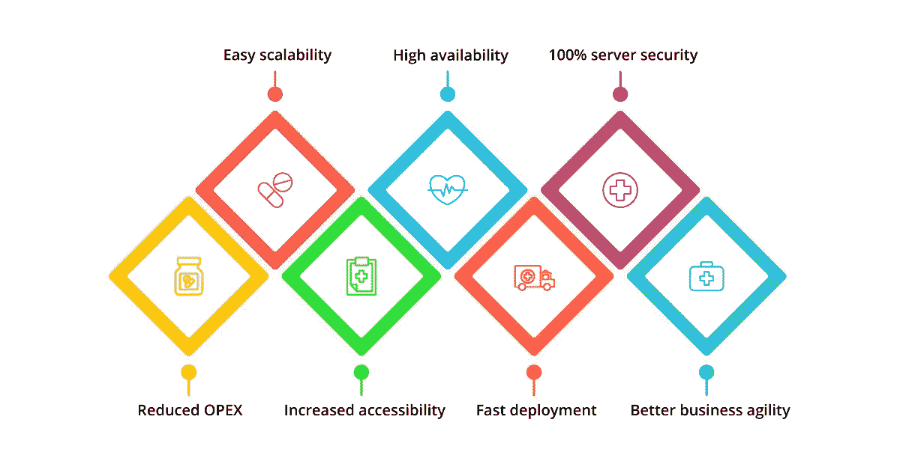
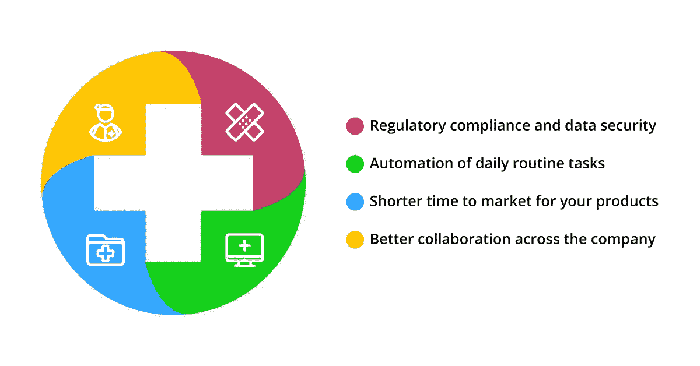

# 医疗保健行业的 DevOps:优势和案例研究

> 原文：<https://medium.com/hackernoon/devops-in-healthcare-industry-benefits-case-studies-7e6c19aa5942>

医疗保健行业拥有丰富的数据。然而，医疗保健公司必须遵守多项法规，并在处理数据时确保严格的安全性。这就是 DevOps 基础设施管理方法对医疗保健非常有益的原因。

在过去的几十年里，医疗保健行业已经发展成熟。从堆满了装着文件的纸板的架子上，it 部门开始利用最新的 IT 技术—专用数据中心和公共或私有云基础架构。然而，尽管是一项高尚的活动，医疗保健仍然是一门生意，必须盈利。因此，当所有的医疗保健市场参与者利用同一类型的硬件时，竞争优势必须在其他地方获得。知名专家预测 [2018 年将成为企业医疗保健行业大规模采用 DevOps 方法的一年](https://www.forrester.com/report/Predictions%202018%20Digital%20Will%20Disrupt%20Siloed%20Healthcare%20Ecosystems/-/E-RES139891#endnote10)，以应对不断增长的数据驱动、交互式和响应式护理需求。

正如亚马逊首席技术官沃纳·威格尔博士在 2018 年伦敦 [AWS 峰会](https://itsvit.com/blog/aws-summit-2018-london-highlights-takeaways/)的主题演讲中所说，AWS 提供的基础设施即服务组件到 2009 年已经基本成熟，目前正在进行微调。现在，任何行业的新竞争领域都不是他们使用的基础架构，而是他们使用云基础架构的效率。这正是 DevOps 运营方法的用武之地，因为它确实是部署亚马逊提供的下一个大东西——ML 优化的大数据解决方案的先决条件。

# 医疗保健的大数据分析和 DevOps 优势

利用[大数据分析](https://itsvit.com/blog/10-hot-trends-big-data-analytics-2017/)的要点是评估所有可用的数据量。这对于传统服务器来说很难，因为它们的设计无法充分处理 3 V 的大数据:收集的所有 v **a** 种数据类型，要处理的数据的绝对**量**以及传入数据的巨大**速度**。这特别适用于医疗保健行业，因为每个医疗保健业务公司都有大量数据可用，并且不是每个公司都可以最大限度地利用这些数据。

这一挑战的解决方案在于开发和部署机器学习(ML)模型来处理收集的数据。这些人工智能(AI)算法能够分析数据，以发现隐藏的模式，并通过深入的[数据可视化](https://itsvit.com/blog/big-data-visualization-principles/)将这些知识转化为可操作的见解。然而，灵活和弹性的基础设施仍然是部署[大数据可视化工具](https://itsvit.com/blog/top-4-popular-big-data-visualization-tools/)的主要要求，这些工具支持大数据的第四个 V——其价值，即做出明智的业务决策并获得切实利益的能力。

使用 [DevOps 即服务](https://itsvit.com/our-services/devops-service-provider/)允许执行彻底的 [IT 基础设施审计](https://itsvit.com/blog/news/increase-infrastructure-efficiency-3-months/)，评估现有的瓶颈和处理它们的可能方法。最终的解决方案通常涉及将基础设施从传统硬件迁移到公共云，如 AWS、Azure 或 GCP，同时创建持续集成/持续交付(CI/CD)管道，以实现自动化基础设施供应、管理和监控。这种方法有几个重要的好处:

*   **降低 OPEX** ，因为没有前期投资，如服务器购买和人员培训
*   **易于扩展**，意味着使用的资源可以根据需要进行扩展和缩减
*   **提高可访问性**，因为所有协作方访问云资源都很简单
*   **高可用性**，因为云架构确保应用和工作负载位于离您的客户最近的可用性区域
*   **快速部署**，多个 DevOps 工具可最大限度地减少根据您的需求调配和配置服务器所需的时间和精力
    100%的服务器安全性，云服务提供商提供业界最佳的黑客防护，云结构有助于缓解许多安全威胁
*   **更好的业务灵活性**，因此医疗保健公司可以更快地满足客户需求，缩短反馈实施周期，从而更快地为客户提供价值。

如您所见，选择 IT 基础架构管理的 DevOps 方法是成功实施数据分析的大数据方法的催化剂。唯一的问题是，DevOps 工作流对医疗保健意味着什么？

# DevOps 方法对医疗保健行业意味着什么？

虽然使用我们上面描述的 DevOps 服务的优势对于任何在云中运营的公司来说都是非常普遍的，但是医疗保健行业特有的一些基本 DevOps 优势却非常重要:

*   **法规遵从性和数据安全性**。在 2018 年 5 月 [GDPR](https://itsvit.com/blog/gdpr-can-ruin-trampoline-business/) 生效后，对客户个人数据的处理变得更加密切监控和监管。新法规的一些主要要求如下:将数据访问级别限制在最低要求，确保数据处理的透明度、数据存储的安全性以及客户要求随意删除其个人详细信息的权利，即所谓的“被遗忘权”。

[DevOps 文化](https://itsvit.com/blog/devops-culture-huge-step-mankind/)旨在为客户提供最大效率的价值。这意味着消除各种浪费，以及确保最佳性能和操作安全性。在软件交付方面，自动化单元测试确保了彻底的代码测试，从而将代码错误和后门访问应用程序的风险降至最低。

在运营方面，对基础设施性能的持续监控有助于确定系统运行的最佳方式，消除多个瓶颈和潜在的安全漏洞。就合规性而言，在设计和实施云基础设施时，法规要求很容易编纂和自动应用，从而大大降低了运营开销并简化了当局的合规性检查。

*   **日常例行任务的自动化。**许多流程和任务占用了大量宝贵的时间，这意味着 IT 部门无法集中精力改善正在使用的基础设施，而必须解决重复性的任务。这些任务可能包括配置检查、安装软件更新、执行数据库备份、监控工作负载、遵循基础架构健康检查清单等。这里的关键点是，这样的任务是重复的，并且它们大多不需要太多的技能。

使用一些[流行的 DevOps 工具](https://itsvit.com/blog/must-have-devops-tools-make-things-right-get-go/)，这些操作可以很容易地自动化。这种方法支持 CI/CD 管道，意味着大部分日常任务在后台完成，因此您的 IT 团队可以分配资源，为最终用户提供更多价值。

*   **缩短产品上市时间**。当云基础架构管理实现自动化时，软件交付生命周期变得更加可预测，产品更新的上市时间也大大缩短。
*   **公司内部更好的协作**。一旦 DevOps 工作流和实践建立起来，公司各部门之间的协作就变得容易多了。除了完成其他团队的各种请求的速度明显加快之外，您的 IT 运营团队在管理效率和与大数据分析团队的合作方面也会有更好的表现。

正如您所看到的，在医疗保健行业实施 IT 运营 DevOps 战略为优化基础设施性能和费用、缩短应用开发周期、改善员工协作以及最大限度地安全利用大数据提供了强大的杠杆。

# 在医疗保健行业实施 DevOps 方法的商业案例

虽然上面列出的好处相当可观，但列出真实的业务案例可以展示在企业医疗保健行业采用 DevOps 实践的全部影响。

## 案例 1:企业级医疗保健平台向 AWS 过渡

一家总部位于美国的跨国企业集团拥有超过 **80，000 名员工**和**300 亿美元**的年收入，通过他们自己的平台向他们的客户提供两个主要的 SaaS 应用程序。他们使用带有专用数据中心的传统基础架构来托管工作负载。当他们决定通过使用 ML 解决方案来交付数据分析以增强其工作流时，他们发现现有系统架构的功能并不足够。

他们决定聘请外部托管服务提供商来交付开发运维即服务。承包商对现有基础设施进行了全面分析，并从公司利益相关者处收集了大量关于现有实践、长期项目战略、目标和实现上述目标的里程碑的信息。预期成果是能够处理平台生成的大数据，以提高价值交付并进一步支持产品发展。

提议的解决方案是向 AWS 过渡，允许**将他们的 OPEX 削减 45** %,同时确保产品的高可用性、运营的完全法规合规性、集成新产品和功能的简单性，以及利用 AWS ML 和大数据分析服务和顶级安全功能。

试运行后，客户对可用的 AWS 安全功能和承包商选择编入系统的附加 AWS 市场产品完全满意。双方目前正在敲定工作范围和其他规范，一家大型医疗保健提供商向云的过渡即将开始。

## 案例 2:基础设施和医院绩效优化

另一家医疗保健提供商的 SaaS 解决方案集成了医院使用的各种 EHR 系统。通过预测资源需求和显著缩短患者的等待时间，集成有助于优化医院运营。该项目要求优化 SaaS 平台的运营，以便使用更少的资源支持更多的客户。

承包商已经将解决方案拆分为微服务，并使用 Docker 将其容器化。这实现了近乎实时的规划效率和无与伦比的应用程序伸缩速度。使用 Docker cgroup 内存和 CPU 使用配额，DevOps 服务提供商能够创建一个动态资源分区系统。

由于事先不知道客户的资源需求，因此能够共享备用资源可确保任务关键型系统的稳定运行。承包商还部署了智能监控和警报系统，使用 Zabbix 和 Prometheus + Grafana 进行监控，使用 ELK stack (ElasticSearch，Logstash，Kibana)进行记录。由于这个项目，客户**的用户池**增加了一倍，而没有在基础设施上花费太多。

## 案例 3:在 Azure 上为医疗保健提供商构建高效的基础设施

一家企业医疗保健提供商拥有一个通过 web 门户和移动应用程序交付医疗保健服务的框架。他们的目标是提高基础架构效率，并决定迁移到 Microsoft Azure 以确保数据的灵活性和可用性，从而有助于实现记录的 24/7 可用性和支持 360 度患者视图的**。**

**利用 Azure 模块化资源允许在几分钟内配置前端调整，而不改变后端基础设施和中断正常的应用程序操作。该公司从这种移动优先的医疗保健软件交付方式中受益匪浅。承包商引入的 CI/CD 管道可以缩短和简化软件开发过程，大大缩短新产品的上市时间。**

# **关于在医疗保健行业使用 DevOps 方法的最终想法**

**如您所见，在医疗保健行业中利用 DevOps 是不可避免且非常明智的发展方式。根据 Forrester 的调查， [2018 年是医疗保健行业的开发运维年](https://go.forrester.com/blogs/2018-the-year-of-enterprise-devops/)，因为**超过 50%的企业医疗保健组织**将实施其开发运维计划。**

**问题是——你的公司在其中吗？如果你想跟上步伐并保持竞争力，就应该这样！要在您的医疗保健业务中实施 DevOps 战略，您唯一需要做的就是联系一家[声誉良好的托管服务提供商](https://clutch.co/it-services/msp)，并从使用他们的 DevOps 服务中获益！**

***原载于 2018 年 9 月 17 日*[*itsvit.com*](https://itsvit.com/blog/devops-healthcare-benefits-case-studies/)*。***