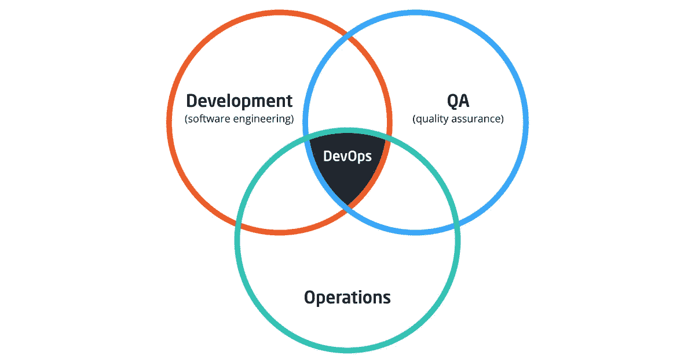
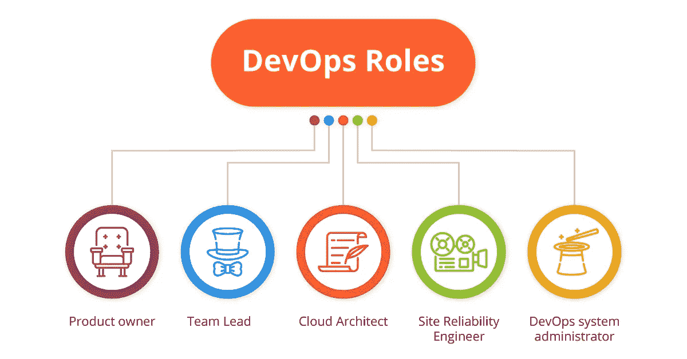

# DevOps 团队角色和职责

> 原文：<https://medium.com/hackernoon/devops-team-roles-and-responsibilities-6571cfb56843>

一个好的 DevOps 团队是开发者和 Ops 工程师的混合体，他们可以做彼此的工作，不是吗？好吧，这与现实相去甚远，今天我们向您展示真实的 DevOps 团队角色。

早在 2009 年，当 [DevOps 文化](https://itsvit.com/blog/devops-culture-huge-step-mankind/)刚刚在[兴起的时候，它的创始人认为它是开发者、QA 工程师和运营工程师的混合体。](https://en.wikipedia.org/wiki/DevOps#Definitions_and_history)

早期提出的 DevOps 实践的定义是围绕着 DevOps 团队对系统所做的更改，并没有指定推荐的团队组成、个人成员角色或职责。事情是这样的:

> ***DevOps 是一套实践，旨在缩短提交系统变更和将变更投入正常生产之间的时间，同时确保高质量。维基百科***

然而，上图和这个定义的松散导致了一个可悲的事实。许多不了解 DevOps 工作流现实的人认为，该运动的目标是将开发、QA 和 Ops 部门合并成一个团队，分享他们的角色，教他们使用彼此的工具，让 DevOps 的魔力发挥作用。太多的公司尝试过这种方式，但都失败了。

# DevOps 给软件交付带来的调整

事实上，真正的 DevOps 团队是由开发人员、QA 和运营工程师组成的。重点是，DevOps 是一种文化，一套实践，一种构建工作流以支持这些部门之间协作的方法——但差异仍然存在。

DevOps 计划试图解决的问题是，对于开发人员和 QA 工程师来说，一旦应用程序或新功能代码成功通过测试，项目就完成了。然后，他们真的把它扔到了墙上，从那时起，将它投入生产并保持其性能就成了运营部门的责任和难题。

然而，将开发人员与运营工程师混合在一起并不能解决这个问题。解决方案是改变软件交付的方法，支持 3 个核心开发运维价值观:

1.  **基础设施即代码(IaC)** —服务器环境在声明性清单中描述，以代码形式存储，可由任何团队成员进行调整并多次重用，以提供测试或构建代码所需的基础设施，以及在生产中维护应用程序。
2.  **持续集成(CI)** —来自项目涉众和最终用户的反馈以规格和功能需求的形式不断地集成到产品中，用于软件开发的下一次迭代。
3.  **连续交付(CD)** —自动代码交付管道已经到位，以确保自动提供所有所需的资源，并在代码通过测试后立即投入生产，无需 DevOps 工程师的额外手动操作，也不会中断最终用户体验。由于使用滚动更新和其他 DevOps 实践，实现“无服务停机”是可行的。

正如您所看到的，这种方法也是以过程为中心，而不是以特定的 DevOps 角色为中心。运营工程师确实编写代码，但这是基础架构供应代码，而不是应用程序代码。开发人员确实是 QA 专家——但只是因为他们在编写应用程序代码之前编写自动化单元测试。这样，真正的 DevOps 与各种专家的组合有很大不同。

# 真实的 DevOps 团队构成

明确地说，DevOps 工程师应该专注于一件事，而且只专注于一件事:云基础设施管理。主要区别在于，他们遵循“**你构建它——你运行它**”的范式，并且他们必须从软件交付流程的最开始就评估在生产中运行应用程序的可能瓶颈。

这就是为什么他们促进了“ [**向左**](https://itsvit.com/blog/agile-vs-devops-merging-fail-fast-agile-with-well-planned-devops/) ”的方法，在构建新的软件版本之前，在将每一批新代码推送到回购之后，进行各种测试。DevOps 专家在应用程序创建之前就考虑了应用程序的运行方式，他们编写脚本来创建 CI/CD 管道，以保证产品更快的上市时间和积极的最终用户体验。

为确保此方法可行，必须有以下 DevOps 角色:

1.  **产品负责人** —团队和客户之间的交集，了解应用应该如何运行以向用户提供价值的人，以及需要什么样的云基础设施来支持生产中的应用。根据项目需求和其他因素，这可以是客户方的人员，也可以是外包开发团队的人员。
2.  **团队领导** —这是最有经验的团队成员的职位，他们可以分析每个项目所需的技能，并在整个团队中委派 DevOps 职责。
3.  **云架构师** —在构建云基础设施方面拥有丰富实践经验的人，了解他们必须包括什么来支持生产中的各种类型的应用和服务。
4.  **站点可靠性工程师(SRE)**—devo PS 专家专注于确保大规模系统中高负载应用的稳定性能和不间断可用性。
5.  **DevOps 系统管理员**—DevOps 的主要角色之一，因为云监控占据了所有 devo PS 任务和时间的一半以上。每个团队成员都必须能够处理支持任务，然而这些是支持管理员的面包和黄油。

这是真实的 DevOps 团队组成，允许达到所需的结果并成功推出产品。根据 Clutch 的调查，作为全球[十大托管服务提供商之一](https://clutch.co/it-services/msp)，IT Svit 根据该方案组成了每个项目的团队。

# 关于 DevOps 角色和职责的最终想法

通过 6 年多的开发运维即服务实践，我们积累了丰富的专业知识。我们的产品所有者知道客户实际上需要利用什么来获得他们想要的产品；IT Svit 团队领导确保项目在预算内按时完成；我们的云架构师可以在 [AWS 或 Azure](https://itsvit.com/blog/aws-vs-ms-azure-cloud-provider-choose/) 、GCP 或 DigitalOcean 上设计弹性和容错的云基础设施； [IT Svit](https://itsvit.com/contacts/) 站点可靠性工程师拥有在大规模环境中维护大量工作负载的丰富经验，我们的支持工程师可以使用多种云监控解决方案来检测和预防客户基础架构的任何问题。