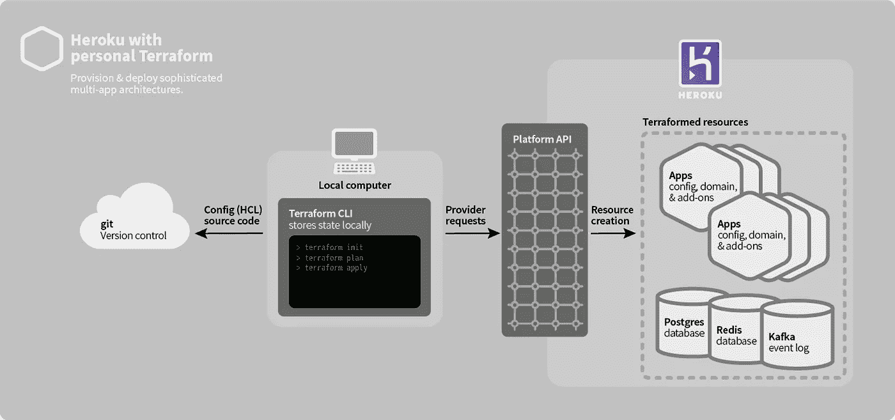
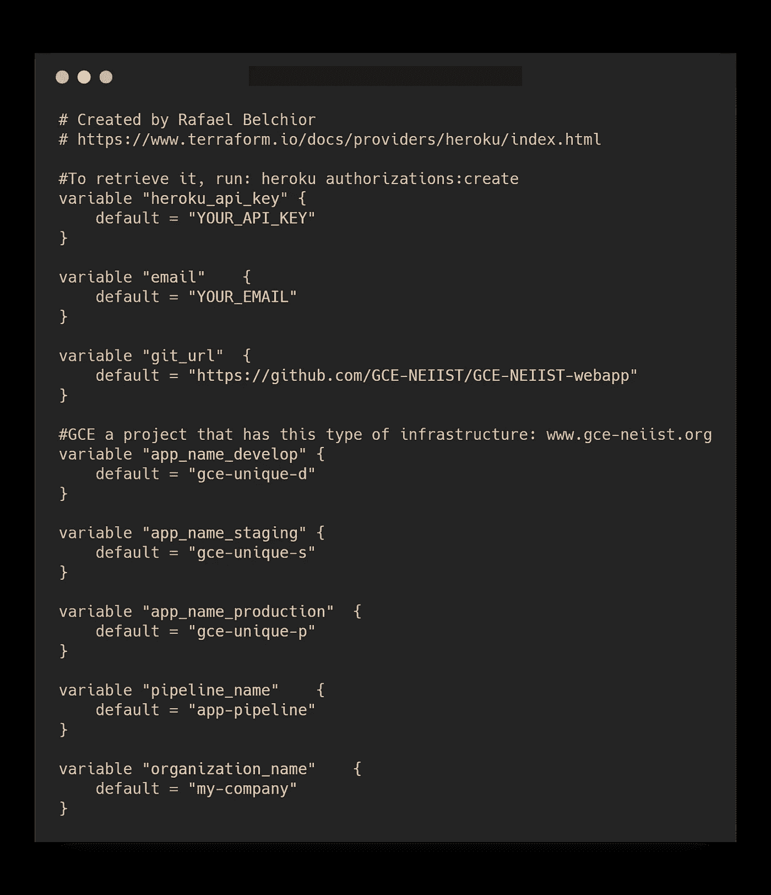
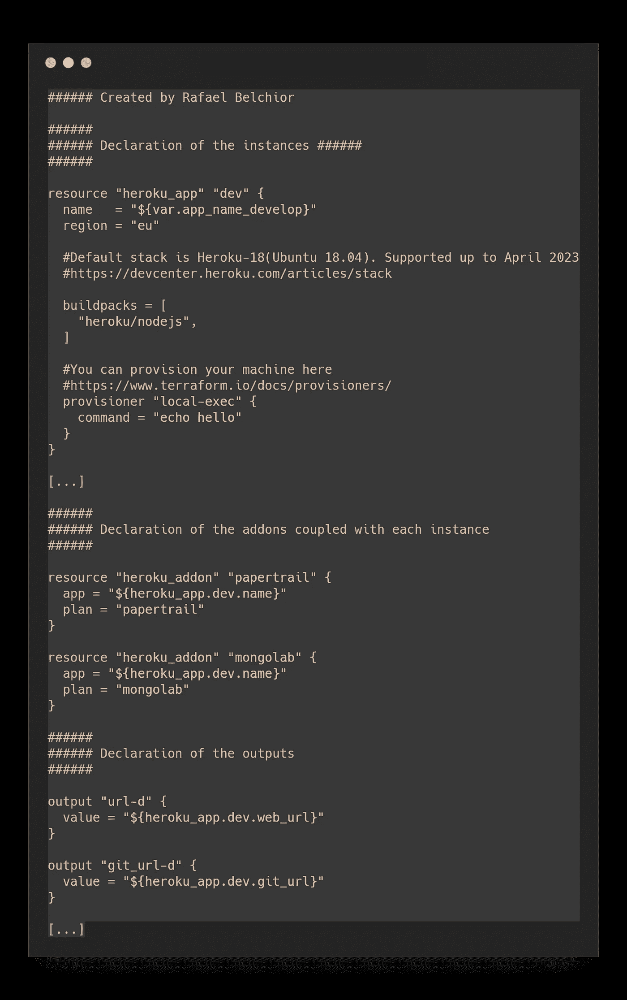
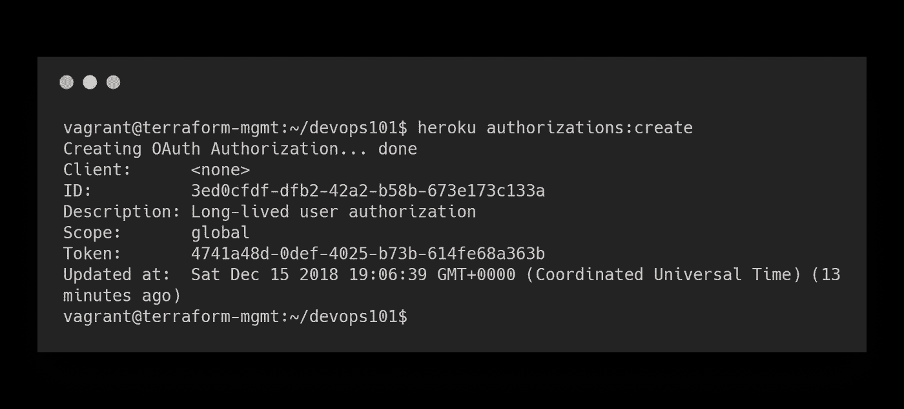
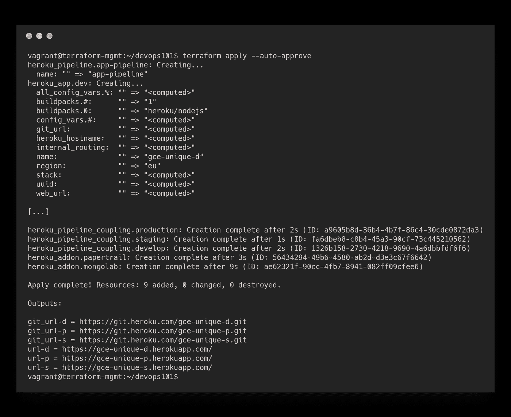
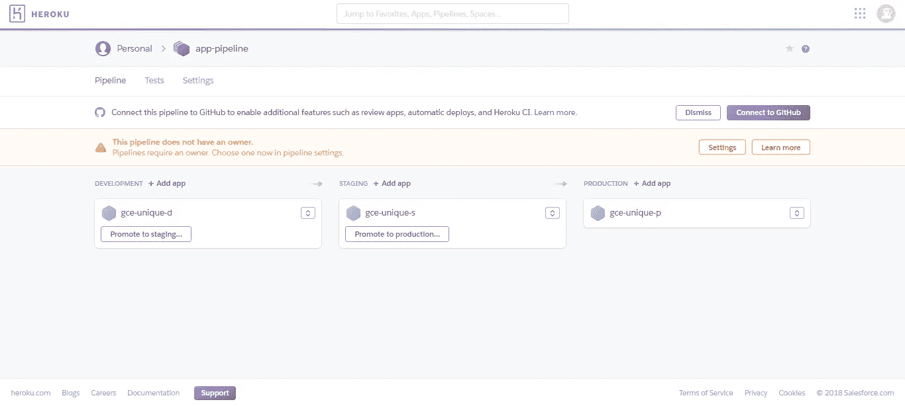

# DevOps101:如何通过 7 个简单的步骤为你的初创企业提供基础设施

> 原文：<https://medium.com/hackernoon/devops101-how-to-provide-infrastructure-to-your-startup-in-6-easy-steps-563b53e77281>

我目前是一名教师助理👨‍💻 *@* [*Técnico 葡京*](https://tecnico.ulisboa.pt/en/) *，我正与*[*Rui Cruz*](https://fenix.tecnico.ulisboa.pt/homepage/ist40132)博士教授密切合作👨‍🏫*at*[*it 基础设施管理与行政*](https://fenix.tecnico.ulisboa.pt/disciplinas/AGISIT/2018-2019/1-semestre) 🖥 *、a* 大师级课程 *@* [*Técnico 葡京*](https://tecnico.ulisboa.pt/en/) 。

# 为什么？

作为一名教授，我的经历开阔了我的思维，让我知道如何使用某些工具来实现我作为一名学生想要达到的目标。作为一名学生，我负责一个学生小组， [GCE](http://www.gce-neiist.org) 。我们的项目有一些问题:从一个想法的概念化到它的实际交付是非常困难和耗时的。

一个良好的自动化基础设施是我们问题的答案。它可以节省大量的时间和精力，从而更快地交付更好的产品。这种技术是为那些想尽可能快地向客户交付尽可能多的东西的人准备的。

# 怎么会？

[我们的应用运行均值栈](/gce-neiist/the-mean-stack-a-practical-example-gce-thesis-ca50af9f1ea8)。如果你需要一些灵感，请随意查看这个项目的资源库。可以通过在 Heroku 中创建如下管道来实现:

*   我们针对三种不同的环境(开发、试运行和生产)开发了三种不同的应用。
*   所有的应用程序都安装了 MongoLab 和一个管理日志的工具(Papertrail)。
*   每个应用程序都与我们的库[的一个分支](https://github.com/GCE-NEIIST/GCE-NEIIST-webapp)相链接

这提供了极大的灵活性。工作流程可能是这样的:

1.  开发者 joo**创建了一个分支**，致力于实现公司和学生之间的牵线搭桥——分支“牵线搭桥”。
2.  乔整晚都在编码。
3.  joo 向分支“开发”发出**拉取请求。当发出请求时，会运行一组测试(到目前为止我们还没有实现)。**
4.  产品经理 Inês 检查拉动式需求。测试通过，她看到一切都很好。她**接受拉取请求**。
5.  到目前为止，Heroku 正在自动构建开发应用程序。
6.  整个团队可以在测试环境中看到**产品的新版本并与之互动。**
7.  当分支“develop”上有足够的功能时，可以向分支“staging”(具有类似于生产的环境)发出一个**拉请求，然后向分支“master”**(生产)发出请求。

在一天结束时，你节省了许多宝贵的时间，这在一个学期中非常有代表性。

# 好吧，我相信。我们开始行动吧！

我们的想法是通过 Terraform 在 Heroku 上配置一台虚拟机作为我们的基础设施。我们将使用[流浪者](https://www.vagrantup.com/)来管理这个虚拟机。

[如果你想知道 Terraform 是如何工作的，可以查看本教程](https://hackernoon.com/terraform-openstack-ansible-d680ea466e22)(直到“要求”，1 分钟读完)。没有虚拟机也可以达到同样的目的。在这种情况下，直接跳到步骤 2。我们要做的事被很好地浓缩在下面的方案中:



[https://devcenter.heroku.com/articles/using-terraform-with-heroku](https://devcenter.heroku.com/articles/using-terraform-with-heroku)

# 步骤 1:安装流浪者

在本文中，我一步一步地展示了如何配置 i t。

# 步骤 2:启动虚拟机

现在，打开您的控制台并运行:

```
$ vagrant up --provision && vagrant ssh
```

虚拟机正在启动，安装所有必需的依赖项。这可能需要一段时间。

稍等一下。完成了。很好。向你致敬👍

# 步骤 3:获取支持文件

[派生这个包含支持文件](https://github.com/RafaelAPB/devops101-terraform_heroku)的库，然后将其克隆到您的计算机上。将它放在正在与您的客户机同步的文件夹中。

# 步骤 4:分析地形文件

现在，替换文件 terraform-vars.tfvars 上的 GitHub 存储库和 Heroku 凭证。



注意 terraform-apps.tf 上正在做的事情。



# 步骤 5:通过 Cli 在 Heroku 中进行身份验证

要进行身份验证，请运行:

```
$ heroku login --interactive
```

输入您的凭证并登录。接下来，我们需要为 Terraform 生成一个访问令牌，以便能够与 Heroku 通信。运行:

```
$ heroku authorizations:create
```

这将返回如下内容:



转到 terraform-vars.tf，粘贴在字段“heroku_api_key”中获得的令牌。

# 步骤 6:初始化 Terraform

通过运行:

```
$ terraform init
```

# 步骤 7:部署基础设施

要了解将要部署的内容，请运行:

```
$ terraform plan
```

如果一切正常，运行:

```
$ terraform apply --auto-aprove
```



The output should be similar to this

*祝贺您，您的基础设施已经启动！*💯

在 Heroku 的仪表板上仔细检查一下:



That looks fine. Don’t forget to add yourself as the owner of the pipeline

我建议您通过选择 GitHub 存储库并将其与分支相关联，来配置每个应用程序上的部署方法。例如，我们可以将“开发”分支关联到开发应用程序。当提交发生时，它将被自动部署。

# 破坏基础设施

使用两个命令，您将结束实验并关闭虚拟机。这些是:

```
$ terraform destroy -auto-approve
$ exit
$ vagrant halt
```

如果要销毁您创建的虚拟机，请运行:

```
$ vagrant destroy --auto-approve
```

*祝贺你！*💯*你到达终点了！* [🦄](https://emojipedia.org/unicorn-face/)

# 后续步骤:

*对于 MVP 来说，这是一个非常好的基础设施，尽管从长远来看可能不是最好的。接下来，我将谈论 Kubernetes，以及我们如何提供类似的基础设施，但更具可扩展性。敬请期待*😀

创业[🔥](https://emojipedia.org/fire/)

[](/swlh/my-journey-as-a-computer-science-student-on-medium-d039962e25a2) [## 我作为计算机科学学生在媒体上的旅程

### 以及一些如何开始写作的小技巧。

medium.com](/swlh/my-journey-as-a-computer-science-student-on-medium-d039962e25a2) [](https://blog.startuppulse.net/top-8-lessons-ive-learned-in-european-innovation-academy-2017-50eeb82d74b4) [## 我在 2017 年欧洲创新学院学到的前 8 课

### 想象你看到了在每个层面提升自己的机会。你会接受吗？

blog.startuppulse.net](https://blog.startuppulse.net/top-8-lessons-ive-learned-in-european-innovation-academy-2017-50eeb82d74b4)