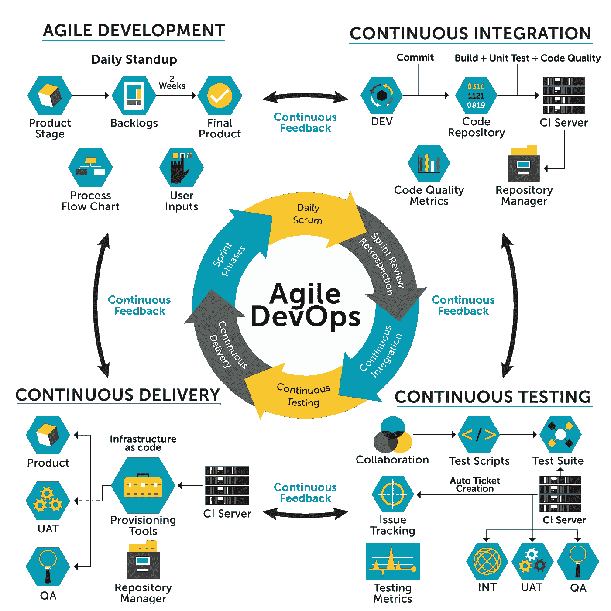
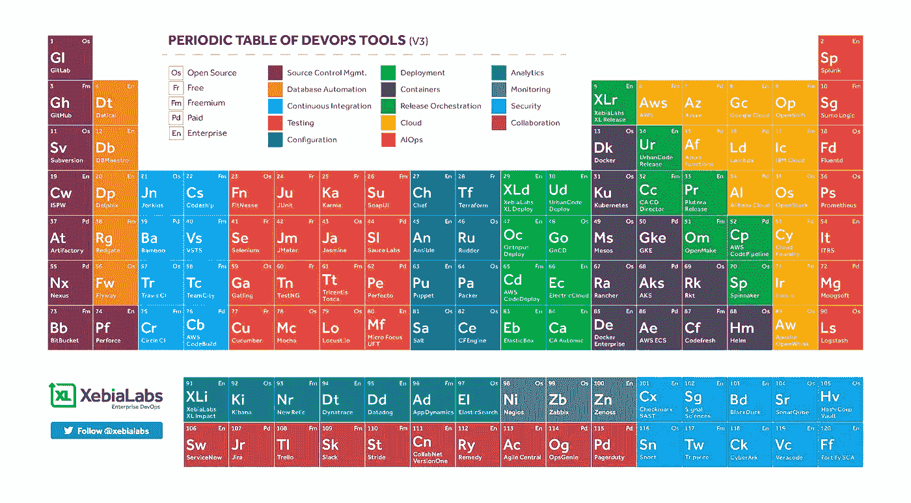

# devo PS 101——基础设施 as 代码，带流浪者(灯堆栈)

> 原文：<https://medium.com/hackernoon/devops101-itinfrastructure-54337d6a148b>

你好！这篇文章旨在提供一个高层次的，简单的和实用的解释，说明如何使用作为代码工具的基础设施。我们将建立一个简单的 IT 场景。

*我目前是一名教师助理*👨‍💻 *@* [*Técnico 葡京*](https://tecnico.ulisboa.pt/en/) *，我正与*[*Rui Cruz*](https://fenix.tecnico.ulisboa.pt/homepage/ist40132)博士教授密切合作👨‍🏫*参加* [*It 基础设施管理与行政*](https://fenix.tecnico.ulisboa.pt/disciplinas/AGISIT/2018-2019/1-semestre) 🖥 *，一门*硕士水平的课程“信息系统与计算机工程硕士学位”和“电信与信息工程硕士学位”*@*[*técnico Lisboa*](https://tecnico.ulisboa.pt/en/)*。*

在我的上一篇 DevOps101 文章中，我们引入了 vagger 并安装了设置环境所需的工具。现在，我们可以更深入一点，深入到代码为 **(IaC)的 [**基础设施。**这有什么关系？这与 DevOps 有什么关系？花些时间学习这些概念和工具有什么实实在在的好处？](https://en.wikipedia.org/wiki/Infrastructure_as_Code)**

根据[2017 年 DevOps 国家报告](https://www.ipexpoeurope.com/content/download/10069/143970/file/2017-state-of-devops-report.pdf)，在 DevOps 团队工作的人的百分比每年都在增加。为什么？公司把赌注押在自动化上，因为这对组织来说是一个巨大的福利。正如 DevOps 报告中所述，随着更多工作实现自动化，高绩效员工可以解放他们的技术人员，让他们从事创新工作，为他们的组织增加真正的价值。换句话说，你节省了时间、金钱和潜在的麻烦。如果您对自动化感兴趣，请考虑敏捷开发运维:



[https://surittec.com.br/devops.html](https://surittec.com.br/devops.html)

它将敏捷世界的精华与测试、交付和集成的良好实践相结合。这为应用精益方法提供了一种非常有效的方式，我在我的文章[中谈到了欧洲创新学院](https://blog.startuppulse.net/top-8-lessons-ive-learned-in-european-innovation-academy-2017-50eeb82d74b4)。

有很多工具可以用来实现您的敏捷开发运维策略。以下是一些例子:



By XebialLabs

虽然 vagger 不是将基础设施实践实现为代码的最强大的工具，但它是被选中的一个，因为它是一个简单的工具。

# 理论够了，动手吧！

女士们先生们，让我们开始工作吧。

或者目标是启动一个简单的基础设施，由 2 台运行[灯栈](https://www.digitalocean.com/community/tags/lamp-stack?type=tutorials)的 web 服务器和一台客户机组成。正如您在上一篇文章中所记得的，我们应该定义一个[浮动文件](https://www.vagrantup.com/docs/vagrantfile/)，它是一个声明性文件，包含启动哪些机器以及如何配置这些机器的指令。

如果你不想输入代码，你可以分叉[我的 Github 库](https://github.com/RafaelAPB/DevOps101-Simple-Infrastructure)并从那里开始执行步骤。

# 安装

出于演示的目的，我们将使用一台 [ubuntu/trusty64 机器](https://app.vagrantup.com/ubuntu/boxes/trusty64)。下载机器并将其添加到机器列表中，包括:

创建一个名为“simple infrastructure”的文件夹，然后添加我们将要使用的框:

```
vagrant box add ubuntu/trusty64
```

创建一个名为“流浪者文件”(没有扩展名)的文件。代码的解释在评论中:

```
Vagrant.configure("2") do |config| # Always use Vagrant's default insecure key
    config.ssh.insert_key = false
  # To avoid/allow install and uninstall of VBoxGuessAdditions.
    config.vbguest.auto_update = false
 end
```

客户端机器可以这样定义:

```
config.vm.define "client" do |client_config| #We are attributing an "OS" to our machine
      client_config.vm.box = "ubuntu/trusty64"

      #The hostname will be client 
      client_config.vm.hostname = "client"

      #Attributing an IP to our machine    
      client_config.vm.network "private_network", ip: "192.168.56.21" #Using VirtualBox to launch the machines
      client_config.vm.provider "virtualbox" do |vb|
        vb.name = "client"
        #About opts: [https://www.virtualbox.org/manual/ch08.html](https://www.virtualbox.org/manual/ch08.html)       
        opts = ["modifyvm", :id, "--natdnshostresolver1", "on"]
        vb.customize opts
        vb.memory = 256

       #You can also define the number of cpus: vb.cpus = x
       end # of vb
    end # of client_config
```

然后我们可以添加 web 服务器:

```
config.vm.define "web-server-1" do |web_config|
      #Operating System
      web_config.vm.box = "ubuntu/trusty64"
      web_config.vm.hostname = "web-server-1"
      #How the Host sees the Box
      web_config.vm.network "private_network", ip: "192.168.56.31"
      #Port 80 is the default port for Apache, port that listens to clients
      #Port 8080 is typically used for a personally hosted web server
      web_config.vm.network "forwarded_port", guest: 80, host: "8081" 

       #Synchronizing our html folder with apache's www/html folder web_config.vm.synced_folder ".", "/var/www/html", :nfs      => {:mount_options => ["dmode=777","fmode=666"]}
      web_config.vm.provider "virtualbox" do |vb|
        vb.name = "web-server-1"
        opts = ["modifyvm", :id, "--natdnshostresolver1", "on"]
        vb.customize opts
        vb.memory = 256
        #vb.cpus = 4
      end # of vb
      web_config.vm.provision "shell", path: "bootstrap_web.sh"
    end # of web_config
```

如果我们想要启动两个 web 服务器，我们不应该重复代码，因为只有几个参数需要更改:虚拟机(vm)的名称、主机名、ip、主机端口和虚拟机箱名称。我们将遵循[流浪者](https://www.vagrantup.com/docs/vagrantfile/tips.html)推荐的一些好的实践，比如使用一个循环来定义类似的机器:

```
(1..2).each do |i|
    config.vm.define "web-server-#{i}" do |web_config|
      #Operating System
      web_config.vm.box = "ubuntu/trusty64"
      web_config.vm.hostname = "web-server-#{i}"
      #How the Host sees the Box
      web_config.vm.network "private_network", ip: "192.168.56.3#{i}"
      #Port 80 is the default port for Apache, port that listens to clients
      #Port 8080 is typically used for a personally hosted web server
      web_config.vm.network "forwarded_port", guest: 80, host: "808#{i}"#Synchronizing our html folder with apache's www/html folderweb_config.vm.synced_folder ".", "/var/www/html", :nfs      => {:mount_options => ["dmode=777","fmode=666"]} web_config.vm.provider "virtualbox" do |vb|
        vb.name = "web-server-#{i}"
        opts = ["modifyvm", :id, "--natdnshostresolver1", "on"]
        vb.customize opts
        vb.memory = 256
        #vb.cpus = 4
      end # of vb
      web_config.vm.provision "shell", path: "bootstrap_web.sh"
    end # of web_config
  end # of loop
```

为了配置我们的机器，将这个 bash 脚本下载到您的文件夹:[https://paste.ee/p/G7uiA](https://paste.ee/p/G7uiA)f

这个脚本将安装 LAMP 机器所需的所有依赖项。我们告诉过流浪者将/var/www 与包含流浪者文件的文件夹同步。创建一个名为 **index** 的 html 文件。让它空着。

要查看正在启动的服务器和供应的输出，请运行:

```
$ vagrant up --provision
```

现在您可以通过“**流浪 ssh 名称”**登录任何机器。例如，通过键入以下内容输入 web-server-1

```
$ vagrant shh web-server-1
```

现在，通过 ping 其他机器和您的主机来检查机器是否正在运行:

```
vagrant@web-server-1:$ ping 192.168.56.32...
vagrant@web-server-1:$ ping **YOUR_HOST_MACHINE_IP**...
```

您可以通过键入以下内容来获取有关网络的更多信息:

```
vagrant@web-server-1:$ ip addr show
```

现在您知道您的机器正在运行和通信。当我们转发我们的 web 服务器端口时，我们可以通过我们的 web 浏览器在地址:localhost: 8081 和 localhost: 8082 中访问机器。

每一个都对应一个不同的网络服务器，它的页面与 index.html**的文件**相关联。如果您更改文件，当您刷新页面时，您会注意到浏览器中的变化。

要完成我们的实验，请运行:

```
$ vagrant halt
```

# 包扎

在本文中，我们简要介绍了 IaC 并介绍了敏捷开发运维。我们设置并启动了一个由两个 LAMP web 服务器和一台客户机组成的简单基础设施。

*祝贺你！*💯您已到达终点！ [🦄](https://emojipedia.org/unicorn-face/)

# 后续步骤:

## 干杯，继续摇摆💪如果你喜欢这篇文章，请订阅我的邮件列表。
此处👇。这对我意义重大。

[](http://eepurl.com/go_uUD)