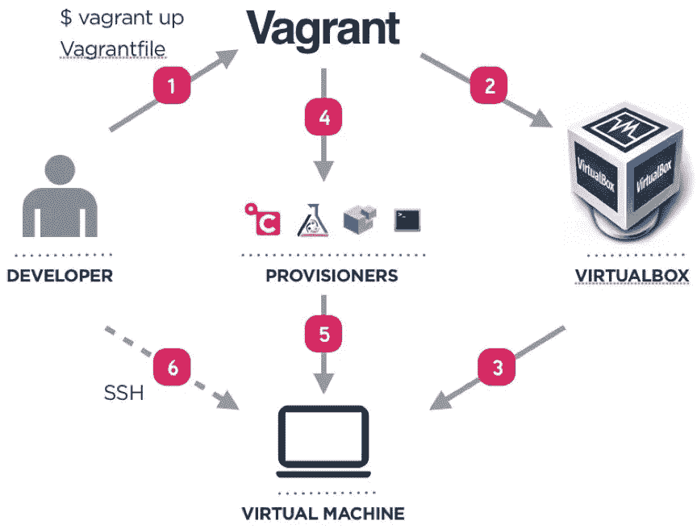

# DevOps101 —改进您的工作流程！流浪的第一步

> 原文：<https://medium.com/hackernoon/devops101-vagrant-6737c8c29904>

*如果你在这里，对* ***DevOps*** *，* ***连续流程*** *，* ***基础设施*** *等话题感兴趣，至少我希望如此！这篇文章旨在提供一个高层次，简单和实用的解释，说明什么是流浪，以及你如何使用它来改善你的工作流程。*

我目前是一名教师助理👨‍💻 *@* [*Técnico 葡京*](https://tecnico.ulisboa.pt/en/) *，与我密切合作的还有*[*Rui Cruz 博士教授*](https://fenix.tecnico.ulisboa.pt/homepage/ist40132) 👨‍🏫*参加* [*It 基础设施管理与行政*](https://fenix.tecnico.ulisboa.pt/disciplinas/AGISIT/2018-2019/1-semestre) 🖥 *，一门*硕士水平课程的“信息系统与计算机工程硕士学位”和“电信与信息工程硕士学位”*@*[*técnico Lisboa*](https://tecnico.ulisboa.pt/en/)。

*[*芮克鲁兹*](https://fenix.tecnico.ulisboa.pt/homepage/ist40132) *博士对本文的贡献是巨大的，他是主要负责人*主要负责“**设置**”和“**实验**”部分。*

# *那么，什么是流浪？*

**

*用一种非常简单的方式来说，流浪者是一个用于构建和发布虚拟环境的开源项目。实质上，这意味着它允许您管理和共享预配置的虚拟机。*

***用例 1:专注于你的任务**🔭*

*作为一名开发人员，你是否已经花了太多时间来设置你的环境？*

*流浪者使管理虚拟盒子变得非常容易。已经安装了所有软件和依赖项的一体化虚拟机是让开发人员专注于他们的任务的好方法。人们只需要创建一个最优的虚拟盒子，然后就可以分发给合作者。不需要设置环境，因为它应该已经设置好了！*

*简而言之，你只需要运行机器，专注于手头的任务。*

***用例 2:改进工作流程**📈*

*作为一名开发人员，您是否已经花费了太多时间来修复发生在生产环境中而不是开发环境中的 bug？*

*首先，一个人应该遵循良好的工作流程实践，例如由[这篇有见地的文章](https://dltj.org/article/software-development-practice/)和[彼得·默里](https://medium.com/u/3568a51d78d8?source=post_page-----6737c8c29904--------------------------------)所引用的那些。其次，我们可以在自动化过程中迈出下一步:在开发和生产(以及中间产品)中拥有完全相同的环境。如果做到了这一点，生产应用程序因开发环境中未发现的错误而崩溃的可能性就非常小，因为环境是相同的。*

*简而言之，您可以在不担心来自依赖项和已安装软件的错误的情况下进行开发。*

***用例 3:分销** ⭐️*

*你是否已经花了一些时间来编写关于如何设置项目的大量文档？*

*有时这可能会令人沮丧，因为可能有许多方面需要考虑:环境变量、软件和特定的配置。如果您需要一个预配置的环境，这个工具将帮助您。*

*通过在虚拟机上打包和分发你需要的一切，你完成了别人不需要(无用地)复制的工作。*

# *它是如何工作的？*

*根据[流浪汉](http://vagrant.org):*

> *由 vagger 管理的环境可以在 VirtualBox 或 VMware 等本地虚拟化平台上运行，也可以通过 AWS 或 OpenStack 在云中运行，或者在 Docker 等容器中运行。*
> 
> *vagger 提供了创建和管理完整的可移植开发环境的框架和配置格式。这些开发环境可以存在于您的计算机上或云中，并且可以在 Windows、Mac OS X 和 Linux 之间移植。*

*简而言之，vagger 管理环境，并使用例如 VirtualBox 来提供(启动)机器。机器启动后运行的脚本可以通过几个供应器进行配置，如 [shell](https://en.wikipedia.org/wiki/Bash_(Unix_shell)) 、 [Terraform](https://www.terraform.io/) 、 [Chef](https://docs.chef.io/provisioning.html) 和 [Ansible](https://www.ansible.com/) 。置备程序旨在利用资源调配(安装依赖项)、自动化、配置管理和流程编排。这符合 DevOps 的思维和工作方式。*

*下面的方案有助于我们形象化地了解流浪者是如何工作的，以及它是如何工作的。*

**

*Source: [https://www.softqubes.com/blog/introduction-of-vagrant-development/](https://www.softqubes.com/blog/introduction-of-vagrant-development/)*

1.  *用户创建一个流浪者文件，这是一个声明性文件(用 Ruby 编写),描述所需的机器类型，以及如何配置和供应该机器。用户使用 travel 来执行 travel file。*
2.  *流浪者使用 VirtualBox 作为提供者。它也可以使用其他提供者。*
3.  *机器启动了。*
4.  *流浪者调用一个 provisioner 来配置机器。*
5.  *置备程序提供机器。例如，它可以是一个简单的 shell 脚本或 Ansible。*
6.  *用户可以通过 ssh 访问部署的机器。*

*就是这样。您可以使用几个命令来管理和启动虚拟机。它的复杂程度和你想要的一样多。*

# *理论够了，动手吧！*

*女士们先生们，让我们开始工作吧。*

*出于演示目的，我将按照 Rui Cruz 教授的 [*It 基础架构管理*](https://fenix.tecnico.ulisboa.pt/disciplinas/AGISIT/2018-2019/1-semestre) *课程的第一个实验指南进行操作。*首先，我们需要安装运行 vanguard 所需的工具。之后，我们将推出一款 [Mininet](http://mininet.org/) 机器。Mininet 允许我们创建虚拟网络，运行真正的内核和应用程序代码。*

# *安装*

*在本节中，我们将执行 Windows、Linux 和 mac OS 的设置。*

***窗户***

*微软 Windows 推荐的包管理器是 [Chocolatey](https://chocolatey.org/) 。*

*要安装 Chocolatey，请打开特权(即管理)Windows 命令提示符(cmd.exe)并执行:*

```
*@"%SystemRoot%\System32\WindowsPowerShell\v1.0\powershell.exe" -NoProfile -InputFormat None -ExecutionPolicy Bypass -Command "iex ((New-Object System.Net.WebClient).DownloadString('https://chocolatey.org/install.ps1'))" && SET "PATH=%PATH%;%ALLUSERSPROFILE%\chocolatey\bin"*
```

*现在，通过 Chocolatey 安装以下依赖项:*

```
*C:\> choco install wgetC:\> choco install git -params “ /GitAndUnixToolsOnPath “C:\> choco install virtualboxC:\> choco install vagrantC:\> choco install xming*
```

*确保 git 可执行文件路径在[路径环境变量](https://java.com/en/download/help/path.xml)上。*

*为了让 xming(一个 XWindows 服务器)工作，我们稍后会用到它，添加名为 **DISPLAY** 的环境变量，其值为 **localhost:0.0** 。*

***苹果 macOS***

*推荐 macOS 的包管理器是 Homebrew，类似于 Linux 的 aptget 或者 yum [http://brew.sh.](http://brew.sh.)*

*如果您没有安装 XCode，请打开“终端”,在 shell 提示符下键入以下内容:*

```
*:~$ xcode -select -- install*
```

*要安装 [Homebrew](http://brew.sh) ，在 shell 提示符下粘贴脚本(从 ruby 调用开始)并按 ENTER:*

```
*:~$ /usr/bin/ ruby -e "$(curl -fsSL https://raw.githubusercontent.com/Homebrew/install/master/install)"*
```

*完成后，shell 提示符会提示安装成功，并要求您运行 brew doctor。按照它的建议去做:*

```
*:~$ brew doctor*
```

*这将使家酿检查您的系统，并确保一切都设置正确。*

```
*:~$ brew install wget:~$ brew install git:~$ brew cask install virtualbox:~$ brew cask install vagrant:~$ brew cask install xquartz*
```

***Linux***

*要安装其他软件包，请打开一个终端并发出以下命令。*

```
*:~$ sudo apt -get install git*
```

*请注意，对于 Ubuntu 的最新发行版，需要小心安装 VirtualBox，因为软件包架构必须与 Linux 内核架构相匹配。此外，Ubuntu 中的 VirtualBox 包在内存受限的环境中运行时可能会出现一些问题。*

*为此，您需要确保您拥有足够的内核架构参考资料。首先编辑源代码列表，发出以下命令:*

```
*:~$ sudo nano/etc/apt/sources.list*
```

*将下面一行添加到列表中(以 16.04“Xenial”内核为例):*

```
*deb http://download.virtualbox.org/virtualbox/debian xenial contrib*
```

*根据你的分布，把‘xenial’换成‘vivid’、‘utopic’、‘trusty’等。您还需要添加和注册 Oracle 公钥(组合命令):*

```
*:~$ wget -q https://www.virtualbox.org/download/ oracle_vbox_2016.asc -O- | sudo apt-key add -:~$ wget -q https://www.virtualbox.org/download/ oracle_vbox.asc -O- | sudo apt-key add -*
```

*现在您可以添加 Virtualbox:*

```
*:~$ sudo apt -get update
:~$ sudo apt -get install virtualbox -5.2*
```

*对于流浪者，仍然有一个问题，我们需要通过从[流浪者网站](http://downloads.vagrantup.com/)下载软件包，然后发出以下命令(从下载文件夹，适应您的版本)来获得最新版本(不在 Ubuntu 存储库中):*

```
*:~$ wget https://releases.hashicorp.com/vagrant/2.1.5/ vagrant_2.1.5_x86_64.deb
:~$ dpkg -i vagrant_2.1.5_x86_64.deb*
```

# *实验:*

*创建一个名为 mininet 的文件夹并进入其中，因为我们正在使用 [mininet 框](https://app.vagrantup.com/ktr/boxes/mininet)。*

```
*:~$ vagrant box add ktr/mininet*
```

*这将创建一个从 vagrant.org 下载的图像框。*

*现在，让我们创建一个包含我们的盒子的流浪者文件:*

```
*:~$ vagrant init ktr/mininet*
```

*上述命令将获取 Ubuntu OS 中已经准备好的 Mininet 系统。*

*没有注释，这是创建的流浪者文件:*

```
*$script **=** **<<-**SCRIPT
sudo apt update
sudo apt upgrade -ySCRIPTVagrant.configure("2") do |config|
  config.vm.box = "ktr/mininet"  
  config.vm.provision "shell", inline: $script
end*
```

*Vagrant.configure 设置的是 travel file 版本，config.vm.box 设置的是要使用的盒子(我们下载的那个)。该脚本将在机器启动后运行。*

*恭喜你！你就快到了。现在，我们启动机器:*

```
*:~$ vagrant up --provider virtualbox --provision*
```

*此阶段可能需要几分钟时间，具体取决于主机系统的速度，输出如下所示:*

```
*Bringing machine 'default ' up with 'virtualbox ' provider ...==> default : Checking if box 'ktr / mininet ' is up to date ...==> default : Clearing any previously set forwarded ports ...==> default : Clearing any previously set network interfaces ...==> default : Preparing network interfaces based on configuration...default : Adapter 1: nat==> default : Forwarding ports ...default : 22 => 2222 ( adapter 1)==> default : Booting VM ...==> default : Waiting for machine to boot . This may take a fewminutes ...default : SSH address : 127.0.0.1:2222default : SSH username : vagrantdefault : SSH auth method : private key==> default : Machine booted and ready !==> default : Checking for guest additions in VM ...default : Guest Additions Version : 4.3.10default : VirtualBox Version : 5.0==> default : Mounting shared folders ...*
```

*此外，您将看到来自配置脚本的日志。*

*接下来，我们将使用以下命令与系统建立会话:*

```
*:~$ vagrant ssh*
```

*会话建立后，我们将得到类似于以下内容的计算机提示:*

```
*Welcome to Ubuntu 14.04.4 LTS (GNU / Linux 3.13.0 -87 - generic x86_64 )Last login : Sun Sep 20 22:50:28 2017 from 10.0.2.2vagrant@mininet :~$*
```

*然后可以执行一个非常简单的测试，通过在 mininet shell 提示符下发出命令' **sudo mn** '来验证一切正常，创建一个由两台主机(h1、h2)和一台交换机(s1)组成的简单网络拓扑:*

```
*vagrant@mininet :~$ sudo mn*** Creating network*** Adding controller*** Adding hosts :h1 h2*** Adding switches :s1*** Adding links :(h1 , s1) (h2 , s1)*** Configuring hostsh1 h2*** Starting controllerc0*** Starting 1 switchess1 ...*** Starting CLI:mininet >*
```

*此时，我们可以发出命令' **pingall** '来验证主机之间是否存在连接:*

```
*mininet > pingall*** Ping : testing ping reachabilityh1 -> h2h2 -> h1*** Results : 0% dropped (2/2 received )*
```

*使用命令' **net** ，我们可以验证节点是如何连接的，即主机 1 通过其 eth0 端口连接到 eth1 端口上的交换机 1，等等。：*

```
*mininet > neth1 h1 - eth0 :s1 - eth1h2 h2 - eth0 :s1 - eth2s1 lo: s1 - eth1 :h1 - eth0 s1 - eth2 :h2 - eth0c0*
```

*发出命令' **dump** '我们可以看到主机的 IP 地址(10.0.0.1 和 10.0.0.2):*

```
*mininet > dump<Host h1: h1 - eth0 :10.0.0.1 pid =1708 ><Host h2: h2 - eth0 :10.0.0.2 pid =1712 ><OVSSwitch s1: lo :127.0.0.1 , s1 - eth1 :None ,s1 - eth2 : None pid =1717 ><Controller c0: 127.0.0.1:6633 pid =1701 >*
```

*为了结束 Mininet 仿真，我们使用命令“exit”。*

```
*mininet > exit*
```

*我们现在可以退出会话:*

```
*vagrant@mininet :~$ exitlogoutConnection to 127.0.0.1 closed .*
```

*为了停止虚拟机并验证系统上所有活动的漫游环境的全局状态，我们可以发出以下命令:*

```
*:~$ vagrant halt==> default : Attempting graceful shutdown of VM ...:~$ vagrant global-status*
```

*确认虚拟机的状态为**断电**。*

# *包扎*

*你知道了解什么是流浪，如何建立一个简单的流浪档案，如何启动一台机器，如何使用它。*

**恭喜恭喜！*💯*您已到达终点！* [🦄](https://emojipedia.org/unicorn-face/)*

## *下一步:
干杯，继续摇摆💪如果你喜欢这篇文章，请订阅我的邮件列表。
这里👇。这对我意义重大。*

*[](http://eepurl.com/go_uUD)*