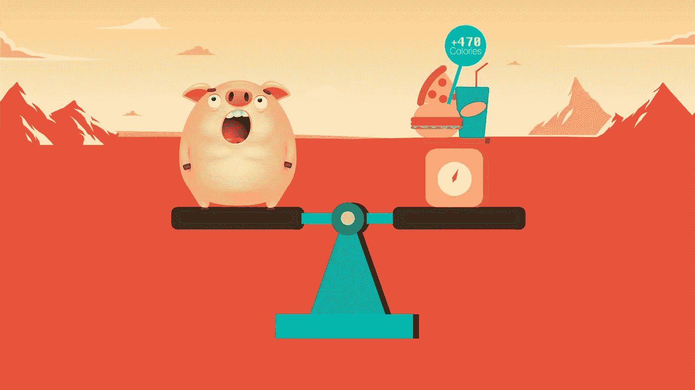
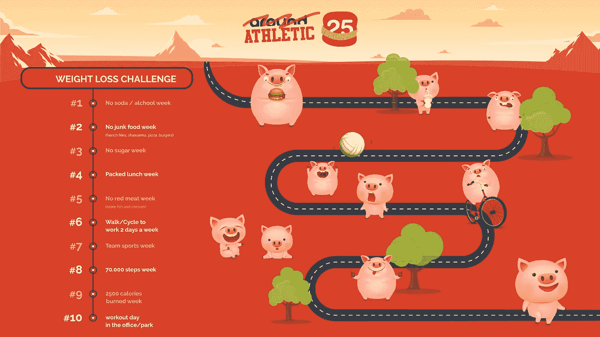
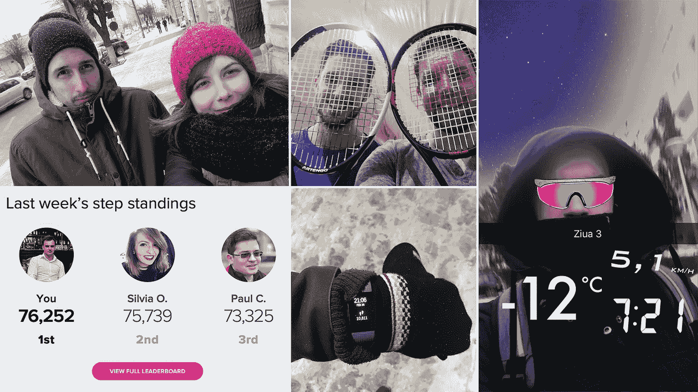
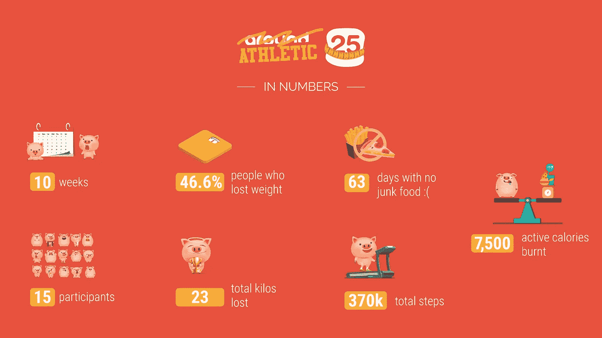
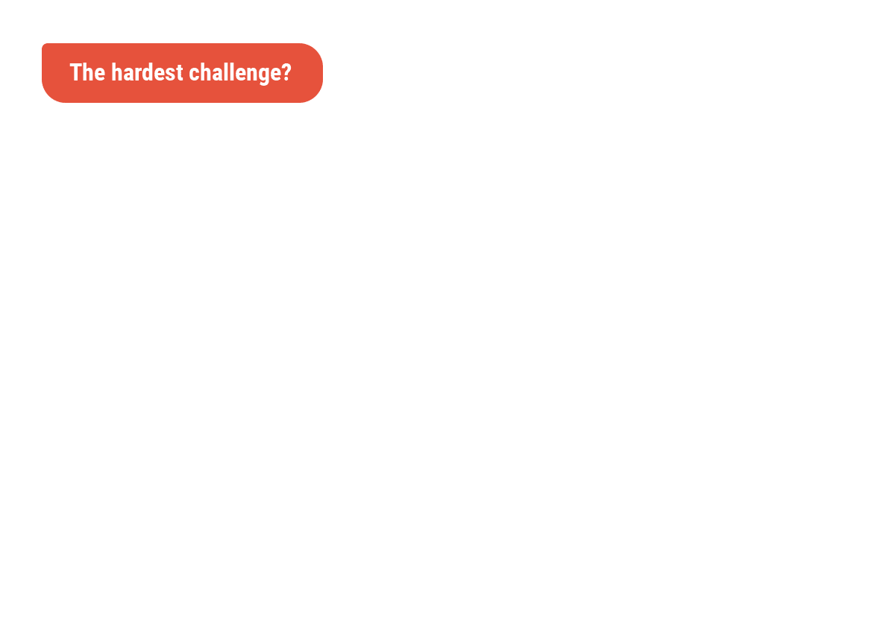
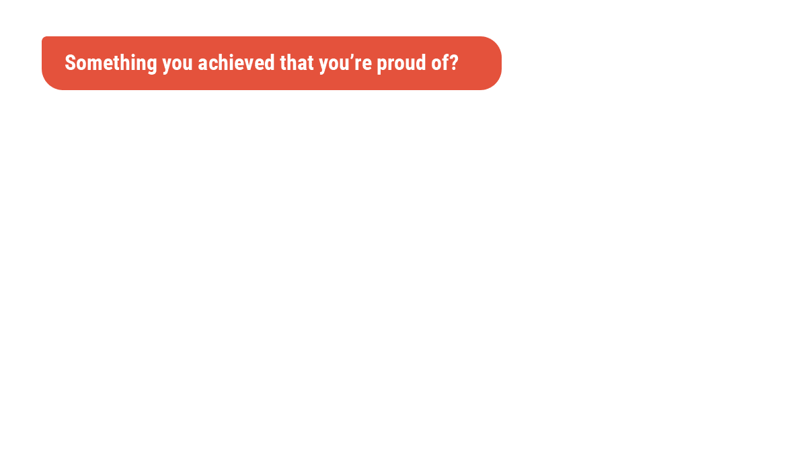
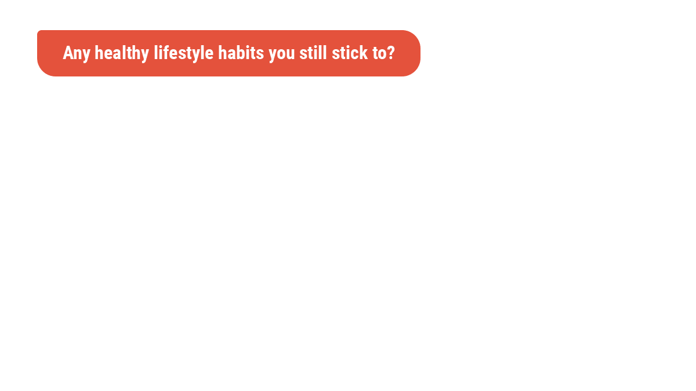
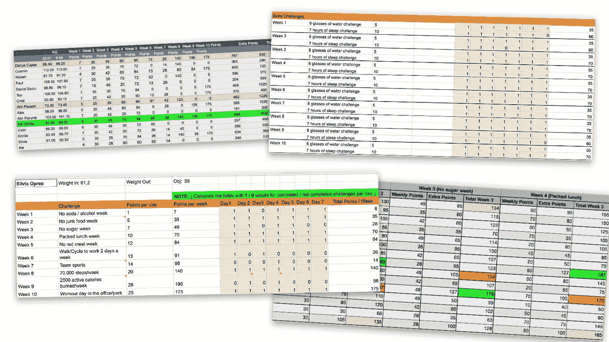

# Devs 黑掉体重增加，一个创业公司诞生了。

> 原文：<https://medium.com/hackernoon/devs-hack-weight-gain-startup-is-built-a-story-c14ddc6af405>

这既不是一个有目的的提升，超级鼓舞人心的催人泪下的动机，也不是一些技术的东西。

我的意思是*是*令人振奋，但以一种完全不同的方式，那就是:

> 一群开发人员在办公室黑出了减肥的方法。

是的，这可能不是什么新鲜事，但是这些家伙除了增加体重还黑了别的东西。他们黑掉了整个*我想找到一个有效的应用程序的想法，并尽快开发它*的动态。

他们是我的同事，罗马尼亚网络和移动开发机构的团队。他们是开发者、设计师和董事会成员，报名参加了为期 3 个月的*运动 25* (源于我们的品牌 25 左右)又名*减肥挑战*。

听着，我要诚实地说:这不是最短的故事，但它确实告诉了你一两件事，如果你愿意四处看看，你可以如何识别一个可能就在你眼皮底下的创业想法。

因此，如果你认为这值得你花 10 分钟的时间，你将经历整个事情，关于它是如何开始的，谁赢得了挑战，他们是如何做到的，我们从这个过程中学到了什么，以及我们如何利用所有这些知识将更多的创业公司添加到我们不断增长的内部创业公司中。

# 项目经理说

> 曾几何时，在 2018 年 1 月的一天，我坐在办公室厨房里，和同事们聊着寒假以及随之而来的不可避免的体重增加。没有人比我们的妈妈做得更好——这是一个举世公认的事实。但我们不能让假日美食毁了我们的海滩身材，我们必须尽快行动。我们得节食。我们需要健康的生活方式。
> 
> 所以那时我清楚了两件事:
> 
> 1)决心摆在那里，它**有**可以利用。不知何故。
> 
> 2)我们在办公室花了很多时间，即使每天打两次乒乓球也不足以弥补久坐的办公室生活。
> 
> **1。**添加到 **2 中。我恍然大悟:**如果 25 岁左右为每个人提供了实现个人目标的方法，会怎么样？****
> 
> 你应该看到我直接跑去找我们的首席执行官保罗，提出这个想法。否则一个大风扇的肯德基桶，他甚至更快地接受了会议，其中管理委员会将讨论这一建议。
> 
> 长话短说，我得到了我的批准，条件是我是项目经理，我密切跟踪整个事情的结果。樱桃在上面，我还得到了一个 Fitbit 作为获胜者的奖品。
> 
> 需要我说我直接进入研究模式挖掘材料和想法吗？
> 
> 我想你明白了——我被夸大了。"

这是营销经理、减肥挑战背后的策划者西尔维娅的谈话。不用说，她兑现了自己的承诺，精心设计了一个详细的项目，包括每周的挑战和评分系统。

跟踪日常活动和步骤将在 Google Fit 的帮助下完成。参与者将支付一笔入场费，设定一个目标(他们想减掉多少公斤)，然后乘着*的潮流去办公室享受快乐减肥*。

作为一项规则，准确的每日更新是被期待的，没有欺骗被接受，没有捷径被鼓励。任何未能达到既定目标的人都要缴纳罚款。

*旁注:你真应该看看那个充满耻辱(惩罚)的罐子，在小猪们吃完前一天晚上聚会剩下的所有披萨后，里面装满了账单。不好玩，伙计们，不好玩。但毕竟完全是人类。*

如果这看起来很多，你应该知道这并不是令人畏惧的。Silvia 和 [Emi](https://around25.com/blog/author/emilia/) 确保我们得到健康的小吃， [Cosmin](https://around25.com/blog/author/cosmin/) 组织了寿司制作教程，我们让 [Core Fitness](https://www.corefitness.ro/) 的团队来我们的办公室参加健身和营养研讨会，参与者通常是为了娱乐。

尤其是在保罗提出了一个完美的形象比喻之后:是的，我们是小猪。一个我们应得却不知道我们需要的类比。

当然，设计团队挑选并交付了完美的小猪图片；现在，我们对未来 10 周 25 岁左右的生活有了一个非常可爱和激励人心的计划:

我是说，你怎么能拒绝他们呢？

我们当然没有——在社交媒体上关注了 25 个月的人也没有。随着参与者分享有趣的每周帖子，关注者发表评论，或者西尔维娅在她参加的各种活动中被问及运动，我们的社交渠道参与度迅速上升。
随着挑战的进行，她注意到大约 25 名报名参加挑战的人有三种类型:

1.  催化者:那些已经去健身房或健康饮食，但因为…竞争+办公室的乐趣而报名的人。
2.  **为什么不加入 s** :尽管之前从未想过减肥，但喜欢以这种方式与同事共度更多时光。
3.  ***全进* s** :猛进和赶进。

正如保罗所指出的，减肥挑战从办公室的有趣事情变成了办公室的竞争事情。

但在这种情况下，竞争是一把双刃剑，暴露了 Silvia 选择的方法中的一些差距:

*   它过于注重在短时间内积累分数。
*   我们应该考虑一个更好的时间表(一开始是健身研讨会，整个过程中有更多的激励措施)。
*   我们没有考虑到人们有不同的时间和内在触发因素。因此，他们中的一些人被遗弃在路上，因为他们和其他人之间的积分差距不断扩大。

然而，在组织层面上，Paul 意识到整个项目已经发展到比最初看起来更好的程度。

哦，我们为减肥所做的事情…

我们得找出是什么不同的诱因激发了不同类型的人。我们必须了解同事的日常习惯，以及幸福对他们意味着什么。我们看到这个话题是如何成为他们家中的一个常规话题的，他们的伴侣也支持运动(有些人甚至加入了挑战，icognito)。

该说的都说了，该做的都做了，这次挑战以一种时尚的方式结束了:以 2224 分的总分，我们加冕阿德里安为我们的大赢家，而亚军是阿林(1337 分)和大流士(1352 分)。

我很想知道是什么让阿迪轻松领先。结果呢？

# 获胜:一次(或多或少)浪漫化的旅程

2018 年 1 月 1 日——是时候做出所有的决定，展望所有乐观的前景了。

这一天，开发人员 Adrian 意识到他很难穿上便装。所以，他不再说*！*、*够了！他就在那里，一个坚定的人走上了健康的生活方式。*

体重也更轻。

受到激励后，我们的同事很高兴地接受了 Silvia 设计的每周挑战系统。因此，他好胜的一面很快就显露出来，下面是人们开始看到 Adi 做的一些事情:

*   每天喝 2l 的水仅仅是为了额外的 5 分。
*   步行上下班几公里，以获得额外步骤的积分。
*   在“10，000 步/天”周中设定 20，000 步/天的目标。

以及其他类似的过激(有人会说是见不得人)行为。

底线是，阿迪实际上开始改变他的生活方式，所以他的新习惯包括固定的膳食，适当的饮水量，更好的睡眠模式，仔细检查卡路里的摄入，60 分钟的锻炼和对迄今为止每个麦奇肯的许多遗憾。

每当有同事取笑他午餐吃的简单沙拉时，他甚至变得很享受。

事后看来，他评价道:

> 起初，我们都非常积极，在第一周结束时，我们在分数上不分上下。一些事情让他们放弃了前进的道路，所以我几乎没有竞争对手——除了阿林。

从 84 公斤到 69 公斤，你可以打赌阿迪需要世界上所有的激烈竞争才能在最终的排行榜上名列前茅。但最棒的是，他从长远来看接受了挑战，在 Fitbit 的帮助下，他现在可以监控自己一天需要多少活动，如何改善睡眠以提高效率，或者需要补上多少步。

# 概念遇见现实:点点滴滴

这是一个很好的故事，我希望:)在童话世界里也有点太多了。

当然不是所有的事情都是彩虹和阳光，当然有些事情我们可以做得更好，这样每个人都有机会去把握自己的节奏。这一章讲的都是我们学到的东西。

我在上面的几行中谈到了排名和分数，尽管减肥挑战并不是真的关于赢家或输家。相反，它是关于找到一个共同的目标，并在工作场所一起完成一些事情。

如果你想的话，可以谈谈团队建设的想法。

在数字中，它看起来像这样:

我们了解到公司级计划有不同的层次:对于 Adi 公司而言，该流程非常合适。对于亚军阿林·波桑来说，也不尽然。

从后者的输入中，我们再次意识到，理论与实践绝对是不同的动物，在我们找到更好的公式之前，还有很长的路要走。

那么阿林说了什么？

> 我以 100%的决心参加挑战，变得更健康，但更重要的是获得纪律和健康的习惯。你知道，再加上要走出我的舒适区。
> 
> 但是如果我心中没有这个远大的目标，我就不可能在比赛中走得这么远。为什么？我觉得是因为整体体制的原因。回想起来，我更希望减肥过程能按照不同的难度进行。一旦你完成了一个可实现的目标，你会得到内心的奖励，这让你更容易保持动力直到最后。
> 
> 我还会增加更多基于协作和团队的挑战(比如，带别人一起慢跑)。这些可以让你始终意识到你努力的“社会”维度，而且它们给这个过程增加了更多的意义。
> 
> 我认为另一个有益的想法是与当地体育赛事合作，为我们中达到一定水平的人提供折扣和/或准入。因此，你应该让人们对一路上微小而有意义的回报感到兴奋，而不是被获得的分数所驱使。
> 
> 也就是说，我确实非常喜欢减肥挑战，我真的非常期待向 Adi 复仇。*😁*

因此，在得到所有这些反馈后，我们下次还会有什么好的实践呢？

*   一个更好的算法意味着挑战的增加和一个更好的惩罚和奖励系统。
*   更多的健康和营养专家帮助我们获得真正有价值的长期信息。
*   每一个动作背后更多的意义，更精准的目标设定。

除了改进和良好的实践，我认为我们低估了我们能够获得的乐趣。几乎每个人都变成了规则弯曲者，这导致了大量的笑声和美好的回忆。

现在让我们来筛选一下重量黑客们经历过的其他方面。

首先，是动机的问题。

然后是关于艰辛。斗争。麻烦。

说到甜食，也有积极的一面。

更多积极的方面。

加上我们一起创造的回忆。任何挑战都值得报名参加。

# 接下来呢？减肥挑战的后果

我告诉过你西尔维娅把所有事情都组织在一个电子表格里，每个参与者都提交了每日更新。

但是除了常规的挑战之外，还有额外的挑战带来额外的分数——所以管理过程和获得一致的概览变得困难和令人厌倦。你可以想象整个事情充满了数据；大概是这样的:

呃，不太好看。

有没有其他方法来集中所有这些数据？回想起来，也许吧。那时候，没有。

> 但是等等，如果没有工具可以帮助我们更快地移动…为什么不解决这个问题呢？

由于我们有头脑实际上*开发*一个软件解决方案，我们召集了一些开发人员，制作了一个品牌工具包和一些模型，然后派团队在 2018 年的 Startup Weekend Cluj 上展示这个项目(名为 [EngageApp](https://get.engageapp.today/) )。

哦，看，这里有一群快乐的孩子。因为，你知道，他们赢了[创业周末 Cluj 2018](https://www.facebook.com/events/137491350252749/) 。

总而言之，减肥挑战开启了关于公司如何创建和管理内部计划的讨论。我们能够看到，在地方一级，不同规模的企业如何在跟踪内部项目和行动时解决类似的问题。

好消息是我们能够开发一个解决方案——而不是一个人处理管理，你将有一个应用程序，每个人都可以记录他们的日常数据，然后*嘣！在那里，你已经有了所有你需要的指标。*

# 这不是“故事的终结”

*当目标符合个人责任时，最好的计划就会出现，有机地成长并茁壮成长。*

对于 Athletic25 来说，没有期限的压力，没有做什么是对的或什么是错的，没有人力资源战略。也许这就是为什么 EngageApp 被证明是如此具有关联性，并很快被同行公司的人所认可。

但还有一件事，对我来说，是我们挑战的真正收获。

为了说明我的观点，我将分享我前几天看到的一张照片。这是一个悲伤的饼干怪兽。

我可以说这是任何一个试图改变健康生活习惯的人吗？我们显然也不例外。

但是减肥挑战证明了我们实际上能够保持意志力。实际上，我们*希望*选择更健康的生活方式，因为这只会增加我们每天精神抖擞地出现在办公室的机会，随时准备处理任何问题或令人疲惫的电话。

*但更重要的是，培养意志力是我们生活中需要的技能，不管我们用它来实现什么目标。*

现在，我写了这篇文章，并谈到了结果是一个新的工具，以改善流程……我想我们会使它成为一个季节性的习惯，并为办公室的下一个(改善的)减肥冲刺做好准备。

大约 25 只小猪将再次参加比赛！🐷💪

*这个故事最初发表于*[*around25.com*](http://bit.ly/Around25M)*。在你选择的社交频道上(* [*【脸书】*](https://www.facebook.com/Around25/) *，*[*insta gram*](https://www.instagram.com/around25team/)*，*[*Twitter*](https://twitter.com/Around25Team)*，*[*LinkedIn*](https://www.linkedin.com/company/around25/)*，*[Medium](https://medium.com/around25)*)你可以得到类似的内幕消息*