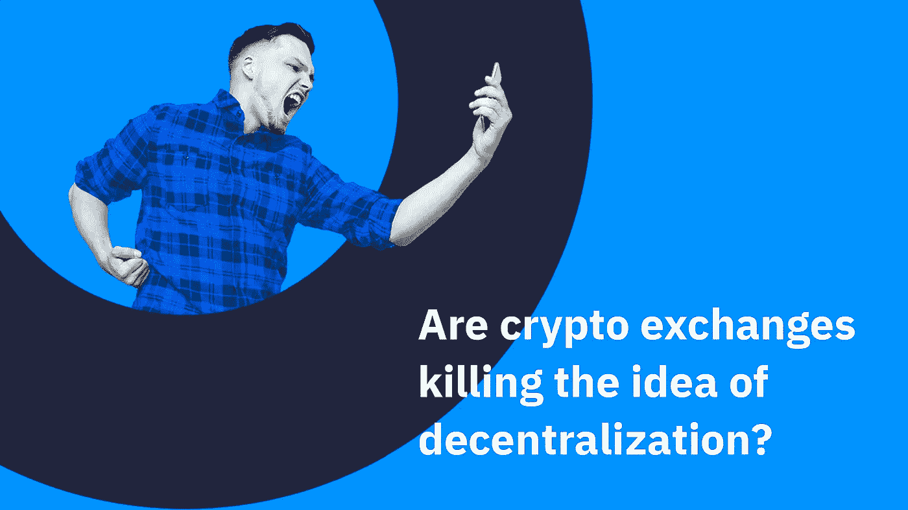
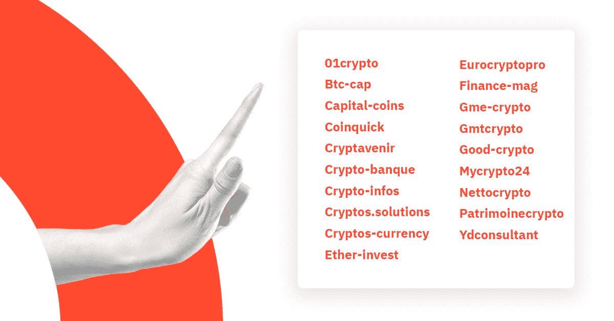
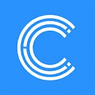

# 数字资产背后的主要思想是去中心化…但主要参与者是集中的。怎么会这样

> 原文：<https://medium.com/hackernoon/dex-cex-9781680e86cb>

去中心化是加密货币最初流行的主要原因之一。这使得避免中间人成为可能，并增加了双方之间的信任，即使他们想保持匿名。 *虽然去中心化可以让区块链成为“信任机器”，但整个密码行业的主要参与者——密码交易所——都是集中化的。*

这个事实不仅具有讽刺意味，而且还会导致重大问题。集中式加密交易所在许多方面与区块链试图颠覆的传统交易所和银行没有什么不同。无论用户在交易所持有多少加密货币，实际上都属于交易所本身，如果发生黑客攻击和/或技术困难，用户可能会失去所有资产。

*最大的交易所自己也开始意识到这种情况的讽刺意味，并开始采取分散解决方案。让我们通过分析顶级交易所的例子来看看历史观点和当前趋势的原因是什么。*

## **集中交易&重大黑客攻击**

集中式交易所似乎一直是交换加密货币最简单、最容易理解的解决方案。根据 CoinDesk 的数据，今天，99%的交易量发生在集中交易所。

第一个——Mt . Gox——创建于 2010 年，也就是比特币诞生的第二年。它允许参与者之间进行快速交换，对大多数用户来说很方便，并提供了足够的流动性。集中化也使得先进交易工具的实施成为可能。今天，像火币、北海巨妖和币安这样的最大的集中交易所的日交易量在最大的加密交易所中达到数亿美元。

然而，Mt.Gox 创建 4 年后，密码行业可以看到这种彩色交换的危险。2014 年 2 月**，**黑客突袭 Mt. Gox，窃取了 744408 个属于客户的比特币，以及另外 10 万个属于公司本身的比特币。Mt. Gox 在日本申请破产，两周后在美国申请破产。

这是为什么集中式解决方案有重大缺陷的最初例证之一。首先，交易所可能遭到的黑客攻击以及随之而来的不可挽回的用户资金损失实际上是可能发生的，而且发生了好几次。找回被盗的比特币是一项极其困难的任务，通常是不可能的。Crypto 社区还记得另一个[案件](https://howmuch.net/articles/biggest-crypto-hacks-scams)2016 年最大的股票交易所——Bitfinex 的黑客攻击(相当于 crypto 中 7200 万美元不见了)。尽管采取了各种防范措施，黑客攻击仍然存在，而且问题还在加剧。

不幸的是，骗局在加密行业也以其他形式盛行。可疑交易是加密市场中仅次于欺诈性 ico 的第二大常见骗局。欺诈集中交易所的名单令人印象深刻:

此外，其他风险包括服务器故障和信息丢失。对于许多用户来说，重要的是交易所完全拥有他们的资产，并且需要所有用户的完整身份。

用户和交易所本身都知道有太多的缺点，但技术进步使得新型的分散式交易所成为可能，这是在第一个 CEX 诞生 6 年之后。

## **分散交易所&流动性问题**

由于智能合约的发明，分散交易成为可能。以太坊[区块链](https://hackernoon.com/tagged/blockchain)率先提供了这一机会，并在其平台上创建了第一批分散式交易所(其中 DEX 和 Etherdelta 于 2016 年出现)。

分散解决方案允许实现参与者之间加密货币交换的绝对安全性。没有必要在交易所的账户上存储资产，没有单一的服务器来确保交易过程，一切都是匿名的，由参与者自己控制。黑客攻击的危险仍然存在，但另一方面，只有智能合同中的错误才会导致严重的损失。

然而，分散式交易所也有许多缺点。性能方面。它们要求分别处理每笔交易，并将每次交易的结果写入区块链本身。这导致交换的显著延迟，达到几天。此外，dex 目前根本无法提供期权和保证金交易等高级工具——交易通常只包括买入和卖出订单。

另一个缺点是流动性不足。由于低生产率和交互的复杂性，很少有人愿意进行大量交易。日均交易量很少超过 100 万美元。

DEX 趋势很可能会失败，因为它在加密社区中不受欢迎。分散交易所的合规性也存在问题:如果监管者向所有者提出问题，他们会怎么做，这一点还不清楚。 [IDEX](https://news.bitcoin.com/decentralized-exchange-idex-to-introduce-full-kyc/) 举例来说，当一个分散的交易所实施一个完整的身份验证过程时，就开创了一个先例。

## **混合 dex 和 CEXs**

令人惊讶的是，不止有两种选择。交换可以是集中的、分散的或两者兼有。今天的主要玩家都想从这两个选项中提供最好的。排名前三的交易所——币安交易所、Bithumb 交易所和 Bitfinex 交易所——正在积极开发此类计划。

## **币安**

交易所[早在 2018 年 3 月就宣布](https://www.youtube.com/watch?v=wN1Uvor4Hd8)创建一个去中心化的解决方案(推出后 7 个月)。

*在广泛研究分散式交易框架和分析现有实施后，我们相信，在为用户提供他们已经习惯的交易体验水平方面，可以做出重大改进。币安官方支持中心表示，集中式和分散式交易所将在不久的将来共存，相互补充，同时也相互依赖。*

该交易所计划于 2019 年初推出。该平台将拥有自己的区块链，币安或许能够避免当前与 ETH 扩展相关的问题。尽管如此，仍然存在一些关于交易具有自身区块链的资产的可能性的担忧(互操作性问题)。也许这些将由原子交换技术来解决。

## **Bitfinex**

2018 年 9 月，Bitfinex 宣布推出 Ethfinex Trustless，这是一个去中心化的交易所，用户可以在没有中介的情况下进行交易。

*没有注册，没有存款或取款延迟，也没有牺牲代币的保管。Erthfinex 营销负责人 Kasper Rasmussen* 表示，用户在整个交易过程中保持对资金的完全控制，同时根据高流动性的离线订单簿执行交易，以确保完全无缝的交易体验。

Bitfinex 解释说，DEX 的创建考虑到了用户在处置其自有资产时的利益，同时保证他们解决由于与中央交易所和链外匹配系统的连接而导致的流动性和速度慢的问题。在最初的两周，只有 4 种代币可供交易:ETH，OMG，ZRX，USDT。对于交易，必须至少有一个 NEC 令牌，它隶属于 Bitfinex。随后，令牌的数量将达到 40+,并且不再需要在天平上放置 NEC 令牌，但是，它仍将作为系统的燃料和决策工具(以上市为例)。

2018 年 9 月 13 日，Bitfinex 还宣布创建 [EOSfinex](http://www.eosfinex.com/) ，这是一个建立在 EOS 区块链基础上的去中心化交易所。EOS 区块链提供有竞争力的[优势](http://blog.bitfinex.com/announcements/eosfinex-introduction/)由于更先进的可扩展性技术，每秒交易(TPS)指标达到 4000，比以太坊区块链快数百倍。最初，将在证券交易所推出三个交易对——EOS/USD、BTC/USD 和 ETH/USD，这意味着通过智能合约与这些区块链完全兼容，并与菲亚特退出。预计将于 2019 年 1 月推出。据该公司称，新交易资产的上市将是微不足道的，并将取决于可信智能合约的创建。

## **比瑟姆**

2018 年 10 月初，韩国最大的证券交易所之一宣布创建自己的去中心化交易所。这一决定可能是对 Bithumb 被黑掉大约 3100 万美元后名誉受损的回应。此外，该交易所因可能存在违规、操纵和洗钱行为而被韩国监管机构清理。为了保持其领导地位，交易所必须做出相应的反应，这是合乎逻辑的。

[创造](/@oneroot/bithumb-dex-is-officially-launched-today-5032cc8152ab)分散交易所的另一个原因是市场的大趋势。这样的解决方案可以给交易所带来更多的关注，扩大其市场份额，增加服务的多样性。

10 月 15 日，去中心化交易所正式[上线](http://www.businesskorea.co.kr/news/articleView.html?idxno=25420)。Bithumb 与 OneRoot 合作，在以太区块链上创建和维护 DEX。为了绕过可伸缩性问题，如 Ethfinex，智能合约被用作链外订单簿。

Bithumb 在韩国的竞争对手 Upbit 最近也采取了行动:Upbit 投资了 Allbit 分散式交易所。最新的决定似乎是该公司通过开设一个在全球市场上受到关注的分散交易所来与全球市场上其他领先交易所竞争的战略。

## **结论**

dex 仍然面临着重大的技术障碍，完全的权力下放还不可能。在不久的将来，混合模式更有可能在集中交易的速度与分散解决方案的安全性之间取得平衡。

## 关于地下室

  C   Crypterium 正在开发一款移动应用程序，它将把加密货币变成你可以像使用现金一样轻松消费的货币。在世界各地购物，在任何 NFC 终端或通过扫描二维码用硬币和代币支付。在网上商店购物，支付您的账单，或者只是在几秒钟内跨境汇款，可靠且只需几分之一便士。

加入我们的 [**电报新闻频道**](https://t.me/crypterium_en) 或其他社交媒体，保持更新！

[**网站**](http://crypterium.com)**๏**[**电报**](https://t.me/crypterium)**๏**[**脸书**](https://www.facebook.com/pg/crypterium.org)**๏**[**推特**](https://twitter.com/crypterium)**๏**[**bitcointalk**](https://bitcointalk.org/index.php?topic=2214098.0)****************