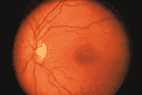
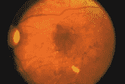
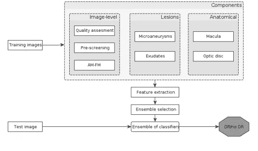
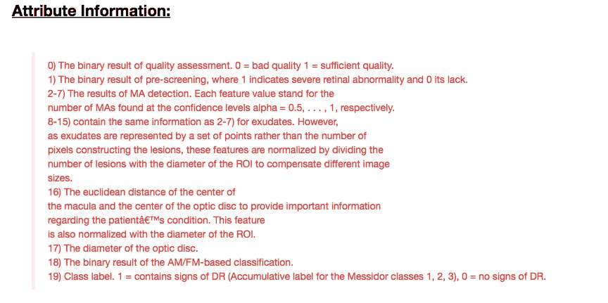
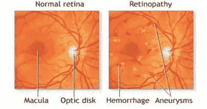
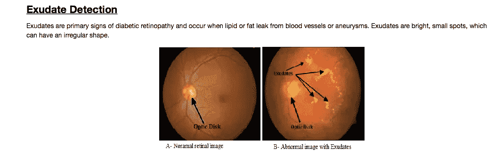
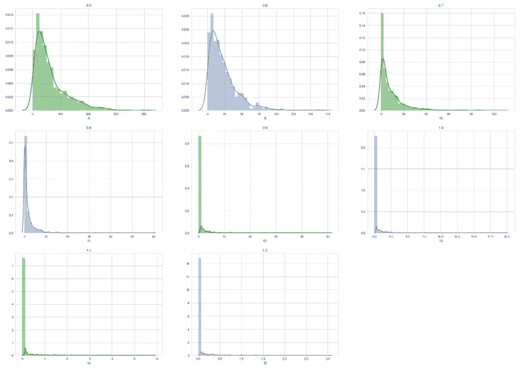
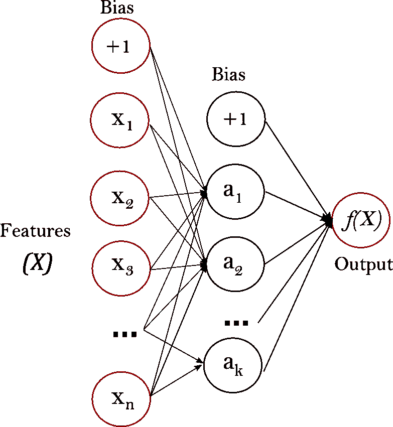
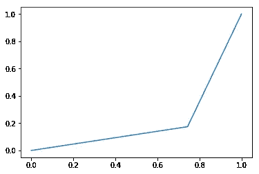

# 糖尿病视网膜病变检测

> 原文：<https://medium.com/hackernoon/diabetic-retinopathy-detection-9bdceac75752>

在糖尿病患者中，[糖尿病视网膜病变](https://hackernoon.com/tagged/diabetic-retinopathy)的患病率在美国 12 个州约为 28.5%，在印度约为 18%。全球范围内， ***患 DR 的人数将从 2010 年的******1.266 亿增长到 2030 年的******1.91 亿*** 。这种疾病是发达国家视力障碍最常见的原因之一，也是工作年龄人口中新增失明病例的主要原因。

> 总的来说，每天有近 75 人因 DR 而失明，尽管治疗是可行的。

糖尿病视网膜病变是[糖尿病](https://www.nhs.uk/Conditions/Diabetes/Pages/Diabetes.aspx)的并发症，由高血糖水平损害眼睛后部(视网膜)引起。如果不诊断和治疗，它会导致失明。如果不治疗，****糖尿病视网膜病变会损害您的视网膜。这是你眼睛后部的内层，将光线转化为图像。世界卫生组织估计，到 2025 年，大约会有 3 亿人患有糖尿病。****

**

*A normal retina*

**

*A retina showing signs of diabetic retinopathy.*

*   *[**糖尿病视网膜病变**](https://www.nhs.uk/conditions/diabetic-retinopathy/) 影响眼睛后部的视网膜感光组织中的血管。它是糖尿病 患者 ***视力丧失的最常见原因，也是工作年龄成年人 ***视力损害和*** 失明的主要原因。****
*   *DR 的自动计算机辅助筛查是一个高度研究的领域([阿布拉莫夫等人，2008](https://www.ncbi.nlm.nih.gov/pmc/articles/PMC2881172/) )。创建可靠的自动 DR 筛查系统的动机是 ***减少大规模筛查*** (Fleming et al .，2011)，这也提出了一个**财务问题** (Scotland et al .，2010)。*

*关于决策，自动 DR 筛查系统要么部分遵循临床协议。*

*糖尿病性视网膜病变的自动分级具有潜在的益处，例如增加效率、重复性、T21、覆盖范围；减少准入壁垒；以及 ***通过提供早期检测和治疗来改善患者结果*** 。为了最大化自动分级的临床效用，需要一种算法来检测相关的糖尿病视网膜病变。*

*我们将利用[机器学习](https://hackernoon.com/tagged/machine-learning)的能力开发一个糖尿病视网膜病变分类的自动化系统。*

*该方法基于由病变检测和解剖部分识别算法提取的特有特征对图像进行分类。从效率的角度考虑筛选的特异性，我们展示了如何通过结合新的筛选特征和决策过程来保持高水平的敏感性和特异性。*

**

*DR Classification Workflow*

*我已经从 UCI 机器学习库中获得了所需的数据集。它由 1151 个实例和 20 个属性组成。所有特征代表检测到的病变、解剖部分的描述性特征或图像级描述符。我们将糖尿病视网膜病变患者与未受其影响的患者进行了区分。以下是我们为患者分类考虑的属性列表和特征的详细描述，请参考此[论文](https://arxiv.org/pdf/1410.8576.pdf) : -*

**

*开始时，数据集有 ***没有丢失值*** 。初始参数为 ***图像质量评估和预筛选*** 。对于图像质量评估，我们假设从图像处理算法中提取的所有特征对于每个患者都具有足够的质量，其中 4 个是例外情况。我们的 ***假设是所有案例的同质性*** ，忽略 1147 个其他案例中的 4 个例外。*

*预筛查结果显示 ***92%*** 的患者存在严重的视网膜异常，而其余患者则不存在视网膜异常。*

*在评估了其余的特性之后，我们得出了一个结论，只有两组特性具有很高的重要性。第一组由 6 个微动脉瘤检测特征组成，置信水平为α从 0.5 到 1.0。*

**

*Normal Retina V/s Micro aneurysm detected Retina*

> ***置信度越高，检测到的微动脉瘤数量越少。***
> 
> ***随着置信水平逐渐降低，我们可以观察到检测到更多的微动脉瘤。***

**

*而第二组包括在α为 0.5 至 1.2 的置信水平下对渗出物进行微动脉瘤检测的 8 个特征。*

**

> ***随着置信水平的增加，检测到的分泌物数量减少。***

*为此，我尝试和测试了许多基线分类器，即 ***、朴素贝叶斯、随机森林、支持向量机和决策树(CART)*** 。这些分类器未能给我们满意的结果。*

*对于医疗决策支持，集成方法已经成功地应用于几个领域。经过对 ***AdaBoost 和*** 梯度升压机的参数实验。准确性突然提高，但我们的 ***模型性能*** 基于特异性和敏感性，没有观察到显著的提高。*

*最后，通过使用 [***多层感知器神经网络***](http://scikit-learn.org/stable/modules/neural_networks_supervised.html) ，我们能够达到相当不错的准确率***【78.56%】***。我们的模型性能目前在灵敏度方面是*74.3%，在特异性方面是 ***82.6%*** 。**

****

**General Architecture of Multilayer Perceptron**

> **我已经使用 L-BFGS 求解器，它收敛更快，在小数据集上有更好的解决方案。它不支持迷你批量学习。**
> 
> **多层感知器对特征缩放很敏感，所以我使用标准缩放来获得最佳效果。**
> 
> **不同的权重初始化会导致不同的验证准确性。具有隐藏层的 MLP 具有非凸损失函数。**

**ROC 曲线显示了在分类器过程的不同设置中这两者之间的权衡，这有助于理解分类器的性能。**

****

**ROC Curve**

**上面的 ROC 曲线显示了灵敏度和特异性之间的*权衡，这是我们的主要参数。曲线下的 ***面积为‘AUC:’，0.2154。******

> *高度敏感的测试意味着很少有假阴性结果，因此也就很少遗漏疾病病例。*
> 
> **高度特异性的检测意味着很少有假阳性结果。使用特异性低的检测进行筛查可能不可行，因为许多没有患病的人将筛查为阳性，并可能接受不必要的诊断程序。**

*与最先进的方法相反，我同时使用了图像级、病变特异性和解剖成分。我的方法已经在 Messidor 数据集上得到验证。*

*我们获得的敏感性/特异性结果(74%/83%)也接近于英国糖尿病协会(BDA) (80%/95%)对糖尿病筛查的建议(BDA，1997)*

*这些结果加强了 MLP 可以有效地用作在眼底图像中检测眼睛相关疾病的分类器的想法。即使有这样的结果和进展，我们的网络也不会给出期望的结果*，如果眼底特定部分的渗出面积超过了光盘的渗出面积*。有了这些限制和结果，应该继续工作以获得更多的特征并开发更有效的系统，或者更合适的方法可以是对 Messidor 的图像数据集使用 ***卷积神经网络，而不是应用图像处理算法*** 。*

*如果你一直关注这个博客，并且有兴趣了解这个代码， ***请访问这个***[【*链接*](https://github.com/PrathamNawal/Diabetic-Retinopathy-Detection) 。非常感谢任何形式的建议和改进。感谢阅读！*