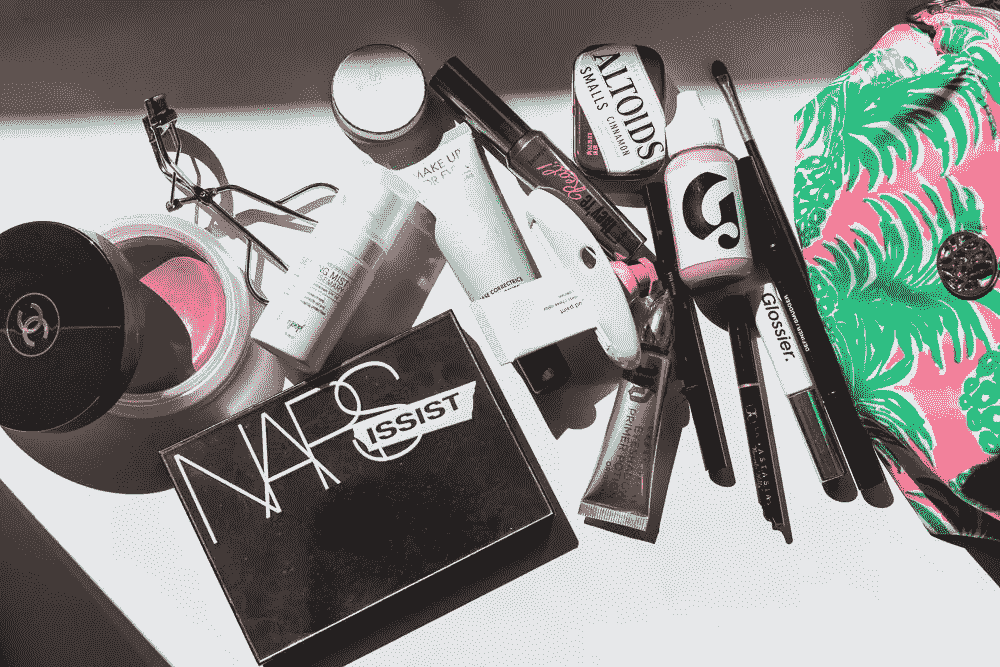
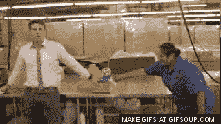
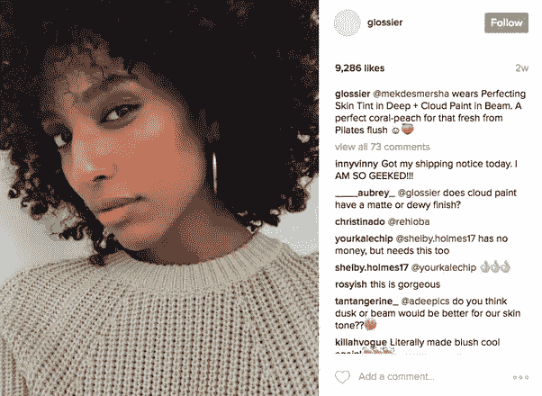
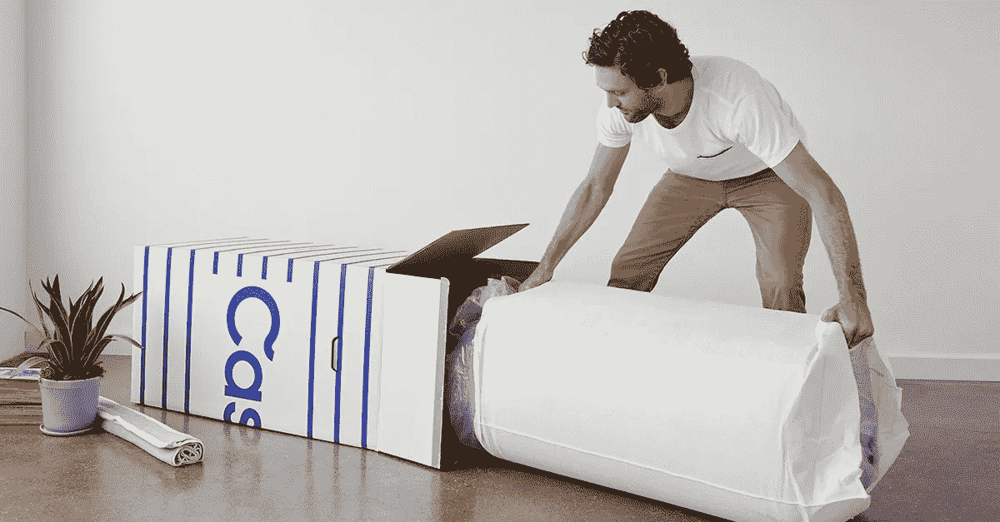
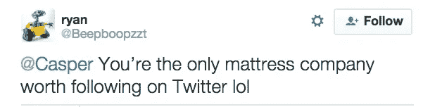

# 诊断直接面向消费者的中断

> 原文：<https://medium.com/hackernoon/diagnosing-direct-to-consumer-disruption-aa85d3badad0>

*特别感谢 Signia 的*[*Alex Lloyd George*](https://www.linkedin.com/in/alex-lloyd-george-24050888/)*，他是本文的合著者。*

自从[倭黑猩猩](/@dunn/digitally-native-vertical-brands-b26a26f2cf83)在 2007 年开始运送合身的男式裤子以来，直接面向消费者(D2C)的创业公司已经渗透到你的卧室、浴室、日常化妆和衣橱的每一个部分。十年后，D2C 品牌不再紧追 CPG 巨头——它们要么与他们合作，要么成为他们的一员。Bonobos 的联合创始人 Andy Dunn 是沃尔玛组建的对抗亚马逊的智囊团的核心人物，Warby Parker、Casper 和 Dollar Shave Club 都是价值数十亿美元的品牌。

最近的一项研究发现，大多数消费类别的增长已经转移到培养直接消费者关系的品牌上。这也是为什么“拆分 P[&【G】](https://www.cbinsights.com/research/disrupting-procter-gamble-cpg-startups/)的说法看起来并不荒谬的原因之一；这也是为什么 General Catalyst 管理合伙人 Hemant Taneja 认为我们已经达到了[“规模的尽头”在 CPG 的世界里，我们已经进入了一个小即是大的时代。](https://sloanreview.mit.edu/article/the-end-of-scale/)

然而，并非所有 D2C 的破坏都是平等的，它们之间的差异对它们的长期前景至关重要。我从两个方面考虑 D2C 的破坏:供应链破坏和品牌破坏。

# D2C 破坏的类别

## 供应链中断

*A glimpse of Dollar Shave Club’s disruptive supply chain*

供应链中断是指初创公司利用互联网的分销和曝光优势，以更低的成本提供更便捷的产品体验。

Dollar Shave Club 是一个经典的例子:它采用了糟糕的客户体验——去 CVS 支付五刀片吉列剃须刀的费用，该剃须刀必须由商店助理从玻璃笼中取出——并通过负担得起的每月订阅使其变得便宜和容易。

过去十年出现的基于互联网的平台使这成为可能:Dollar Shave Club 不需要与 P&G 这样的公司争夺宝贵的药店货架空间——互联网有无限的货架空间。AWS 让托管和扩展网站变得前所未有的简单。创始人迈克尔杜宾不需要在电视或平面广告上花费大量金钱来让你的潜在客户了解他的小企业——相反，他只需要花几千美元在 YouTube 上疯狂传播的发布视频就可以了(尽管公平地说，没有办法保证病毒式传播)。这些新渠道使 Dollar Shave Club 能够遵循一种新的业务模式，这种模式极大地简化了供应链的前端，省去了药店中介，减少了客户的摩擦。

## 品牌颠覆

*Glossier’s fans supply much of its Instagram content and help the company build a differentiated makeup brand*

另一种主要的 D2C 颠覆是品牌颠覆。这是初创公司使用围绕内容的互联网平台——如社交媒体和博客——来创造更多维度的品牌体验，从而创造超级参与的客户和忠诚的数字社区。

这个领域的佼佼者是 Glossier。Glossier 是一只 CPG 蝴蝶，它从创始人 Emily Weiss 的 caterpillar 中脱颖而出，进入 Gloss beauty 博客。该博客最初于 2010 年推出，在 Glossier 在其[第一系列产品](https://fashionista.com/2014/10/glossier)中推出“Balm Dot Com”面霜时，每月吸引【2010 万独立访客。《走进光泽》为 Glossier 提供了一个心甘情愿的直接受众，但韦斯进一步发展了她对社区建设的见解。臭名昭著的“牛奶果冻洁面乳”的生产过程整合了来自顾客的 400 条社交媒体评论；该公司为数百名超级粉丝开设了一个松弛频道，他们通过策划活动提供定期反馈和免费营销；Glossier [Instagram](https://www.instagram.com/glossier/?hl=en) 页面已经聚集了 110 万粉丝，并且不缺乏用户生成的内容。

过去，品牌包括包装以及通过电视和平面广告传达的任何个性。除了这些渠道，这个品牌根本没有太多的方式来表达自己。有了 Instagram 和博客等品牌表达渠道，Glossier 这样的公司可以以零边际成本随时发布视觉和文本内容。这种新的力量为拥有品牌产品的公司提供了建立品牌个性和吸引追随者的巨大空间。

供应链中断提供了一种快速有效的方式来获得牵引力并从现有企业那里窃取市场份额。因为它从根本上是围绕商业模式的创新，但是，它是可复制的，因此不会形成强大的护城河。另一方面，品牌颠覆建立了一个拥有忠实粉丝群的护城河，既通过品牌传播降低了客户获取成本，又通过促使相同的客户一次又一次地回来而延长了终身价值。

# 卡斯帕和双重分裂的情况

*Casper’s innovative business model has been copied many times over, but its strong brand keeps the company on top*

这两种 D2C 颠覆并不相互排斥，事实上，过去十年中一些最好的 D2C 公司已经结合了两者的元素。以卡斯珀为例。

供应链中断是卡斯珀成功突围的关键。该公司一开始以价格合理的高质量盒装床垫吸引消费者，这种床垫可以通过非常简单的过程购买——与过去复杂、不方便、昂贵的床垫商店体验相去甚远。

卡斯珀同时围绕睡眠打造了一个[强大的生活方式品牌](http://fortune.com/2017/08/23/casper-mattress-philip-krim/)，在社交媒体、博客和传统广告中发出一致的不敬声音。他们不把自己标榜为床垫公司——谁会对床垫公司感到兴奋呢？而是“睡眠的耐克”该公司组织了一个由全球 20，000 名粉丝组成的焦点小组，提供关于他们睡眠模式和产品反馈的大量数据。

Casper 商业模式的成功刺激了模仿创业公司( [Yogabed](https://marpac.com/) 、 [Leesa](https://www.leesa.com/) 、 [Helix](https://helixsleep.com/) )，给了现有竞争对手新的曝光机会( [Saatva](https://www.crunchbase.com/organization/saatva-luxury-mattress) 、 [Tuft & Needle](https://www.crunchbase.com/organization/tuft-and-needle) )，并迫使现有公司采取反制措施(市场份额领先的床垫公司现在也向[提供免费送货和 120 天退货的床盒](https://www.bloomberg.com/news/articles/2017-10-12/mattress-firm-creates-bed-in-box-startup-to-challenge-casper-j8ok9ivu))。一些行业观察家估计，可能有多达 100 个品牌在网上销售床垫。当其他公司复制它的时候，Casper 最初的钩——它的创新商业模式——实际上已经被中和了。

然而，自 2014 年以来，Casper 仍然成功售出了约 40%的盒装床垫。为什么？他们神奇的多维品牌，体现在他们的在线存在。供应链中断是 Casper 成功冲击床垫行业的关键，但品牌——他们的护城河——在他们的模式被复制粘贴后仍保持领先。

# D2C 颠覆的未来

*Brand disruption will be more important for D2C brands than supply-chain innovation*

供应链中断对于上面提到的一些 D2C 公司来说非常有效，但是要成功将会变得更加困难。亚马逊在零售业中的份额越来越大；杰夫·贝索斯对时尚有着宏伟的计划，T2 也日益成为美容界的中心。在价格和便利性上与亚马逊竞争极其困难。美元刮脸或卡斯珀风格的削弱将是罕见的。这并不是说我们不会看到更多的供应链中断，但随着低垂的果实继续被采摘，这很可能发生在越来越不为人知的行业。[例如，InkBox](https://inkbox.com/) 是一家将创意商业模式应用于 D2C 半永久纹身行业的初创公司。Warby Parker 试图在视力检查之后的[之前让供应链遭受两次雷击——这是另一种昂贵且不方便的客户体验。](https://www.fastcompany.com/40483807/how-warby-parker-reinvented-the-eye-test)

尽管有这些例外，品牌颠覆仍将成为焦点。Glossier 表明，在不创新供应链的情况下，建立一个开创性的 D2C 品牌是可能的。一个强大的社区围绕着一个存在于多个在线渠道的品牌——并提供[独特的 IRL 体验](https://techcrunch.com/2018/03/17/the-rise-of-experiential-commerce/)——是一个很深的护城河。还有大量的品牌创新即将到来——以 [Volition Beauty](https://volitionbeauty.com/?gclid=Cj0KCQjw8MvWBRC8ARIsAOFSVBWew9DY9TZ2lLeVolC9rfRMlxvXQgaQgDyjFNp0PQeqjDfKatuQJKoaAtd2EALw_wcB&gclsrc=aw.ds) 为例，这是一个数字化的本土美容品牌，从其社区众包其产品创意。尽管 Glossier 从客户那里寻求反馈，但 Volition 更加模糊了生产者和消费者之间的区别——或者可能完全消除了这种区别。在更宏观的层面上，品牌表达的渠道仍在出现:语音和聊天机器人商务在这里是有前途的领域。

供应链中断的机会越来越少，品牌中断的渠道越来越多，这让我相信，未来的 D2C 品牌将更像 Glossier，而不像 Dollar Shave Club。

Sunny Dhillon 是 Signia Ventures 的创始合伙人，Signia Ventures 是一家总部位于旧金山湾区的 1 亿美元种子和 A 轮风险投资公司。他投资 Signia 的消费者和企业初创公司，并对直接面向消费者的美容品牌进行天使投资。在创办自己的创业公司并成为投资者之前，他曾在新线电影公司(New Line Cinema)的一家风险投资公司担任第一业务开发员工，并在华纳兄弟公司(Warner Bros .)担任公司战略。他的一些投资包括阿里巴巴(纽约证券交易所代码:baba)，Tenor(被谷歌收购)，Cruise Automation(被通用汽车收购)。

*这篇文章也可以在* [*LinkedIn*](https://www.linkedin.com/pulse/diagnosing-direct-to-consumer-disruption-sunny-dhillon/) *和我的* [*个人网站*](https://www.sunnydhillon.co/the-blog/2018/6/4/diagnosing-direct-to-consumer-disruption) *上找到。*

*如果你喜欢这篇文章，请在左下角“鼓掌”50 次，这样会有更多人分享。您也可以随时* [*推特我*](https://twitter.com/sundhillon?lang=en) *您的想法，关注我的*[*LinkedIn*](https://www.linkedin.com/in/sundhillon/)*，或者在我的* [*个人网站*](https://www.sunnydhillon.co/) *了解更多。*