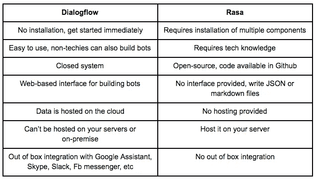

# Dialogflow 与 Rasa——选择哪一个？

> 原文：<https://medium.com/hackernoon/dialogflow-vs-rasa-which-one-to-choose-844c42117cb2>

有很多带 NLP 的 [chatbot](https://hackernoon.com/tagged/chatbot) 平台，比如:

[Rasa:开源对话式 AI](http://rasa.com/)
[dialog flow](https://dialogflow.com/)
[Bot 框架](https://dev.botframework.com/)
[wit . AI](https://wit.ai/)
[Amazon Lex—构建对话机器人](https://aws.amazon.com/lex/)

[**创建免费聊天机器人**](https://dashboard.kommunicate.io/signup)

我们评估了为客户支持和服务行业构建聊天机器人的最值得关注的机器人平台。最后， [Dialogflow](https://hackernoon.com/tagged/dialogflow) 和 Rasa 在我们的优先列表中名列前茅。

本文涵盖了 Dialogflow 和 Rasa 之间的区别，并帮助您理解选择哪一个。

# 对话流

Dialogflow 是谷歌旗下的产品。他们开发了基于自然语言对话的人机交互技术。

Dialogflow 是一个完整的闭源产品，有 API 和 web 接口。Dialogflow 之前被称为 api.ai，并于 2016 年被谷歌收购。

# 罗砂

Rasa 是一个开源的机器学习工具，用于开发人员和产品团队扩展机器人，而不仅仅是回答简单的问题。
Rasa 配有 Rasa NLU 和 Rasa 核心。NLU 处理意图和实体，而核心处理对话和实现。

[**免费试用 30 天**](https://dashboard.kommunicate.io/signup)

# Dialogflow 与 Rasa 的主要区别

首先，我们发现 Dialogflow 超级好用。几乎所有的东西都可以在用户界面中找到，你甚至不用写一行代码就可以创建一个机器人。Dialogflow 提供了从实体、意图、培训、分析、历史到集成的一切。它们在用户界面中可用。它就像一个成熟的随时可用的服务。

相比之下，你将不得不在 Rasa 之上建立东西。此外，定制机器人需要 python 开发。

## Rasa 中提供用户界面的项目

[口齿伶俐](http://spg.ai/projects/articulate/)
Rasa UI

Dialogflow 满足每个人的需求，而且更通用。在 Rasa 中，您可以自定义 bot，这需要 python 开发。两者都提供免费和付费计划。

## 如何从 Dialogflow 迁移到 Rasa？

从 Dialogflow 迁移到 Rasa 很容易。Dialogflow 提供了一种以 zip 文件形式导出代理的方法。然后，您可以使用相同的下载数据训练拉莎 NLU。然后修改 API URL 以指向 Rasa NLU 服务器。

详细说明见[此处](http://rasa.com/docs/getting-started/dialogflow/)。

## 结论

我们希望对定制有更多的控制，所以继续用 Rasa 来构建我们的定制机器人，如 [Liz](https://www.kommunicate.io/blog/why-should-you-delete-your-faq-page-e60933050643/) 。对于基本的机器人和已经在使用 Dialogflow 的客户，我们增加了对简单的 [dialogflow 集成](https://www.kommunicate.io/blog/how-to-integrate-bot-using-dialogflow-in-kommunicate-1ac32911a7d0/)的支持。

你如何评价 Dialogflow 和 Rasa，为什么？请在下面的评论中告诉我们，我们很乐意听到他们的意见。

[**免费试用**](https://dashboard.kommunicate.io/signup)

*本文原贴* [*此处。*](https://www.kommunicate.io/blog/dialogflow-vs-rasa-which-one-to-choose/)