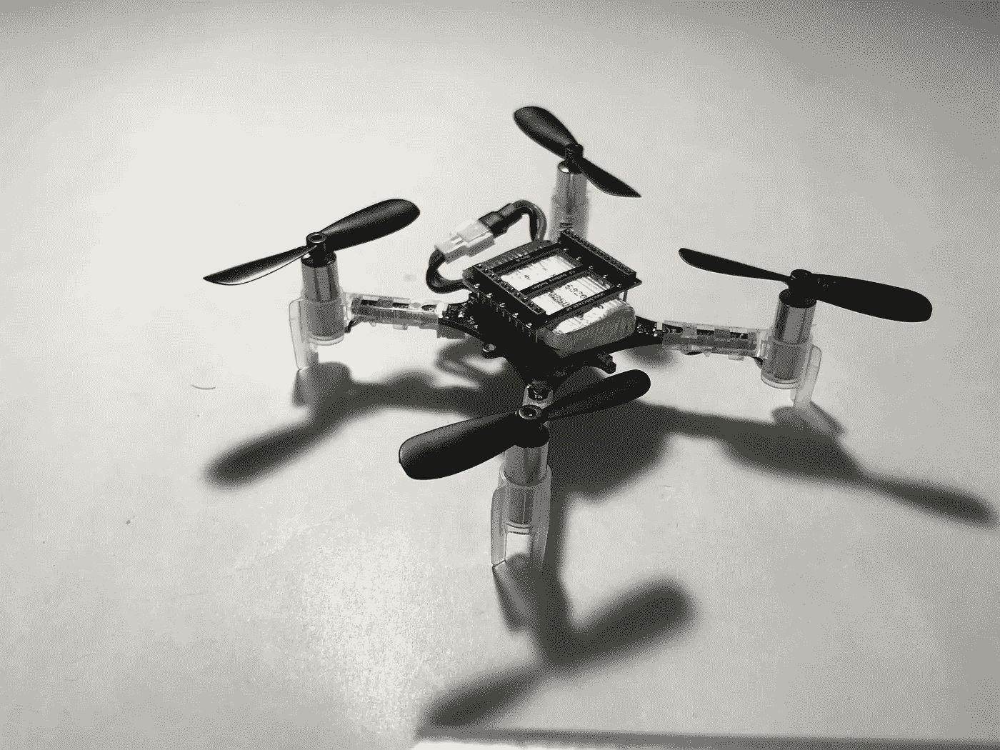

# 飞行汽车工程师的日记#0

> 原文：<https://medium.com/hackernoon/diary-of-a-flying-car-engineer-0-112b0747418a>

> 声明:这个系列的重点是分享我在飞行汽车纳米学位期间学到的东西，对于飞行汽车上更酷的东西，[查看官方纳米学位](https://in.udacity.com/course/flying-car-nanodegree--nd787)。

凌晨 5 点。
[情人节。我不耐烦地盯着我的手机屏幕。](https://hackernoon.com/a-self-driving-and-flying-new-year-3-30d5ecd375e8)

记得我说过[我的梦想是研发自动驾驶汽车](https://hackernoon.com/a-self-driving-new-year-33284e592f35)吗？我撒谎了。

Image: Back to The Future Poster

看完回看[未来](https://hackernoon.com/tagged/future)电影后一直梦想着会飞的汽车。我是看着这部电视剧长大的，每当我遇到交通堵塞时，我总是幻想着按下一个按钮，把我的车变成悬停模式，我浪费了无数个小时思考如何从我的公寓飞到大学。

当然，我对自动驾驶汽车充满热情。但是飞行汽车一直是一个梦想。如果你没有同感。我拒绝相信你。

所以当 Udacity 拿出他们的[飞行汽车 nano degree](https://in.udacity.com/course/flying-car-nanodegree--nd787)；我不得不马上申请。我已经在追求自动驾驶汽车 Nanodegree，我确信这是我接近梦想的最佳方式。

回到我的约会。

我急切地等待着我的录取邮件。我是从成千上万的申请者中被录取的第一批 800 人之一！多酷啊！

我决定暂时搁置我的深度学习设备，并注册了第一批。

回到[未来](https://hackernoon.com/tagged/future)系列。在这个系列中，我将会写下我所学到的东西——我在攻读纳米学位时建立的项目。我学到的新东西。

Udacity 还为我们提供了 Crazyflie 2.0 的折扣:这是一个无人机套件，因此我们可以在现实世界中体验真正的无人机。几乎是一辆飞行汽车，不是吗？

这个系列将展示我学到的所有东西，我建立的项目和我将进行的无人机飞行。

Crazyflie 2.0 Drone (Aka the init27 Flying Car)

我的计划还包括通过我的 YouTube 频道分享试飞和将我所学应用于无人机的教程。

首先:

这是“init27 飞行汽车”的预告片

Coming Real Soon!

*如果你觉得这篇文章很有趣并且想保持联系，你可以在 Twitter 上找到我* [*这里*](http://twitter.com/bhutanisanyam1) *。*

订阅我的时事通讯，了解更多关于自动驾驶汽车、深度学习、计算机视觉和现在:飞行汽车的信息。