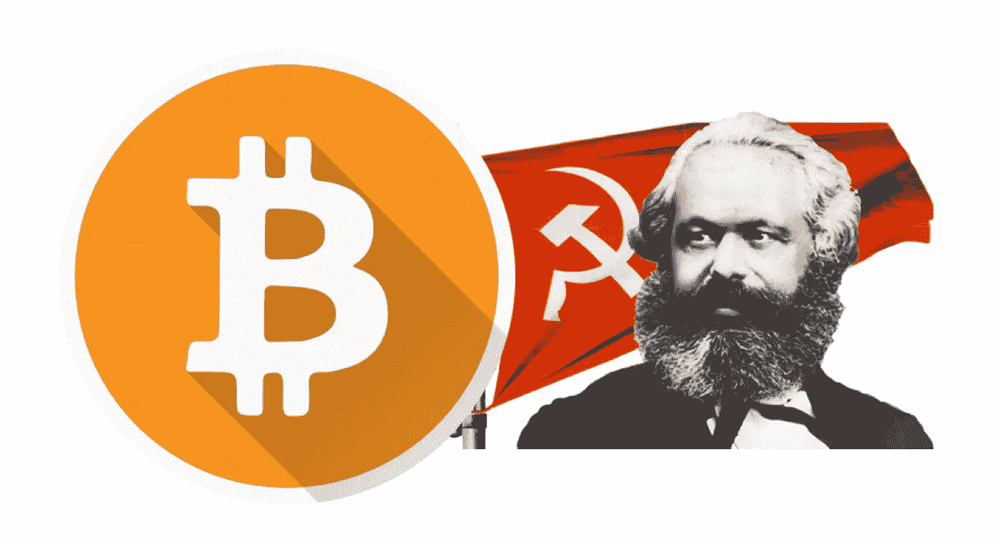

# 卡尔·马克思在大约 100 年前是否推测过区块链革命？

> 原文：<https://medium.com/hackernoon/did-karl-marx-conjecture-blockchain-revolution-about-100-years-ago-5ecbeea1375d>

据说卡尔·马克思是永远改变了世界的人，一个走在时代前列的人。《共产党宣言》记录了他对世界的天才见解(如他所认为的)。他预言“冲突”导致了*资本主义。*资本主义最终会导致*社会主义*和最终*共产主义*。尽管他未能展示这种转变将如何以及何时发生，但他预测这肯定会发生。

作为一个读者，你可能想知道卡尔·马克思和区块链的技术有什么关系！他是。如果他今天还活着，他会把区块链视为他的理论的完美典范。所以不要再等了，让我们马上开始吧。

> 区块链技术发明的理论基础源于马克思主义。

## 1.从颠覆到革命

*马克思说过的话—* 在资本主义环境中，权力集中在少数人手里，导致权力滥用。这种滥用权力的结果是，工人阶级不得不受苦。但是工人阶级迟早会厌倦起来反抗。这就是一个新社会的新的政治、经济、社会结构将如何演变。

*区块链所吹捧的——在今天的时代格言**数据是新的石油**正在获得越来越多的人的认识。数据和金钱集中在少数人手里，使人们容易失去隐私，欺诈和丑闻增加。一个震惊世界的丑闻是 2008 年的金融危机。这产生了一个高尚的灵魂——中本聪，他提出了开创性的、改变人生的比特币理论:一个点对点系统*。银行丑闻太多了，人们开始觉得这很正常。人们的数据在未经他们同意的情况下被使用，他们的财务可能在他们不知情的情况下被不当处理。这听起来可能有点乌托邦，但当今世界正在寻求一个更加平等的社会。

> 银行对客户应该像客户对银行一样透明。

## 2.如果控制权被分割，是否会导致混乱？无政府状态？

*马克思说过的话——*资本主义将逐渐被更聪明的阶级(工人阶级)推翻，以便获得被不公正地从他们手中夺走的控制权。最后阶段是**共产主义。权力将从中央政府下放，并在普通民众中分配。官僚主义将会终结。**

> 共产主义之后不会有混乱。

*区块链吹捧的——*区块链技术的关键特征是，记录交易的整个分类账在本质上是**分布式的**。大家都能看出来。它是透明的。没有一个单独的实体(比如一家银行)控制它。随着比特币和以太坊等加密货币的出现，央行将失去对法定货币的控制，从而解放人们。

> 历史上第一次，每个人都可以看到银行的所有交易。银行可以享受丑闻的日子一去不复返了。

## 3.最终结果是一个没有阶级，人人平等的社会

马克思说过的话——反抗最终会导致一个没有阶级的社会，在那里每个人都是平等的。不会有滥用权力的可能。正如我们今天所看到的那样，资产阶级和工人阶级之间的差距只会越来越大。这种差距最终会消失，因为阶级的基本概念会被消除，因为每个人在社会中都有平等的利益。

*区块链所吹捧的—* 区块链认为人人平等。在加密货币时代，阶级的概念根本不存在。加密货币的所有者是区块链网络的匿名参与者。每个人都被认为是一样的，然而每个人都是不同的。每个人都有平等的挖矿机会。每个人都有平等的机会。

这些是我在阅读《共产党宣言》时可以推断出的一些惊人的相似之处。我确信马克思主义和中本主义之间有更多微妙的联系。

> 我确信会发生叛乱。暴风雨即将来临，我能感觉到。

尽管卡尔·马克思在他的宣言中没有明确使用区块链这个术语，但他走在了他的时代的前面，至少他可以推测这样的场景在未来一定会发生。

我完全被这个震惊了。希望你也是！