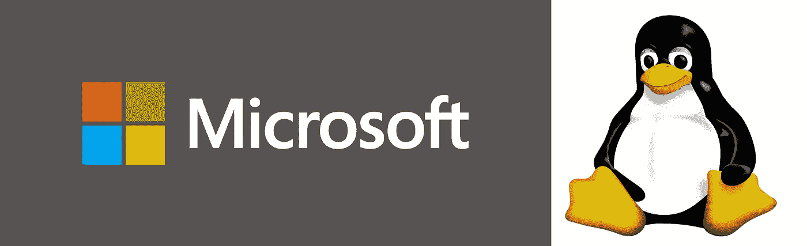

# 微软真的只是“开源其所有专利”吗？？

> 原文：<https://medium.com/hackernoon/did-microsoft-really-just-open-source-all-its-patents-3e419ae1a439>

## 总是阅读小字…

本周，[微软](https://hackernoon.com/tagged/microsoft) [宣布](https://azure.microsoft.com/en-us/blog/microsoft-joins-open-invention-network-to-help-protect-linux-and-open-source/)其决定加入[开放发明网络](https://www.openinventionnetwork.com/)(【OIN】)开源专利联盟。鉴于微软与开源软件的敌对关系，这一声明让许多人感到惊讶。标题和推文宣称**微软已经“开源了它所有的专利”**

微软的专利组合是世界上最大和最有价值的之一(据报道，超过 60，000 项专利)。**现在这些专利都是“开源”的吗**

下面是微软参与 OIN 对他们的专利意味着什么的简要概述( ***【免责声明***** )。

# ***‘OIN’是什么？***

OIN 于 2005 年成立，致力于保护围绕 Linux 的自由开发。这是通过两个主要组件实现的:

1.  约 750 项自有[专利](https://www.openinventionnetwork.com/about-us/us-patents-owned-by-oin/)，涵盖一系列技术(数据处理、电信、区块链、物联网等)。).
2.  它在 OIN 参与者(“被许可方”)(现在超过 2600 个[)中管理的“交叉许可”计划。](https://www.openinventionnetwork.com/community-of-licensees/)

任何公司都可以免费加入 oin。当一家公司加入 OIN 时:

1.  该公司获得了 OIN(750 项)专利的无限制许可。

*这意味着 OIN 参与者可以制造、使用或分销包含 OIN 专利所涵盖技术的产品，而没有 OIN 可能主张其专利的风险(例如，通过诉讼)。*

2a。该公司获得任何其他 OIN 参与者拥有的与“Linux 系统”技术的使用或传播相关的专利许可。

*这意味着公司可以使用或分发“Linux 系统”技术，而不会有其他 OIN 参与者针对此类“Linux 系统”技术主张其专利的风险。*

2b。该公司将其专利许可**授予所有其他 OIN 参与者**使用或分发**Linux 系统技术**。

*这意味着该公司同意不利用其专利干涉其他 OIN 成员使用或传播“Linux 系统”技术。*

除了 OIN 自己的[专利](https://www.openinventionnetwork.com/about-us/us-patents-owned-by-oin/)(无限制许可)**之外，OIN 的交叉许可仅限于(a)“Linux 系统”技术和(b) OIN 成员**。

# ***OIN 的交叉许可仅限于“Linux 系统”技术***

OIN 网站对“Linux 系统”进行了全面的定义，列出了具体的软件库和软件包。最初，OIN 对“Linux 系统”的定义包括组成 Linux 内核的库/包。随着时间的推移，OIN 已经扩展了其对“Linux 系统”的定义，将 Android、Apache、Kubernetes、ChromeOS 和其他基于 Linux 的技术的核心包包括在内。

一个由 [OIN“成员】](https://www.openinventionnetwork.com/community-of-licensees/)(包括谷歌、IBM、红帽和丰田)组成的委员会规定了哪些软件包属于“Linux 系统”的定义。

OIN 参与者承诺，在“Linux 系统”包的使用或分发方面，不会针对其他 OIN 参与者使用其专利**。例如，如果一个 OIN 参与者拥有一个覆盖“Linux 系统”包的专利，专利持有者不能针对其他 OIN 参与者**使用或分发所覆盖的“Linux 系统”包**主张该专利。**

然而， ***OIN 的交叉许可不适用于“Linux 系统”定义*** 之外的技术。对于非“Linux 系统”技术，OIN 参与者可以自由主张他们的相关专利，甚至可以与其他 OIN 参与者对抗。

# ***OIN 的交叉许可仅限于其他 OIN 参与者***

除了限于“Linux 系统”技术之外，OIN 参与者仅承诺不将其专利用于其他 OIN 参与者的“Linux 系统”相关活动**。**

例如，持有“Linux 系统”包专利的 OIN 参与者不能因为其他 OIN 参与者使用或分发所涵盖的“Linux 系统”包而对其主张专利。然而，由于 OIN 交叉许可不适用于非 OIN 参与者，专利持有人可以对非 OIN 参与者提出相同的专利要求——****，即使是使用或分发“Linux 系统”包*** 。*

# ****微软的决定意味着什么？****

1.  *通过加入 OIN，微软同意不使用其 60，000 项专利中的任何一项来对抗其他 [OIN 参与者](https://www.openinventionnetwork.com/community-of-licensees/)使用或传播“Linux 系统”技术。*
2.  *微软参与 OIN 并不限制微软针对“Linux 系统”定义之外的技术主张其专利的能力。*
3.  *微软在 OIN 的参与也不限制微软对非 OIN 参与者主张其专利的能力——即使是使用或分发“Linux 系统”软件包。*

# ****结论****

*加入微软是 OIN 的一项重大成就，应该会使 OIN 的参与对其他公司更具吸引力。将微软的专利组合添加到 OIN 的交叉许可中，为使用或分发“Linux 系统”技术的 OIN 参与者提供了实质性的额外保护。然而，这些保护仅延伸至**其他 OIN 参与者**的与**‘Linux 系统’相关的活动。***

*微软在 OIN 的参与不影响微软专利对非 OIN 参与者和 OIN 参与者的非“Linux 系统”活动的潜在适用性。*

***** *免责声明*** :我是一名专利代理人，之前曾代理过微软的专利事务。我目前不代表微软。我的评论(仅供参考，并非法律建议:)完全基于 OIN 许可的内容，与我对微软的陈述无关。*

*如果你喜欢这篇文章，请在下面为它鼓掌，并在 Twitter、LinkedIn 等上分享。*

*欢迎在 [Twitter](https://twitter.com/ArielR_IP) 上关注我，并在 [LinkedIn](https://www.linkedin.com/in/ariel-reinitz-9149b53) 上与我联系。*