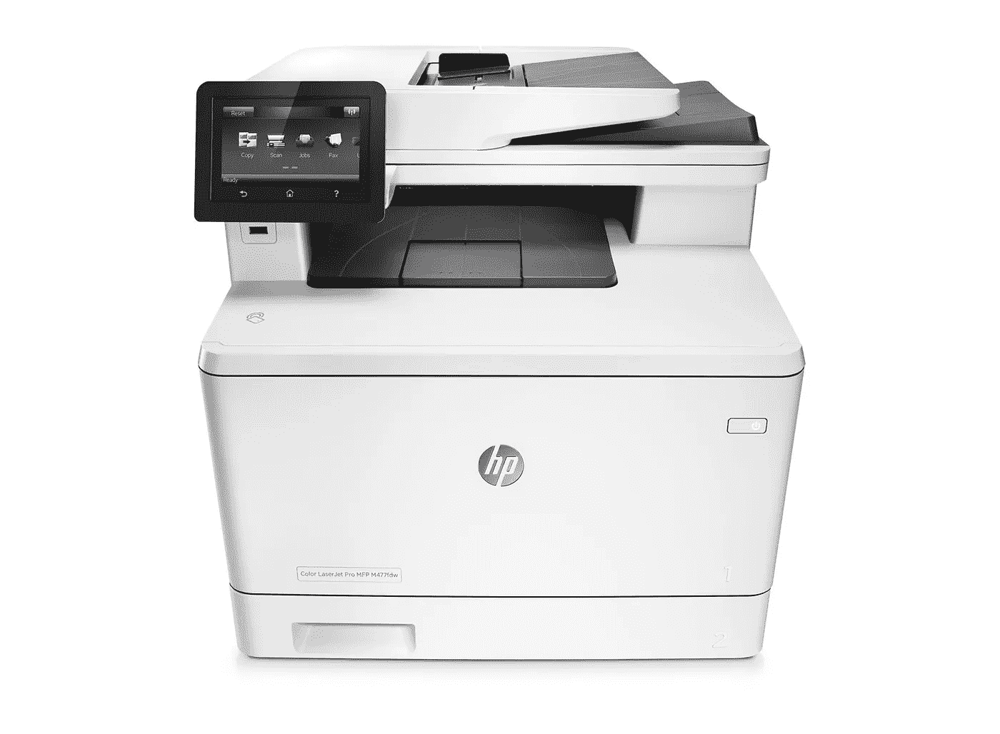
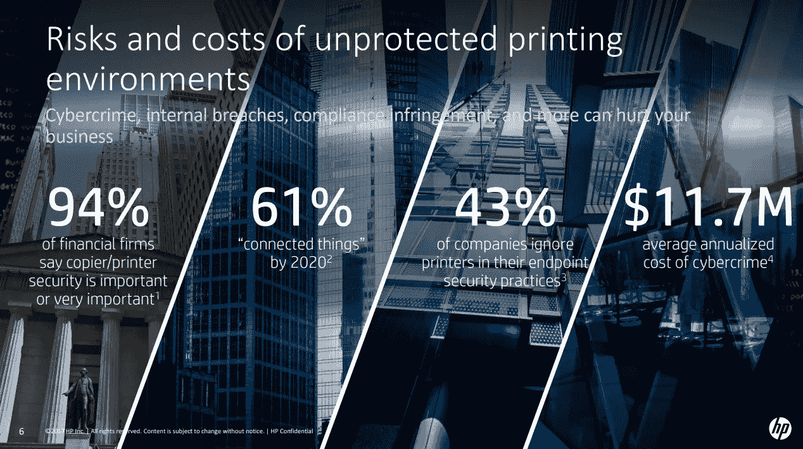
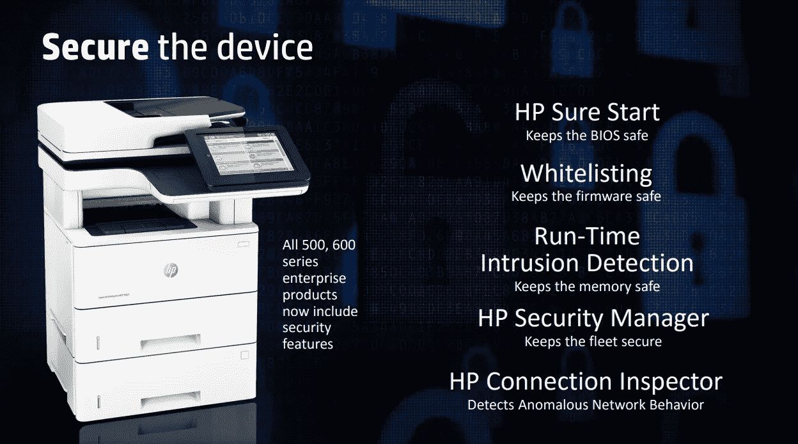
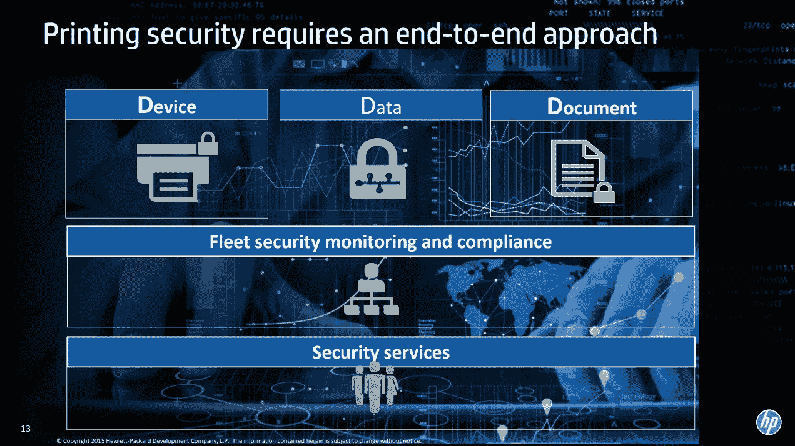

# 您知道打印机是主要的网络攻击媒介吗？

> 原文：<https://medium.com/hackernoon/did-you-know-that-printers-are-a-major-cyber-attack-vector-eddfbd8f99bb>

HP Color Laserjet MFP M477fdw, one of the most secure print devices ever. [Image is courtesy of HP](http://store.hp.com/CanadaStore/Merch/Product.aspx?id=CF379A&opt=BGJ&sel=PRN).

想象你的办公室[网络](https://hackernoon.com/tagged/network)。网络攻击者正试图进入其中。他们知道你的公司有利润丰厚的专有数据。他们知道，如果他们可以用勒索软件瘫痪您的计算机，您的公司将会禁不住支付昂贵的加密货币赎金。即使你保存了很好的备份，[从备份中恢复也可能不切实际](https://www.cylance.com/en_us/blog/hospital-had-backups-paid-ransom.html)。也许网络攻击者想要钱？也许他们只是想破坏你的网络服务器“为了 lulz？”也许单个攻击者不会针对你的公司，但如今可以很容易地从黑暗网络中雇佣有利可图的网络攻击僵尸网络和服务。机器人会在互联网上到处寻找易受攻击的目标。您的办公网络可能会被标记为“it”

你能想象你的攻击媒介会是什么吗？它很可能是一台客户端 PC。员工可能会打开您的防病毒软件无法检测到的恶意电子邮件附件。也许网络攻击会逃过防火墙。不幸的是，这种情况时有发生。也许您的 web 应用程序会被注入 SQL。可能会利用 LDAP 漏洞，对您的活动目录进行权限提升攻击。

你有没有想过放在房间角落的那个大型网络打印机？打印作业不断从您的客户端电脑发送到 it 部门。它还连接到您公司的无线局域网。它*需要*连接到你公司的无线局域网。嗯，你的无线局域网连接到互联网，不是吗？它可能也连接到你的私人内部网络。所以这是一个从公共互联网到你的私人网络的网络攻击媒介。嗯嗯…

黑掉不安全的打印机很容易。不幸的是，根据 Spiceworks 的调查，只有 16%的 IT 行业受访者认为打印机面临安全漏洞的高风险！43%的受访公司在其终端安全方法中忽略了打印机。嗯，有哪些管理员不知道*会*伤害他们。公司投资保护他们的计算设备。为什么不是打印机？

打印安全性有三个主要方面。它需要安全设计和部署的硬件、软件和网络。这意味着选择保护您办公室的网络需要从一开始就考虑到网络安全的打印设备开始。一家打印设备供应商知道您必须保护设备、数据和文档。我要亲眼看看，那个供应商是惠普。

## 惠普拥有世界上最安全的打印设备

Image is courtesy of HP.

二月初，我独家了解了惠普的打印安全计划。惠普确实拥有世界上最安全的打印设备！但是不要相信我的话。

查看[IDC market scape:2017 年全球安全解决方案和服务硬拷贝供应商评估](http://idcdocserv.com/US41988517e_HP)中的内容:

> “在所有硬拷贝供应商中，惠普公司在提高打印和文档安全问题的意识和可见性方面处于领先地位，并宣传自己拥有世界上最安全的打印机。惠普公司的安全方法考虑了整个打印和文档基础设施，从锁定设备开始，扩展到设备使用和内容保护的所有方面。
> 
> 惠普公司广泛的打印和文档安全解决方案套件基于自有技术和合作伙伴交付能力的组合，在四个主要领域提供安全性:惠普 JetAdvantage 安全管理器、惠普公司的拉式打印解决方案、惠普公司的数据保护和惠普公司的安全服务。HP JetAdvantage Security Manager 支持客户制定全面的打印安全策略，根据该策略评估和修复设备，并根据预定义的准则提供审计和报告措施。
> 
> 惠普公司提供广泛的拉式打印解决方案，旨在满足特定客户环境的需求，以及数据保护解决方案，帮助组织检测和防止通过打印设备丢失数据。利用其广泛的解决方案组合，惠普公司提供了一套广泛的基于安全的服务，包括安全审计咨询服务、实施服务和咨询顾问服务。
> 
> 惠普公司以独立程序的形式提供其安全服务，但其整个安全解决方案和服务组合也可通过惠普公司的托管打印服务(MPS)产品获得。惠普公司已经建立了强大的托管打印服务实践，其中包括作为主干的安全性，并建立在对其“即服务”全球基础设施的投资基础之上。事实上，惠普公司将其 MPS 计划作为“安全 MPS”进行营销，这只是营销的一部分，但它也指出了已成为惠普公司 MPS 武器库中标准安全组件的核心功能。"

[根据 IDC MarketScape 的 2017 年厂商评估，惠普在打印安全领域领先业界](http://idcdocserv.com/US41988517e_HP)。

您还应该考虑 [Quocirca 在 2016 年托管打印服务领域的研究结果](http://quocirca.com/content/managed-print-services-landscape-2016):

> “惠普的安全产品是 MPS 市场的一个关键优势，这促使它在 2016 年推出了一项安全主导的 MPS 计划:惠普安全 MPS。惠普安全 MPS 的主要组件包括惠普的企业打印机产品组合、安全软件解决方案和安全服务。
> 
> 惠普企业打印机的独特功能包括运行时入侵检测，这使得惠普成为唯一一家将打印机事件数据与 HPE ArcSight 或 Splunk 等主要安全监控和事件检测工具相集成的打印机制造商。
> 
> 通过不断扩大的 JetAdvantage 产品组合，解决方案是惠普的主要优势。据估计，超过 75%的企业直接参与是软件支持的，包括文档捕获、安全性、移动性、工作核算、表单自动化和生产打印等解决方案。
> 
> 惠普通过市场开发、行业细分市场营销和销售支持能力，继续深化其行业重点。它拥有一系列针对金融服务、医疗保健、制造、通信/媒体/娱乐和公共部门等行业的解决方案，以及通过惠普企业内容管理平台提供的一系列垂直解决方案。"

只有惠普提供了一系列安全功能，可以监控并自动阻止攻击，然后在重启时自我验证软件完整性。

## 惠普专有的打印安全特性

Image is courtesy of HP.

以下是惠普企业打印设备独有或几乎独有的打印机安全特性列表:

*   具有自我修复功能的运行时入侵检测
*   “即时启动”安全性
*   具有自我修复功能的安全引导
*   只有惠普和利盟拥有设备级 SIEM 集成
*   只有 HP、Lexmark 和 Kyocera 打开/关闭远程固件升级
*   只有惠普和施乐拥有完整的打印设备安全管理员通知功能
*   只有惠普和京瓷包含美国 NIST 清单

HP Sure Start 内置于 BIOS 中。BIOS 运行自己的固件，在您启动时检查打印设备的健康和运行情况，这与操作系统启动前 PC 和服务器中的 BIOS 的工作方式相同。BIOS 固件是网络攻击者的主要目标，尤其是通过恶意软件！HP Sure Start 旨在保护您的打印机 BIOS 免受黑客攻击。借助 HP Sure Start，如果检测到 BIOS 固件被篡改，设备将使用其 BIOS 的安全“黄金副本”重新启动。

您的网络可能运行入侵检测设备。如果没有，那就真的应该有！在您的网络中拥有专用的 IDS 设备会有所帮助。如果您的企业打印设备中也内置了入侵检测功能，那就更好了。惠普的运行时入侵检测持续运行。它在复杂的固件和内存操作中检测异常，自动阻止入侵，并重新启动。

许多最具破坏性的恶意软件“呼叫总部”来攻击指挥和控制服务器。恶意数据不仅会进入专用网络，还会退出专用网络！这就是 HP Connection Inspector 的用武之地。HP Connection Inspector 评估进出打印设备的连接。如果任何东西看起来可疑，HP Connection Inspector 会立即阻止它。这使得网络攻击者获得访问您网络敏感数据的权限变得更加困难！

## 惠普安全咨询服务

Image is courtesy of HP.

惠普独特的企业打印设备安全策略并不仅限于设计更安全的硬件和软件。如果您的网络有惠普设备，您可以请求惠普安全管理器快速评估。惠普安全管理器快速评估将评估多达 20 台惠普网络打印机，并向您发送一份完整、详细的报告，介绍如何提高您的安全性。[从他们的网络表单开始](http://www8.hp.com/us/en/solutions/business-solutions/printingsolutions/contact.html)。

## 梦工厂动画依赖惠普安全 MPS

你可能听说过梦工厂动画。他们因热门电影而闻名，如《怪物史莱克》、《驯龙高手》和《功夫熊猫》。你可能已经和家人一起看过至少一部他们的电影。

他们现在正在制作新的故事片动画项目，未来几年将在你当地的电影院上映。惠普打印设备是他们工作中不可或缺的一部分。他们的知识产权工作通过惠普打印设备进行，他们不希望公众看到它们，直到他们准备好推广他们即将上映的电影。但是狗仔队、娱乐杂志和网站会为好莱坞的泄密支付高价。流行歌星和著名说唱歌手讨厌公众在他们准备发行之前就听到他们的音乐。为什么没有看到梦工厂有任何未经授权的泄露？惠普 MPS 是一个主要因素。

梦工厂动画服务运营副总裁 Mark Tokunaga 表示:“我们的现场惠普 MPS 服务提供可预测的成本和近乎完美的打印设备正常运行时间。惠普 MPS 使工作室的运营团队能够减少因打印管理问题而分散的时间，这样我们就可以专注于战略工程计划。”

## 选择您的企业打印设备

因此，您希望在您的网络中使用惠普安全 MPS 及其专有打印安全特性。你从哪里开始？

[惠普列出了他们最安全的企业打印设备，您可以在这里找到](http://www8.hp.com/ca/en/solutions/business-solutions/printingsolutions/devicesecurity.html)。印刷快乐！