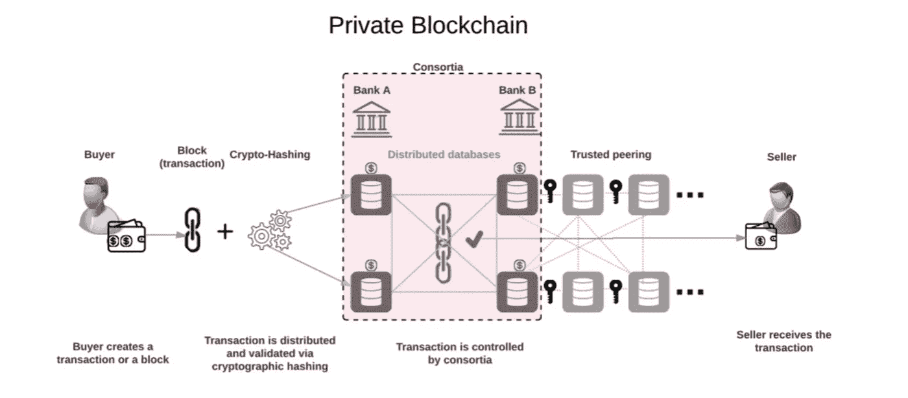
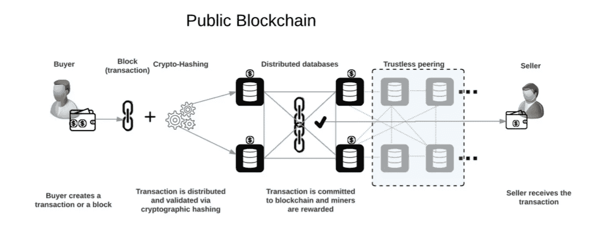

# 公有和私有区块链的区别|区块链专家的观点

> 原文：<https://medium.com/hackernoon/difference-between-public-private-blockchain-blockchain-experts-view-4450d0860a17>

整个故事开始于“[比特币](https://hackernoon.com/tagged/bitcoin)世界。[区块链](https://hackernoon.com/tagged/blockchain)一词的造词应运而生。我们不能说比特币和区块链是先出现的。然而，它们都共存了很长一段时间。类似于主干技术的术语也存在于先前的“加密”世界计划中。然而，区块链凭借功能性能力让世界变得更美好。

例子:[比特币](https://en.wikipedia.org/wiki/Bitcoin)，[莱特币](https://en.wikipedia.org/wiki/Litecoin)

# 私有区块链的需求和发展:

拥有区块链的整个想法是让公众可以获得数据，没有任何查看限制。然而，情况发生了变化。区块链的整个概念是“处理当前监管机构的事情”受到了强烈的挑战。更明确地说，看到区块链技术的功能优势，监管机构和企业也希望在他们的应用程序堆栈中有一个像“区块链”这样的平台。因此，建筑师和技术先驱创造了一个有限制和更多功能的区块链，这对机构/企业世界来说很好。，对新技术的渴求催生了对适合他们需求的区块链的大讨论和[开发，“私有区块链”时代开始了。](http://www.agiratech.com/blockchain-development/)

示例:[总账](https://www.hyperledger.org/)

# 公共区块链和私有区块链的相似之处

1)分布式分类帐概念是通用的(对等网络)

2)只允许数字签名的交易

3)副本通过称为共识的协议同步

4)“分类账的不变性。”得到保证

# 私有区块链和公有区块链有什么不同？

我们可以称之为“私有区块链”与术语“许可网络”相似和等效此网络需要许可才能加入。该网络需要权限才能执行某些操作。系统中的访问控制因每个参与者而异。一个或多个商定和接受的管理机构或财团将决定网络内部的各种活动，从加入网络开始，直到执行该封闭网络中的任何功能。参与者的“数字身份”将由监管机构或财团管理和监控。

图片来源:[https://steemit.com/blockchain/@geek4geek/](https://steemit.com/blockchain/@geek4geek/)

这些对私有区块链环境的基本需求可以很好地解释为“私有”违背了区块链本身的概念。然而，这种情况需要这样的私有链，并且仍然，使用它的人的家族将比以前在“权威/财团”世界中的情况公开信息。

图片来源:【https://steemit.com/blockchain/@geek4geek/ 

# 很少列举公共区块链的挫折原因(仅供读者了解，非本人观点):

1)节点运行时消耗大量电力

2)采矿是艰难的

3)复杂性可能会随着时间的推移而增加

**一个内胆(s):**

在公共区块链中，任何人都可以运行该链，任何人都可以进行交易(尽管基于基本规则)，任何人都可以审计/审查该链。

在私有区块链中，只有被允许的参与者可以运行该链、进行交易(基于规则)以及审计/审查该链。

我希望并相信“公共区块链”将为行业带来革命性的变化，更多的创新产品将基于作为技术平台的一部分提供的主干开发出来。

请分享你的想法和评论，希望能收到你的回复。

*原载于 2018 年 6 月 11 日*[*www.agiratech.com*](http://www.agiratech.com/public-blockchain-vs-private-blockchain/)*。*

**感谢您抽出时间阅读本文！:)**

***所有“人”的长相都是为了“激励”&“欣赏”。如果你喜欢读这篇文章，请点击下面的“鼓掌”按钮||我会为你写更多的文章，这对阅读这篇文章的读者来说意义重大。***

*作者是 Agira Technologies (#agiratech，*[*)www.agiratech.com*](http://www.agiratech.com/)*)首席执行官加纳帕蒂·M。*

在…对我说“嘿”

[**Quora**](https://www.quora.com/profile/Ganapathi-Manthiram)**|**[**LinkedIn**](https://www.linkedin.com/in/ganapathim/)**|**[**脸书**](https://www.facebook.com/agiratechnologies/) **|** [**推特**](https://twitter.com/mganapathi) **|** [**网站**](http://www.agiratech.com)

***很想听听你对这个话题的看法和经验……***

***联系我:*** *您或您的公司正在寻找一个有才华的、创新的&手把手的、善于沟通的专家开发/设计团队&概念化帮助* ***构建+扩展您的网络&手机 app*** *？个人(直接)发邮件至****ganapathi@agiratech.com****免费咨询！*

我很乐意帮助你。