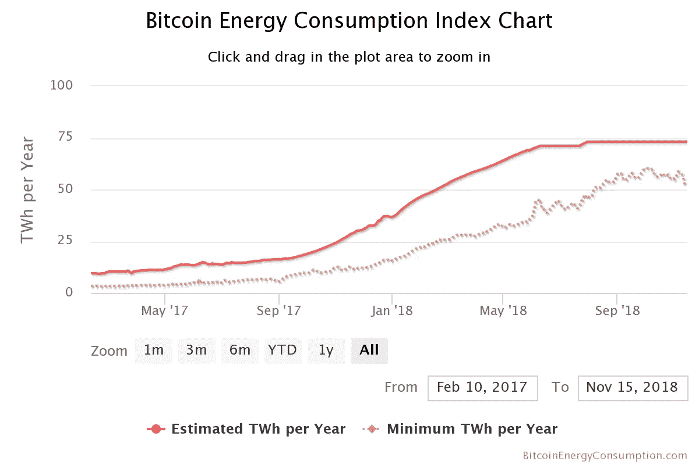
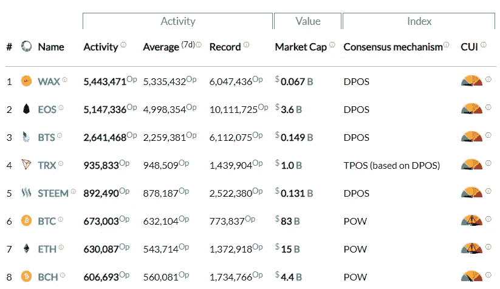

# 不同的区块链共识机制

> 原文：<https://medium.com/hackernoon/different-blockchain-consensus-mechanisms-d19ea6c3bcd6>

大多数区块链有许多共同点，功能也相似，但区块链的独特之处之一是达成共识的方式。哪些交易是合法的，哪些交易被添加到区块链中？区块链使用各种共识机制来做到这一点，我们将在下面解释最重要的机制和其他一些机制。

# 什么是共识机制？

简而言之，共识机制是确保所有节点(区块链上维护区块链并(有时)处理事务的设备)彼此同步并就哪些事务是合法的并被添加到区块链达成一致的协议。

这些共识机制对于区块链的正常运行至关重要。他们确保每个人都使用相同的区块链。每个人都可以提交要添加到区块链中的东西，所以所有的交易都必须不断地被检查，所有的节点都必须不断地审计区块链。没有一个良好的共识机制，区块链就有遭受各种攻击的危险。

有许多方法可以达成共识，所以我们将直接进入最流行的方法。

# 工作证明

工作证明(POW)是第一个区块链共识机制，最初由比特币使用。许多加密货币效仿比特币，也采用了这种共识机制。

工作证明过程称为挖掘，节点称为挖掘器。矿工解决需要大量计算能力的复杂数学难题。第一个解决难题的人可以创造一个积木，并获得创造积木的奖励。这些数学难题有一些有趣的性质。首先，它们是不对称的，这意味着找到答案要花很多时间，但验证答案是否正确却很容易。
其次，解决这些谜题的唯一方法就是‘猜测’答案。除了试错法之外，使用任何其他方法都不可能更快地解决这些难题。这也意味着，如果一个人想更快地找到谜题的答案，他们将需要更多的计算能力，这可能会非常昂贵。
最后，这些谜题的难度随着开采速度的不同而不同。为了保持新硬币的稳定供应，必须在一定的时间范围内创造出新的硬币。如果积木造得太快，拼图会变得更难，如果造得太慢，拼图会变得更容易。

这个过程确保了为了能够创建一个块，首先需要大量的计算来解决这个难题。但是矿工们是如何开采这些区块的呢？

矿工可以使用许多不同的硬件开采区块:

> **CPU 挖掘** —使用普通计算机的 CPU 来验证工作证明共识协议中的事务。
> **GPU 挖掘** —这与 CPU 挖掘没有什么不同，但是在这种情况下使用了显卡。显卡功能更强大，但耗电量相对较少。
> **FPGA 挖矿** —又称“现场可编程门阵列挖矿”。FPGA 是为特定计算任务定制的电路，使它们在挖掘方面比普通处理器快几倍。
> **ASIC 挖掘** —是一种“专用集成电路”，为特定用途定制的电路。ASICs 在速度和效率上都轻松胜过 CPU、GPU 和 FPGAs，它们一般只真正用于比特币挖矿。
> **采矿池** —为了增加成功开采区块的可能性，采矿者将他们的资源集中起来，根据每个采矿者的贡献分享任何潜在的奖励。
> **云采矿** —一些矿工在规定的时间内将他们的处理能力出租给其他矿工。
> *摘自* [*lisk.io*](https://lisk.io/academy/blockchain-basics/how-does-blockchain-work/proof-of-work)

然而，这种共识机制有一个重大缺陷。工作证明使用大量资源，并且据说在未来是不可持续的，这就是为什么一些区块链正在转向不同的共识机制。

Bitcoin Energy Consumption index, [https://digiconomist.net/bitcoin-energy-consumption](https://digiconomist.net/bitcoin-energy-consumption)

为了让你了解区块链使用工作证明可以消耗多少能源，我们包括了上面的图表，该图表估计了比特币在过去两年中消耗的能源。Digiconomist 估计，仅在去年一年，比特币的消费量约为 73.12 TWh，估计成本为 3656073069 美元。

# 股权证明

利害关系证明(POS)是工作证明协议中更环保的兄弟。利害关系的证明利用了这样一个前提，即在一个网络中拥有最多硬币的人对保持网络的维护和硬币的高价值有既得利益。

在一个使用利害关系证明的系统中，一个随机过程被用来决定谁将生产下一个区块。用户可以将他们的令牌作为验证者(可以生成块的人)，这意味着他们将令牌锁定一段时间。这样做之后，他们就有资格生产砌块。决定谁来生产下一个区块的过程需要考虑几个因素，这些因素取决于区块链的设计，但一般来说，拥有最大股份的人有最大的机会生产区块。可以考虑的另一个因素的例子是硬币被下注的时间。

验证者也会因为他们的工作而获得奖励。验证器在创建下一个块时获得的回报再次取决于区块链的设计。通常，他们要么收到他们创建的区块中所有交易的全部或部分交易费，要么收到固定金额的硬币(通过通货膨胀产生)。

利害关系证明不仅比工作证明系统更节能，它还有另一个主要区别。在工作证明系统中，矿工可能不拥有他们正在开采的硬币，这意味着他们只寻求最大化他们的利润，而没有实际改善网络。在利害关系证明系统中，验证者有更大的动机来实际维护网络，因为他们实际上持有他们正在验证的区块链硬币。

# 委托股权证明(DPOS)

委托利益证明(DPOS)是一种非常快速的共识机制，因其在 EOS 中的实施而闻名，由于其股权加权投票系统，通常被称为数字民主。

在委托赌注证明系统中，用户可以用他们的硬币来为一定数量的代表投票。他们投票的权重取决于他们的股份，例如，如果 A 为一名代表投了 10 个硬币，B 为一名代表投了 1 个硬币，A 的投票比 B 的投票重 10 倍。

但是什么是委托呢？代表是希望在网络上生产积木的个人或组织。获得最高票数的代表可以制作积木，并因制作这些积木而获得奖励。就像股权证明一样，他们要么从交易费用中获得报酬，要么获得固定数量的硬币，这些硬币是通过通货膨胀创造的。有多少代表可以生产砌块取决于区块链的设计，一般来说，这要么是一个固定的数量，要么是某一工资等级以上的所有代表。谁是最高代表可以不断改变。

> 代表们可能会被投票选举，而不是简单地接受减薪，因为他们将代表薪酬用于其他任务，如营销、法律工作或游说。因此，他们可以履行其他类型公司的员工会做的一些职责。
> 
> 因此，所有代表都有强烈的动机不仅要保护网络，还要以其他方式为股东提供价值。丹尼尔·拉里默

由于代表们希望获得尽可能多的选票，他们不断受到激励，为社区创造有价值的东西，因为他们这样做可能会获得额外的选票。

Blockchain activity index including consensus mechanisms, blocktivity.info

委托利益证明协议在处理事务时也比上述协议更有效。如上图所示，最活跃的区块链(按过去 7 天的交易量排序)都使用了委托股权证明协议或其变体。您还可以在图像右侧看到 CUI 指数，它显示了区块链处理其接收的交易量的情况。与较大的区块链处理的交易量相比，使用委托利益证明协议的区块链在处理他们接收的所有交易时没有任何问题，而使用工作证明协议的区块链在处理相对较小的交易量时却非常困难。

# 其他共识机制

现在你已经了解了 3 种最流行的共识机制，你可能想知道还有什么其他的共识机制。我们在下面解释了其中的一些。

## 能力证明(POC)

能力证明是一种共识机制，使用一种称为绘图的过程。对于工作证明，矿工使用计算来猜测正确的解决方案，而对于容量证明，解决方案是预先存储在数字存储中的(如硬盘)。这个过程叫做绘图。在存储被绘制后(意味着它已经被填充了解决方案)，它可以参与块创建过程。

谁能最快解决一个(新)积木的难题，谁就能创造新的积木。存储容量越大，可以存储的解决方案越多，创建块的几率就越高。

## 逝去时间的证明(诗人)

经过时间的证明是一种共识机制，旨在根据等待的时间随机、公平地决定谁可以生成块。为了决定谁来产生一个块，这个过程给每个节点分配一个随机的等待时间。等待时间最先结束的节点将产生下一个块。

只有当有一个系统来验证没有人可以运行多个节点，并且分配的等待时间实际上是随机的时，这种共识机制才能起作用。如果没有这样的制度，共识机制就会有重大缺陷。

归根结底，所有这些机制都有一个相同的目标:在一个分散的网络中达成共识。尽管这些机制有着共同的目标，但它们达成共识的方式却大相径庭。虽然完美的共识机制还不存在，但看到共识机制如何随着时间的推移而演变并适应像这样的协议不断变化的需求是有趣和鼓舞人心的，而且看到新想法的实现肯定会令人着迷。

## 关于我们

我们是 Blockgenic，一个世界级技术企业家和投资者的网络，希望对区块链技术产生积极影响。你可以在这里找到我们:
EOS Block 制作人姓名:' blockgenicbp'
[网站](https://blockgenic.website/)
[推特](https://twitter.com/blockgenic)
[Youtube](https://www.youtube.com/channel/UCXTaehuAs3UWKnMVnT71MMQ)
[Reddit](https://www.reddit.com/user/blockgenic)

*作者为* [*作者为*](https://www.linkedin.com/in/yannick-slenter/) *作者为* [*作者为*](https://blockgenic.website/)